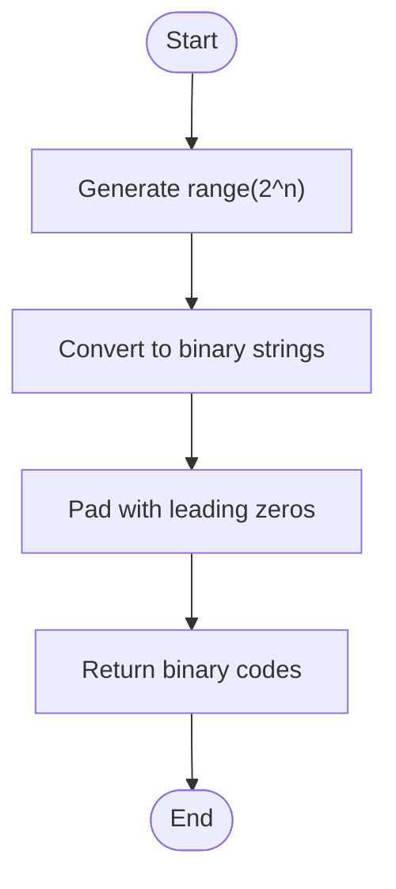

# Gray and Binary Encoding

<cite>
**Referenced Files in This Document**   
- [gray_binary_encoding.py](file://src/tyxonq/libs/hamiltonian_encoding/gray_binary_encoding.py)
- [operator_encoding.py](file://src/tyxonq/libs/hamiltonian_encoding/operator_encoding.py)
</cite>

## Table of Contents
1. [Introduction](#introduction)
2. [Core Encoding Functions](#core-encoding-functions)
3. [Gray Code Generation](#gray-code-generation)
4. [Binary Code Generation](#binary-code-generation)
5. [Encoding Selection Mechanism](#encoding-selection-mechanism)
6. [Application in Bosonic Operator Transformations](#application-in-bosonic-operator-transformations)
7. [Encoding Properties and Trade-offs](#encoding-properties-and-trade-offs)
8. [Integration with Quantum Simulations](#integration-with-quantum-simulations)
9. [Conclusion](#conclusion)

## Introduction

The Gray and binary encoding utilities in TyxonQ provide essential functionality for mapping multi-level bosonic systems to qubit registers in quantum simulations. These encodings are critical for representing vibrational modes and other bosonic degrees of freedom in quantum algorithms. The system implements three primary encoding schemes: unary, binary, and Gray encoding, each with distinct advantages for different simulation scenarios. This documentation details the implementation and application of these encoding utilities, focusing on the recursive generation of Gray codes, standard binary representations, and the selection mechanism that chooses appropriate encoding schemes based on the specified parameters.

**Section sources**
- [gray_binary_encoding.py](file://src/tyxonq/libs/hamiltonian_encoding/gray_binary_encoding.py#L1-L35)
- [operator_encoding.py](file://src/tyxonq/libs/hamiltonian_encoding/operator_encoding.py#L1-L50)

## Core Encoding Functions

The encoding system in TyxonQ revolves around three core functions that generate and manage different encoding schemes for bosonic degrees of freedom. These functions work together to provide flexible mapping strategies from multi-level systems to qubit representations.

**Diagram sources**
- [gray_binary_encoding.py](file://src/tyxonq/libs/hamiltonian_encoding/gray_binary_encoding.py#L2-L31)

**Section sources**
- [gray_binary_encoding.py](file://src/tyxonq/libs/hamiltonian_encoding/gray_binary_encoding.py#L2-L31)

## Gray Code Generation

The `get_gray_codes` function implements a recursive reflection algorithm to generate n-bit Gray codes. Gray codes are binary sequences where consecutive values differ by exactly one bit, making them particularly valuable for minimizing bit-flip transitions in quantum circuits.

The algorithm works by recursively building n-bit Gray codes from (n-1)-bit codes:
1. Generate the Gray code sequence for n-1 bits
2. Create two copies: one prefixed with '0' and the other with '1' in reverse order
3. Concatenate these sequences to form the n-bit Gray code

This recursive reflection approach ensures the fundamental property of Gray codes—that adjacent codes differ by only one bit—while providing an efficient generation method. The implementation handles the base case of zero bits by returning an empty string, then builds larger sequences through the recursive process.

**Diagram sources**
- [gray_binary_encoding.py](file://src/tyxonq/libs/hamiltonian_encoding/gray_binary_encoding.py#L2-L9)

**Section sources**
- [gray_binary_encoding.py](file://src/tyxonq/libs/hamiltonian_encoding/gray_binary_encoding.py#L2-L9)

## Binary Code Generation

The `get_binary_codes` function generates standard binary representations for n-bit numbers. Unlike Gray codes, binary codes follow the conventional positional numbering system where each bit position represents a power of two.

The implementation uses Python's built-in `bin()` function to convert integers to their binary string representations, then pads each code with leading zeros to ensure uniform length across all codes in the sequence. This approach efficiently produces the complete set of 2^n binary codes for n bits, ordered by their numerical values.

Binary encoding optimizes qubit usage by requiring only ⌈log₂(m)⌉ qubits to represent m levels, making it more qubit-efficient than unary encoding. However, unlike Gray encoding, adjacent binary codes may differ by multiple bits, potentially leading to more complex quantum circuit implementations when transitioning between states.

**Diagram sources**
- [gray_binary_encoding.py](file://src/tyxonq/libs/hamiltonian_encoding/gray_binary_encoding.py#L12-L14)

**Section sources**
- [gray_binary_encoding.py](file://src/tyxonq/libs/hamiltonian_encoding/gray_binary_encoding.py#L12-L14)

## Encoding Selection Mechanism

The `get_encoding` function serves as the central dispatcher for encoding scheme selection, determining the appropriate bitstring representation based on the number of levels (m) and the specified encoding type (boson_encoding).

The function implements a conditional logic system that supports three encoding schemes:
- **Direct encoding**: For two-level systems (m=2), returns simple "01" representation
- **Unary encoding**: For m levels, uses m qubits with exactly one qubit in state |1⟩
- **Binary encoding**: Uses ⌈log₂(m)⌉ qubits with standard binary representation
- **Gray encoding**: Uses ⌈log₂(m)⌉ qubits with Gray code representation

The selection mechanism calculates the required number of qubits as (m-1).bit_length(), which determines the minimum number of bits needed to represent m-1 in binary. It then retrieves the appropriate code sequence from either `get_binary_codes` or `get_gray_codes` and truncates it to the first m codes, ensuring the encoding matches the required number of levels.

**Diagram sources**
- [gray_binary_encoding.py](file://src/tyxonq/libs/hamiltonian_encoding/gray_binary_encoding.py#L20-L31)

**Section sources**
- [gray_binary_encoding.py](file://src/tyxonq/libs/hamiltonian_encoding/gray_binary_encoding.py#L20-L31)

## Application in Bosonic Operator Transformations

The encoding utilities are integrated into the bosonic operator transformation pipeline through the `transform_op_boson_binary` function in the operator encoding module. This function maps bosonic operators to qubit operators using the selected encoding scheme, enabling quantum simulation of vibrational modes and other bosonic systems.

The transformation process involves:
1. Determining the number of qubits needed based on the basis dimension
2. Generating the appropriate code strings (Gray or binary) for state representation
3. Converting matrix elements of the bosonic operator to qubit operator terms
4. Constructing the final qubit Hamiltonian as a sum of Pauli operators

When Gray encoding is selected, the transformation uses Gray codes to represent basis states, which minimizes the number of bit flips between adjacent states. This property reduces the complexity of quantum circuits implementing state transitions, as fewer qubit operations are needed to move between consecutive energy levels.

**Diagram sources**
- [operator_encoding.py](file://src/tyxonq/libs/hamiltonian_encoding/operator_encoding.py#L222-L244)
- [gray_binary_encoding.py](file://src/tyxonq/libs/hamiltonian_encoding/gray_binary_encoding.py#L20-L31)

**Section sources**
- [operator_encoding.py](file://src/tyxonq/libs/hamiltonian_encoding/operator_encoding.py#L222-L244)

## Encoding Properties and Trade-offs

Each encoding scheme offers distinct advantages and trade-offs in quantum simulations:

**Gray Encoding Benefits:**
- Minimizes bit-flip transitions between adjacent states
- Reduces quantum circuit depth for state evolution
- Improves fidelity by limiting simultaneous qubit operations
- Particularly effective for simulating harmonic oscillators

**Binary Encoding Benefits:**
- Optimizes qubit usage with logarithmic scaling
- Requires ⌈log₂(m)⌉ qubits for m levels
- More efficient than unary encoding for large m
- Standard representation compatible with classical algorithms

**Unary Encoding Benefits:**
- Simple one-hot representation
- Direct mapping between level and qubit
- Easy initialization and measurement
- Requires m qubits for m levels

The choice of encoding depends on the specific requirements of the quantum simulation, balancing qubit efficiency against circuit complexity. Gray encoding is preferred when minimizing transitions is critical, while binary encoding is chosen when qubit resources are limited.

**Section sources**
- [gray_binary_encoding.py](file://src/tyxonq/libs/hamiltonian_encoding/gray_binary_encoding.py#L20-L31)
- [operator_encoding.py](file://src/tyxonq/libs/hamiltonian_encoding/operator_encoding.py#L102-L122)

## Integration with Quantum Simulations

The encoding utilities are deeply integrated into TyxonQ's quantum simulation framework, particularly in the representation of vibrational modes and other bosonic systems. The `get_subspace_idx` function demonstrates this integration by constructing the complete state space mapping for multi-boson systems.

When simulating molecular vibrations or phononic systems, the framework uses the selected encoding scheme to map each bosonic degree of freedom to a set of qubits. The `qubit_encode_basis` function handles this mapping, creating appropriate qubit bases based on the chosen encoding. For Gray encoding, this ensures that vibrational transitions between adjacent energy levels require minimal qubit operations, preserving quantum coherence and reducing error rates.

The initialization functions like `get_init_circuit` leverage the encoding schemes to prepare initial states, converting classical state specifications into quantum circuits that set the appropriate qubit configurations according to the selected encoding.

**Diagram sources**
- [operator_encoding.py](file://src/tyxonq/libs/hamiltonian_encoding/operator_encoding.py#L296-L342)
- [operator_encoding.py](file://src/tyxonq/libs/hamiltonian_encoding/operator_encoding.py#L102-L122)

**Section sources**
- [operator_encoding.py](file://src/tyxonq/libs/hamiltonian_encoding/operator_encoding.py#L296-L342)

## Conclusion

The Gray and binary encoding utilities in TyxonQ provide a comprehensive framework for mapping multi-level bosonic systems to qubit registers in quantum simulations. The recursive `get_gray_codes` function generates Gray codes that minimize bit-flip transitions, while `get_binary_codes` produces standard binary representations that optimize qubit usage. The `get_encoding` function serves as a flexible dispatcher, selecting the appropriate encoding scheme based on the specified parameters.

These encodings are integral to the simulation of vibrational modes and other bosonic systems, with Gray encoding particularly valuable for minimizing circuit complexity in state transitions. The implementation demonstrates a thoughtful balance between mathematical elegance and practical quantum computing considerations, providing researchers with powerful tools for quantum algorithm development. By understanding the trade-offs between different encoding schemes, users can optimize their quantum simulations for either qubit efficiency or circuit simplicity based on their specific requirements.