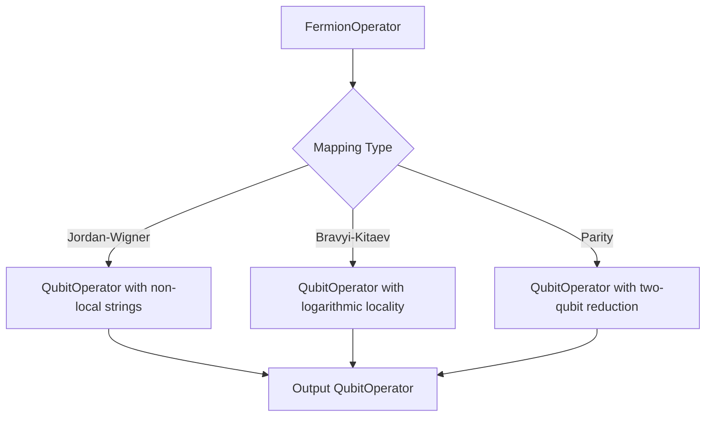
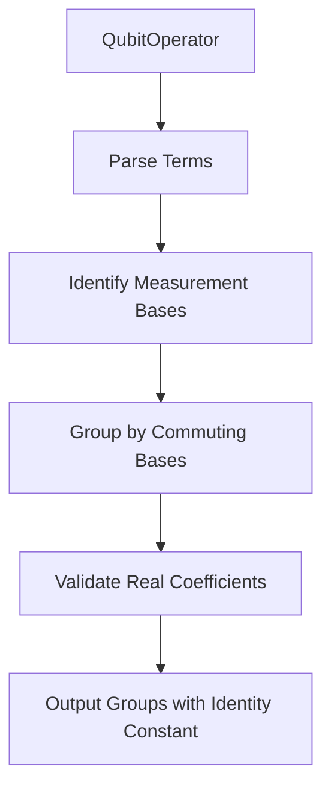
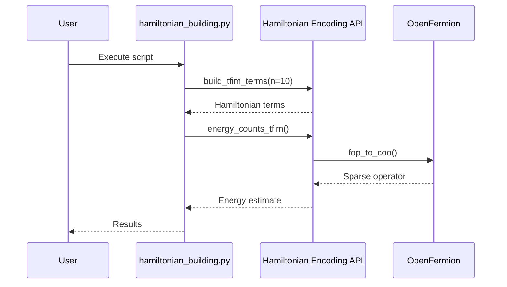

# Hamiltonian Encoding API

<cite>
**Referenced Files in This Document**   
- [fermion_to_qubit.py](file://src/tyxonq/libs/hamiltonian_encoding/fermion_to_qubit.py)
- [gray_binary_encoding.py](file://src/tyxonq/libs/hamiltonian_encoding/gray_binary_encoding.py)
- [hamiltonian_grouping.py](file://src/tyxonq/libs/hamiltonian_encoding/hamiltonian_grouping.py)
- [operator_encoding.py](file://src/tyxonq/libs/hamiltonian_encoding/operator_encoding.py)
- [pauli_io.py](file://src/tyxonq/libs/hamiltonian_encoding/pauli_io.py)
- [hamiltonian_building.py](file://examples/hamiltonian_building.py)
- [hchainhamiltonian.py](file://examples/hchainhamiltonian.py)
</cite>

## Table of Contents
1. [Introduction](#introduction)
2. [Fermion-to-Qubit Mappings](#fermion-to-qubit-mappings)
3. [Pauli Operator I/O and OpenFermion Compatibility](#pauli-operator-io-and-openfermion-compatibility)
4. [Hamiltonian Grouping for Measurement Optimization](#hamiltonian-grouping-for-measurement-optimization)
5. [Operator Encoding Utilities](#operator-encoding-utilities)
6. [Gray and Binary Encoding for Efficient Qubit Mappings](#gray-and-binary-encoding-for-efficient-qubit-mappings)
7. [Interface Specifications and Transformation Workflows](#interface-specifications-and-transformation-workflows)
8. [Error Handling Mechanisms](#error-handling-mechanisms)
9. [Practical Implementation Examples](#practical-implementation-examples)
10. [Integration with Quantum Chemistry Applications](#integration-with-quantum-chemistry-applications)
11. [Compiler Measurement Optimization Passes](#compiler-measurement-optimization-passes)
12. [Conclusion](#conclusion)

## Introduction
The Hamiltonian Encoding module in TyxonQ provides a comprehensive suite of tools for transforming fermionic and bosonic operators into qubit representations suitable for quantum computation. This API enables seamless integration with quantum chemistry simulations, variational algorithms, and measurement optimization workflows. The module supports multiple fermion-to-qubit mapping strategies, Pauli operator input/output with OpenFermion compatibility, and advanced Hamiltonian grouping techniques to minimize measurement overhead. It also includes utilities for Gray and binary encodings to optimize qubit usage in bosonic systems.

**Section sources**
- [operator_encoding.py](file://src/tyxonq/libs/hamiltonian_encoding/operator_encoding.py#L1-L50)

## Fermion-to-Qubit Mappings
The module implements several standard fermion-to-qubit transformation strategies, including Jordan-Wigner, Bravyi-Kitaev, and parity mappings. These transformations convert fermionic creation and annihilation operators into Pauli strings acting on qubits, preserving the anticommutation relations essential for accurate quantum simulations.

The `fop_to_qop` function serves as the primary interface for these mappings, accepting a FermionOperator and a specified mapping strategy. The Jordan-Wigner transformation is exact but results in non-local Pauli strings, while Bravyi-Kitaev offers logarithmic locality improvements. The parity mapping further reduces qubit count through two-qubit reduction under electron-number conservation constraints.



**Diagram sources**
- [fermion_to_qubit.py](file://src/tyxonq/libs/hamiltonian_encoding/fermion_to_qubit.py#L78-L88)

**Section sources**
- [fermion_to_qubit.py](file://src/tyxonq/libs/hamiltonian_encoding/fermion_to_qubit.py#L1-L98)

## Pauli Operator I/O and OpenFermion Compatibility
The Hamiltonian Encoding module ensures full compatibility with OpenFermion through robust Pauli operator input/output utilities. The `pauli_io.py` module provides functions for converting between OpenFermion's QubitOperator and FermionOperator types and internal representations used by TyxonQ.

Key functions include `reverse_fop_idx` and `reverse_qop_idx`, which handle index reversal between big-endian and little-endian conventions, ensuring consistent operator representation across different frameworks. The `qop_to_qiskit` function enables interoperability with Qiskit by converting QubitOperators into SparsePauliOp objects.

Additionally, the module supports sparse matrix representations via `fop_to_coo` and `hcb_to_coo`, which convert fermionic and qubit operators into COO (Coordinate) format for efficient storage and manipulation. These utilities facilitate integration with numerical backends and simulation pipelines.

**Section sources**
- [pauli_io.py](file://src/tyxonq/libs/hamiltonian_encoding/pauli_io.py#L1-L208)

## Hamiltonian Grouping for Measurement Optimization
To minimize measurement overhead in variational quantum algorithms, the module implements Hamiltonian grouping strategies that partition qubit operators into commuting subsets. The `group_qubit_operator_terms` function analyzes a QubitOperator and groups its terms by measurement basis, enabling simultaneous estimation of all terms within each group.

This grouping reduces the number of circuit executions required for energy evaluation, significantly improving efficiency. The algorithm checks for non-negligible imaginary components in coefficients, ensuring physical validity of the Hamiltonian. Each group corresponds to a unique tensor product of Pauli bases (e.g., XXYI), allowing measurement in a single basis configuration.



**Diagram sources**
- [hamiltonian_grouping.py](file://src/tyxonq/libs/hamiltonian_encoding/hamiltonian_grouping.py#L11-L44)

**Section sources**
- [hamiltonian_grouping.py](file://src/tyxonq/libs/hamiltonian_encoding/hamiltonian_grouping.py#L1-L66)

## Operator Encoding Utilities
The `operator_encoding.py` module provides advanced utilities for encoding quantum operators from various representations into qubit form. The core function `qubit_encode_op` transforms elementary operators into qubit representations using specified basis sets and encoding schemes.

These utilities support both direct qubit encoding for spin systems and bosonic encoding with options for unary, binary, or Gray representations. The `transform_op` function dispatches to appropriate encoding methods based on basis type, while `get_init_circuit` generates initial state preparation circuits from classical configurations.

The module integrates with the renormalizer library for advanced operator manipulation, enabling complex transformations required in quantum chemistry applications. Error checking ensures compatibility with supported basis types and prevents invalid configurations.

**Section sources**
- [operator_encoding.py](file://src/tyxonq/libs/hamiltonian_encoding/operator_encoding.py#L59-L87)

## Gray and Binary Encoding for Efficient Qubit Mappings
For bosonic systems, the module implements Gray and binary encoding schemes to efficiently represent multi-level systems using qubits. The `get_gray_codes` and `get_binary_codes` functions generate n-bit Gray and binary code sequences, which are used to map bosonic occupation numbers to qubit states.

Gray encoding minimizes bit-flip transitions between adjacent levels, reducing gate complexity in state preparation and operator implementation. Binary encoding provides a compact representation with logarithmic qubit scaling. The `get_encoding` function selects the appropriate encoding scheme based on user specification, supporting unary, binary, and Gray options.

These encodings are particularly valuable in quantum simulations of vibrational modes and lattice gauge theories, where efficient representation of high-dimensional Hilbert spaces is crucial for practical implementation.

```mermaid
flowchart TD
M[Bosonic System] --> N{Encoding Type}
N --> |Unary| O[One-hot encoding: n levels → n qubits]
N --> |Binary| P[Compact encoding: n levels → log₂(n) qubits]
N --> |Gray| Q[Minimized transitions: adjacent levels differ by one bit]
O --> R[Encoded Qubit Representation]
P --> R
Q --> R
```

**Diagram sources**
- [gray_binary_encoding.py](file://src/tyxonq/libs/hamiltonian_encoding/gray_binary_encoding.py#L2-L9)

**Section sources**
- [gray_binary_encoding.py](file://src/tyxonq/libs/hamiltonian_encoding/gray_binary_encoding.py#L1-L35)

## Interface Specifications and Transformation Workflows
The Hamiltonian Encoding API follows a consistent interface design across all transformation functions. Input operators are typically provided as OpenFermion FermionOperator or QubitOperator instances, with parameters specified through keyword arguments. All functions return validated qubit operators or structured data suitable for downstream processing.

Transformation workflows typically follow a pipeline: fermionic Hamiltonian construction → fermion-to-qubit mapping → Pauli term grouping → circuit generation. The API supports both high-level convenience functions and low-level utilities for fine-grained control over each transformation step.

Type hints and comprehensive docstrings ensure clarity in function signatures, while error handling provides meaningful feedback for invalid inputs. The modular design allows individual components to be used independently or combined into custom workflows.

**Section sources**
- [fermion_to_qubit.py](file://src/tyxonq/libs/hamiltonian_encoding/fermion_to_qubit.py#L78-L88)
- [operator_encoding.py](file://src/tyxonq/libs/hamiltonian_encoding/operator_encoding.py#L59-L87)

## Error Handling Mechanisms
The module implements rigorous error handling to ensure numerical stability and physical validity of encoded Hamiltonians. Key validation checks include:

- Verification of real-valued coefficients with negligible imaginary components (threshold: 1e-10)
- Validation of electron count parity in parity mapping
- Type checking for supported basis sets
- Bounds checking for qubit indices
- Consistency verification in index reversal operations

Exceptions are raised with descriptive messages that identify the source of invalid data, enabling rapid debugging of quantum chemistry workflows. The error handling framework follows Python best practices, using specific exception types (ValueError, TypeError, ImportError) to distinguish between different error categories.

**Section sources**
- [hamiltonian_grouping.py](file://src/tyxonq/libs/hamiltonian_encoding/hamiltonian_grouping.py#L20-L40)
- [fermion_to_qubit.py](file://src/tyxonq/libs/hamiltonian_encoding/fermion_to_qubit.py#L60-L65)

## Practical Implementation Examples
The examples directory contains two key demonstrations of the Hamiltonian Encoding module in practice:

The `hamiltonian_building.py` example constructs a transverse-field Ising model (TFIM) Hamiltonian using a list-of-terms representation. It demonstrates energy estimation through measurement counts, implementing basis rotations for X and Z measurements. This showcases the integration of Hamiltonian construction with measurement workflows.

The `hchainhamiltonian.py` example builds a molecular hydrogen chain Hamiltonian using OpenFermion's quantum chemistry tools. It applies fermion-to-qubit mapping via binary code transformation and converts the resulting QubitOperator into a sparse matrix representation. This demonstrates end-to-end quantum chemistry simulation setup, from molecular data to qubit Hamiltonian.



**Diagram sources**
- [hamiltonian_building.py](file://examples/hamiltonian_building.py#L1-L93)
- [hchainhamiltonian.py](file://examples/hchainhamiltonian.py#L1-L76)

**Section sources**
- [hamiltonian_building.py](file://examples/hamiltonian_building.py#L1-L93)
- [hchainhamiltonian.py](file://examples/hchainhamiltonian.py#L1-L76)

## Integration with Quantum Chemistry Applications
The Hamiltonian Encoding module is designed for seamless integration with quantum chemistry workflows. It interfaces directly with OpenFermion's molecular data processing pipeline, enabling conversion of electronic structure Hamiltonians into qubit representations suitable for variational algorithms.

The module supports common quantum chemistry mappings including Jordan-Wigner, Bravyi-Kitaev, and parity transformations with two-qubit reduction. It handles fermionic operator reordering (e.g., up-then-down spin ordering) and index reversal to maintain consistency across different software frameworks.

When combined with TyxonQ's compiler and execution backend, the encoded Hamiltonians can be used in variational quantum eigensolvers (VQE), quantum phase estimation, and time evolution algorithms. The integration supports both statevector simulations and noisy intermediate-scale quantum (NISQ) device execution.

**Section sources**
- [fermion_to_qubit.py](file://src/tyxonq/libs/hamiltonian_encoding/fermion_to_qubit.py#L78-L88)
- [pauli_io.py](file://src/tyxonq/libs/hamiltonian_encoding/pauli_io.py#L95-L100)

## Compiler Measurement Optimization Passes
The Hamiltonian grouping functionality integrates with TyxonQ's compiler pipeline to optimize measurement strategies. The `group_qubit_operator_terms` function serves as the foundation for measurement reduction passes that minimize circuit executions.

These optimization passes analyze the grouped Hamiltonian terms and generate efficient measurement schedules, combining commuting observables into single circuit configurations. The compiler can further optimize these schedules through gate cancellation, qubit remapping, and shot allocation strategies.

The measurement optimization is particularly valuable in variational algorithms where Hamiltonian expectation values must be evaluated repeatedly during parameter optimization. By reducing the number of required measurements, the overall algorithm runtime is significantly decreased.

**Section sources**
- [hamiltonian_grouping.py](file://src/tyxonq/libs/hamiltonian_encoding/hamiltonian_grouping.py#L11-L44)
- [hamiltonian_building.py](file://examples/hamiltonian_building.py#L50-L70)

## Conclusion
The Hamiltonian Encoding module in TyxonQ provides a comprehensive, robust, and efficient framework for transforming quantum operators into qubit representations. Its support for multiple fermion-to-qubit mappings, OpenFermion compatibility, and advanced measurement optimization techniques makes it well-suited for quantum chemistry simulations and variational algorithms. The modular design, rigorous error handling, and clear interface specifications ensure reliability and ease of use in both research and production environments.