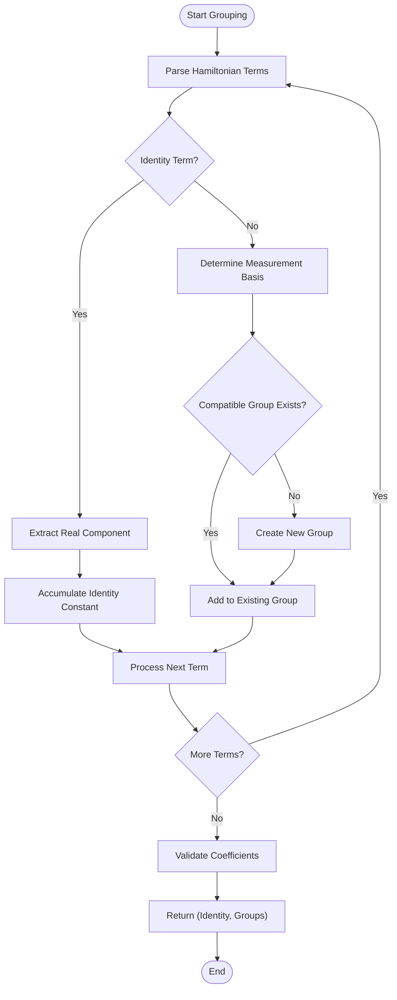

# Hamiltonian Term Grouping

<cite>
**Referenced Files in This Document**   
- [hamiltonian_grouping.py](file://src/tyxonq/libs/hamiltonian_encoding/hamiltonian_grouping.py)
- [hamiltonian_grouping.py](file://src/tyxonq/compiler/utils/hamiltonian_grouping.py)
- [measurement.py](file://src/tyxonq/compiler/stages/rewrite/measurement.py)
</cite>

## Table of Contents
1. [Introduction](#introduction)
2. [Core Grouping Functions](#core-grouping-functions)
3. [Return Structure and Data Format](#return-structure-and-data-format)
4. [Measurement Optimization Mechanism](#measurement-optimization-mechanism)
5. [Error Handling for Non-Hermitian Operators](#error-handling-for-non-hermitian-operators)
6. [Compiler Integration and Optimization Passes](#compiler-integration-and-optimization-passes)
7. [Application in Variational Algorithms](#application-in-variational-algorithms)
8. [Conclusion](#conclusion)

## Introduction

The Hamiltonian term grouping functionality in TyxonQ is a critical optimization component designed to enhance the efficiency of quantum measurements, particularly in variational quantum algorithms like Variational Quantum Eigensolver (VQE). This system partitions QubitOperator terms into measurement groups based on compatible Pauli bases, enabling simultaneous measurement of commuting terms. By reducing the total number of measurement shots required, this grouping strategy significantly improves computational efficiency and resource utilization in quantum simulations. The implementation is primarily located in the `hamiltonian_grouping.py` module within the `libs/hamiltonian_encoding` package, with integration points in the compiler's optimization pipeline.

**Section sources**
- [hamiltonian_grouping.py](file://src/tyxonq/libs/hamiltonian_encoding/hamiltonian_grouping.py#L1-L10)

## Core Grouping Functions

The core functionality is provided by two primary functions: `group_qubit_operator_terms` and `group_hamiltonian_pauli_terms`. The `group_qubit_operator_terms` function processes OpenFermion-like QubitOperator objects, extracting their terms and coefficients to group them by compatible measurement bases. This function handles the standard QubitOperator format where terms are represented as tuples of (qubit_index, Pauli_operator) pairs. The `group_hamiltonian_pauli_terms` function serves a similar purpose but operates on a Pauli-sum representation, accepting a list of coefficient-term pairs where each term is a list of (Pauli_operator, qubit_index) tuples. Both functions implement the same underlying grouping logic but provide different interfaces to accommodate various input formats commonly used in quantum chemistry and quantum simulation workflows.

**Section sources**
- [hamiltonian_grouping.py](file://src/tyxonq/libs/hamiltonian_encoding/hamiltonian_grouping.py#L11-L65)

## Return Structure and Data Format

Both grouping functions return a tuple containing an identity constant and a dictionary of grouped terms. The identity constant represents the scalar component of the Hamiltonian (terms with no Pauli operators), which contributes directly to the total energy expectation value. The dictionary maps measurement bases to lists of term-coefficient pairs, where each key is a tuple representing the Pauli basis for all qubits (e.g., ("I", "X", "Y", "Z")). Each value in the dictionary is a list of tuples, where each tuple contains a term specification (as a tuple of (qubit_index, Pauli_operator) pairs) and its corresponding coefficient. This structured return format enables downstream components to efficiently organize measurement circuits and post-process results, maintaining clear separation between the identity component and the measurable terms.

**Section sources**
- [hamiltonian_grouping.py](file://src/tyxonq/libs/hamiltonian_encoding/hamiltonian_grouping.py#L11-L65)

## Measurement Optimization Mechanism

The grouping algorithm enables measurement optimization by identifying sets of Pauli terms that can be measured simultaneously. Terms that share the same measurement basis (i.e., require identical single-qubit rotations before measurement) are grouped together, allowing their expectation values to be estimated from the same set of measurement shots. This optimization is based on the principle that commuting Pauli operators can be simultaneously diagonalized, meaning they can be measured in the same basis. The algorithm implements a greedy grouping strategy that scans through all Hamiltonian terms and assigns each to the first compatible group, or creates a new group if no compatible one exists. This approach ensures linear complexity relative to the number of terms while achieving significant reduction in the total number of required measurement settings.



**Diagram sources**
- [hamiltonian_grouping.py](file://src/tyxonq/libs/hamiltonian_encoding/hamiltonian_grouping.py#L11-L65)

**Section sources**
- [hamiltonian_grouping.py](file://src/tyxonq/libs/hamiltonian_encoding/hamiltonian_grouping.py#L11-L65)

## Error Handling for Non-Hermitian Operators

The implementation includes robust error handling for non-Hermitian operators with significant imaginary components. During processing of both identity terms and regular Hamiltonian terms, the code explicitly checks the imaginary part of each coefficient. If the absolute value of the imaginary component exceeds a threshold of 1e-10, a ValueError is raised with a descriptive message indicating which term has a non-negligible imaginary part. This validation ensures that only physically meaningful (Hermitian) Hamiltonians are processed, preventing potential errors in subsequent quantum simulations. The threshold of 1e-10 is chosen to accommodate minor numerical imprecision from floating-point arithmetic while catching genuine non-Hermitian cases that would indicate a problem in the Hamiltonian construction process.

**Section sources**
- [hamiltonian_grouping.py](file://src/tyxonq/libs/hamiltonian_encoding/hamiltonian_grouping.py#L25-L35)

## Compiler Integration and Optimization Passes

The Hamiltonian grouping functionality is integrated into TyxonQ's compiler through the measurement optimization pass located in `compiler/stages/rewrite/measurement.py`. The `MeasurementRewritePass` class utilizes the grouping functions to process Hamiltonian terms provided as input options, either in the form of a QubitOperator or a Pauli-sum list. When a Hamiltonian is detected in the compilation options, the pass invokes the appropriate grouping function based on the input format, then merges the resulting groups into the circuit's metadata under the "measurement_groups" key. This metadata includes not only the grouped terms but also additional information such as wire mappings, basis specifications, and estimated shot requirements. The integration allows the compiler to optimize measurement circuits holistically, considering both explicit measurement instructions and Hamiltonian-based energy calculations within the same framework.

```mermaid
classDiagram
class MeasurementRewritePass {
+execute_plan(circuit, **opts) Circuit
-_group_measurements(measurements) List[Dict]
-_parse_pauli_support(obs, wires) Tuple[str, Dict]
}
class group_qubit_operator_terms {
+group_qubit_operator_terms(qop, n_qubits) Tuple[float, Dict]
+group_hamiltonian_pauli_terms(hamiltonian, n_qubits) Tuple[float, Dict]
}
MeasurementRewritePass --> group_qubit_operator_terms : "uses"
MeasurementRewritePass ..> Circuit : "transforms"
MeasurementRewritePass ..> "Circuit.metadata" : "writes"
```

**Diagram sources**
- [measurement.py](file://src/tyxonq/compiler/stages/rewrite/measurement.py#L1-L165)
- [hamiltonian_grouping.py](file://src/tyxonq/libs/hamiltonian_encoding/hamiltonian_grouping.py#L11-L65)

**Section sources**
- [measurement.py](file://src/tyxonq/compiler/stages/rewrite/measurement.py#L49-L65)

## Application in Variational Algorithms

The Hamiltonian term grouping functionality plays a crucial role in variational quantum algorithms, particularly VQE and Quantum Approximate Optimization Algorithm (QAOA). In these algorithms, the expectation value of a molecular or problem Hamiltonian must be estimated repeatedly during the optimization loop. By reducing the number of distinct measurement settings required, the grouping algorithm significantly decreases the total measurement overhead, which is often the bottleneck in variational algorithms. For example, in VQE calculations of molecular ground states, the grouping can reduce the number of required measurement circuits from hundreds or thousands to just tens, dramatically accelerating the optimization process. This efficiency gain is particularly important for near-term quantum devices with limited coherence times and high measurement error rates, where minimizing the number of circuit executions directly translates to improved result quality and reduced experimental runtime.

**Section sources**
- [hamiltonian_grouping.py](file://src/tyxonq/libs/hamiltonian_encoding/hamiltonian_grouping.py#L11-L65)
- [measurement.py](file://src/tyxonq/compiler/stages/rewrite/measurement.py#L49-L65)

## Conclusion

The Hamiltonian term grouping functionality in TyxonQ represents a sophisticated optimization that bridges the gap between theoretical quantum algorithms and practical quantum computation. By intelligently grouping compatible Pauli terms for simultaneous measurement, the system achieves substantial efficiency gains without compromising accuracy. The implementation demonstrates careful attention to both algorithmic correctness (through proper handling of Hermiticity constraints) and practical usability (through flexible input formats and seamless compiler integration). As quantum algorithms continue to scale to larger systems, such measurement optimization techniques will become increasingly important, and TyxonQ's grouping functionality provides a robust foundation for efficient quantum simulation and variational algorithm execution.