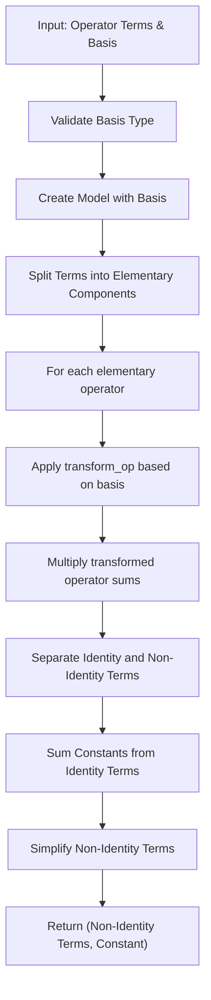
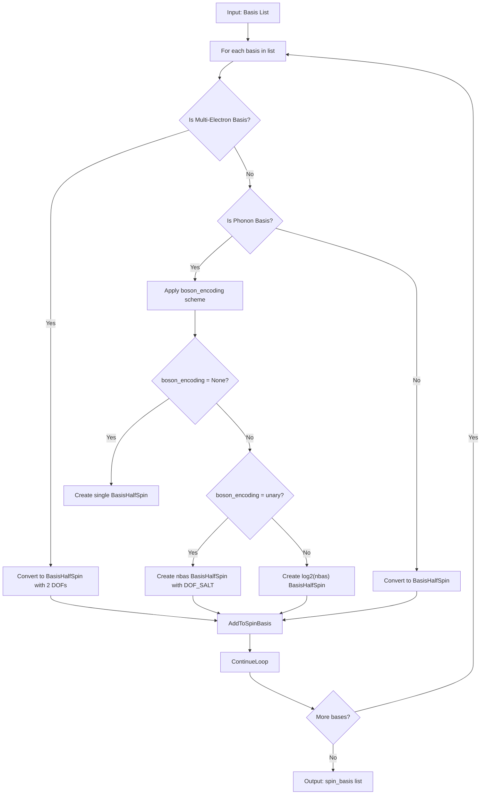
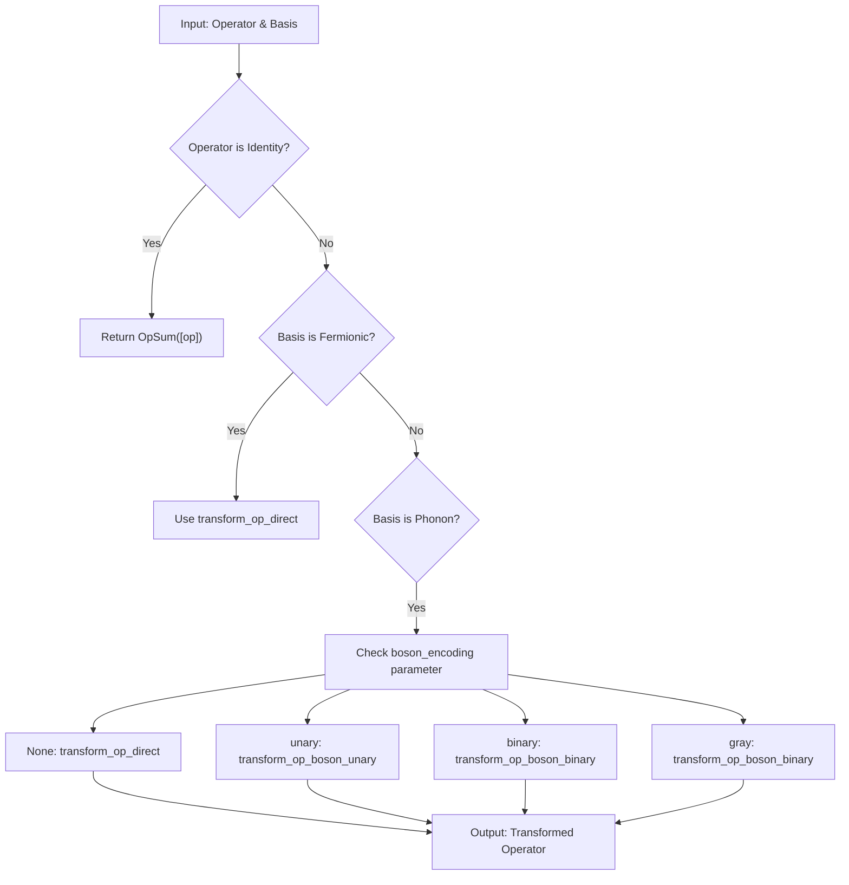
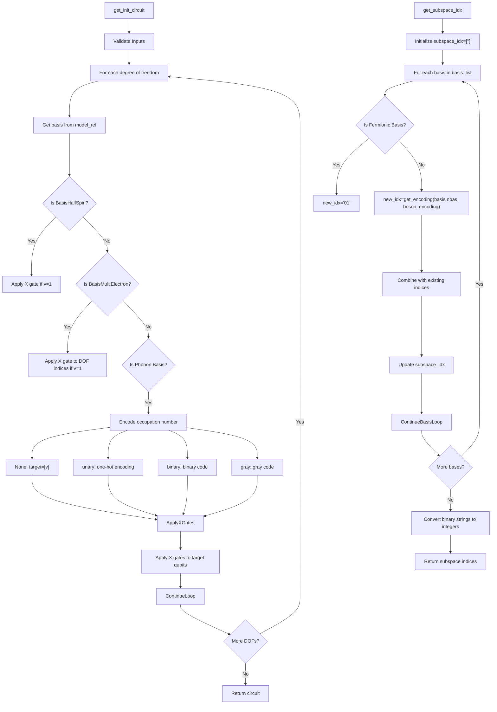

# Operator and Basis Encoding

<cite>
**Referenced Files in This Document**   
- [operator_encoding.py](file://src/tyxonq/libs/hamiltonian_encoding/operator_encoding.py)
- [gray_binary_encoding.py](file://src/tyxonq/libs/hamiltonian_encoding/gray_binary_encoding.py)
</cite>

## Table of Contents
1. [Introduction](#introduction)
2. [Operator Encoding Functions](#operator-encoding-functions)
3. [Basis Transformation and Encoding](#basis-transformation-and-encoding)
4. [Bosonic Operator Encoding](#bosonic-operator-encoding)
5. [State Preparation and Subspace Mapping](#state-preparation-and-subspace-mapping)
6. [DOF_SALT Mechanism](#dof_salt-mechanism)
7. [Renormalizer Integration and Error Handling](#renormalizer-integration-and-error-handling)

## Introduction
The operator and basis encoding utilities in TyxonQ provide essential functionality for transforming fermionic and bosonic operators into qubit operators using various encoding schemes. These utilities operate at the "compile-before-gates" layer, producing qubit operators and encoded bases that feed into gate-level construction and measurement grouping. The encoding process integrates with the renormalizer library for advanced quantum simulations while maintaining compatibility with quantum circuit compilation workflows.

**Section sources**
- [operator_encoding.py](file://src/tyxonq/libs/hamiltonian_encoding/operator_encoding.py#L0-L38)

## Operator Encoding Functions

The `qubit_encode_op` function transforms fermionic or bosonic operators into qubit operators by processing input terms through a model that maps degrees of freedom to site indices. It handles both single operators and lists of operators, splitting them into elementary components and applying appropriate transformations based on the basis type. The function separates identity terms from non-identity terms, returning simplified non-identity operator sums and a constant value from identity terms.

The `qubit_encode_op_grouped` function extends this capability by processing grouped operator terms, applying `qubit_encode_op` to each group while accumulating the total constant contribution. This enables efficient encoding of Hamiltonian terms that have been pre-grouped for measurement or optimization purposes, preserving the grouping structure in the output while handling the encoding process uniformly across all groups.

**Diagram sources**
- [operator_encoding.py](file://src/tyxonq/libs/hamiltonian_encoding/operator_encoding.py#L59-L87)

**Section sources**
- [operator_encoding.py](file://src/tyxonq/libs/hamiltonian_encoding/operator_encoding.py#L59-L99)

## Basis Transformation and Encoding

The `qubit_encode_basis` function transforms a list of basis objects into a spin basis representation suitable for qubit encoding. For fermionic systems, it converts electron bases to half-spin bases. For bosonic systems, it applies the specified encoding scheme (unary, binary, or gray) to map phonon modes to multiple qubits. The function uses the DOF_SALT mechanism to generate unique degree-of-freedom identifiers for encoded qubits, ensuring proper separation between different physical degrees of freedom in the encoded representation.

When processing multi-electron bases, the function asserts that exactly two basis functions are present, maintaining consistency with the underlying physical model. For phonon modes, the function determines the number of qubits needed based on the encoding scheme and creates appropriate half-spin basis objects for each resulting qubit, preserving the mapping between original degrees of freedom and their encoded qubit representations.

**Diagram sources**
- [operator_encoding.py](file://src/tyxonq/libs/hamiltonian_encoding/operator_encoding.py#L102-L122)

**Section sources**
- [operator_encoding.py](file://src/tyxonq/libs/hamiltonian_encoding/operator_encoding.py#L102-L122)

## Bosonic Operator Encoding

The `transform_op` family of functions handles the transformation of operators based on their basis type. For fermionic systems (half-spin, simple electron, or multi-electron bases), it applies direct encoding using `transform_op_direct`. For bosonic systems (phonon bases), it delegates to `transform_op_boson` with the appropriate encoding scheme. The function ensures that operators are properly normalized (factor = 1) before transformation and handles identity operators as a special case.

The bosonic transformation functions implement three encoding schemes: direct (single qubit), unary (one-hot), and binary/gray (logarithmic). The unary encoding creates a separate qubit for each basis state, with occupation represented by a single excited qubit. The binary and gray encodings use a logarithmic number of qubits, with state representation following standard binary or Gray code patterns. The gray encoding specifically uses reflected Gray codes to minimize bit changes between adjacent states, potentially reducing gate complexity in certain applications.

**Diagram sources**
- [operator_encoding.py](file://src/tyxonq/libs/hamiltonian_encoding/operator_encoding.py#L125-L138)

**Section sources**
- [operator_encoding.py](file://src/tyxonq/libs/hamiltonian_encoding/operator_encoding.py#L125-L222)

## State Preparation and Subspace Mapping

The `get_init_circuit` function generates quantum circuits for initializing quantum states from classical conditions. It handles different basis types appropriately: for half-spin bases, it applies X gates for excited states; for multi-electron bases, it applies X gates to the appropriate DOF indices; for phonon bases, it encodes the occupation number according to the specified boson encoding scheme. The function supports various initialization methods, including direct qubit excitation, unitary operations, and specialized encoding patterns.

The `get_subspace_idx` function maps basis states to qubit state indices in the full Hilbert space. It recursively builds the subspace indices by combining the encoding patterns of individual bases. For fermionic bases, it uses binary digits "0" and "1" to represent unoccupied and occupied states. For bosonic bases, it uses the appropriate encoding (unary, binary, or gray) to represent the multi-level states. The resulting indices are converted from binary strings to integers, providing a mapping between the logical basis states and their positions in the dense state vector representation.

**Diagram sources**
- [operator_encoding.py](file://src/tyxonq/libs/hamiltonian_encoding/operator_encoding.py#L247-L293)
- [operator_encoding.py](file://src/tyxonq/libs/hamiltonian_encoding/operator_encoding.py#L308-L321)

**Section sources**
- [operator_encoding.py](file://src/tyxonq/libs/hamiltonian_encoding/operator_encoding.py#L247-L342)

## DOF_SALT Mechanism

The DOF_SALT mechanism provides a consistent naming convention for degrees of freedom in encoded quantum systems. Defined as "TCCQUBIT", this salt string is appended to original degree of freedom identifiers when creating multi-qubit representations for bosonic modes. This ensures that qubits representing different levels of the same phonon mode are uniquely identifiable while maintaining a clear relationship to the original physical degree of freedom.

The mechanism is used in conjunction with integer indices to create unique identifiers for each qubit in an encoded bosonic mode. For example, a phonon mode with identifier "v0" encoded in unary with 4 levels would produce qubits with DOFs ("v0", "TCCQUBIT-0"), ("v0", "TCCQUBIT-1"), ("v0", "TCCQUBIT-2"), and ("v0", "TCCQUBIT-3"). This hierarchical naming scheme preserves the physical interpretation of the system while enabling the mathematical formalism of qubit-based quantum computing.

**Section sources**
- [operator_encoding.py](file://src/tyxonq/libs/hamiltonian_encoding/operator_encoding.py#L35-L38)

## Renormalizer Integration and Error Handling

The encoding utilities integrate with the renormalizer library through the `_require_renormalizer` function, which checks for the availability of essential renormalizer components. This integration enables advanced quantum simulations and operator manipulations while maintaining a clean separation between core encoding functionality and optional dependencies. The error handling system raises appropriate exceptions when required components are missing or when unsupported basis types are encountered.

The `check_basis_type` function validates input bases, rejecting unsupported types like BasisMultiElectronVac and ensuring that multi-electron bases have exactly two degrees of freedom. For unsupported encoding schemes, the `transform_op_boson` function raises a ValueError with a descriptive message. These error handling mechanisms ensure the integrity of the encoding process and provide clear feedback for debugging and development.

**Section sources**
- [operator_encoding.py](file://src/tyxonq/libs/hamiltonian_encoding/operator_encoding.py#L35-L56)
- [operator_encoding.py](file://src/tyxonq/libs/hamiltonian_encoding/operator_encoding.py#L222-L244)