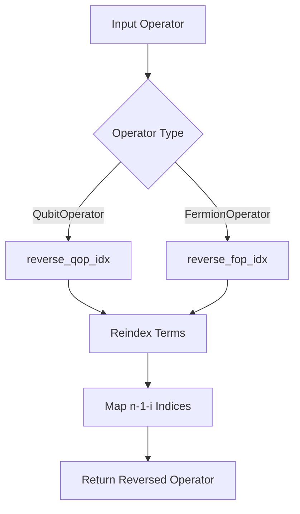
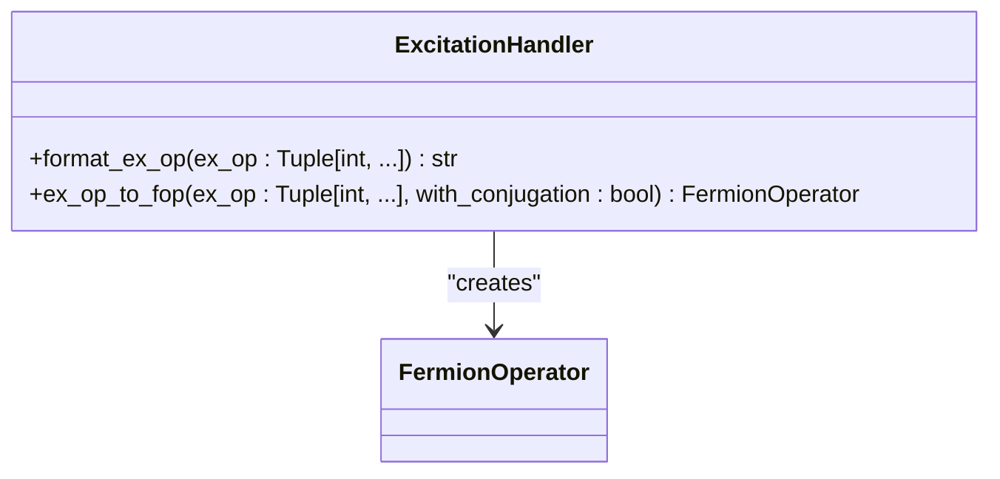
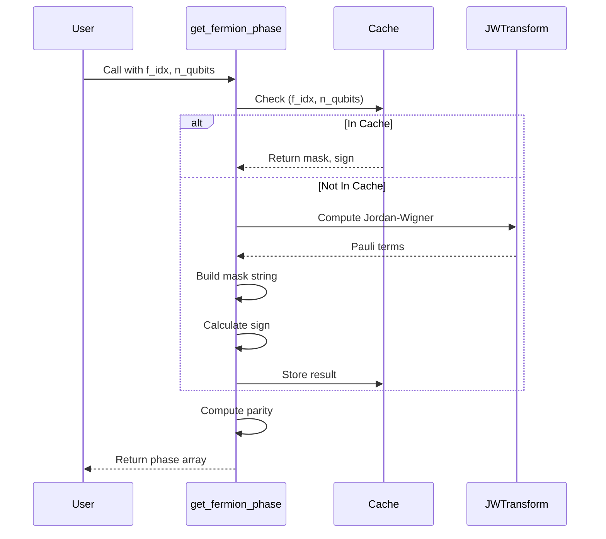
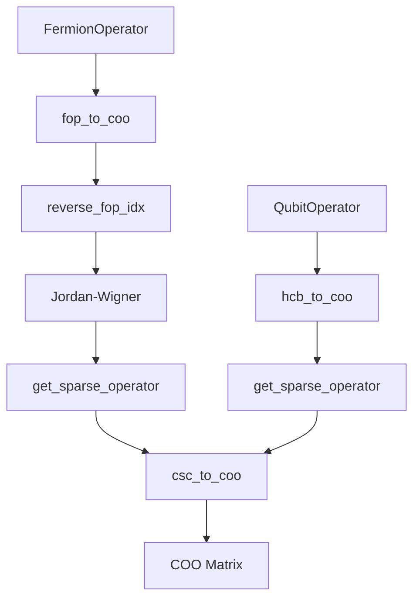
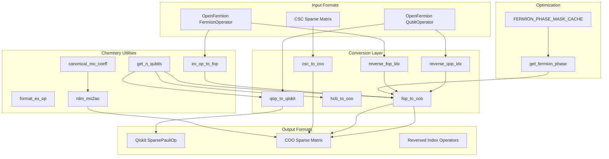

# Pauli Operator I/O

<cite>
**Referenced Files in This Document**   
- [pauli_io.py](file://src/tyxonq/libs/hamiltonian_encoding/pauli_io.py)
- [fermion_to_qubit.py](file://src/tyxonq/libs/hamiltonian_encoding/fermion_to_qubit.py)
- [civector_ops.py](file://src/tyxonq/applications/chem/chem_libs/quantum_chem_library/civector_ops.py)
- [constants.py](file://src/tyxonq/applications/chem/constants.py)
</cite>

## Table of Contents
1. [Introduction](#introduction)
2. [Core Conversion Functions](#core-conversion-functions)
3. [Index Reversal Utilities](#index-reversal-utilities)
4. [Excitation Operator Handling](#excitation-operator-handling)
5. [Chemistry Helper Functions](#chemistry-helper-functions)
6. [Fermion Phase Optimization](#fermion-phase-optimization)
7. [Sparse Matrix Conversions](#sparse-matrix-conversions)
8. [Architecture Overview](#architecture-overview)

## Introduction
This document provides comprehensive API documentation for Pauli operator input/output operations in TyxonQ. The module `pauli_io.py` offers essential utilities for converting between different quantum operator representations, handling index ordering conventions, and supporting chemistry-specific computations. These tools facilitate interoperability between OpenFermion, Qiskit, and internal sparse matrix formats, enabling efficient quantum chemistry simulations and algorithm development.

**Section sources**
- [pauli_io.py](file://src/tyxonq/libs/hamiltonian_encoding/pauli_io.py#L1-L50)

## Core Conversion Functions

### qop_to_qiskit Function
The `qop_to_qiskit` function converts OpenFermion `QubitOperator` instances into Qiskit's `SparsePauliOp` format. This conversion enables seamless integration with Qiskit's quantum circuit framework and simulation tools. The function processes each Pauli term by extracting its string representation and qubit indices, then constructs a sparse list format compatible with Qiskit's API. This utility is essential for workflows that require execution on Qiskit-based backends or further processing using Qiskit's quantum information tools.

**Section sources**
- [pauli_io.py](file://src/tyxonq/libs/hamiltonian_encoding/pauli_io.py#L75-L83)

## Index Reversal Utilities

### reverse_qop_idx and reverse_fop_idx Functions
The `reverse_qop_idx` and `reverse_fop_idx` functions handle the conversion between big-endian and little-endian qubit indexing conventions. These utilities are critical when interfacing with different quantum computing frameworks that may use varying qubit ordering schemes. The functions transform operator terms by reversing the qubit indices according to the total number of qubits in the system, ensuring consistent representation across different components of the quantum software stack.

**Diagram sources**
- [pauli_io.py](file://src/tyxonq/libs/hamiltonian_encoding/pauli_io.py#L86-L100)

**Section sources**
- [pauli_io.py](file://src/tyxonq/libs/hamiltonian_encoding/pauli_io.py#L86-L100)

## Excitation Operator Handling

### ex_op_to_fop and format_ex_op Functions
The `ex_op_to_fop` function converts excitation operator tuples into OpenFermion `FermionOperator` instances. It supports both single (2-index) and double (4-index) excitations, optionally applying anti-Hermitian conjugation for variational quantum eigensolver (VQE) applications. The `format_ex_op` utility provides string formatting for excitation operators, enhancing readability and debugging capabilities. These functions are fundamental for constructing unitary coupled cluster (UCC) ansätze and other excitation-based quantum chemistry methods.

**Diagram sources**
- [pauli_io.py](file://src/tyxonq/libs/hamiltonian_encoding/pauli_io.py#L103-L119)

**Section sources**
- [pauli_io.py](file://src/tyxonq/libs/hamiltonian_encoding/pauli_io.py#L103-L119)

## Chemistry Helper Functions

### rdm_mo2ao, canonical_mo_coeff, and get_n_qubits Functions
The chemistry helper functions provide essential utilities for quantum chemistry calculations. The `rdm_mo2ao` function transforms reduced density matrices from molecular orbital (MO) to atomic orbital (AO) basis using coefficient matrices. The `canonical_mo_coeff` function standardizes molecular orbital coefficients by ensuring the largest element in each column is positive, providing consistent phase conventions. The `get_n_qubits` utility determines the number of qubits from various quantum data structures, supporting flexible input types including vectors, matrices, and MPO functions.

**Section sources**
- [pauli_io.py](file://src/tyxonq/libs/hamiltonian_encoding/pauli_io.py#L136-L158)

## Fermion Phase Optimization

### FERMION_PHASE_MASK_CACHE and get_fermion_phase Function
The `FERMION_PHASE_MASK_CACHE` is a global dictionary that caches phase calculation results for fermionic operators, significantly improving performance in repeated calculations. The `get_fermion_phase` function computes fermionic phase factors using Jordan-Wigner transformation properties and bitwise operations on configuration strings. This optimization is crucial for efficient CI vector evolution and excitation operator applications in quantum chemistry simulations, reducing redundant calculations through memoization.

**Diagram sources**
- [pauli_io.py](file://src/tyxonq/libs/hamiltonian_encoding/pauli_io.py#L165-L205)

**Section sources**
- [pauli_io.py](file://src/tyxonq/libs/hamiltonian_encoding/pauli_io.py#L165-L205)

## Sparse Matrix Conversions

### fop_to_coo, hcb_to_coo, and csc_to_coo Functions
The sparse matrix conversion functions provide efficient transformations between operator representations and COO (Coordinate) sparse matrix format. The `fop_to_coo` function converts fermionic operators by first applying Jordan-Wigner transformation and index reversal, while `hcb_to_coo` handles qubit operators directly. The `csc_to_coo` function converts CSC (Compressed Sparse Column) matrices to COO format with backend-aware construction, preferring the current numeric backend's sparse matrix implementation when available. These functions support optional real-part extraction and automatically discard negligible imaginary components.

**Diagram sources**
- [pauli_io.py](file://src/tyxonq/libs/hamiltonian_encoding/pauli_io.py#L61-L72)

**Section sources**
- [pauli_io.py](file://src/tyxonq/libs/hamiltonian_encoding/pauli_io.py#L61-L72)

## Architecture Overview

**Diagram sources**
- [pauli_io.py](file://src/tyxonq/libs/hamiltonian_encoding/pauli_io.py#L1-L208)

**Section sources**
- [pauli_io.py](file://src/tyxonq/libs/hamiltonian_encoding/pauli_io.py#L1-L208)