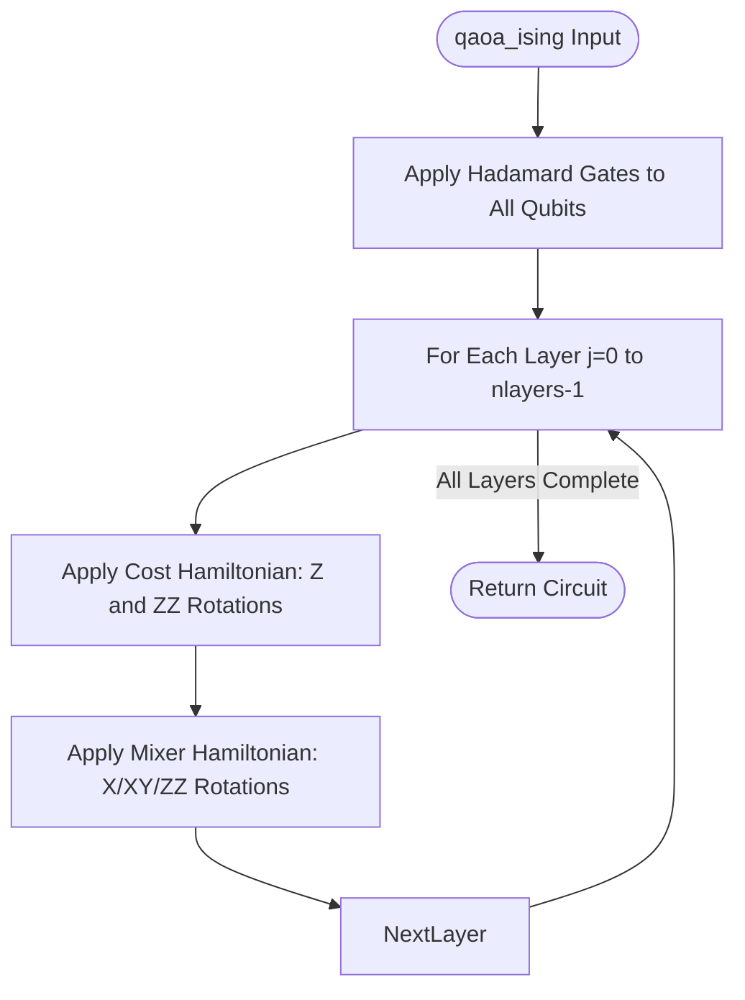
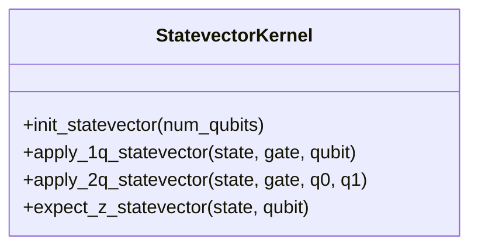
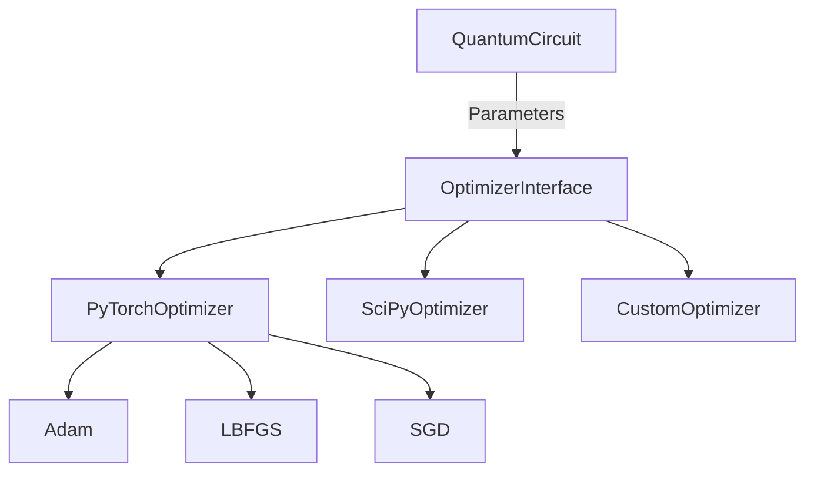
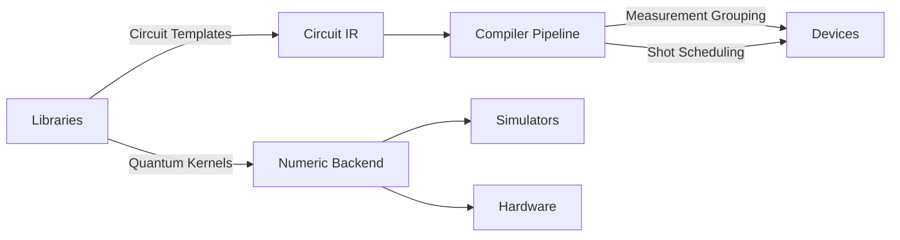

# Libraries API

<cite>
**Referenced Files in This Document**   
- [vqe.py](file://src/tyxonq/libs/circuits_library/vqe.py)
- [qaoa_ising.py](file://src/tyxonq/libs/circuits_library/qaoa_ising.py)
- [trotter_circuit.py](file://src/tyxonq/libs/circuits_library/trotter_circuit.py)
- [ucc.py](file://src/tyxonq/libs/circuits_library/ucc.py)
- [variational.py](file://src/tyxonq/libs/circuits_library/variational.py)
- [statevector.py](file://src/tyxonq/libs/quantum_library/kernels/statevector.py)
- [density_matrix.py](file://src/tyxonq/libs/quantum_library/kernels/density_matrix.py)
- [matrix_product_state.py](file://src/tyxonq/libs/quantum_library/kernels/matrix_product_state.py)
- [unitary.py](file://src/tyxonq/libs/quantum_library/kernels/unitary.py)
- [pauli.py](file://src/tyxonq/libs/quantum_library/kernels/pauli.py)
- [fermion_to_qubit.py](file://src/tyxonq/libs/hamiltonian_encoding/fermion_to_qubit.py)
- [pauli_io.py](file://src/tyxonq/libs/hamiltonian_encoding/pauli_io.py)
- [soap.py](file://src/tyxonq/libs/optimizer/soap.py)
- [interop.py](file://src/tyxonq/libs/optimizer/interop.py)
- [vqe_noisyopt.py](file://examples/vqe_noisyopt.py)
- [simple_qaoa.py](file://examples/simple_qaoa.py)
- [timeevolution_trotter.py](file://examples/timeevolution_trotter.py)
- [cloud_uccsd_hea_demo.py](file://examples/cloud_uccsd_hea_demo.py)
</cite>

## Table of Contents
1. [Introduction](#introduction)
2. [Circuits Library](#circuits-library)
3. [Quantum Library Kernels](#quantum-library-kernels)
4. [Hamiltonian Encoding Module](#hamiltonian-encoding-module)
5. [Optimizer Module](#optimizer-module)
6. [Usage Examples](#usage-examples)
7. [Integration with Core Framework](#integration-with-core-framework)
8. [Conclusion](#conclusion)

## Introduction
The TyxonQ Libraries module provides a comprehensive collection of reusable quantum computing components designed for high-level algorithm construction and numerical simulation. This API documentation details the core libraries including circuit templates, quantum kernels, Hamiltonian encoding utilities, and optimization tools. These components are engineered to work seamlessly with the TyxonQ core framework, enabling efficient development of quantum algorithms across various domains including quantum chemistry, optimization, and dynamics simulation.

## Circuits Library

The circuits_library module provides a collection of pre-built quantum circuit templates for variational algorithms, time evolution, and quantum chemistry applications. These templates are implemented as reusable functions that generate circuit operations compatible with the TyxonQ IR (Intermediate Representation).

### VQE Circuit Templates
The VQE (Variational Quantum Eigensolver) module provides components for constructing variational ansatz circuits and computing energy expectations. The `build_hwe_ansatz_ops` function creates hardware-efficient ansatz circuits with configurable layers of CX, RX, RZ, and RX gates. Energy evaluation is performed through the `evaluate_energy` function, which computes expectation values from measurement counts. Gradient computation follows the parameter-shift rule via `parameter_shift_gradient`, supporting automatic differentiation workflows.

**Section sources**
- [vqe.py](file://src/tyxonq/libs/circuits_library/vqe.py#L0-L152)

### QAOA/Ising Circuit Templates
The QAOA (Quantum Approximate Optimization Algorithm) template implements the Ising model ansatz for combinatorial optimization problems. The `qaoa_ising` function constructs circuits with alternating cost and mixer layers. Cost layers apply Z and ZZ rotations based on problem Hamiltonian terms, while mixer layers support X, XY, or ZZ mixers with configurable coupling patterns. The circuit supports both linear and full coupling topologies for the mixer Hamiltonian.

**Diagram sources**
- [qaoa_ising.py](file://src/tyxonq/libs/circuits_library/qaoa_ising.py#L0-L68)

**Section sources**
- [qaoa_ising.py](file://src/tyxonq/libs/circuits_library/qaoa_ising.py#L0-L68)

### Trotter Circuit Templates
The Trotter module provides first-order Trotterization for quantum time evolution. The `build_trotter_circuit` function constructs circuits that approximate the time evolution operator exp(-iHt) by decomposing the Hamiltonian into Pauli terms and applying their individual evolutions sequentially. Each Trotter step applies unitary operations for all Hamiltonian terms, with support for configurable time steps and evolution duration. The implementation includes native gate decomposition for single-qubit X/Z and two-qubit ZZ terms.

**Section sources**
- [trotter_circuit.py](file://src/tyxonq/libs/circuits_library/trotter_circuit.py#L0-L91)

### UCC Circuit Templates
The UCC (Unitary Coupled Cluster) module implements quantum chemistry ansatz circuits for molecular energy calculations. The `build_ucc_circuit` function constructs circuits based on fermionic excitation operators mapped to qubit operators via Jordan-Wigner transformation. The implementation supports both gate-level and Trotterized evolution modes, with optional multicontrol gate decomposition. Initial state preparation includes Hartree-Fock state initialization with configurable fermion-to-qubit mapping modes.

**Section sources**
- [ucc.py](file://src/tyxonq/libs/circuits_library/ucc.py#L0-L128)

### Variational Circuit Templates
The variational module provides tools for constructing parameterized quantum circuits from Pauli operator lists. The `build_layered_pauli_circuit` function creates layered ansatz circuits where each layer applies exponentiated Pauli operators with shared parameters. The implementation supports both direct evolution and compiled gate sequences. Additional utilities include state preparation functions, Jacobian computation, and variational dynamics runtimes for quantum simulation.

**Section sources**
- [variational.py](file://src/tyxonq/libs/circuits_library/variational.py#L0-L253)

## Quantum Library Kernels

The quantum_library module provides low-level kernels for quantum state simulation and manipulation across different representations.

### Statevector Operations
The statevector kernel implements operations for full statevector simulation. The `init_statevector` function creates initial computational basis states. Single-qubit operations are applied via `apply_1q_statevector` using tensor contraction with the gate matrix, while two-qubit operations use `apply_2q_statevector` with appropriate index mapping. Expectation value computation for Pauli-Z operators is optimized through `expect_z_statevector`, which calculates measurement probabilities from state amplitudes.

**Diagram sources**
- [statevector.py](file://src/tyxonq/libs/quantum_library/kernels/statevector.py#L0-L54)

**Section sources**
- [statevector.py](file://src/tyxonq/libs/quantum_library/kernels/statevector.py#L0-L54)

### Density Matrix Operations
The density matrix kernel supports mixed state simulation with operations on density matrices. The `init_density` function creates pure initial states in density matrix form. Single-qubit operations follow the transformation ρ → UρU† implemented in `apply_1q_density`, while two-qubit operations extend this pattern in `apply_2q_density`. The `exp_z_density` function computes Z-basis expectation values efficiently by extracting diagonal elements corresponding to computational basis states.

**Section sources**
- [density_matrix.py](file://src/tyxonq/libs/quantum_library/kernels/density_matrix.py#L0-L83)

### Matrix Product State Operations
The matrix product state (MPS) kernel provides compressed state simulation capabilities. The `MPSState` class represents quantum states as a chain of tensors with bounded entanglement. The `init_product_state` function creates separable initial states, while `apply_1q` and `apply_2q_nn` apply local unitaries with bond dimension control. The implementation includes SVD-based truncation in `apply_2q_nn` to maintain computational efficiency during time evolution. The `to_statevector` function enables full state reconstruction for verification purposes.

**Section sources**
- [matrix_product_state.py](file://src/tyxonq/libs/quantum_library/kernels/matrix_product_state.py#L0-L234)

### Unitary Operations
The unitary kernel provides canonical unitary matrices for fundamental quantum gates. The `get_unitary` function returns dense matrix representations for supported gates including H, RZ, and CX. Single-qubit gates are implemented with parameterized rotations, while two-qubit gates follow standard computational basis ordering. The implementation uses NumPy as the underlying numerical backend to ensure compatibility across different execution environments.

**Section sources**
- [unitary.py](file://src/tyxonq/libs/quantum_library/kernels/unitary.py#L0-L82)

### Pauli Operations
The pauli kernel provides utilities for Pauli operator manipulation and Hamiltonian construction. The `ps2xyz` and `xyz2ps` functions convert between integer-encoded Pauli strings and dictionary representations. The `pauli_string_to_matrix` function generates dense matrix representations of Pauli terms, while `pauli_string_sum_dense` constructs full Hamiltonians from linear combinations of Pauli strings. Additional functionality includes Heisenberg model Hamiltonian generation and sparse matrix construction.

**Section sources**
- [pauli.py](file://src/tyxonq/libs/quantum_library/kernels/pauli.py#L0-L174)

## Hamiltonian Encoding Module

The hamiltonian_encoding module provides tools for mapping physical problems to qubit Hamiltonians and handling Pauli operator representations.

### Fermion-to-Qubit Mapping
The fermion_to_qubit module implements transformations from fermionic operators to qubit operators, primarily through the Jordan-Wigner transformation. This mapping preserves the algebraic structure of fermionic creation and annihilation operators while representing them as tensor products of Pauli matrices. The implementation supports excitation operator conversion and index reversal to maintain compatibility with different qubit ordering conventions.

**Section sources**
- [fermion_to_qubit.py](file://src/tyxonq/libs/hamiltonian_encoding/fermion_to_qubit.py)

### Pauli Operator Handling
The pauli_io module provides utilities for working with Pauli operators in various representations. The `ex_op_to_fop` function converts excitation operators to fermionic operators, while `reverse_qop_idx` handles qubit index reversal for compatibility with different wire conventions. These tools enable seamless translation between quantum chemistry formulations and executable quantum circuits.

**Section sources**
- [pauli_io.py](file://src/tyxonq/libs/hamiltonian_encoding/pauli_io.py#L0-L128)

### OpenFermion I/O
The hamiltonian_encoding module provides interoperability with OpenFermion through re-exported utilities. This enables direct import of molecular Hamiltonians and operator representations from OpenFermion workflows. The integration maintains consistent data structures for Hamiltonian terms, allowing smooth transition from quantum chemistry calculations to quantum circuit execution.

**Section sources**
- [operator_encoding.py](file://src/tyxonq/libs/hamiltonian_encoding/operator_encoding.py)
- [pauli_io.py](file://src/tyxonq/libs/hamiltonian_encoding/pauli_io.py#L0-L128)

## Optimizer Module

The optimizer module provides optimization tools for variational quantum algorithms with integration capabilities for external frameworks.

### SOAP Optimizer
The soap optimizer implements a second-order optimization algorithm tailored for quantum variational problems. The implementation leverages quantum geometric information to accelerate convergence compared to first-order methods. The optimizer interface is designed to work with parameter-shift gradients and supports both exact and sampled gradient evaluations.

**Section sources**
- [soap.py](file://src/tyxonq/libs/optimizer/soap.py)

### Interoperability Features
The interop module enables integration with external optimization frameworks and machine learning libraries. The implementation supports PyTorch optimizers through the `torch.optim` interface, allowing seamless use of Adam, LBFGS, and other optimizers with quantum circuits. The re-export mechanism in `__init__.py` provides convenient import paths for optimizer components.

**Diagram sources**
- [interop.py](file://src/tyxonq/libs/optimizer/interop.py)
- [soap.py](file://src/tyxonq/libs/optimizer/soap.py)

**Section sources**
- [interop.py](file://src/tyxonq/libs/optimizer/interop.py)
- [soap.py](file://src/tyxonq/libs/optimizer/soap.py)

## Usage Examples

The examples directory demonstrates practical usage of the Libraries module components in real quantum algorithms.

### VQE Examples
The VQE examples showcase variational quantum eigensolvers for molecular energy calculations. The `vqe_noisyopt.py` example demonstrates parameter optimization with noise-aware techniques, using PyTorch's Adam optimizer for gradient-based parameter updates. The implementation follows the standard VQE loop: circuit execution, energy measurement, gradient computation, and parameter update.

**Section sources**
- [vqe_noisyopt.py](file://examples/vqe_noisyopt.py#L264-L264)

### QAOA Examples
The QAOA examples illustrate combinatorial optimization with the Quantum Approximate Optimization Algorithm. The `simple_qaoa.py` example implements MaxCut optimization on graphs, constructing QAOA circuits with alternating cost and mixer layers. The workflow includes Hamiltonian construction, circuit parameter optimization, and solution extraction from measurement results.

**Section sources**
- [simple_qaoa.py](file://examples/simple_qaoa.py)

### Trotter Examples
The time evolution examples demonstrate quantum dynamics simulation using Trotterization. The `timeevolution_trotter.py` example implements time evolution of quantum systems under various Hamiltonians, comparing first-order Trotter results with exact solutions. The implementation shows circuit construction for time steps and state tomography for verification.

**Section sources**
- [timeevolution_trotter.py](file://examples/timeevolution_trotter.py)

### UCC Examples
The quantum chemistry examples showcase unitary coupled cluster methods for molecular systems. The `cloud_uccsd_hea_demo.py` example demonstrates UCCSD ansatz circuits for molecular energy calculations, integrating with cloud-based classical computation resources. The workflow includes Hartree-Fock initialization, excitation operator generation, and variational optimization.

**Section sources**
- [cloud_uccsd_hea_demo.py](file://examples/cloud_uccsd_hea_demo.py)

## Integration with Core Framework

The Libraries module components integrate seamlessly with the TyxonQ core framework through well-defined interfaces and data flow patterns.

### Component Integration
Library components connect to the core framework via the Stable IR (Intermediate Representation) contract. Circuit templates generate IR-compatible operations that flow into the compilation pipeline. Quantum kernels interface with the numeric backend abstraction, supporting multiple array backends including NumPy, PyTorch, and CuPy. The integration ensures consistent behavior across device and numeric execution paths.

**Diagram sources**
- [vqe.py](file://src/tyxonq/libs/circuits_library/vqe.py#L0-L152)
- [statevector.py](file://src/tyxonq/libs/quantum_library/kernels/statevector.py#L0-L54)

**Section sources**
- [vqe.py](file://src/tyxonq/libs/circuits_library/vqe.py#L0-L152)
- [statevector.py](file://src/tyxonq/libs/quantum_library/kernels/statevector.py#L0-L54)

### Application Layer Integration
The Libraries module serves as a foundation for higher-level applications in quantum chemistry, optimization, and machine learning. The integration pattern follows a layered architecture where application-specific algorithms build upon reusable library components. This design enables rapid development of domain-specific solutions while maintaining hardware realism and numerical accuracy.

**Section sources**
- [vqe.py](file://src/tyxonq/libs/circuits_library/vqe.py#L0-L152)
- [ucc.py](file://src/tyxonq/libs/circuits_library/ucc.py#L0-L128)

## Conclusion
The TyxonQ Libraries module provides a comprehensive set of reusable components for quantum algorithm development. The circuits_library offers pre-built templates for VQE, QAOA, Trotter, and UCC algorithms, while the quantum_library provides efficient kernels for different state representations. The hamiltonian_encoding module enables seamless translation from physical problems to qubit Hamiltonians, and the optimizer module supports advanced parameter optimization with external framework integration. Together, these components form a powerful foundation for building quantum applications with the TyxonQ framework, combining hardware realism with numerical efficiency and developer productivity.