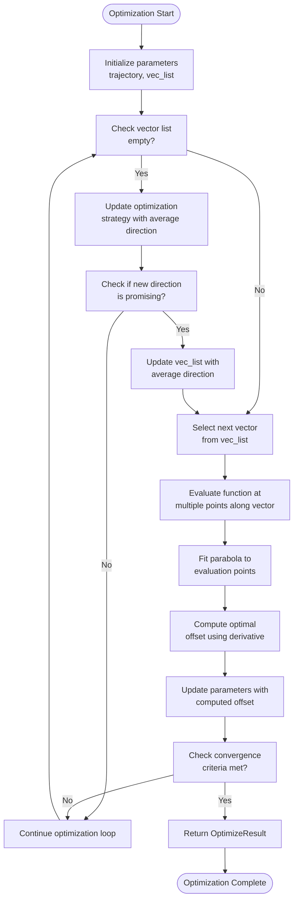
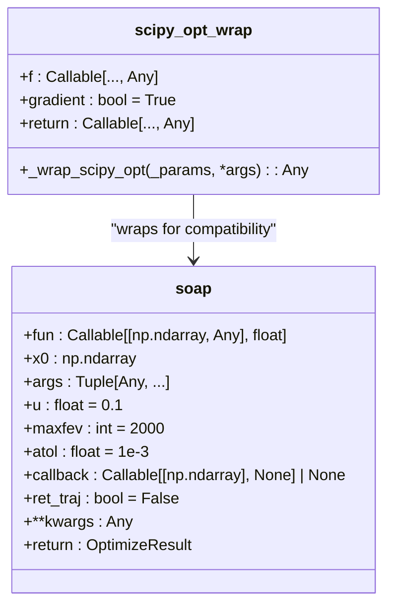
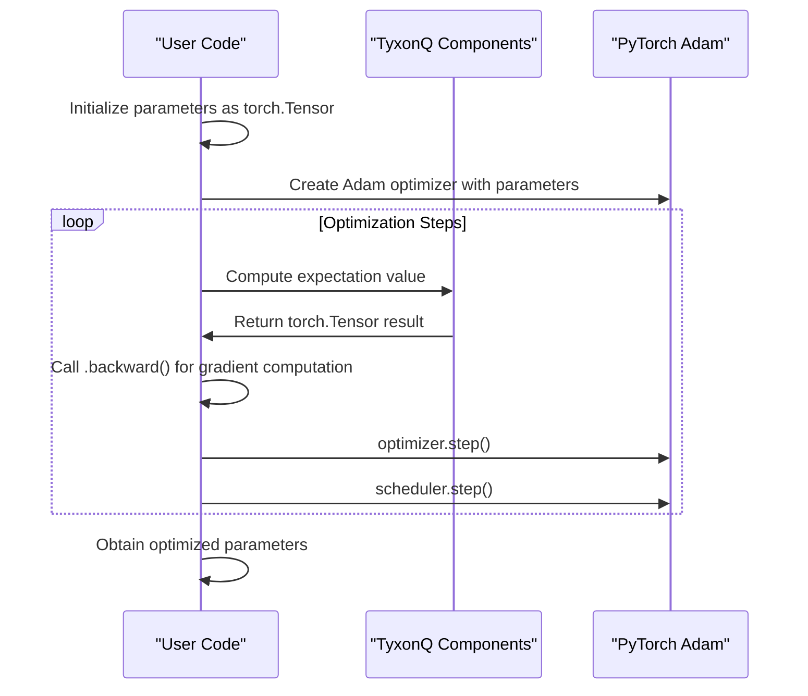
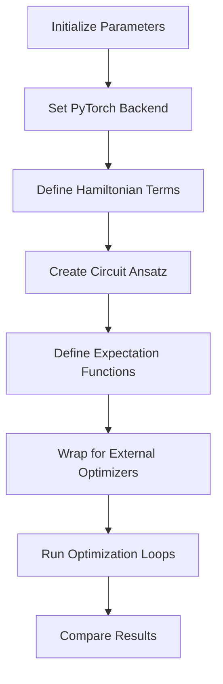

# Optimizer API

<cite>
**Referenced Files in This Document**   
- [soap.py](file://src/tyxonq/libs/optimizer/soap.py)
- [interop.py](file://src/tyxonq/libs/optimizer/interop.py)
- [vqe_noisyopt.py](file://examples/vqe_noisyopt.py)
- [vqe_shot_noise.py](file://examples/vqe_shot_noise.py)
</cite>

## Table of Contents
1. [Introduction](#introduction)
2. [SOAP Optimizer](#soap-optimizer)
3. [Interop Module](#interop-module)
4. [Integration with External Frameworks](#integration-with-external-frameworks)
5. [Usage Examples](#usage-examples)
6. [Optimizer Configuration](#optimizer-configuration)
7. [Convergence Behavior](#convergence-behavior)
8. [Conclusion](#conclusion)

## Introduction

The Optimizer module in TyxonQ provides a comprehensive suite of optimization tools designed specifically for variational quantum algorithms. This document details the SOAP (Second-Order Approximate Optimization) optimizer implementation and the interop module for integration with external optimization frameworks. The module enables seamless optimization of quantum circuits in both noisy (counts-based) and exact (numeric) execution paths, supporting both gradient-free and gradient-based optimization strategies.

The optimizer integrates with the compiler pipeline through gradient computation mechanisms and supports various configuration options for tuning optimization behavior. The design emphasizes compatibility with external frameworks like PyTorch and SciPy while maintaining the ability to handle quantum-specific optimization challenges such as shot noise and parameter-shift gradients.

**Section sources**
- [soap.py](file://src/tyxonq/libs/optimizer/soap.py#L1-L126)
- [interop.py](file://src/tyxonq/libs/optimizer/interop.py#L1-L35)

## SOAP Optimizer

The SOAP (Sequential Optimization with Approximate Parabola) optimizer is a lightweight, SciPy-compatible optimization algorithm designed for variational quantum algorithms. It implements a second-order approximate optimization strategy that balances computational efficiency with convergence performance.

**Diagram sources**
- [soap.py](file://src/tyxonq/libs/optimizer/soap.py#L7-L120)

**Section sources**
- [soap.py](file://src/tyxonq/libs/optimizer/soap.py#L7-L120)

## Interop Module

The interop module provides utilities for integrating TyxonQ's optimization functions with external optimization frameworks. The primary component is the `scipy_opt_wrap` function, which adapts TyxonQ's optimization functions to be compatible with SciPy optimizers.

**Diagram sources**
- [interop.py](file://src/tyxonq/libs/optimizer/interop.py#L8-L29)
- [soap.py](file://src/tyxonq/libs/optimizer/soap.py#L7-L120)

**Section sources**
- [interop.py](file://src/tyxonq/libs/optimizer/interop.py#L8-L29)

## Integration with External Frameworks

The optimizer module provides seamless integration with external optimization frameworks such as PyTorch and SciPy. This integration is facilitated through the interop module and specific optimization patterns demonstrated in the example code.

### PyTorch Integration

The integration with PyTorch's Adam optimizer is demonstrated in the example files, where TyxonQ components are used alongside `torch.optim.Adam`. The integration follows a pattern where quantum circuit parameters are managed as PyTorch tensors, enabling automatic differentiation through the computational graph.

**Diagram sources**
- [vqe_noisyopt.py](file://examples/vqe_noisyopt.py#L1-L288)
- [vqe_shot_noise.py](file://examples/vqe_shot_noise.py#L1-L222)

### SciPy Integration

The integration with SciPy optimizers is facilitated by the `scipy_opt_wrap` function, which ensures compatibility between TyxonQ's optimization functions and SciPy's optimization interface. This allows users to leverage SciPy's extensive collection of optimization algorithms with TyxonQ's quantum circuits.

**Section sources**
- [vqe_noisyopt.py](file://examples/vqe_noisyopt.py#L1-L288)
- [vqe_shot_noise.py](file://examples/vqe_shot_noise.py#L1-L222)

## Usage Examples

The optimizer module is demonstrated in two key example files: `vqe_noisyopt.py` and `vqe_shot_noise.py`. These examples showcase both noisy (counts-based) and exact (numeric) optimization paths for Variational Quantum Eigensolver (VQE) algorithms.

### VQE with Noisy Optimization

The `vqe_noisyopt.py` example demonstrates optimization with finite measurement shot noise, comparing gradient-free (SPSA, Compass) and gradient-based (parameter-shift with Adam) approaches. The example shows how to wrap quantum circuit evaluation functions for use with external optimizers.

**Diagram sources**
- [vqe_noisyopt.py](file://examples/vqe_noisyopt.py#L1-L288)

### VQE with Shot Noise

The `vqe_shot_noise.py` example focuses on VQE with finite measurement shot noise, demonstrating both gradient-free optimization with SciPy's COBYLA method and gradient-based optimization using parameter-shift gradients with Adam. The example highlights the trade-offs between different optimization strategies in noisy environments.

**Section sources**
- [vqe_noisyopt.py](file://examples/vqe_noisyopt.py#L1-L288)
- [vqe_shot_noise.py](file://examples/vqe_shot_noise.py#L1-L222)

## Optimizer Configuration

The SOAP optimizer and interop module provide several configuration options to tune optimization behavior for specific use cases.

### SOAP Hyperparameters

The SOAP optimizer accepts the following hyperparameters:

| Parameter | Type | Default | Description |
|---------|------|---------|-------------|
| fun | Callable[[np.ndarray, Any], float] | Required | Objective function to minimize |
| x0 | np.ndarray | Required | Initial parameter values |
| args | Tuple[Any, ...] | () | Additional arguments for objective function |
| u | float | 0.1 | Scale parameter for step size |
| maxfev | int | 2000 | Maximum function evaluations |
| atol | float | 1e-3 | Absolute tolerance for convergence |
| callback | Callable[[np.ndarray], None] | None | Function called after each iteration |
| ret_traj | bool | False | Whether to return optimization trajectory |

**Section sources**
- [soap.py](file://src/tyxonq/libs/optimizer/soap.py#L7-L120)

### Interop Configuration

The `scipy_opt_wrap` function provides configuration options for integration with SciPy optimizers:

| Parameter | Type | Default | Description |
|---------|------|---------|-------------|
| f | Callable[..., Any] | Required | Function to wrap for SciPy compatibility |
| gradient | bool | True | Whether the function returns gradient information |

**Section sources**
- [interop.py](file://src/tyxonq/libs/optimizer/interop.py#L8-L29)

## Convergence Behavior

The SOAP optimizer exhibits specific convergence characteristics that make it suitable for variational quantum algorithms. The algorithm uses a second-order approximation to determine optimal step sizes, balancing exploration and exploitation in the parameter space.

The convergence criteria are based on the change in objective function values over a sliding window of iterations. When the mean improvement over the last `2 * len(x0)` iterations falls below the absolute tolerance (`atol`), the optimization terminates.

The optimizer maintains a trajectory of parameter values and function evaluations, which can be returned when `ret_traj=True`. This information is valuable for analyzing optimization dynamics and diagnosing convergence issues.

**Section sources**
- [soap.py](file://src/tyxonq/libs/optimizer/soap.py#L7-L120)

## Conclusion

The Optimizer module in TyxonQ provides a robust foundation for optimizing variational quantum algorithms. The SOAP optimizer offers an efficient, second-order approximate optimization strategy with configurable hyperparameters and convergence criteria. The interop module enables seamless integration with external optimization frameworks like PyTorch and SciPy, allowing users to leverage state-of-the-art optimization algorithms with quantum circuits.

The examples demonstrate practical usage patterns for both noisy and exact optimization paths, highlighting the flexibility of the module in handling different optimization scenarios. The integration with PyTorch's Adam optimizer showcases how quantum circuit parameters can be optimized using automatic differentiation, while the SciPy integration demonstrates compatibility with a wide range of classical optimization algorithms.

This comprehensive optimization framework supports the development and deployment of variational quantum algorithms across different execution environments, from exact numeric simulations to noisy quantum hardware.