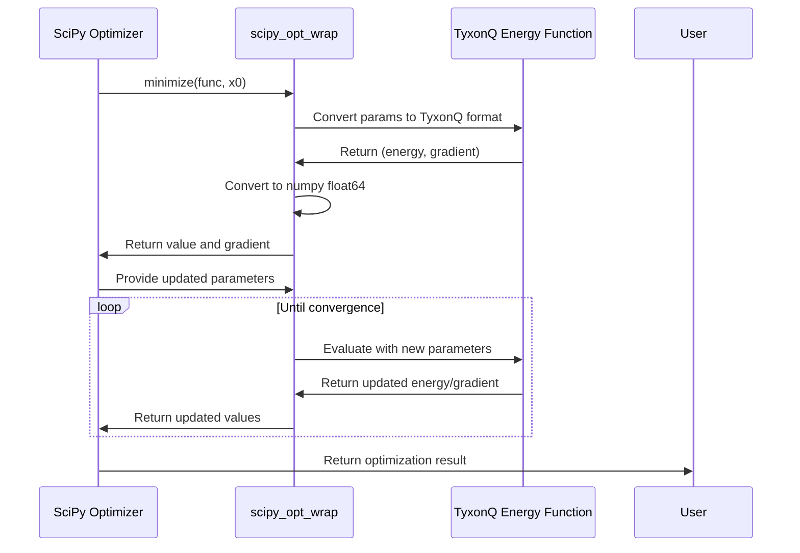
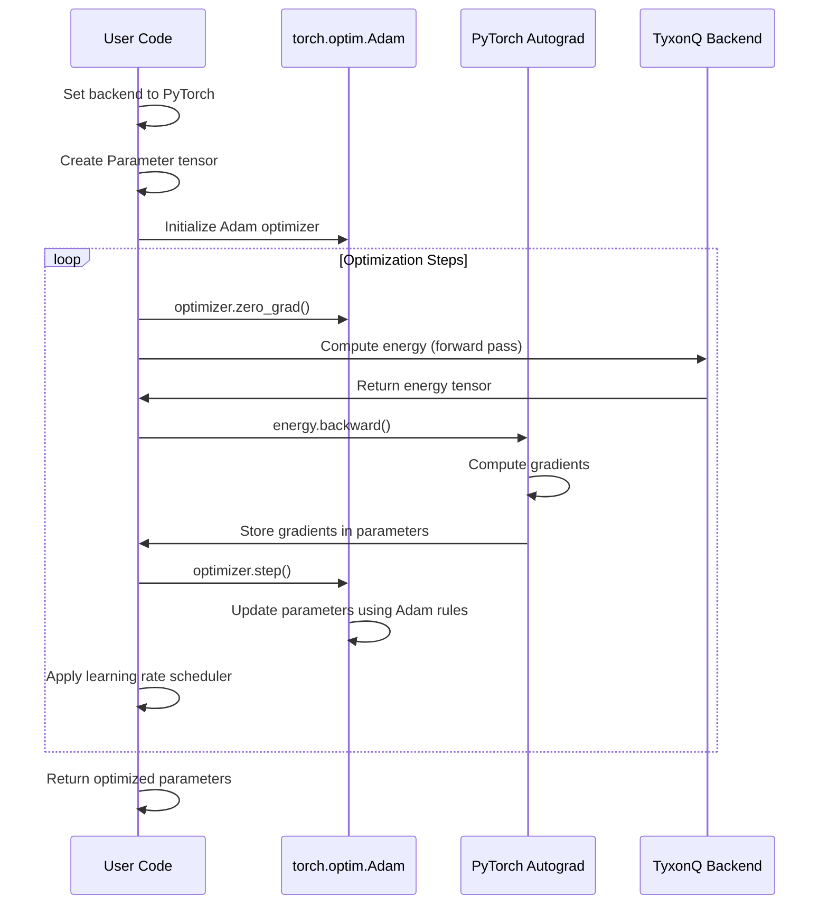
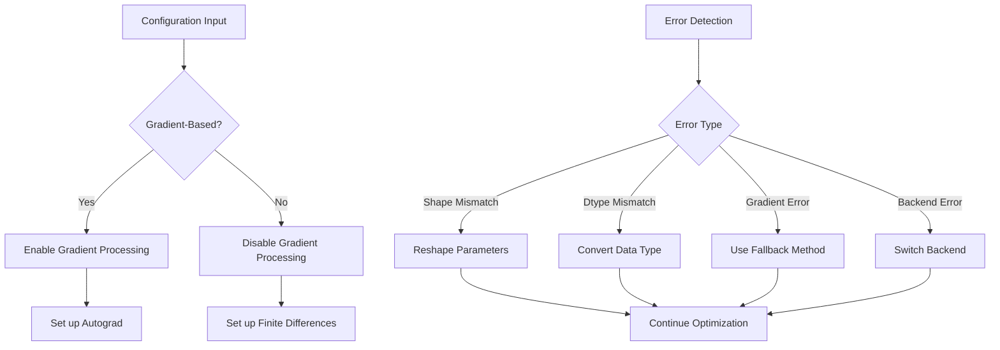
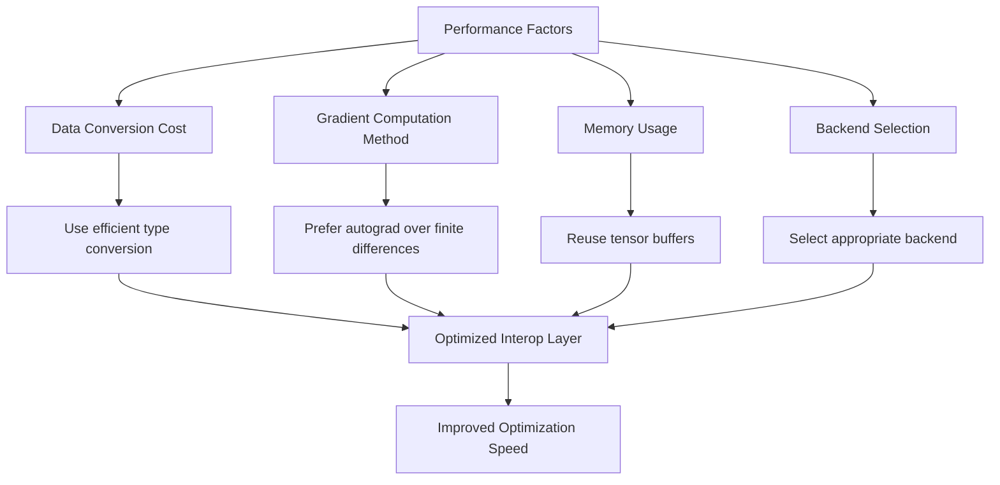
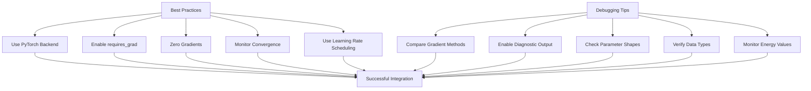

# Optimizer Interop Layer

<cite>
**Referenced Files in This Document**   
- [interop.py](file://src/tyxonq/libs/optimizer/interop.py)
- [vqe_noisyopt.py](file://examples/vqe_noisyopt.py)
- [pytorch_backend.py](file://src/tyxonq/numerics/backends/pytorch_backend.py)
- [vqe_extra.py](file://examples/vqe_extra.py)
</cite>

## Table of Contents
1. [Introduction](#introduction)
2. [Core Interop Mechanisms](#core-interop-mechanisms)
3. [SciPy Integration](#scipy-integration)
4. [PyTorch Adam Integration](#pytorch-adam-integration)
5. [Gradient Handling and Parameter Synchronization](#gradient-handling-and-parameter-synchronization)
6. [Configuration and Error Handling](#configuration-and-error-handling)
7. [Performance Considerations](#performance-considerations)
8. [Best Practices and Debugging](#best-practices-and-debugging)

## Introduction

The Optimizer Interop Layer in TyxonQ enables seamless integration between the quantum computing framework and external classical optimization libraries such as PyTorch and SciPy. This interop layer serves as a bridge that translates TyxonQ's gradient computation and parameter update mechanisms into formats compatible with popular optimizers like `torch.optim.Adam` and `scipy.optimize.minimize`. The architecture is designed to support both gradient-based and gradient-free optimization strategies, allowing users to leverage the strengths of different optimization frameworks while working with quantum circuits and variational algorithms.

The interop layer operates by providing adapter interfaces that handle data type conversions, gradient extraction, and parameter synchronization between TyxonQ's numeric backend and external optimizers. This enables hybrid quantum-classical training loops where quantum circuits are evaluated using TyxonQ's simulation capabilities, while classical optimization is performed using mature, high-performance libraries. The design emphasizes compatibility, performance, and ease of use, allowing researchers and developers to focus on algorithm development rather than integration details.

**Section sources**
- [interop.py](file://src/tyxonq/libs/optimizer/interop.py#L1-L36)
- [vqe_noisyopt.py](file://examples/vqe_noisyopt.py#L1-L289)

## Core Interop Mechanisms

The Optimizer Interop Layer implements several key mechanisms to enable integration with external optimization frameworks. At its core, the layer provides adapter interfaces that translate between TyxonQ's internal data representations and the expectations of external optimizers. The primary mechanism is the `scipy_opt_wrap` decorator, which transforms TyxonQ's energy evaluation functions into a format compatible with SciPy optimizers. This wrapper ensures that inputs and outputs are converted to numpy float64 arrays, which is the standard data type expected by SciPy optimization routines.

The interop layer also handles the translation of gradient information between different frameworks. For gradient-based optimization, it extracts gradients computed by TyxonQ's autograd system and formats them appropriately for consumption by external optimizers. The layer supports both tuple-based gradient outputs (value, gradient) and iterable gradient formats, providing flexibility for different optimizer requirements. When interfacing with PyTorch's `torch.optim.Adam`, the interop layer manages the conversion between TyxonQ's parameter tensors and PyTorch's Parameter objects, ensuring proper gradient tracking and update semantics.

```mermaid
flowchart TD
A[TyxonQ Quantum Circuit] --> B[Energy Evaluation Function]
B --> C{Gradient-Based?}
C --> |Yes| D[Autograd Gradient Computation]
C --> |No| E[Parameter-Shift Gradient]
D --> F[Gradient Extraction]
E --> F
F --> G[Data Type Conversion]
G --> H[External Optimizer<br>(PyTorch/SciPy)]
H --> I[Parameter Update]
I --> J[Parameter Synchronization]
J --> A
```

**Diagram sources**
- [interop.py](file://src/tyxonq/libs/optimizer/interop.py#L8-L29)
- [vqe_noisyopt.py](file://examples/vqe_noisyopt.py#L110-L171)

**Section sources**
- [interop.py](file://src/tyxonq/libs/optimizer/interop.py#L1-L36)
- [vqe_noisyopt.py](file://examples/vqe_noisyopt.py#L1-L289)

## SciPy Integration

The integration with SciPy optimizers is facilitated by the `scipy_opt_wrap` function, which serves as a decorator to adapt TyxonQ's energy evaluation functions for use with SciPy's optimization routines. This wrapper function performs several critical transformations to ensure compatibility. First, it converts input parameters from SciPy's expected numpy array format to TyxonQ's numeric backend representation using `nb.asarray()`. This ensures that the parameters are in the correct format for quantum circuit evaluation within TyxonQ.

The wrapper also handles output formatting, converting TyxonQ's energy and gradient results into numpy float64 arrays that SciPy optimizers can process. When gradient information is available, the wrapper attempts to unpack the (value, grad) tuple and convert both components to appropriate numpy arrays. If the gradient is provided as an iterable, it converts each element to float64. This dual handling approach provides flexibility for different gradient computation methods within TyxonQ.

For optimization algorithms that require only function values (gradient-free methods), the wrapper simply converts the scalar energy result to a numpy float64 value. The `scipy_opt_wrap` function is designed to be non-intrusive, preserving the original function's behavior while adding the necessary type conversions. This allows users to write energy evaluation functions in a natural way within the TyxonQ framework, then easily adapt them for use with SciPy's extensive collection of optimization algorithms.



**Diagram sources**
- [interop.py](file://src/tyxonq/libs/optimizer/interop.py#L8-L29)
- [vqe_noisyopt.py](file://examples/vqe_noisyopt.py#L190-L192)

**Section sources**
- [interop.py](file://src/tyxonq/libs/optimizer/interop.py#L1-L36)
- [vqe_noisyopt.py](file://examples/vqe_noisyopt.py#L1-L289)

## PyTorch Adam Integration

The integration with PyTorch's `torch.optim.Adam` optimizer demonstrates a more sophisticated interop pattern that leverages automatic differentiation. In the `vqe_noisyopt.py` example, TyxonQ's PyTorch backend is activated using `tq.set_backend("pytorch")`, which configures the numeric operations to use PyTorch tensors. This enables seamless gradient computation through PyTorch's autograd system.

The integration process begins by wrapping the initial parameters in a `torch.nn.Parameter` object, which enables gradient tracking. The energy evaluation function `exp_val_exact` is designed to work with PyTorch tensors and returns a scalar tensor that supports backpropagation. During the optimization loop, the process follows PyTorch's standard training pattern: zeroing gradients, computing the forward pass to obtain the energy value, calling `backward()` to compute gradients via autograd, and then invoking the optimizer's `step()` method to update parameters.

A key aspect of this integration is the handling of parameter updates in scenarios where gradients are computed externally, such as with the parameter-shift rule. In these cases, the manually computed gradient tensor is assigned directly to the parameter's `grad` attribute, allowing the Adam optimizer to apply its update rules correctly. The interop layer also supports learning rate scheduling through `torch.optim.lr_scheduler`, enabling advanced training strategies like exponential decay of the learning rate over optimization iterations.



**Diagram sources**
- [vqe_noisyopt.py](file://examples/vqe_noisyopt.py#L210-L230)
- [pytorch_backend.py](file://src/tyxonq/numerics/backends/pytorch_backend.py#L1-L260)

**Section sources**
- [vqe_noisyopt.py](file://examples/vqe_noisyopt.py#L1-L289)
- [pytorch_backend.py](file://src/tyxonq/numerics/backends/pytorch_backend.py#L1-L260)

## Gradient Handling and Parameter Synchronization

The Optimizer Interop Layer implements sophisticated mechanisms for gradient handling and parameter synchronization across different optimization frameworks. For gradient-based optimization, the layer supports multiple gradient computation methods, including automatic differentiation through PyTorch's autograd system and numerical methods like the parameter-shift rule. The `parameter_shift_grad_counts` function in `vqe_noisyopt.py` demonstrates a custom gradient computation that uses finite differences with a shift of π/2, which is optimal for certain quantum gates.

When working with external optimizers, the interop layer manages the conversion between different gradient representations. For SciPy optimizers, gradients are typically expected as numpy arrays, while PyTorch optimizers work with gradient tensors attached to Parameter objects. The layer handles these conversions transparently, ensuring that gradient information is properly formatted for the target optimizer. In cases where gradients are computed outside the automatic differentiation framework, such as with the parameter-shift method, the interop layer provides mechanisms to manually assign gradients to parameters before optimizer updates.

Parameter synchronization is another critical aspect of the interop layer. When parameters are updated by an external optimizer, the changes must be reflected in TyxonQ's internal state for subsequent circuit evaluations. The layer ensures that parameter updates are properly propagated through the system, maintaining consistency between the optimizer's view of parameters and TyxonQ's circuit representation. This is particularly important in hybrid training loops where quantum and classical components are updated in alternating steps.

```mermaid
flowchart TD
A[Gradient Computation] --> B{Method}
B --> |Autograd| C[PyTorch backward()]
B --> |Parameter-Shift| D[Finite Differences]
B --> |Analytical| E[Exact Gradient Formula]
C --> F[Gradient Tensor]
D --> G[Gradient Array]
E --> H[Gradient Values]
F --> I[Parameter.grad Assignment]
G --> J[Convert to Tensor]
H --> J
J --> I
I --> K[Optimizer Step]
K --> L[Updated Parameters]
L --> M[Synchronize with TyxonQ Circuit]
M --> N[Next Iteration]
```

**Diagram sources**
- [vqe_noisyopt.py](file://examples/vqe_noisyopt.py#L158-L171)
- [pytorch_backend.py](file://src/tyxonq/numerics/backends/pytorch_backend.py#L1-L260)

**Section sources**
- [vqe_noisyopt.py](file://examples/vqe_noisyopt.py#L1-L289)
- [pytorch_backend.py](file://src/tyxonq/numerics/backends/pytorch_backend.py#L1-L260)

## Configuration and Error Handling

The Optimizer Interop Layer includes comprehensive configuration options and error handling strategies to ensure robust integration with external optimization frameworks. Configuration is primarily managed through function parameters and backend settings, allowing users to customize the behavior of the interop layer for different optimization scenarios. For example, the `scipy_opt_wrap` function accepts a `gradient` parameter that controls whether gradient information is expected and processed, providing flexibility for both gradient-based and gradient-free optimizers.

Error handling is implemented at multiple levels to address common integration issues. The interop layer includes type checking and conversion routines that handle mismatches between tensor shapes and data types. When interfacing with SciPy optimizers, the wrapper functions include try-except blocks to catch and handle exceptions that may occur during gradient unpacking or type conversion. These error handlers provide fallback mechanisms, such as returning gradient arrays instead of tuples when the expected format is not available.

The layer also implements validation checks for parameter shapes and dimensions, ensuring that the parameters passed to and from optimizers have the correct structure for the quantum circuit being optimized. When shape mismatches are detected, the interop layer provides informative error messages that help users diagnose and fix configuration issues. For dtype mismatches, the layer automatically converts between common numeric types (float32, float64) to ensure compatibility between TyxonQ's numeric backend and external optimizers.



**Section sources**
- [interop.py](file://src/tyxonq/libs/optimizer/interop.py#L1-L36)
- [vqe_noisyopt.py](file://examples/vqe_noisyopt.py#L1-L289)

## Performance Considerations

The Optimizer Interop Layer is designed with performance in mind, minimizing overhead during the frequent state transfers between TyxonQ and external optimizers. One key performance consideration is the cost of data type conversions and tensor operations during each optimization iteration. The layer optimizes these operations by using efficient conversion methods and minimizing unnecessary data copying. For example, the `scipy_opt_wrap` function uses `np.asarray()` with explicit dtype specification to ensure efficient conversion to float64 arrays.

Another performance factor is the choice of gradient computation method. Automatic differentiation through PyTorch's autograd system is generally faster than numerical methods like parameter-shift, especially for circuits with many parameters. However, parameter-shift may be preferred in certain quantum hardware scenarios where analytical gradients are more accurate. The interop layer allows users to choose the most appropriate gradient method based on their specific performance and accuracy requirements.

Memory usage is also an important consideration, particularly when working with large quantum circuits or batched optimization tasks. The layer manages memory efficiently by reusing tensor buffers where possible and ensuring that intermediate computation results are properly garbage collected. When using PyTorch optimizers, the layer leverages PyTorch's memory management capabilities, including GPU acceleration when available, to maximize performance.



**Section sources**
- [interop.py](file://src/tyxonq/libs/optimizer/interop.py#L1-L36)
- [vqe_noisyopt.py](file://examples/vqe_noisyopt.py#L1-L289)
- [pytorch_backend.py](file://src/tyxonq/numerics/backends/pytorch_backend.py#L1-L260)

## Best Practices and Debugging

When working with the Optimizer Interop Layer, several best practices can help ensure successful integration and efficient optimization. First, it is recommended to use the PyTorch backend when possible, as it provides the most seamless integration with gradient-based optimizers through automatic differentiation. Users should also ensure that parameter tensors are properly configured with `requires_grad=True` when using autograd, and that gradients are zeroed before each backward pass to prevent accumulation.

For debugging integration issues, the interop layer provides several useful strategies. Users can verify the correctness of gradient computations by comparing autograd results with finite difference approximations. The layer's wrapper functions include diagnostic capabilities that can be enabled to trace data conversions and function calls. When encountering shape or dtype errors, users should check that parameter arrays have the correct dimensions for their quantum circuits and that data types are consistent across the optimization pipeline.

Another best practice is to implement proper learning rate scheduling and convergence monitoring. The example in `vqe_noisyopt.py` demonstrates the use of `torch.optim.lr_scheduler.ExponentialLR` to gradually reduce the learning rate during optimization, which can improve convergence. Users should also monitor the energy values and gradient norms during optimization to detect issues like vanishing gradients or optimization plateaus.



**Section sources**
- [vqe_noisyopt.py](file://examples/vqe_noisyopt.py#L1-L289)
- [vqe_extra.py](file://examples/vqe_extra.py#L1-L196)