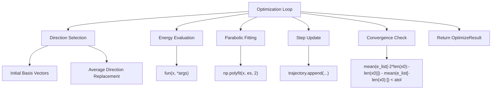
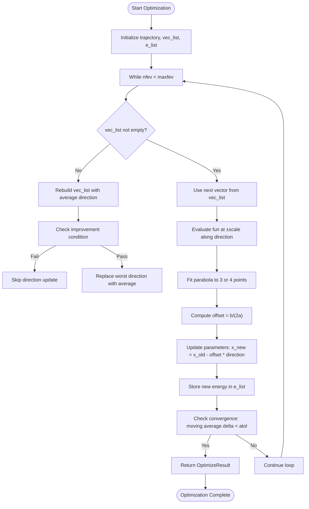
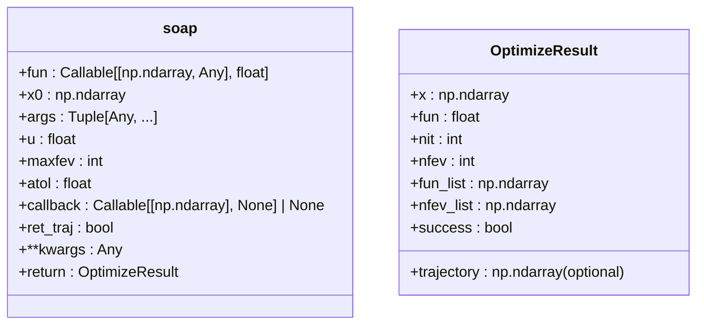
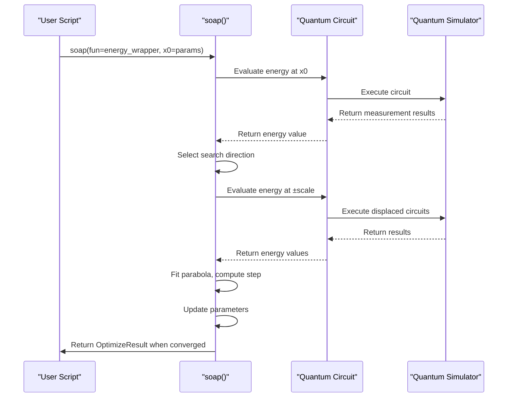

# SOAP Optimizer

<cite>
**Referenced Files in This Document**   
- [soap.py](file://src/tyxonq/libs/optimizer/soap.py)
- [vqe_noisyopt.py](file://examples/vqe_noisyopt.py)
- [vqe_shot_noise.py](file://examples/vqe_shot_noise.py)
- [parameter_shift.py](file://src/tyxonq/compiler/gradients/parameter_shift.py)
</cite>

## Table of Contents
1. [Introduction](#introduction)
2. [Core Components](#core-components)
3. [Architecture Overview](#architecture-overview)
4. [Detailed Component Analysis](#detailed-component-analysis)
5. [Integration with Gradient Pipeline](#integration-with-gradient-pipeline)
6. [Usage Examples in VQE Workflows](#usage-examples-in-vqe-workflows)
7. [Performance and Convergence Behavior](#performance-and-convergence-behavior)
8. [Tuning Recommendations and Best Practices](#tuning-recommendations-and-best-practices)
9. [Conclusion](#conclusion)

## Introduction
The Sequential Optimization with Approximate Parabola (SOAP) optimizer is a lightweight, second-order approximate optimization method implemented in TyxonQ for variational quantum algorithms such as Variational Quantum Eigensolver (VQE) and Quantum Approximate Optimization Algorithm (QAOA). Designed to operate efficiently in noisy quantum environments, SOAP leverages parabolic fitting and directional search strategies to navigate complex energy landscapes without requiring explicit Hessian computation. It integrates seamlessly into the quantum-classical loop, supporting both gradient-free and gradient-based workflows while maintaining compatibility with SciPy's optimization interface.

**Section sources**
- [soap.py](file://src/tyxonq/libs/optimizer/soap.py#L1-L20)

## Core Components
The core functionality of the SOAP optimizer resides in the `soap` function defined in `soap.py`. This function implements a custom optimization loop that approximates second-order behavior through local parabolic fitting along dynamically selected parameter directions. The algorithm maintains a trajectory of parameter vectors and energy evaluations, enabling convergence monitoring and optional trajectory return for analysis.

Key components include:
- Energy evaluation wrapper with function call counting
- Adaptive direction selection based on parameter significance
- Parabolic interpolation for step size estimation
- Convergence criteria based on moving average of energy changes

**Section sources**
- [soap.py](file://src/tyxonq/libs/optimizer/soap.py#L7-L120)

## Architecture Overview

**Diagram sources**
- [soap.py](file://src/tyxonq/libs/optimizer/soap.py#L7-L120)

## Detailed Component Analysis

### Optimization Algorithm Design
The SOAP optimizer implements a native second-order approximation method by sequentially exploring parameter directions and fitting quadratic models to estimate optimal steps. Unlike traditional Newton-type methods, it avoids explicit gradient or Hessian computations, instead using finite differences along selected directions to construct local parabolic approximations.

At each iteration, the optimizer cycles through a set of search directions. Initially, these are the standard basis vectors ordered by parameter magnitude. When all directions have been explored, the algorithm evaluates whether replacing one direction with the average displacement vector from recent steps would improve progress.

**Diagram sources**
- [soap.py](file://src/tyxonq/libs/optimizer/soap.py#L7-L120)

### Method Signature and Interface
The `soap` function provides a SciPy-compatible interface, accepting an objective function, initial parameters, and optional arguments. It returns an `OptimizeResult` object containing the final parameters, optimal function value, iteration counts, and convergence status.

**Diagram sources**
- [soap.py](file://src/tyxonq/libs/optimizer/soap.py#L7-L120)

### Hyperparameter Configuration
The SOAP optimizer exposes several hyperparameters that control its behavior:

| Hyperparameter | Default Value | Description |
|----------------|---------------|-------------|
| u | 0.1 | Initial step scale factor used in parabolic fitting |
| maxfev | 2000 | Maximum number of function evaluations |
| atol | 1e-3 | Absolute tolerance for convergence detection |
| ret_traj | False | Flag to return full optimization trajectory |
| callback | None | Optional callback function executed after each iteration |

These parameters allow fine-tuning of the optimizer's exploration strategy and termination conditions, making it adaptable to different problem scales and noise levels.

**Section sources**
- [soap.py](file://src/tyxonq/libs/optimizer/soap.py#L7-L15)

## Integration with Gradient Pipeline
While SOAP is primarily designed as a gradient-free optimizer, it operates within TyxonQ's broader gradient computation ecosystem. The parameter shift method, implemented in `parameter_shift.py`, provides an alternative gradient estimation technique that can be used in conjunction with other optimizers. However, SOAP itself does not directly consume gradient information, instead relying on function evaluations at displaced points to approximate curvature.

The separation between optimization logic and gradient computation enables flexible integration patterns, where SOAP can be applied to both exact (statevector) and noisy (counts-based) energy evaluations without modification.

**Section sources**
- [parameter_shift.py](file://src/tyxonq/compiler/gradients/parameter_shift.py#L1-L38)
- [soap.py](file://src/tyxonq/libs/optimizer/soap.py#L7-L120)

## Usage Examples in VQE Workflows
Practical applications of the SOAP optimizer are demonstrated in the `vqe_noisyopt.py` and `vqe_shot_noise.py` examples, which compare optimization performance under different noise conditions.

In both examples, the optimizer is applied to a 1D Transverse Field Ising Model (TFIM) Hamiltonian using a hardware-efficient ansatz. The workflows illustrate:
- Construction of parameterized quantum circuits
- Energy evaluation via statevector simulation (exact) and shot-based sampling (noisy)
- Wrapper functions to interface with optimization routines
- Comparison of convergence across different optimization strategies

The examples highlight SOAP's ability to converge in both idealized and realistic (shot-noise affected) scenarios, demonstrating its robustness to stochastic objective functions.

**Diagram sources**
- [vqe_noisyopt.py](file://examples/vqe_noisyopt.py#L1-L288)
- [vqe_shot_noise.py](file://examples/vqe_shot_noise.py#L1-L222)

## Performance and Convergence Behavior
The SOAP optimizer exhibits distinct convergence characteristics compared to first-order methods. By approximating second-order information through parabolic fitting, it can take more informed steps that often lead to faster convergence in well-conditioned regions of the parameter space.

However, in highly noisy environments (e.g., low shot counts), the parabolic fitting may become unreliable due to stochastic fluctuations in energy estimates. The algorithm's convergence criterion, based on the moving average of recent energy changes, helps mitigate this by requiring sustained improvement over multiple iterations.

Performance trade-offs include:
- **Advantages**: Second-order behavior without explicit gradient computation, robust to moderate noise, memory efficient
- **Limitations**: Sensitivity to step scale parameter (u), potential instability in high-noise regimes, sequential direction exploration may slow convergence in high-dimensional spaces

**Section sources**
- [soap.py](file://src/tyxonq/libs/optimizer/soap.py#L7-L120)
- [vqe_noisyopt.py](file://examples/vqe_noisyopt.py#L1-L288)

## Tuning Recommendations and Best Practices
For optimal performance when applying SOAP to quantum chemistry problems:

1. **Parameter Scaling**: Ensure parameters are reasonably scaled (e.g., near 0.1–1.0 range) to avoid numerical issues with the default `u=0.1` setting.

2. **Noise Management**: In shot-limited scenarios, increase the number of shots per energy evaluation or use error mitigation techniques to stabilize parabolic fitting.

3. **Convergence Threshold**: Adjust `atol` based on expected energy precision; for chemical accuracy (1.6 mHa ≈ 6e-4 Ha), set `atol` below this threshold.

4. **Trajectory Analysis**: Enable `ret_traj=True` during development to analyze optimization dynamics and identify potential issues like oscillations or premature convergence.

5. **Initial Direction Bias**: The initial direction selection based on `np.argsort(np.abs(x0))[::-1]` means larger initial parameters are explored first—consider initializing parameters with magnitudes reflecting expected importance.

Common issues such as overfitting in noisy environments can be addressed by:
- Using larger shot counts for final energy evaluations
- Implementing early stopping based on validation metrics
- Applying regularization techniques to the ansatz or objective function

**Section sources**
- [soap.py](file://src/tyxonq/libs/optimizer/soap.py#L7-L120)
- [vqe_noisyopt.py](file://examples/vqe_noisyopt.py#L1-L288)

## Conclusion
The SOAP optimizer provides a practical second-order approximation method for variational quantum algorithms in TyxonQ. Its design balances computational efficiency with effective exploitation of curvature information, making it suitable for both noise-free simulations and realistic, shot-limited experiments. By avoiding explicit gradient calculations while still capturing some second-order behavior, SOAP offers a compelling alternative to both first-order optimizers and full Newton-type methods in the quantum optimization landscape.