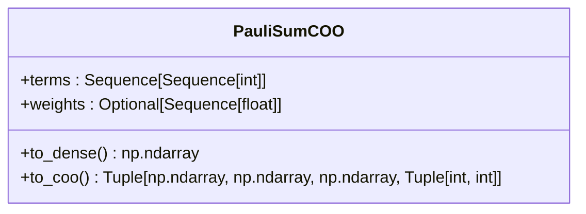
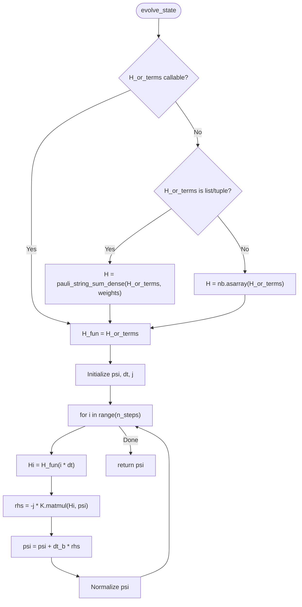
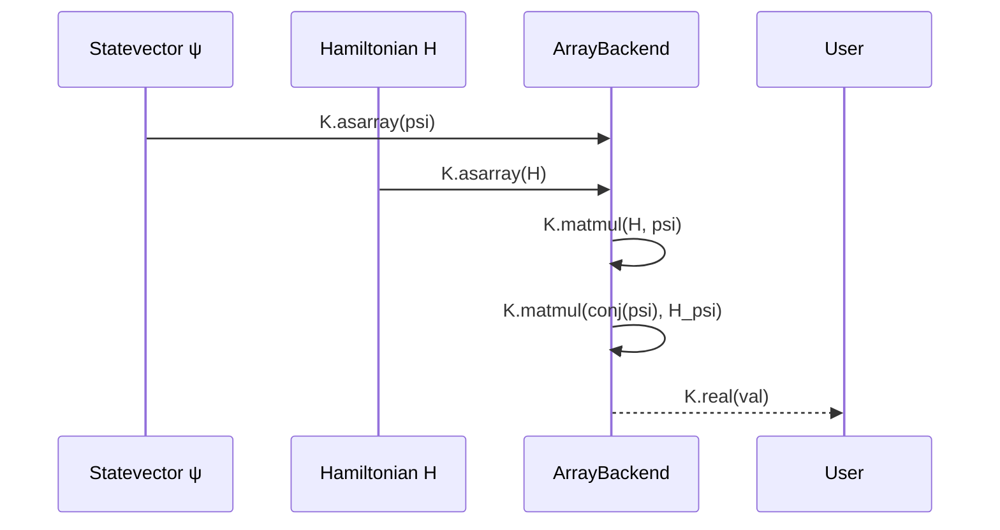
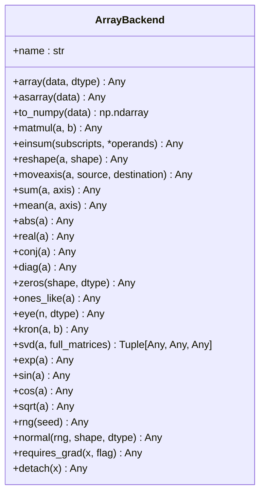
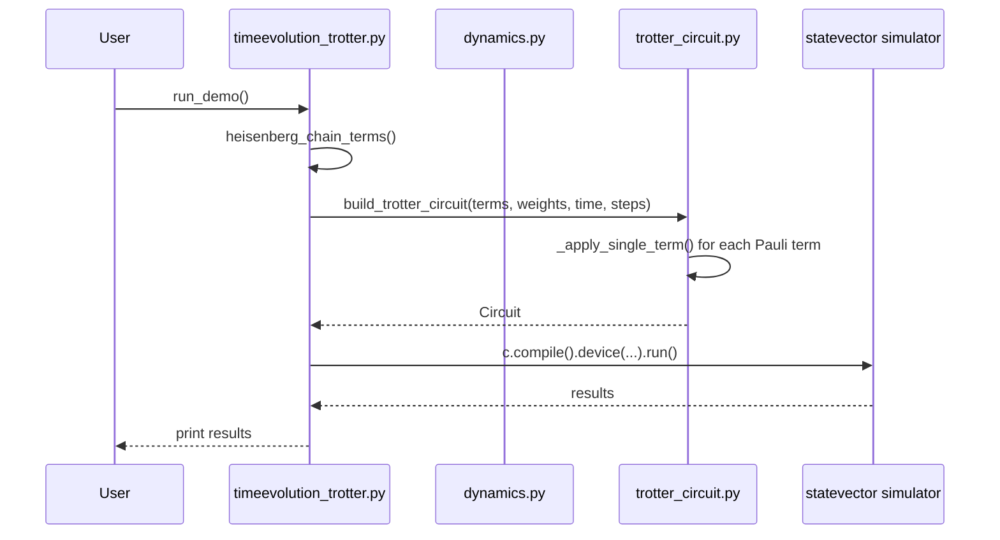

# Dynamics Module

<cite>
**Referenced Files in This Document**   
- [dynamics.py](file://src/tyxonq/libs/quantum_library/dynamics.py)
- [pauli.py](file://src/tyxonq/libs/quantum_library/kernels/pauli.py)
- [trotter_circuit.py](file://src/tyxonq/libs/circuits_library/trotter_circuit.py)
- [timeevolution_trotter.py](file://examples/timeevolution_trotter.py)
- [circuit.py](file://src/tyxonq/core/ir/circuit.py)
- [__init__.py](file://src/tyxonq/numerics/__init__.py)
- [api.py](file://src/tyxonq/numerics/api.py)
</cite>

## Table of Contents
1. [Introduction](#introduction)
2. [PauliSumCOO Class](#paulisumcoo-class)
3. [State Evolution with evolve_state](#state-evolution-with-evolve_state)
4. [Expectation Value Computation](#expectation-value-computation)
5. [Backend and Array Type Handling](#backend-and-array-type-handling)
6. [Usage Examples and Workflows](#usage-examples-and-workflows)
7. [Performance and Numerical Considerations](#performance-and-numerical-considerations)
8. [Conclusion](#conclusion)

## Introduction

The `dynamics.py` module in TyxonQ's Quantum Library provides essential utilities for quantum dynamics simulations, particularly for small-scale systems. It offers lightweight, dependency-minimal tools for representing Hamiltonians, evolving quantum states, and computing observables. The module is designed for educational, prototyping, and small-system research use cases, prioritizing clarity and ease of use over high-performance simulation for large systems.

The core functionality revolves around the `PauliSumCOO` class for sparse Hamiltonian representation, the `evolve_state` function for time evolution via ODE integration, and the `expectation` function for computing observable values. These components are built on a flexible `ArrayBackend` protocol, allowing for backend-agnostic numerical computations. The module is complemented by example workflows in `timeevolution_trotter.py`, which demonstrate Trotter-based evolution and variational quantum algorithms.

**Section sources**
- [dynamics.py](file://src/tyxonq/libs/quantum_library/dynamics.py#L1-L50)

## PauliSumCOO Class

The `PauliSumCOO` class provides a lightweight adapter for representing a Hamiltonian as a sum of Pauli terms. It is designed for small systems where a full dense matrix representation is feasible but a sparse, memory-efficient format is preferred for certain operations.

The class is initialized with a list of Pauli terms and optional weights. Each Pauli term is encoded as a list of integers, where 0, 1, 2, and 3 represent the identity (I), X, Y, and Z Pauli operators, respectively. The weights are the coefficients for each term in the sum. If no weights are provided, they are assumed to be 1.0 for each term.

**Diagram sources**
- [dynamics.py](file://src/tyxonq/libs/quantum_library/dynamics.py#L25-L51)

The class provides two primary methods for converting the Hamiltonian representation:
- `to_dense()`: Constructs a dense matrix representation of the Hamiltonian, which is a 2^n by 2^n complex matrix for an n-qubit system. This method is suitable for small systems where the full matrix can be stored in memory.
- `to_coo()`: Returns a COO (Coordinate) format representation of the Hamiltonian as a tuple containing the non-zero values, row indices, column indices, and the shape of the matrix. This format is compatible with sparse matrix workflows and is useful for interfacing with other sparse linear algebra libraries.

The internal implementation relies on the `pauli_string_sum_dense` and `pauli_string_sum_coo` functions from the `kernels.pauli` module, which perform the actual matrix construction and sparse conversion.

**Section sources**
- [dynamics.py](file://src/tyxonq/libs/quantum_library/dynamics.py#L25-L51)
- [pauli.py](file://src/tyxonq/libs/quantum_library/kernels/pauli.py#L73-L117)

## State Evolution with evolve_state

The `evolve_state` function is the primary tool for simulating the time evolution of a quantum state under a given Hamiltonian. It solves the Schrödinger equation dψ/dt = -i H(t) ψ using a simple fixed-step integration scheme, specifically the Euler method.

The function is highly flexible in its input for the Hamiltonian (`H_or_terms`). It can accept:
- A dense Hamiltonian matrix directly.
- A list of Pauli terms with optional weights, which is internally converted to a dense matrix.
- A callable function `H(t)` that returns the instantaneous Hamiltonian at any time `t`, enabling support for time-dependent Hamiltonians.

The initial state `psi0` is provided as a statevector of shape (2^n,), and the total evolution time `t` is specified. The integration is performed in a fixed number of steps, controlled by the `steps` parameter. More steps generally lead to higher accuracy but increased computational cost.

**Diagram sources**
- [dynamics.py](file://src/tyxonq/libs/quantum_library/dynamics.py#L54-L113)

The integration loop applies the Euler step `psi = psi + dt * (-i * H * psi)` at each time step. After each step, the statevector is normalized to maintain unit norm, which is crucial for numerical stability. The function supports different numerical backends via the `backend` parameter, which must conform to the `ArrayBackend` protocol.

**Section sources**
- [dynamics.py](file://src/tyxonq/libs/quantum_library/dynamics.py#L54-L113)

## Expectation Value Computation

The `expectation` function computes the expectation value ⟨ψ|H|ψ⟩ of a dense Hamiltonian `H` with respect to a statevector `ψ`. This is a fundamental operation in quantum mechanics for calculating the average value of an observable.

The function performs the matrix-vector multiplication `H * psi` and then computes the inner product `conj(psi) * (H * psi)`. The result is a complex number, but only the real part is returned, as the expectation value of a Hermitian operator is always real.

**Diagram sources**
- [dynamics.py](file://src/tyxonq/libs/quantum_library/dynamics.py#L116-L125)

The computation is performed using the provided `backend` or the default `NumericBackend` if none is specified. This ensures that the operation is performed efficiently on the chosen numerical backend, whether it is NumPy, PyTorch, or another supported library.

**Section sources**
- [dynamics.py](file://src/tyxonq/libs/quantum_library/dynamics.py#L116-L125)

## Backend and Array Type Handling

The dynamics module is built on a flexible backend system that allows for seamless switching between different numerical libraries. The core of this system is the `ArrayBackend` protocol, which defines a unified interface for array creation, manipulation, and mathematical operations.

The `NumericBackend` class acts as a class-level proxy to the current backend, providing a static interface to backend functions. This allows users to write backend-agnostic code by calling `NumericBackend.array()`, `NumericBackend.matmul()`, etc., without needing to manage backend instances directly.

**Diagram sources**
- [api.py](file://src/tyxonq/numerics/api.py#L18-L101)
- [__init__.py](file://src/tyxonq/numerics/__init__.py#L21-L192)

Users can set the global backend using `tq.set_backend("numpy")` or similar commands, which affects all subsequent operations that use the default backend. This design promotes code portability and allows users to leverage GPU acceleration or automatic differentiation by switching to PyTorch or other backends.

**Section sources**
- [api.py](file://src/tyxonq/numerics/api.py#L18-L101)
- [__init__.py](file://src/tyxonq/numerics/__init__.py#L21-L192)

## Usage Examples and Workflows

The `examples/timeevolution_trotter.py` file provides a concrete example of using the dynamics module for Heisenberg model time evolution via Trotterization. This workflow demonstrates how to build a Hamiltonian from Pauli terms, construct a Trotterized circuit, and run it on a simulator.

The example first defines the Pauli terms for a Heisenberg chain Hamiltonian, including XX, YY, and ZZ interactions between neighboring qubits. These terms are then used to build a Trotterized circuit using the `build_trotter_circuit` function from the `trotter_circuit` module. The circuit is compiled and executed on a local statevector simulator, with results printed to the console.

**Diagram sources**
- [timeevolution_trotter.py](file://examples/timeevolution_trotter.py#L1-L58)
- [trotter_circuit.py](file://src/tyxonq/libs/circuits_library/trotter_circuit.py#L38-L85)

This example also illustrates the VQE (Variational Quantum Eigensolver) workflow, where the Trotterized circuit is used to prepare a trial state for energy estimation. The `expectation` function can be used to compute the energy of the trial state with respect to the Hamiltonian, which is a key step in the VQE algorithm.

**Section sources**
- [timeevolution_trotter.py](file://examples/timeevolution_trotter.py#L1-L58)
- [trotter_circuit.py](file://src/tyxonq/libs/circuits_library/trotter_circuit.py#L38-L85)

## Performance and Numerical Considerations

The functions in the `dynamics.py` module are designed for small quantum systems, typically up to 10-12 qubits, due to the use of dense matrix representations. The memory and computational complexity scale exponentially with the number of qubits, making these methods impractical for larger systems.

For time evolution, the choice of step size is critical for numerical stability and accuracy. Too large a step can lead to significant errors or instability, while too small a step increases computational cost without necessarily improving accuracy. Users should perform convergence tests by increasing the number of steps until the results stabilize.

The Euler integration method used in `evolve_state` is simple but not the most accurate or stable for long-time simulations. For more demanding applications, higher-order methods like Runge-Kutta or specialized quantum integrators should be considered. However, the Euler method is chosen here for its simplicity and educational value.

The use of dense matrices in `pauli_string_sum_dense` and `expectation` is efficient for small systems but becomes prohibitive for larger ones. For larger systems, sparse matrix techniques or tensor network methods would be more appropriate, though they are not covered by this module.

**Section sources**
- [dynamics.py](file://src/tyxonq/libs/quantum_library/dynamics.py#L54-L113)
- [pauli.py](file://src/tyxonq/libs/quantum_library/kernels/pauli.py#L73-L86)

## Conclusion

The `dynamics.py` module provides a clear and accessible set of tools for quantum dynamics simulations on small systems. Its focus on simplicity and educational value makes it ideal for learning quantum mechanics, prototyping algorithms, and performing small-scale research. The integration with the `ArrayBackend` protocol ensures flexibility in numerical computation, while the example workflows demonstrate practical applications in quantum simulation and variational algorithms. Users should be mindful of the exponential scaling with system size and the limitations of the Euler integration method when applying these tools to their research.