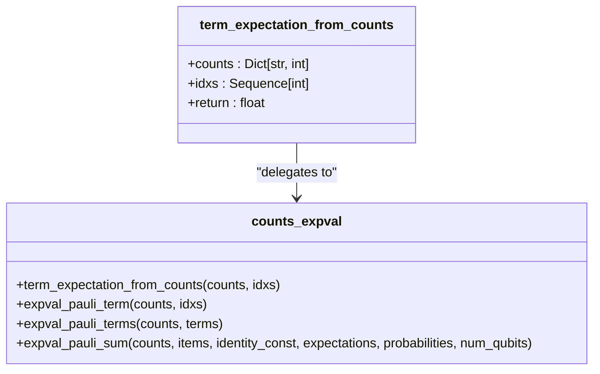
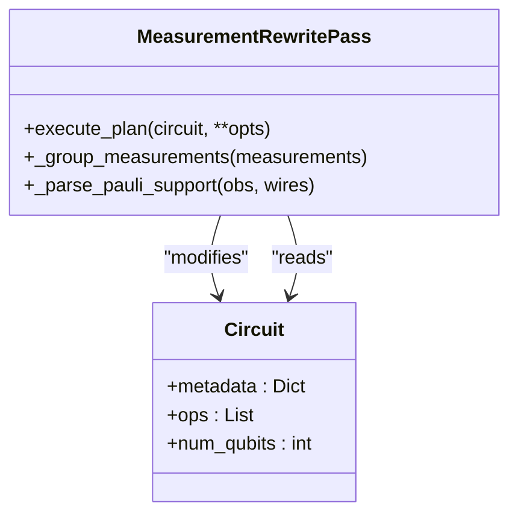
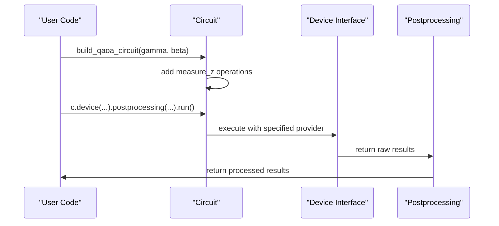
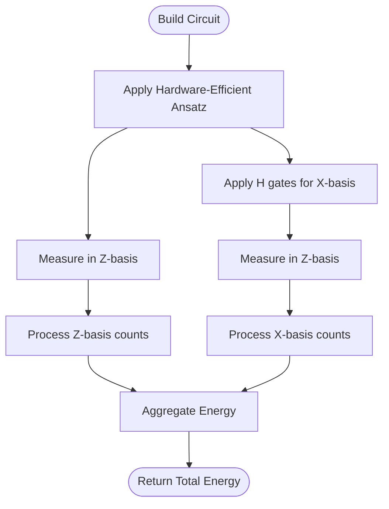

# Measurement Module

<cite>
**Referenced Files in This Document**   
- [measurement.py](file://src/tyxonq/libs/quantum_library/measurement.py)
- [counts_expval.py](file://src/tyxonq/postprocessing/counts_expval.py)
- [measurement.py](file://src/tyxonq/compiler/stages/rewrite/measurement.py)
- [simple_qaoa.py](file://examples/simple_qaoa.py)
- [vqe_extra.py](file://examples/vqe_extra.py)
</cite>

## Table of Contents
1. [Introduction](#introduction)
2. [Deprecated Measurement Module](#deprecated-measurement-module)
3. [Migration Path for Expectation Calculation](#migration-path-for-expectation-calculation)
4. [Modern Measurement Grouping System](#modern-measurement-grouping-system)
5. [Transition Guidance](#transition-guidance)
6. [Modern Usage Examples](#modern-usage-examples)
7. [Conclusion](#conclusion)

## Introduction
This document provides comprehensive guidance on the deprecated status of the legacy measurement module in TyxonQ's Quantum Library and outlines the migration path to modern, compiler-integrated measurement systems. The `measurement.py` module in `tyxonq.libs.quantum_library` is retained solely for backward compatibility and should not be used in new code. This documentation details the replacement of legacy functions with current best practices, focusing on the transition to compiler-driven measurement grouping with metadata propagation and shot scheduling integration.

## Deprecated Measurement Module

The `measurement.py` module located at `src/tyxonq/libs/quantum_library/measurement.py` is officially deprecated and maintained only for backward compatibility. This module contains legacy functions that have been superseded by more robust, compiler-integrated alternatives. The deprecation is clearly indicated in the function docstrings, which explicitly state that these functions should no longer be used in new code.

The module serves as a thin compatibility layer, providing re-exports of functionality that has been moved to more appropriate locations within the library's architecture. Developers should treat this module as read-only for existing code maintenance and avoid referencing it in any new development.

**Section sources**
- [measurement.py](file://src/tyxonq/libs/quantum_library/measurement.py#L1-L52)

## Migration Path for Expectation Calculation

The function `term_expectation_from_counts` has been relocated from the deprecated `measurement.py` module to the postprocessing module at `tyxonq.postprocessing.counts_expval`. This migration reflects a more logical organization of the codebase, where post-measurement data processing is separated from core quantum operations.

The legacy function in `measurement.py` now serves as a compatibility wrapper that imports and delegates to the new implementation:

**Diagram sources**
- [measurement.py](file://src/tyxonq/libs/quantum_library/measurement.py#L5-L11)
- [counts_expval.py](file://src/tyxonq/postprocessing/counts_expval.py#L6-L19)

**Section sources**
- [measurement.py](file://src/tyxonq/libs/quantum_library/measurement.py#L5-L11)
- [counts_expval.py](file://src/tyxonq/postprocessing/counts_expval.py#L6-L19)

## Modern Measurement Grouping System

The legacy grouping functions `group_qubit_operator` and `group_hamiltonian_terms` have been superseded by the compiler-driven `MeasurementRewritePass` located in `tyxonq.compiler.rewrite.measurement`. This modern approach integrates measurement grouping directly into the compilation pipeline, enabling metadata propagation and shot scheduling integration.

The `MeasurementRewritePass` class implements a comprehensive measurement grouping strategy with several advantages over the legacy approach:

- **Explicit metadata storage**: Grouping information (basis, basis_map, wires) is stored in `Circuit.metadata`, improving observability and enabling downstream scheduling.
- **Greedy, product-basis-safe grouping**: Enables safe shot reuse without changing circuit semantics while maintaining linear complexity.
- **Extensibility**: The grouping policy can evolve (e.g., to commuting sets or cost-aware packing) without modifying device code.
- **Integration with shot scheduler**: Grouping metadata can be propagated to the scheduling stage to minimize total measurement settings.

**Diagram sources**
- [measurement.py](file://src/tyxonq/compiler/stages/rewrite/measurement.py#L15-L165)
- [measurement.py](file://src/tyxonq/libs/quantum_library/measurement.py#L14-L48)

**Section sources**
- [measurement.py](file://src/tyxonq/compiler/stages/rewrite/measurement.py#L15-L165)
- [measurement.py](file://src/tyxonq/libs/quantum_library/measurement.py#L14-L48)

## Transition Guidance

To transition from the deprecated measurement module to the modern compiler-driven system, follow these guidelines:

1. **For expectation value calculation**: Replace imports of `term_expectation_from_counts` from `tyxonq.libs.quantum_library.measurement` with imports from `tyxonq.postprocessing.counts_expval`.

2. **For measurement grouping**: Replace direct calls to `group_qubit_operator` or `group_hamiltonian_terms` with the compiler pipeline using `MeasurementRewritePass`. This involves:
   - Constructing your circuit using the standard API
   - Using the chainable device and postprocessing methods
   - Allowing the compiler to automatically handle measurement grouping

3. **For Hamiltonian-based calculations**: Pass Hamiltonian terms or qubit operators as options to the `execute_plan` method of `MeasurementRewritePass`, which will handle grouping and metadata attachment automatically.

The modern approach leverages the compiler pipeline to handle measurement optimization, reducing the burden on application code and ensuring consistency across different execution backends.

## Modern Usage Examples

The examples `simple_qaoa.py` and `vqe_extra.py` demonstrate the modern usage patterns for measurement and postprocessing in TyxonQ. These examples showcase the chainable API approach that integrates seamlessly with the compiler's measurement grouping system.

In `simple_qaoa.py`, the measurement process is handled through the device and postprocessing chain:

Similarly, `vqe_extra.py` demonstrates the use of multiple measurement settings (Z-basis and X-basis) through explicit circuit modifications, with results processed through the modern postprocessing pipeline.

**Diagram sources**
- [simple_qaoa.py](file://examples/simple_qaoa.py#L50-L85)
- [vqe_extra.py](file://examples/vqe_extra.py#L10-L40)

**Section sources**
- [simple_qaoa.py](file://examples/simple_qaoa.py#L50-L85)
- [vqe_extra.py](file://examples/vqe_extra.py#L10-L40)

## Conclusion
The deprecated `measurement.py` module in `tyxonq.libs.quantum_library` should be avoided in new code. Developers should migrate to the modern measurement system that leverages the compiler pipeline for measurement grouping and optimization. The `term_expectation_from_counts` function has been moved to `tyxonq.postprocessing.counts_expval`, while measurement grouping functionality has been superseded by the `MeasurementRewritePass` in the compiler module. The examples `simple_qaoa.py` and `vqe_extra.py` provide clear patterns for implementing the modern approach, which offers better integration, observability, and performance through metadata propagation and shot scheduling.