# Quantum Library API

<cite>
**Referenced Files in This Document**   
- [dynamics.py](file://src/tyxonq/libs/quantum_library/dynamics.py)
- [measurement.py](file://src/tyxonq/libs/quantum_library/measurement.py)
- [statevector.py](file://src/tyxonq/libs/quantum_library/kernels/statevector.py)
- [density_matrix.py](file://src/tyxonq/libs/quantum_library/kernels/density_matrix.py)
- [matrix_product_state.py](file://src/tyxonq/libs/quantum_library/kernels/matrix_product_state.py)
- [unitary.py](file://src/tyxonq/libs/quantum_library/kernels/unitary.py)
- [pauli.py](file://src/tyxonq/libs/quantum_library/kernels/pauli.py)
- [numpy_backend.py](file://src/tyxonq/numerics/backends/numpy_backend.py)
- [pytorch_backend.py](file://src/tyxonq/numerics/backends/pytorch_backend.py)
- [cupynumeric_backend.py](file://src/tyxonq/numerics/backends/cupynumeric_backend.py)
- [timeevolution_trotter.py](file://examples/timeevolution_trotter.py)
- [sample_value_gradient.py](file://examples/sample_value_gradient.py)
</cite>

## Table of Contents
1. [Introduction](#introduction)
2. [Core Numerical Kernels](#core-numerical-kernels)
3. [Dynamics Module](#dynamics-module)
4. [Measurement Module](#measurement-module)
5. [Backend Compatibility](#backend-compatibility)
6. [Integration with Numerics Subsystem](#integration-with-numerics-subsystem)
7. [Example Usage](#example-usage)
8. [Numerical Stability Considerations](#numerical-stability-considerations)

## Introduction
The Quantum Library module of TyxonqQ provides a comprehensive suite of numerical kernels and utilities for quantum simulation and computation. This API documentation details the core components responsible for statevector, density matrix, matrix product state (MPS), unitary, and Pauli operator computations. The module supports time evolution simulations through its dynamics module and enables observable evaluation via the measurement module. Designed for flexibility and performance, the library integrates seamlessly with multiple numerical backends including NumPy, PyTorch, and CuPyNumeric, allowing users to select the most appropriate computational engine for their use case.

## Core Numerical Kernels

This section details the fundamental numerical kernels that form the backbone of the quantum simulation capabilities in TyxonqQ. These kernels provide optimized implementations for various quantum state representations and operations.

### Statevector Kernel
The statevector kernel provides functions for initializing and manipulating quantum states represented as complex vectors in Hilbert space. Key operations include state initialization, single and two-qubit gate applications, and expectation value calculations.

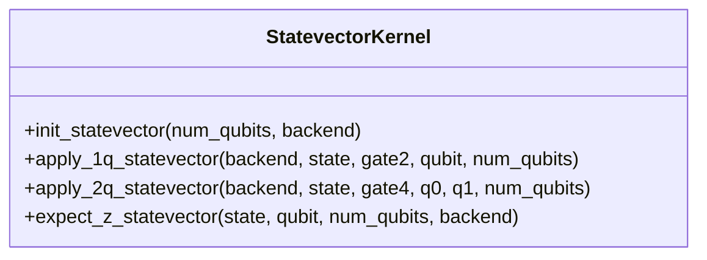

**Diagram sources**
- [statevector.py](file://src/tyxonq/libs/quantum_library/kernels/statevector.py#L15-L54)

**Section sources**
- [statevector.py](file://src/tyxonq/libs/quantum_library/kernels/statevector.py#L1-L54)

### Density Matrix Kernel
The density matrix kernel implements operations for mixed quantum states represented as density matrices. It supports initialization of pure states, application of single and two-qubit operations, and expectation value computation using the Heisenberg picture.

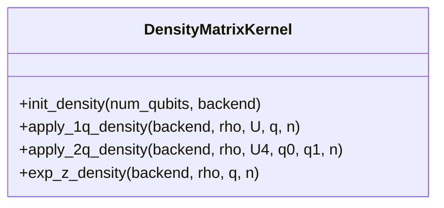

**Diagram sources**
- [density_matrix.py](file://src/tyxonq/libs/quantum_library/kernels/density_matrix.py#L15-L83)

**Section sources**
- [density_matrix.py](file://src/tyxonq/libs/quantum_library/kernels/density_matrix.py#L1-L83)

### Matrix Product State Kernel
The matrix product state (MPS) kernel provides a compressed representation of quantum states suitable for simulating large systems with limited entanglement. It includes functions for state initialization, gate application with bond dimension truncation, and conversion to full statevector representation.

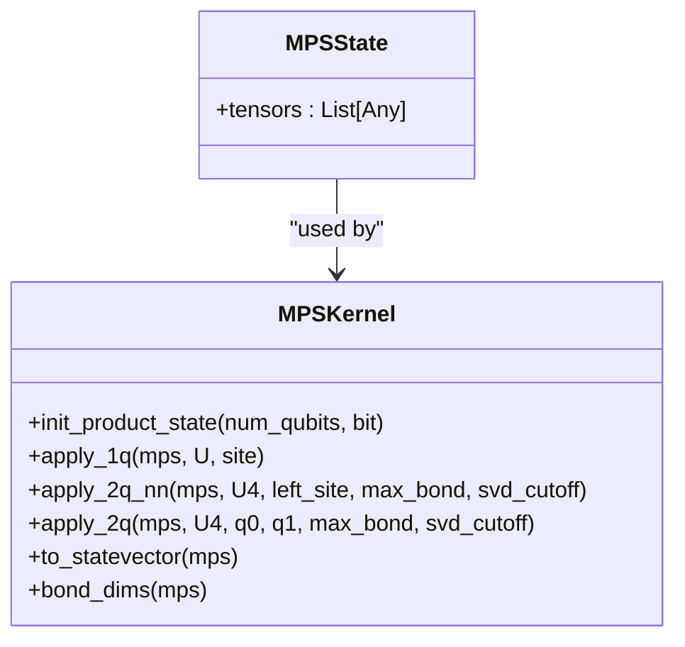

**Diagram sources**
- [matrix_product_state.py](file://src/tyxonq/libs/quantum_library/kernels/matrix_product_state.py#L15-L234)

**Section sources**
- [matrix_product_state.py](file://src/tyxonq/libs/quantum_library/kernels/matrix_product_state.py#L1-L234)

### Unitary Kernel
The unitary kernel provides canonical unitary matrices for fundamental quantum gates. These static definitions are used across the system for gate decomposition and simulation.

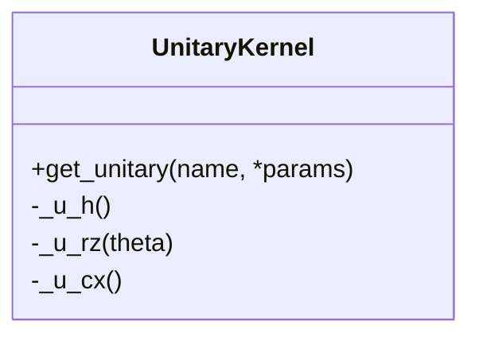

**Diagram sources**
- [unitary.py](file://src/tyxonq/libs/quantum_library/kernels/unitary.py#L15-L82)

**Section sources**
- [unitary.py](file://src/tyxonq/libs/quantum_library/kernels/unitary.py#L1-L82)

### Pauli Kernel
The Pauli kernel implements utilities for working with Pauli operators and Hamiltonians. It provides conversions between different Pauli string representations and methods for constructing dense Hamiltonian matrices from Pauli term sums.

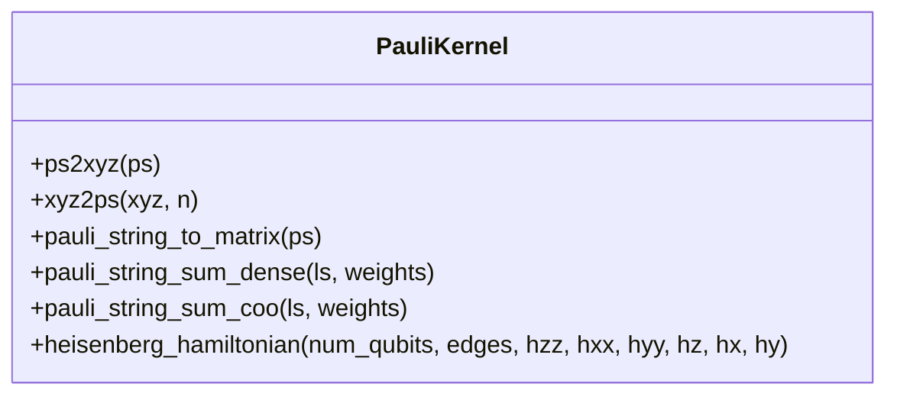

**Diagram sources**
- [pauli.py](file://src/tyxonq/libs/quantum_library/kernels/pauli.py#L15-L174)

**Section sources**
- [pauli.py](file://src/tyxonq/libs/quantum_library/kernels/pauli.py#L1-L174)

## Dynamics Module

The dynamics module provides tools for simulating quantum time evolution under time-independent and time-dependent Hamiltonians. It implements a basic ODE integrator for Schrödinger dynamics and supports various Hamiltonian representations.

### Time Evolution Simulation
The core functionality of the dynamics module is provided by the `evolve_state` function, which integrates the Schrödinger equation using a fixed-step Euler method. The module supports multiple input formats for the Hamiltonian, including dense matrices, Pauli term lists, and callable functions.

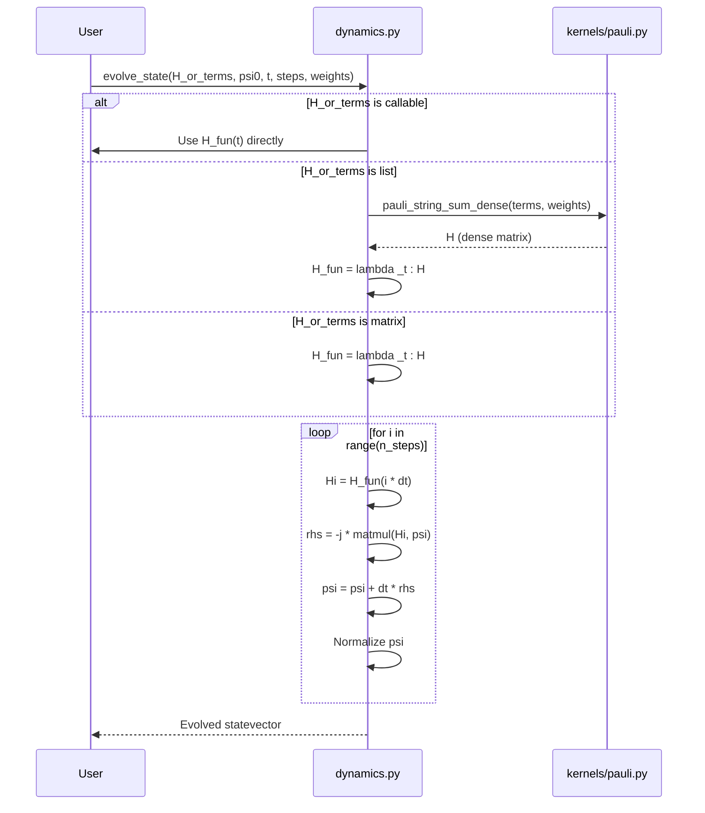

**Diagram sources**
- [dynamics.py](file://src/tyxonq/libs/quantum_library/dynamics.py#L15-L145)
- [pauli.py](file://src/tyxonq/libs/quantum_library/kernels/pauli.py#L15-L174)

**Section sources**
- [dynamics.py](file://src/tyxonq/libs/quantum_library/dynamics.py#L1-L145)

### PauliSumCOO Class
The `PauliSumCOO` class provides a lightweight adapter for Pauli-sum Hamiltonians, enabling conversion between different sparse matrix representations.

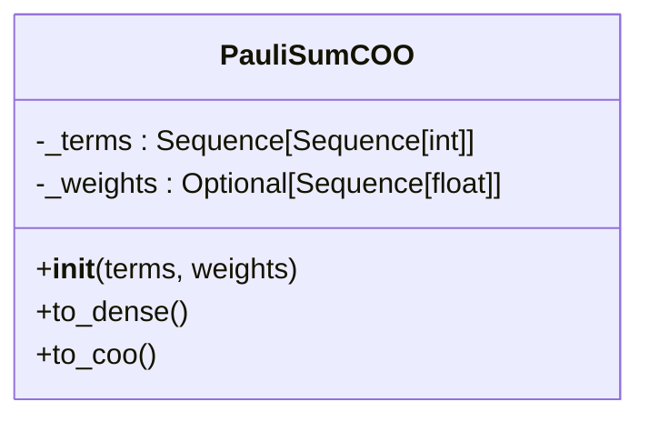

**Diagram sources**
- [dynamics.py](file://src/tyxonq/libs/quantum_library/dynamics.py#L15-L145)

**Section sources**
- [dynamics.py](file://src/tyxonq/libs/quantum_library/dynamics.py#L1-L145)

## Measurement Module

The measurement module provides functions for evaluating observables from quantum measurements. While some functions are deprecated in favor of newer implementations in the postprocessing module, they remain available for backward compatibility.

### Deprecated Measurement Functions
The measurement module contains several deprecated functions that have been moved to the postprocessing module. These functions are maintained for compatibility but should not be used in new code.

```mermaid
classDiagram
class MeasurementModule {
+term_expectation_from_counts(counts, idxs)
+group_qubit_operator(qop, n_qubits)
+group_hamiltonian_terms(hamiltonian, n_qubits)
}
note right of MeasurementModule
All functions in this module are
deprecated and have been moved to
tyxonq.postprocessing.counts_expval
and compiler.rewrite.measurement
end
```

**Diagram sources**
- [measurement.py](file://src/tyxonq/libs/quantum_library/measurement.py#L1-L51)

**Section sources**
- [measurement.py](file://src/tyxonq/libs/quantum_library/measurement.py#L1-L51)

## Backend Compatibility

The Quantum Library module supports multiple numerical backends through a unified interface. This section details the backend implementations and their capabilities.

### Backend Architecture
The backend system is designed to provide a consistent API across different numerical libraries, allowing seamless switching between computational engines.

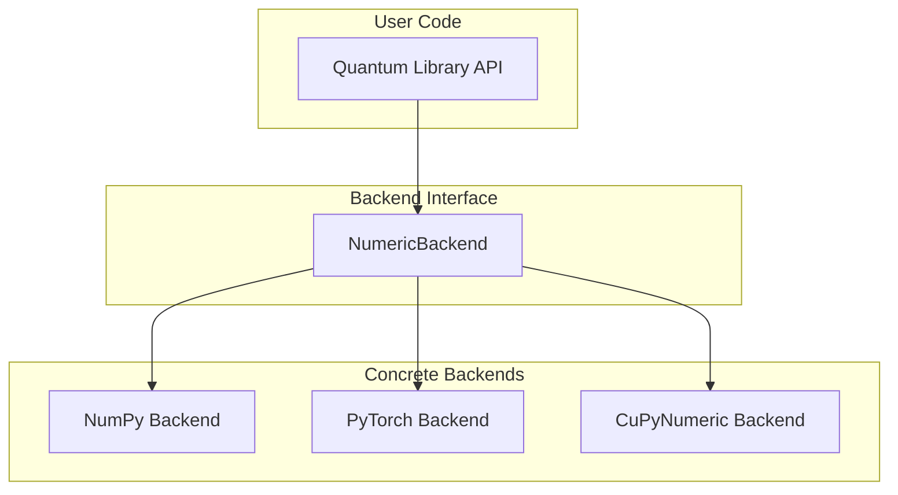

**Diagram sources**
- [numpy_backend.py](file://src/tyxonq/numerics/backends/numpy_backend.py#L1-L165)
- [pytorch_backend.py](file://src/tyxonq/numerics/backends/pytorch_backend.py#L1-L259)
- [cupynumeric_backend.py](file://src/tyxonq/numerics/backends/cupynumeric_backend.py#L1-L255)

**Section sources**
- [numpy_backend.py](file://src/tyxonq/numerics/backends/numpy_backend.py#L1-L165)
- [pytorch_backend.py](file://src/tyxonq/numerics/backends/pytorch_backend.py#L1-L259)
- [cupynumeric_backend.py](file://src/tyxonq/numerics/backends/cupynumeric_backend.py#L1-L255)

### Backend-Specific Features
Each backend implementation provides optimized versions of core numerical operations while maintaining API consistency.

#### NumPy Backend
The NumPy backend provides CPU-based numerical computation with comprehensive support for array operations and linear algebra.

#### PyTorch Backend
The PyTorch backend enables GPU acceleration and automatic differentiation through PyTorch tensors. It supports JIT compilation via `torch.compile` and provides autograd-based gradient computation.

#### CuPyNumeric Backend
The CuPyNumeric backend offers GPU/accelerated computation through the CuPyNumeric library. For operations not supported on GPU, it falls back to CPU-based NumPy implementations.

## Integration with Numerics Subsystem

The Quantum Library module integrates closely with the numerics subsystem to provide a unified computational framework. This integration enables consistent tensor operations and memory management across different components.

### Numerics API Integration
The library uses the numerics API to abstract away backend-specific details, allowing algorithms to be written in a backend-agnostic manner.

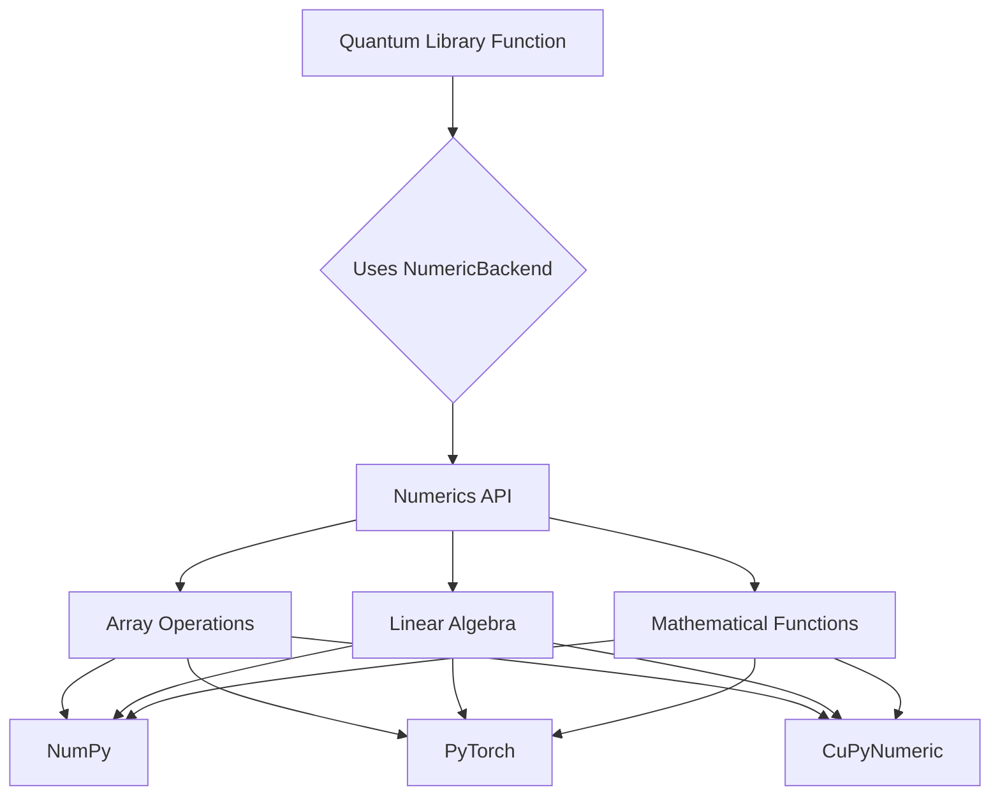

**Diagram sources**
- [statevector.py](file://src/tyxonq/libs/quantum_library/kernels/statevector.py#L1-L54)
- [density_matrix.py](file://src/tyxonq/libs/quantum_library/kernels/density_matrix.py#L1-L83)
- [numpy_backend.py](file://src/tyxonq/numerics/backends/numpy_backend.py#L1-L165)
- [pytorch_backend.py](file://src/tyxonq/numerics/backends/pytorch_backend.py#L1-L259)
- [cupynumeric_backend.py](file://src/tyxonq/numerics/backends/cupynumeric_backend.py#L1-L255)

**Section sources**
- [statevector.py](file://src/tyxonq/libs/quantum_library/kernels/statevector.py#L1-L54)
- [density_matrix.py](file://src/tyxonq/libs/quantum_library/kernels/density_matrix.py#L1-L83)

## Example Usage

This section demonstrates real-world usage of the Quantum Library module through examples from the codebase.

### Time Evolution with Trotterization
The `timeevolution_trotter.py` example demonstrates how to simulate time evolution of a Heisenberg spin chain using Trotterization.

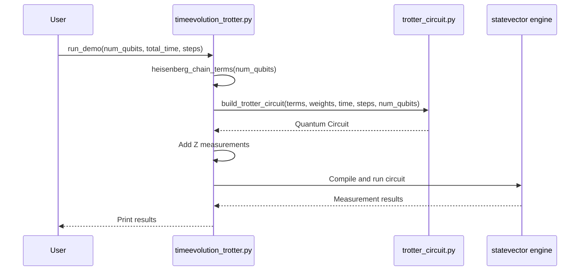

**Diagram sources**
- [timeevolution_trotter.py](file://examples/timeevolution_trotter.py#L1-L58)

**Section sources**
- [timeevolution_trotter.py](file://examples/timeevolution_trotter.py#L1-L58)

### Value and Gradient Computation
The `sample_value_gradient.py` example shows how to compute expectation values and gradients for variational quantum algorithms.

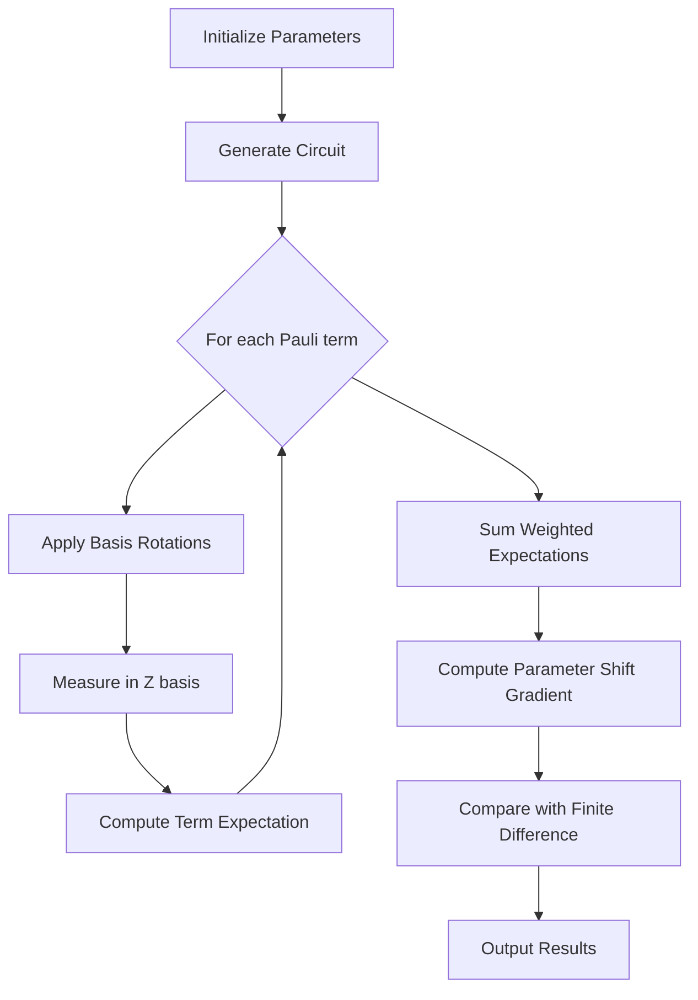

**Diagram sources**
- [sample_value_gradient.py](file://examples/sample_value_gradient.py#L1-L169)

**Section sources**
- [sample_value_gradient.py](file://examples/sample_value_gradient.py#L1-L169)

## Numerical Stability Considerations

The Quantum Library module incorporates several design choices to ensure numerical stability across different backends and problem scales.

### State Normalization
During time evolution, the statevector is periodically normalized to prevent numerical drift:

```python
nrm2 = K.sum(K.abs(psi) ** 2)
nrm = K.sqrt(nrm2)
if float(np.asarray(K.to_numpy(nrm))) > 0.0:
    psi = psi / nrm
```

This normalization ensures that the state remains on the unit sphere in Hilbert space, preserving the physical interpretation of the quantum state.

### SVD Truncation
In the MPS kernel, singular value decomposition (SVD) is used to compress bond dimensions after two-qubit gate applications. The truncation policy includes both a hard cap on maximum bond dimension and an optional singular value cutoff:

```python
def _truncate_svd(Um, Sm, Vh, max_bond, svd_cutoff):
    # Apply cutoff by absolute threshold on singular values
    if svd_cutoff is not None:
        keep = (Sm >= float(svd_cutoff))
        # Ensure at least rank-1 to avoid collapsing entirely
        if not np.any(keep):
            keep = np.zeros_like(Sm, dtype=bool)
            keep[0] = True
        Um = Um[:, keep]
        Sm = Sm[keep]
        Vh = Vh[keep, :]
    # Apply hard cap
    if max_bond is not None and max_bond < r:
        r = max_bond
        Um = Um[:, :r]
        Sm = Sm[:r]
        Vh = Vh[:r, :]
    return Um, Sm, Vh
```

This dual truncation strategy balances computational efficiency with accuracy preservation.

### Gradient Computation
The library provides multiple methods for gradient computation, including parameter shift and finite difference, with automatic fallback to numerical methods when autograd is unavailable:

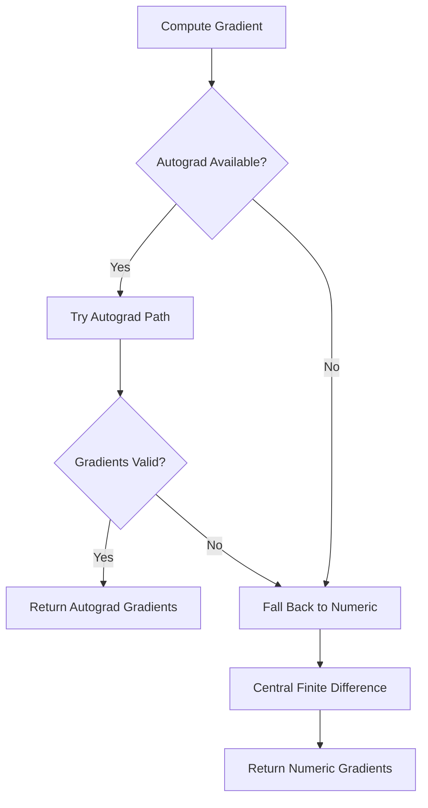

This robust approach ensures gradient computation is always possible, even when advanced features like automatic differentiation are not available.

**Section sources**
- [dynamics.py](file://src/tyxonq/libs/quantum_library/dynamics.py#L1-L145)
- [matrix_product_state.py](file://src/tyxonq/libs/quantum_library/kernels/matrix_product_state.py#L1-L234)
- [pytorch_backend.py](file://src/tyxonq/numerics/backends/pytorch_backend.py#L1-L259)