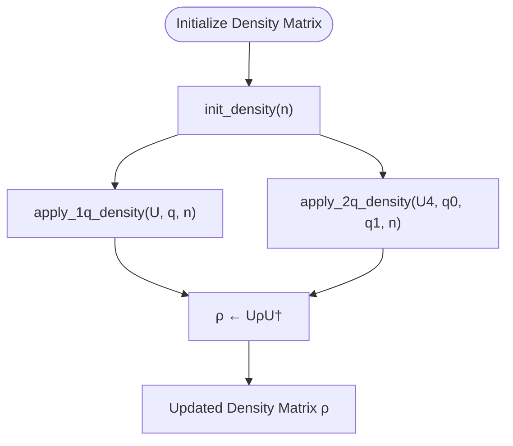
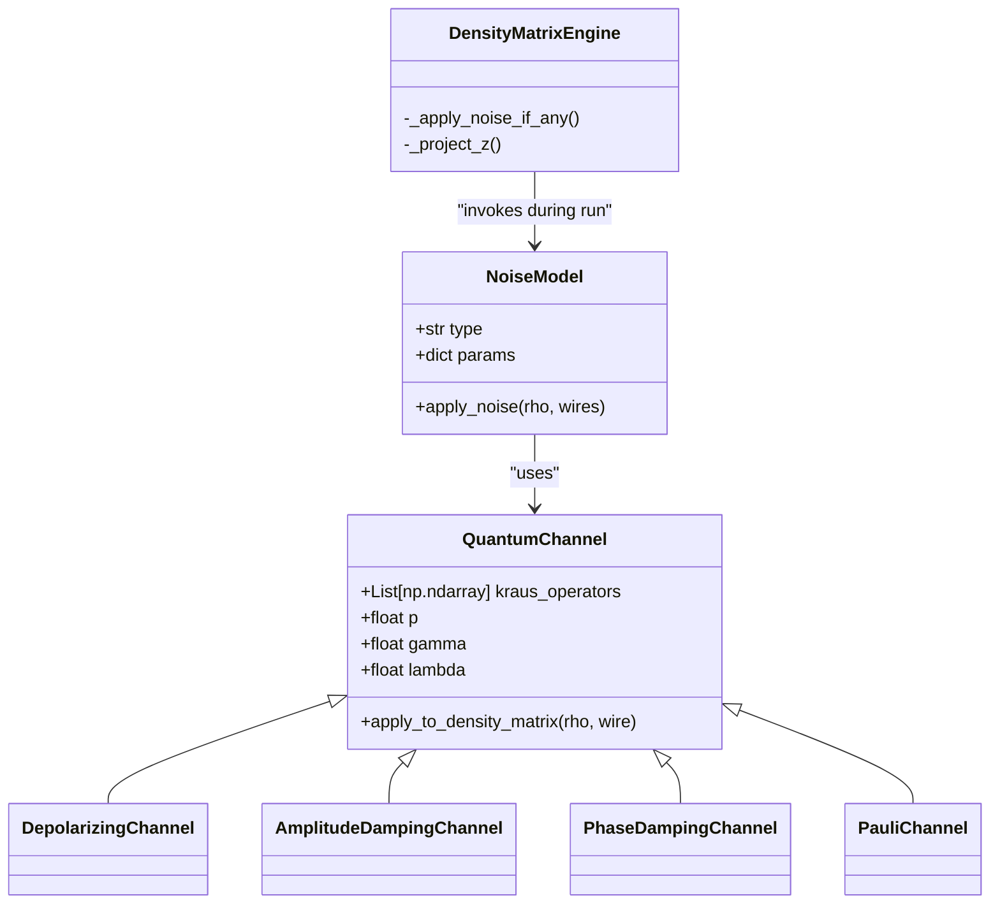
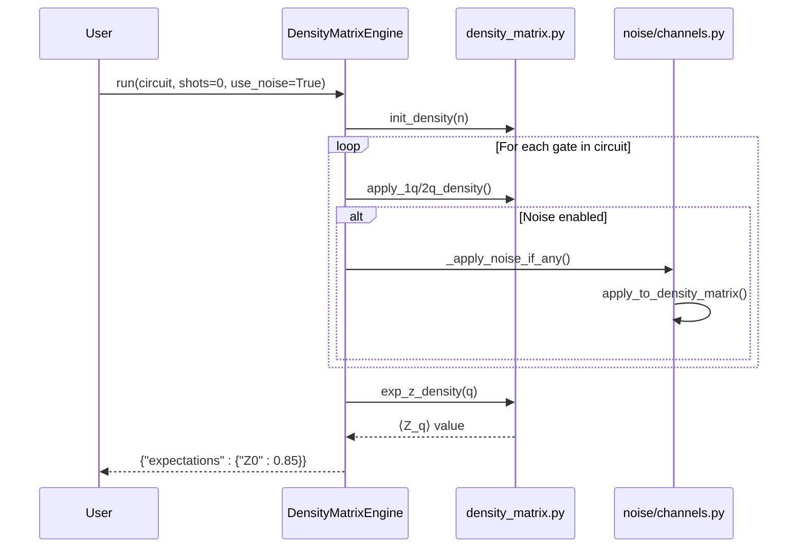
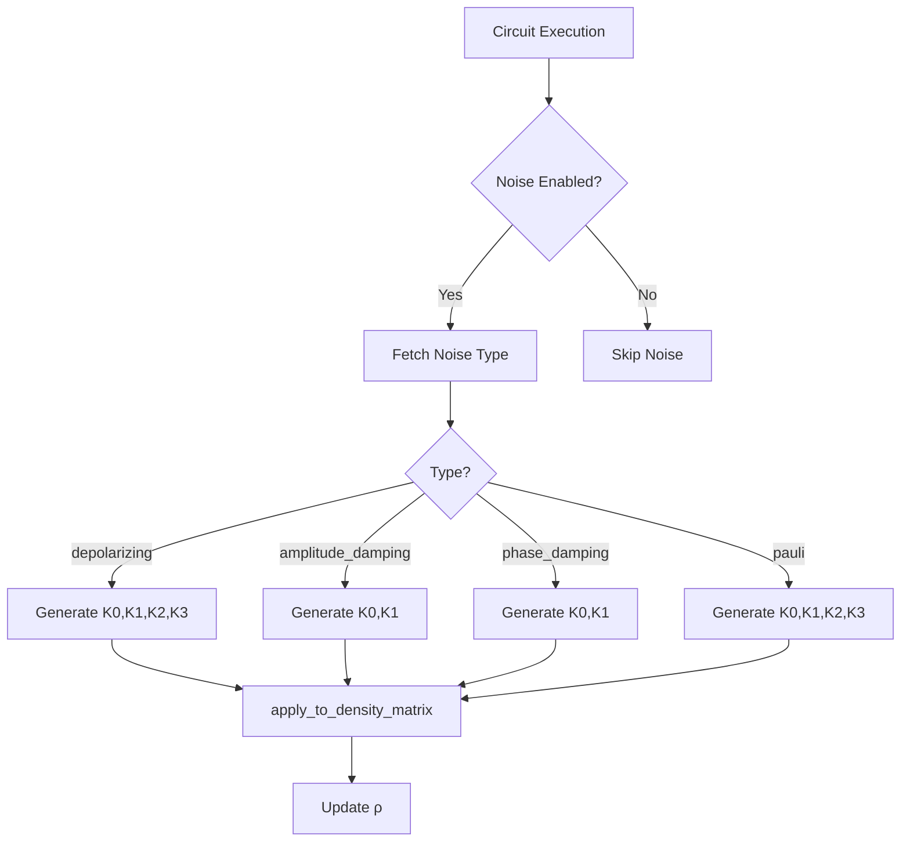

# Density Matrix Kernels

<cite>
**Referenced Files in This Document**   
- [density_matrix.py](file://src/tyxonq/libs/quantum_library/kernels/density_matrix.py)
- [engine.py](file://src/tyxonq/devices/simulators/density_matrix/engine.py)
- [channels.py](file://src/tyxonq/devices/simulators/noise/channels.py)
- [noise_controls_demo.py](file://examples/noise_controls_demo.py)
- [noisy_qml.py](file://examples-ng/noisy_qml.py)
</cite>

## Table of Contents
1. [Introduction](#introduction)
2. [Core Functions for Density Matrix Representation](#core-functions-for-density-matrix-representation)
3. [Quantum Channel Application and Noise Evolution](#quantum-channel-application-and-noise-evolution)
4. [Fidelity and Expectation Value Calculations](#fidelity-and-expectation-value-calculations)
5. [Integration with Noise Models](#integration-with-noise-models)
6. [Execution in Density Matrix Simulators](#execution-in-density-matrix-simulators)
7. [Choi Matrix Operations](#choi-matrix-operations)
8. [Performance Considerations for High-Dimensional Systems](#performance-considerations-for-high-dimensional-systems)
9. [Numerical Stability and Positivity Preservation](#numerical-stability-and-positivity-preservation)
10. [Backend-Specific Optimizations](#backend-specific-optimizations)
11. [Example Usage in Noisy Quantum Circuit Simulation](#example-usage-in-noisy-quantum-circuit-simulation)
12. [Conclusion](#conclusion)

## Introduction
The Density Matrix kernel module in TyxonQ provides a comprehensive framework for simulating mixed quantum states using density matrices. This documentation details the core functions for density matrix manipulation, quantum channel application, noise modeling, and expectation value computation. The module integrates tightly with noise models defined in `src/tyxonq/devices/simulators/noise/channels.py` and is executed within density matrix simulators that support native Kraus operator evolution. Designed for high-fidelity noisy quantum circuit simulation, this kernel supports backend flexibility across NumPy, PyTorch, and CuPyNumeric, enabling scalable and numerically stable simulations.

## Core Functions for Density Matrix Representation
The foundation of the density matrix simulation lies in the initialization and manipulation of the density matrix ρ, a positive semi-definite Hermitian operator of dimension 2^n × 2^n representing the mixed state of an n-qubit system.

The `init_density(num_qubits: int, backend: ArrayBackend | None = None)` function initializes the density matrix in the |0⟩⊗n state, setting the (0,0) element to 1 and all others to zero. It leverages the unified numeric backend system to ensure compatibility across different computational backends.

Single- and two-qubit operations are applied via `apply_1q_density` and `apply_2q_density`, which implement the quantum channel transformation ρ → UρU† using efficient tensor contractions via `einsum`. These functions reshape the density matrix into a 2n-dimensional tensor and use Einstein summation notation to apply the unitary evolution on the specified qubit(s), preserving the trace and Hermiticity of ρ.

**Diagram sources**
- [density_matrix.py](file://src/tyxonq/libs/quantum_library/kernels/density_matrix.py#L8-L38)

**Section sources**
- [density_matrix.py](file://src/tyxonq/libs/quantum_library/kernels/density_matrix.py#L8-L62)

## Quantum Channel Application and Noise Evolution
Noise evolution is implemented through quantum channels represented by Kraus operators {K_i}, which transform the density matrix as ρ → Σ_i K_i ρ K_i†. The module supports several standard noise models via the `channels.py` interface.

The `depolarizing(p)` channel applies isotropic noise with probability p, returning four Kraus operators corresponding to the identity and Pauli X, Y, Z operations. The `amplitude_damping(gamma)` and `phase_damping(lambda)` functions model energy relaxation and dephasing processes, respectively. The `pauli_channel(px, py, pz)` allows custom probabilistic Pauli errors.

The core function `apply_to_density_matrix(rho, kraus, wire, num_qubits)` applies a set of Kraus operators to a specific qubit within the full density matrix. It reshapes ρ into a tensor, performs the contraction for each Kraus operator using `einsum`, and accumulates the result. This operation is numerically stable and preserves the positivity of ρ when the Kraus operators satisfy completeness Σ_i K_i†K_i = I.

**Diagram sources**
- [channels.py](file://src/tyxonq/devices/simulators/noise/channels.py#L6-L61)
- [engine.py](file://src/tyxonq/devices/simulators/density_matrix/engine.py#L167-L193)

**Section sources**
- [channels.py](file://src/tyxonq/devices/simulators/noise/channels.py#L6-L61)
- [engine.py](file://src/tyxonq/devices/simulators/density_matrix/engine.py#L167-L193)

## Fidelity and Expectation Value Calculations
The module provides efficient methods for computing expectation values of Pauli-Z operators via `exp_z_density(backend, rho, q, n)`. This function exploits the diagonal structure of the Z operator, computing ⟨Z_q⟩ = Tr(ρZ_q) by summing the diagonal elements of ρ weighted by ±1 based on the q-th qubit's state. This avoids full matrix multiplication and is significantly faster than general observable evaluation.

For arbitrary observables, the `expval(circuit, obs)` method in `DensityMatrixEngine` computes the expectation using OpenFermion's sparse operator conversion. It constructs the Hamiltonian matrix H from the observable and computes Tr(ρH), returning the real part of the trace. This method is suitable for small to medium-sized systems where full matrix operations are feasible.

**Diagram sources**
- [density_matrix.py](file://src/tyxonq/libs/quantum_library/kernels/density_matrix.py#L65-L72)
- [engine.py](file://src/tyxonq/devices/simulators/density_matrix/engine.py#L38-L137)

**Section sources**
- [density_matrix.py](file://src/tyxonq/libs/quantum_library/kernels/density_matrix.py#L65-L72)
- [engine.py](file://src/tyxonq/devices/simulators/density_matrix/engine.py#L139-L165)

## Integration with Noise Models
The integration between the density matrix kernel and noise models is mediated through the `DensityMatrixEngine._apply_noise_if_any()` method, which conditionally applies noise based on the `use_noise` flag and provided noise configuration. Supported noise types include "depolarizing", "amplitude_damping", "phase_damping", and "pauli", each mapped to their respective Kraus operator generators in `channels.py`.

Noise is applied after each quantum gate operation on the affected qubits, ensuring accurate temporal modeling of decoherence. The engine also supports readout noise during measurement sampling by applying a calibration matrix A to the diagonal probabilities before sampling.

**Diagram sources**
- [engine.py](file://src/tyxonq/devices/simulators/density_matrix/engine.py#L167-L193)
- [channels.py](file://src/tyxonq/devices/simulators/noise/channels.py#L6-L61)

**Section sources**
- [engine.py](file://src/tyxonq/devices/simulators/density_matrix/engine.py#L167-L193)

## Execution in Density Matrix Simulators
The `DensityMatrixEngine` class orchestrates the simulation workflow, managing the density matrix state, applying gates and noise, and handling measurements. It supports both shot-based sampling and exact expectation value computation.

When `shots > 0`, the engine samples measurement outcomes by treating the diagonal of ρ as a probability distribution. It optionally applies readout or depolarizing noise to the probabilities before sampling using the backend's random number generator. Measurement results are returned as bitstring counts.

For noise-free or expectation-only runs, the engine computes ⟨Z_q⟩ for each measured qubit using the optimized `exp_z_density` function. The engine's `run` method processes the circuit's operation list sequentially, applying each gate and associated noise.

**Section sources**
- [engine.py](file://src/tyxonq/devices/simulators/density_matrix/engine.py#L38-L137)

## Choi Matrix Operations
While not directly exposed in the public API, the underlying framework supports Choi matrix representation of quantum channels through the Kraus operator formalism. The `apply_to_density_matrix` function effectively implements the action of the Choi matrix J(Φ) = Σ_i |vec(K_i)⟩⟨vec(K_i)| on the vectorized density matrix.

This enables the simulation of arbitrary completely positive trace-preserving (CPTP) maps, forming the basis for advanced noise characterization and quantum process tomography within the TyxonQ framework.

**Section sources**
- [channels.py](file://src/tyxonq/devices/simulators/noise/channels.py#L43-L61)

## Performance Considerations for High-Dimensional Systems
The density matrix simulation scales as O(4^n) in memory and O(4^n × g) in time for g gates, making it suitable for small to medium-sized systems (n ≤ 15). The use of `einsum` with optimized backend libraries (NumPy, PyTorch, CuPyNumeric) ensures efficient tensor contractions.

For high-dimensional systems, performance can be improved by:
- Using GPU-accelerated backends (PyTorch/CUDA, CuPyNumeric)
- Minimizing unnecessary noise applications
- Avoiding full state tomography when partial measurements suffice
- Leveraging sparsity in the density matrix (not currently exploited)

The engine's design prioritizes numerical accuracy and noise modeling fidelity over scalability, making it ideal for benchmarking and noise characterization rather than large-scale circuit simulation.

**Section sources**
- [engine.py](file://src/tyxonq/devices/simulators/density_matrix/engine.py#L38-L137)
- [density_matrix.py](file://src/tyxonq/libs/quantum_library/kernels/density_matrix.py#L19-L62)

## Numerical Stability and Positivity Preservation
The implementation ensures numerical stability through several mechanisms:
- Use of `einsum` for stable tensor contractions
- Explicit clipping of probabilities to [0,1] during sampling
- Normalization of projected states after measurement
- Input validation for noise parameters (e.g., p ∈ [0,1])

Positivity of the density matrix is preserved by construction when using valid Kraus operators that satisfy Σ_i K_i†K_i = I. The engine catches exceptions during noise application and returns the unmodified state in case of numerical errors.

**Section sources**
- [engine.py](file://src/tyxonq/devices/simulators/density_matrix/engine.py#L195-L205)
- [channels.py](file://src/tyxonq/devices/simulators/noise/channels.py#L6-L61)

## Backend-Specific Optimizations
The kernel leverages TyxonQ's unified numeric backend system to provide optimized execution across NumPy, PyTorch, and CuPyNumeric. The `ArrayBackend` interface abstracts array operations, allowing the same code to run on CPU and GPU with minimal changes.

Key backend-specific optimizations include:
- GPU acceleration for tensor contractions in PyTorch and CuPyNumeric
- Efficient random sampling using native RNG implementations
- Memory-efficient array operations through backend-specific kernels
- Automatic device placement and data transfer management

The backend is specified during `DensityMatrixEngine` initialization and propagated to all kernel functions.

**Section sources**
- [density_matrix.py](file://src/tyxonq/libs/quantum_library/kernels/density_matrix.py#L8-L72)
- [engine.py](file://src/tyxonq/devices/simulators/density_matrix/engine.py#L28)

## Example Usage in Noisy Quantum Circuit Simulation
The `examples/noise_controls_demo.py` demonstrates basic noise control, showing how to enable global noise and override it at the device level. It compares clean and noisy simulation results for a single-qubit RZ gate, illustrating the attenuation of ⟨Z⟩ under depolarizing noise.

The `examples-ng/noisy_qml.py` example showcases more advanced noisy quantum machine learning workflows, integrating density matrix simulation with parameterized circuits and gradient-based optimization under noise.

These examples validate the correctness of noise application and provide templates for developing noise-resilient quantum algorithms.

**Section sources**
- [noise_controls_demo.py](file://examples/noise_controls_demo.py#L1-L46)
- [noisy_qml.py](file://examples-ng/noisy_qml.py)

## Conclusion
The Density Matrix kernel module in TyxonQ provides a robust, flexible, and numerically stable framework for simulating noisy quantum circuits. By integrating efficient tensor operations with a comprehensive noise model library, it enables accurate characterization of quantum algorithms under realistic decoherence. The modular design supports multiple computational backends and scales effectively for systems up to 15 qubits, making it a valuable tool for quantum error mitigation research and algorithm development.