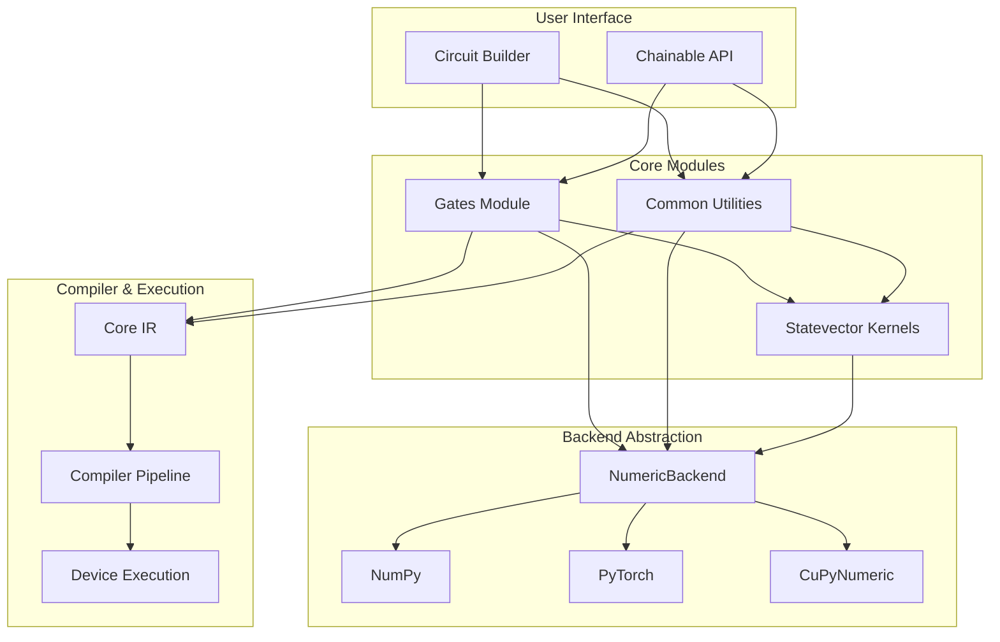
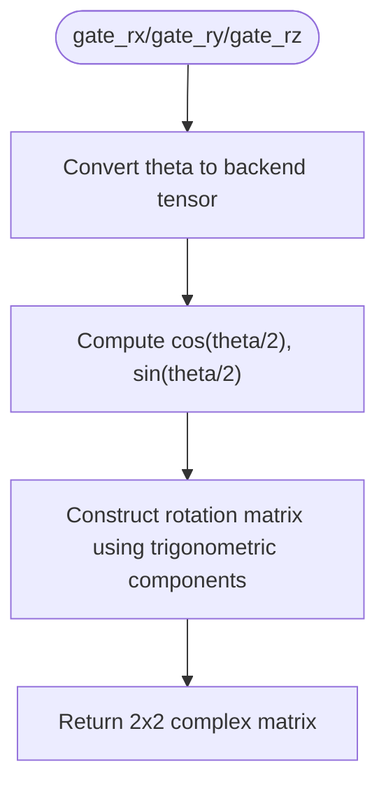
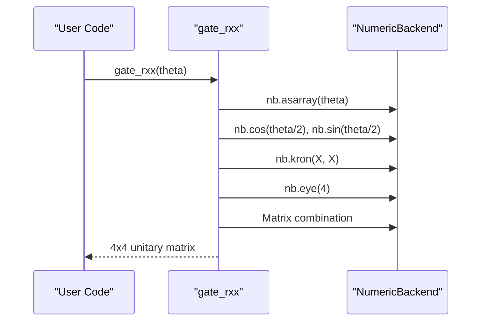

# Gates and Common Utilities

<cite>
**Referenced Files in This Document**   
- [gates.py](file://src/tyxonq/libs/quantum_library/kernels/gates.py)
- [common.py](file://src/tyxonq/libs/quantum_library/kernels/common.py)
- [circuit_chain_demo.py](file://examples/circuit_chain_demo.py)
- [simple_qaoa.py](file://examples/simple_qaoa.py)
- [statevector.py](file://src/tyxonq/libs/quantum_library/kernels/statevector.py)
- [circuit.py](file://src/tyxonq/core/ir/circuit.py)
</cite>

## Table of Contents
1. [Introduction](#introduction)
2. [Core Architecture and Integration](#core-architecture-and-integration)
3. [Standard Quantum Gate Implementations](#standard-quantum-gate-implementations)
4. [Parametric Gate Operations](#parametric-gate-operations)
5. [Two-Qubit and Controlled Gates](#two-qubit-and-controlled-gates)
6. [Common Utilities and Numerical Helpers](#common-utilities-and-numerical-helpers)
7. [Integration with Core IR and Compiler Pipeline](#integration-with-core-ir-and-compiler-pipeline)
8. [Automatic Differentiation Support](#automatic-differentiation-support)
9. [Numerical Stability and Backend Optimizations](#numerical-stability-and-backend-optimizations)
10. [Usage Examples and Circuit Composition](#usage-examples-and-circuit-composition)
11. [Conclusion](#conclusion)

## Introduction
This document provides comprehensive API documentation for the Gates and Common Utilities modules within TyxonQ's Quantum Library. It details the implementation of standard quantum gates, parametric operations, and shared utility functions that form the foundation of quantum circuit construction and simulation. The modules `gates.py` and `common.py` provide backend-agnostic numerical implementations compatible with NumPy, PyTorch, and CuPyNumeric, enabling seamless integration across classical and quantum computing workflows. These components are tightly integrated with the core Intermediate Representation (IR) and compiler pipeline, supporting advanced features such as automatic differentiation, gradient computation via parameter shift rules, and efficient tensor operations for statevector simulation. This documentation covers function signatures, numerical formulations, backend interoperability, and practical usage patterns demonstrated through example circuits.

## Core Architecture and Integration
The Gates and Common Utilities modules are central to TyxonQ's quantum computation framework, providing low-level numerical primitives that interface directly with the core IR and higher-level circuit construction APIs. The architecture is designed for maximum flexibility and performance across diverse backends.



**Diagram sources**
- [gates.py](file://src/tyxonq/libs/quantum_library/kernels/gates.py)
- [common.py](file://src/tyxonq/libs/quantum_library/kernels/common.py)
- [statevector.py](file://src/tyxonq/libs/quantum_library/kernels/statevector.py)
- [circuit.py](file://src/tyxonq/core/ir/circuit.py)

**Section sources**
- [gates.py](file://src/tyxonq/libs/quantum_library/kernels/gates.py)
- [common.py](file://src/tyxonq/libs/quantum_library/kernels/common.py)

## Standard Quantum Gate Implementations
The `gates.py` module implements a comprehensive set of standard single-qubit quantum gates using backend-native numerical operations. Each gate function returns a complex-valued matrix representation compatible with the active numeric backend (NumPy, PyTorch, or CuPyNumeric). These implementations ensure numerical stability and gradient compatibility for use in variational quantum algorithms.

### Hadamard Gate (H)
The Hadamard gate creates superposition states and is implemented as a normalized sum of identity and Pauli-X matrices.

```python
def gate_h() -> Any:
    one = nb.array(1.0, dtype=nb.complex128)
    minus_one = nb.array(-1.0, dtype=nb.complex128)
    mat = nb.array([[one, one], [one, minus_one]], dtype=nb.complex128)
    factor = nb.array(1.0, dtype=nb.complex128) / nb.sqrt(nb.array(2.0, dtype=nb.float64))
    return factor * mat
```

**Section sources**
- [gates.py](file://src/tyxonq/libs/quantum_library/kernels/gates.py#L9-L14)

### Pauli Gates (X, Y, Z)
The Pauli gates represent fundamental single-qubit operations corresponding to rotations around the Bloch sphere axes.

```python
def gate_x() -> Any:
    zero = nb.array(0.0, dtype=nb.complex128)
    one = nb.array(1.0, dtype=nb.complex128)
    return nb.array([[zero, one], [one, zero]], dtype=nb.complex128)
```

**Section sources**
- [gates.py](file://src/tyxonq/libs/quantum_library/kernels/gates.py#L98-L101)

### Phase Gates (S, T)
Phase gates introduce complex phase shifts and are special cases of the general phase gate parameterized by rotation angle.

```python
def gate_s() -> Any:
    return gate_phase(nb.array(np.pi / 2.0, dtype=nb.float64))

def gate_t() -> Any:
    return gate_phase(nb.array(np.pi / 4.0, dtype=nb.float64))
```

**Section sources**
- [gates.py](file://src/tyxonq/libs/quantum_library/kernels/gates.py#L86-L95)

## Parametric Gate Operations
Parametric gates enable the construction of variational quantum circuits by introducing tunable parameters that can be optimized during algorithm execution. These gates are essential for quantum machine learning and variational algorithms like VQE and QAOA.

### Rotation Gates (RX, RY, RZ)
Rotation gates perform arbitrary rotations around the X, Y, and Z axes of the Bloch sphere, parameterized by an angle theta.



The RZ gate implementation demonstrates the general pattern:
```python
def gate_rz(theta: Any) -> Any:
    th = nb.asarray(theta)
    half = nb.array(0.5, dtype=nb.float64)
    c = nb.cos(th * half)
    s = nb.sin(th * half)
    I = nb.eye(2, dtype=nb.complex128)
    Z = nb.array([[1.0, 0.0], [0.0, -1.0]], dtype=nb.complex128)
    return c * I + (-nb.array(1j, dtype=nb.complex128) * s) * Z
```

**Diagram sources**
- [gates.py](file://src/tyxonq/libs/quantum_library/kernels/gates.py#L17-L25)

**Section sources**
- [gates.py](file://src/tyxonq/libs/quantum_library/kernels/gates.py#L17-L46)

## Two-Qubit and Controlled Gates
Two-qubit gates enable entanglement and are crucial for implementing quantum algorithms that outperform classical counterparts. The module provides both standard controlled gates and parametric two-qubit rotations.

### Controlled-NOT (CX) and Controlled-Z (CZ)
The CX and CZ gates are fundamental two-qubit operations implemented as 4x4 unitary matrices.

```python
def gate_cx_4x4() -> Any:
    one = nb.array(1.0, dtype=nb.complex128)
    zero = nb.array(0.0, dtype=nb.complex128)
    return nb.array([
        [one, zero, zero, zero],
        [zero, one, zero, zero],
        [zero, zero, zero, one],
        [zero, zero, one, zero],
    ], dtype=nb.complex128)
```

**Section sources**
- [gates.py](file://src/tyxonq/libs/quantum_library/kernels/gates.py#L58-L66)

### Parametric Two-Qubit Gates (RXX, RYY, RZZ)
These gates implement rotations around tensor products of Pauli operators, commonly used in quantum chemistry and optimization algorithms.



**Diagram sources**
- [gates.py](file://src/tyxonq/libs/quantum_library/kernels/gates.py#L108-L139)

**Section sources**
- [gates.py](file://src/tyxonq/libs/quantum_library/kernels/gates.py#L108-L139)

## Common Utilities and Numerical Helpers
The `common.py` module provides essential utility functions that support quantum circuit simulation and optimization, particularly focusing on gradient computation and tensor operations.

### Parameter Shift Gradient
The parameter shift rule is a quantum-native method for computing gradients of expectation values with respect to variational parameters.

```python
def parameter_shift_gradient(energy_fn: Callable[[np.ndarray], float], params: Sequence[float]) -> np.ndarray:
    base = np.asarray(params, dtype=np.float64)
    if base.ndim != 1:
        raise ValueError("params must be 1-D")
    s = 0.5 * np.pi
    g = np.zeros_like(base)
    for i in range(len(base)):
        p_plus = base.copy(); p_plus[i] += s
        p_minus = base.copy(); p_minus[i] -= s
        e_plus = float(energy_fn(p_plus))
        e_minus = float(energy_fn(p_minus))
        g[i] = 0.5 * (e_plus - e_minus)
    return g
```

This implementation enables gradient-based optimization of quantum circuits without relying on classical automatic differentiation, making it compatible with any backend that can evaluate the energy function.

**Section sources**
- [common.py](file://src/tyxonq/libs/quantum_library/kernels/common.py#L10-L22)

## Integration with Core IR and Compiler Pipeline
The gate and utility functions are tightly integrated with TyxonQ's core Intermediate Representation (IR) and compiler pipeline, enabling seamless circuit construction, optimization, and execution.


When a user calls circuit methods like `.h(0)` or `.cx(0,1)`, these translate to IR operations that reference the corresponding gate functions during simulation. The compiler pipeline can decompose higher-level gates into native gate sets supported by specific hardware backends.

**Section sources**
- [circuit.py](file://src/tyxonq/core/ir/circuit.py)
- [gates.py](file://src/tyxonq/libs/quantum_library/kernels/gates.py)

## Automatic Differentiation Support
The architecture supports multiple approaches to automatic differentiation, enabling gradient-based optimization of quantum circuits for variational algorithms.

### Hybrid Autograd Implementation
The system supports a hybrid approach combining PyTorch's autograd with quantum-native gradient computation:

```python
def qaoa_objective_autograd(gamma_t, beta_t, g=example_graph) -> any:
    nb = tq.get_backend("pytorch")
    psi = _build_state_autograd(nb, gamma_t, beta_t, g)
    probs = nb.square(nb.abs(psi)) if hasattr(nb, "square") else nb.abs(psi) ** 2
    # Compute expectation values
    zz_sum = 0.0
    for (u, v) in g.edges:
        diag = [1.0 if (((k >> (n - 1 - u)) & 1) == ((k >> (n - 1 - v)) & 1)) else -1.0 for k in range(dim)]
        d = nb.asarray(diag)
        term = nb.sum(d * probs)
        zz_sum = term + zz_sum
    m = float(len(list(g.edges))) or 1.0
    exp_cut_total = 0.5 * (m - zz_sum)
    return -exp_cut_total
```

This approach allows end-to-end gradient computation through quantum circuit execution when using the PyTorch backend.

**Section sources**
- [simple_qaoa.py](file://examples/simple_qaoa.py#L100-L150)

## Numerical Stability and Backend Optimizations
The implementation prioritizes numerical stability and performance across different computational backends.

### Backend-Agnostic Design
All operations use the `NumericBackend` interface to ensure consistent behavior across NumPy, PyTorch, and CuPyNumeric:

```python
from ....numerics import NumericBackend as nb

def gate_h() -> Any:
    one = nb.array(1.0, dtype=nb.complex128)
    minus_one = nb.array(-1.0, dtype=nb.complex128)
    mat = nb.array([[one, one], [one, minus_one]], dtype=nb.complex128)
    factor = nb.array(1.0, dtype=nb.complex128) / nb.sqrt(nb.array(2.0, dtype=nb.float64))
    return factor * mat
```

This abstraction ensures that all numerical operations maintain precision and leverage backend-specific optimizations such as GPU acceleration and automatic differentiation.

**Section sources**
- [gates.py](file://src/tyxonq/libs/quantum_library/kernels/gates.py)
- [common.py](file://src/tyxonq/libs/quantum_library/kernels/common.py)

## Usage Examples and Circuit Composition
The functionality is demonstrated through practical examples that show circuit construction, parameterized execution, and integration with optimization workflows.

### QAOA Circuit Construction
The QAOA example demonstrates how parametric gates are used to construct variational circuits:

```python
def build_qaoa_circuit(gamma, beta, g=example_graph):
    n = len(g.nodes)
    c = tq.Circuit(n)
    for i in range(n):
        c.h(i)
    for j in range(nlayers):
        for (u, v) in g.edges:
            theta = g[u][v].get("weight", 1.0) * float(gamma[j])
            c.cx(u, v)
            c.rz(v, theta=2.0 * theta)
            c.cx(u, v)
        for i in range(n):
            c.rx(i, theta=float(beta[j]))
    for i in range(n):
        c.measure_z(i)
    return c
```

This pattern shows the composition of Hadamard gates, controlled operations, and parametric rotations to implement the QAOA ansatz.

**Section sources**
- [simple_qaoa.py](file://examples/simple_qaoa.py#L50-L70)

### Circuit Chain API
The chainable API demonstrates fluent circuit construction and execution:

```python
result = (
    Circuit(2).h(0).cx(0, 1)
    .compile(compile_engine="qiskit")
    .device(provider="simulator", device="statevector", shots=1024)
    .postprocessing(method="none")
    .run()
)
```

This pattern enables concise specification of the entire quantum workflow from circuit construction to execution and post-processing.

**Section sources**
- [circuit_chain_demo.py](file://examples/circuit_chain_demo.py)

## Conclusion
The Gates and Common Utilities modules in TyxonQ's Quantum Library provide a robust foundation for quantum circuit construction and simulation. By implementing standard and parametric quantum gates with backend-agnostic numerical operations, these modules enable flexible and efficient quantum algorithm development. The tight integration with the core IR and compiler pipeline allows for sophisticated circuit optimization and hardware-specific compilation, while support for automatic differentiation and parameter shift gradients facilitates variational quantum algorithms. The demonstrated examples illustrate practical usage patterns for quantum optimization problems like QAOA, showcasing the library's capabilities for real-world quantum computing applications. The architecture's emphasis on numerical stability, gradient compatibility, and multi-backend support makes it suitable for both research and production quantum computing workflows.