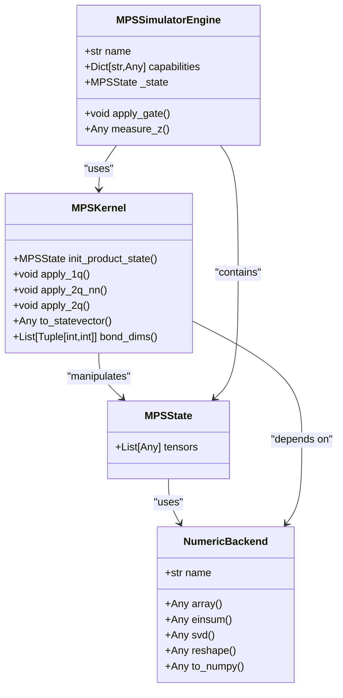
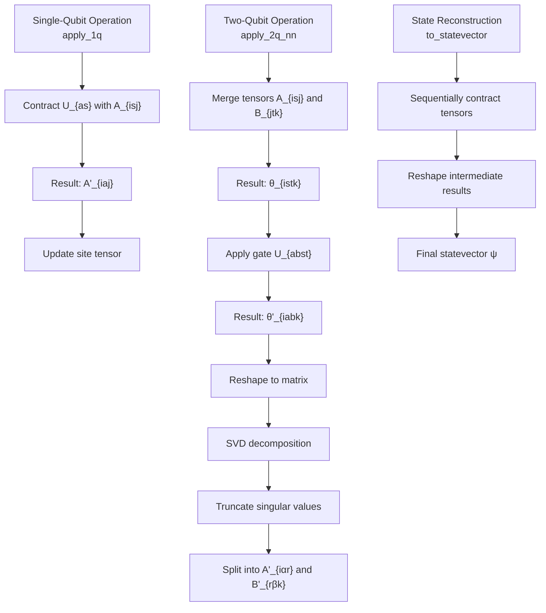
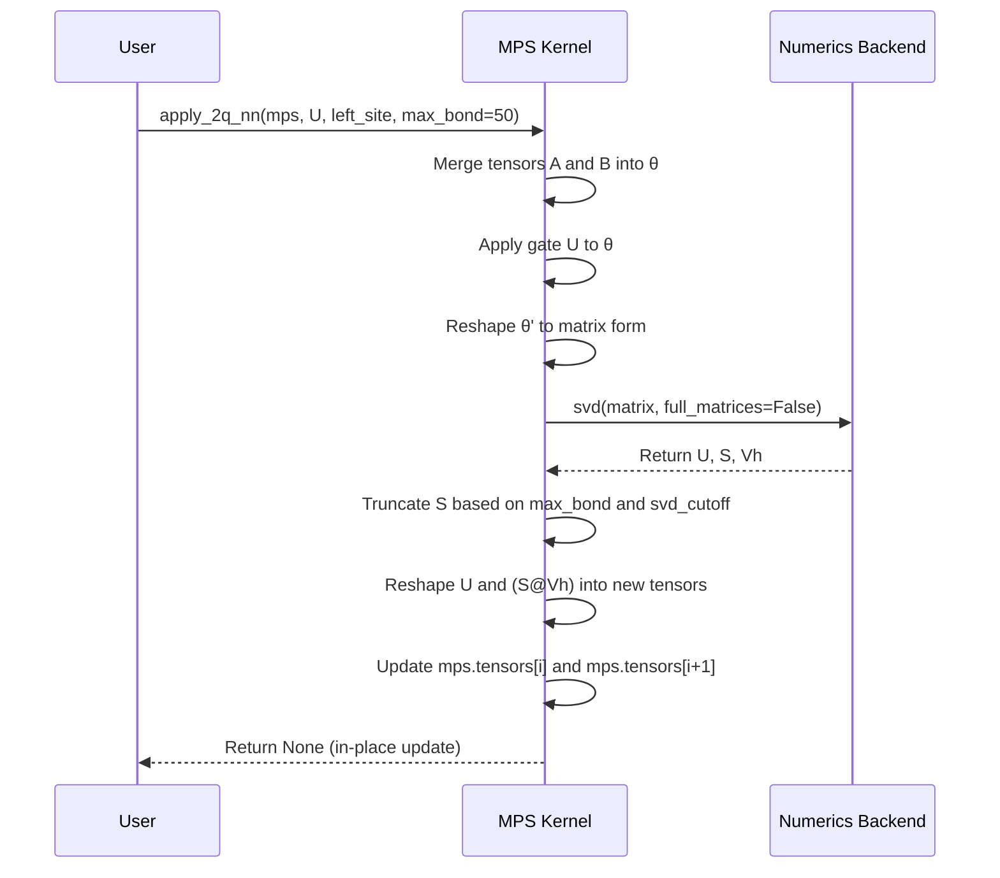
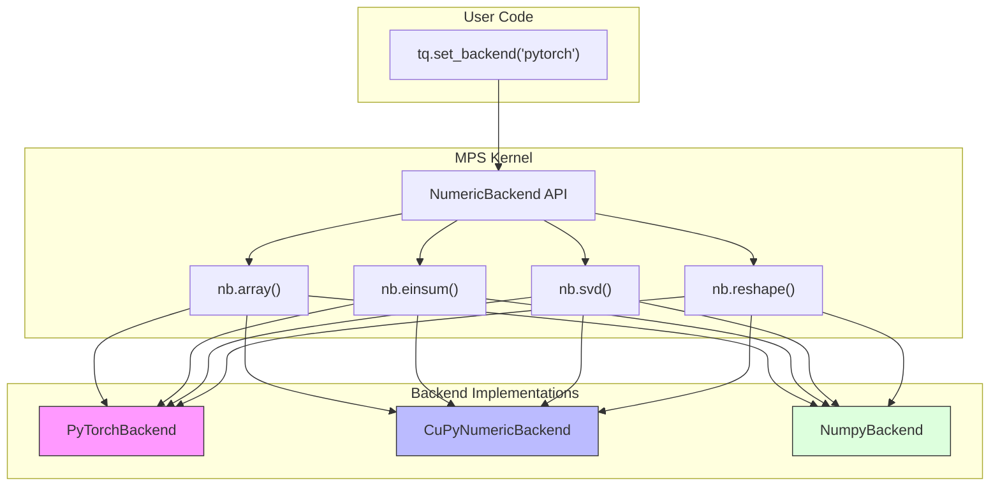

# Matrix Product State Kernels

<cite>
**Referenced Files in This Document**   
- [matrix_product_state.py](file://src/tyxonq/libs/quantum_library/kernels/matrix_product_state.py)
- [mpsvsexact.py](file://examples-ng/mpsvsexact.py)
- [lightcone_simplify.py](file://examples-ng/lightcone_simplify.py)
- [cupynumeric_backend.py](file://src/tyxonq/numerics/backends/cupynumeric_backend.py)
- [numpy_backend.py](file://src/tyxonq/numerics/backends/numpy_backend.py)
- [pytorch_backend.py](file://src/tyxonq/numerics/backends/pytorch_backend.py)
- [engine.py](file://src/tyxonq/devices/simulators/matrix_product_state/engine.py)
</cite>

## Table of Contents
1. [Introduction](#introduction)
2. [Core Components](#core-components)
3. [MPS Initialization and State Representation](#mps-initialization-and-state-representation)
4. [Tensor Network Operations](#tensor-network-operations)
5. [Gate Application and SVD Truncation](#gate-application-and-svd-truncation)
6. [Canonical Form and Bond Dimension Management](#canonical-form-and-bond-dimension-management)
7. [Expectation Value Computation](#expectation-value-computation)
8. [Numerics Backend Integration](#numerics-backend-integration)
9. [MPS Simulator Usage](#mps-simulator-usage)
10. [Performance Trade-offs and Optimization](#performance-trade-offs-and-optimization)
11. [Example Applications](#example-applications)
12. [Error Control and Compression](#error-control-and-compression)

## Introduction
The Matrix Product State (MPS) kernel module in TyxonQ provides efficient simulation capabilities for large-scale quantum systems through tensor network methods. This documentation details the core functionality of the MPS implementation, focusing on tensor network operations, canonical form management, and integration with the numerics backend. The MPS representation enables simulation of quantum circuits with limited entanglement by representing the quantum state as a product of local tensors, where computational complexity scales with bond dimension rather than exponentially with qubit count. The implementation supports key operations including MPS initialization, gate application with SVD-based truncation, expectation value computation, and state reconstruction, making it suitable for simulating 1D quantum systems and variational algorithms.

**Section sources**
- [matrix_product_state.py](file://src/tyxonq/libs/quantum_library/kernels/matrix_product_state.py#L1-L50)

## Core Components
The MPS kernel module consists of several core components that work together to enable efficient quantum simulation. The primary data structure is the `MPSState` class, which contains a list of site tensors representing the quantum state in matrix product form. Each tensor has shape (Dl, 2, Dr) where Dl and Dr are the left and right bond dimensions. The module provides functions for initializing product states, applying single and two-qubit gates, and reconstructing the full statevector for verification. The implementation is designed for clarity and minimalism, using the unified numerics backend API for tensor operations while allowing device engines to select appropriate backends for performance-critical kernels. The MPS simulator engine integrates these kernel functions with the broader TyxonQ framework, enabling seamless switching between exact and approximate simulation methods.

**Diagram sources**
- [matrix_product_state.py](file://src/tyxonq/libs/quantum_library/kernels/matrix_product_state.py#L36-L43)
- [engine.py](file://src/tyxonq/devices/simulators/matrix_product_state/engine.py#L30-L36)

**Section sources**
- [matrix_product_state.py](file://src/tyxonq/libs/quantum_library/kernels/matrix_product_state.py#L36-L234)
- [engine.py](file://src/tyxonq/devices/simulators/matrix_product_state/engine.py#L1-L36)

## MPS Initialization and State Representation
The MPS kernel provides functionality for initializing product states in matrix product form through the `init_product_state` function. This function creates an MPS representation of computational basis states |0...0⟩ or |1...1⟩ with unit bond dimensions, serving as the starting point for quantum circuit simulation. Each site tensor is initialized with shape (1, 2, 1), where the physical index of size 2 represents the qubit state and the bond dimensions of 1 indicate no entanglement between sites. The `MPSState` dataclass serves as the container for the tensor chain, providing a clean interface for state manipulation. For product states, this initialization exactly represents the desired quantum state with minimal memory footprint. The implementation uses the unified numerics backend for array creation and manipulation, ensuring compatibility across different computational backends while maintaining the mathematical correctness of the initial state representation.

**Section sources**
- [matrix_product_state.py](file://src/tyxonq/libs/quantum_library/kernels/matrix_product_state.py#L46-L59)

## Tensor Network Operations
The MPS kernel implements fundamental tensor network operations that enable efficient manipulation of quantum states. Central to these operations is the use of Einstein summation (einsum) for tensor contractions, which is abstracted through the numerics backend API. The `apply_1q` function performs single-qubit gate application by contracting the gate matrix with the site tensor, preserving the MPS structure without altering bond dimensions. For two-qubit operations, the kernel implements a more complex procedure involving tensor merging, gate application, and SVD-based splitting. The `to_statevector` function provides a way to reconstruct the full quantum state from the MPS representation by sequentially contracting all tensors, though this operation has exponential complexity and is intended for small systems or testing purposes. The `bond_dims` utility function allows inspection of the current bond structure, returning the left and right bond dimensions for each site tensor, which is crucial for monitoring entanglement growth during simulation.

**Diagram sources**
- [matrix_product_state.py](file://src/tyxonq/libs/quantum_library/kernels/matrix_product_state.py#L62-L70)
- [matrix_product_state.py](file://src/tyxonq/libs/quantum_library/kernels/matrix_product_state.py#L101-L148)
- [matrix_product_state.py](file://src/tyxonq/libs/quantum_library/kernels/matrix_product_state.py#L203-L223)

**Section sources**
- [matrix_product_state.py](file://src/tyxonq/libs/quantum_library/kernels/matrix_product_state.py#L62-L223)

## Gate Application and SVD Truncation
The MPS kernel implements gate application with built-in truncation to control computational complexity. For nearest-neighbor two-qubit gates, the `apply_2q_nn` function follows a standard tensor network procedure: merging adjacent site tensors, applying the gate via tensor contraction, reshaping the result into a matrix, performing SVD decomposition, and splitting back into two tensors. The SVD step is crucial as it enables truncation of small singular values, effectively limiting entanglement and controlling bond dimension growth. The `_truncate_svd` helper function implements two complementary truncation strategies: a hard cap on maximum bond dimension (`max_bond`) and a relative threshold on singular values (`svd_cutoff`). The implementation attempts to use the backend's native SVD function (e.g., PyTorch's accelerated SVD) but falls back to NumPy if unavailable. For non-nearest-neighbor gates, the `apply_2q` function uses SWAP operations to bring qubits adjacent before applying the gate, then reverses the routing, with all intermediate operations subject to the same truncation constraints.

**Diagram sources**
- [matrix_product_state.py](file://src/tyxonq/libs/quantum_library/kernels/matrix_product_state.py#L101-L148)
- [matrix_product_state.py](file://src/tyxonq/libs/quantum_library/kernels/matrix_product_state.py#L72-L98)

**Section sources**
- [matrix_product_state.py](file://src/tyxonq/libs/quantum_library/kernels/matrix_product_state.py#L72-L172)

## Canonical Form and Bond Dimension Management
The MPS implementation manages bond dimensions through controlled truncation during gate operations, which serves as a proxy for canonical form management. While the current implementation does not explicitly enforce left- or right-canonical forms, the SVD-based splitting procedure naturally produces a form where the left tensor has orthogonal columns (up to truncation) and the right tensor absorbs the singular values. The bond dimension is dynamically managed through the `max_bond` parameter, which imposes a hard limit on the rank of the decomposition, and the `svd_cutoff` parameter, which removes singular values below a specified threshold. The `bond_dims` function provides visibility into the current bond structure, returning the left and right bond dimensions for each site. This information is critical for monitoring entanglement growth and computational resource usage during simulation. The implementation prioritizes simplicity and clarity over advanced canonicalization techniques, making it suitable for educational purposes and as a foundation for more sophisticated MPS algorithms.

**Section sources**
- [matrix_product_state.py](file://src/tyxonq/libs/quantum_library/kernels/matrix_product_state.py#L226-L232)

## Expectation Value Computation
While the core MPS kernel module does not directly implement expectation value computation, it provides the foundational operations that enable efficient expectation calculation in the MPS simulator. The `to_statevector` function can be used to reconstruct the full state for small systems, allowing standard expectation value computation through inner products. For larger systems, the MPS structure enables more efficient methods by contracting operators locally and propagating through the tensor chain. The example code in `mpsvsexact.py` demonstrates expectation value computation for the transverse field Ising model, using the `expectation` method on circuit objects that internally leverage the MPS representation. The lightcone optimization shown in `lightcone_simplify.py` further enhances efficiency by identifying and eliminating gates that do not affect the measurement outcome, reducing the effective circuit depth for expectation computation. These examples illustrate how the MPS kernel integrates with higher-level simulation features to enable scalable quantum algorithm evaluation.

**Section sources**
- [mpsvsexact.py](file://examples-ng/mpsvsexact.py#L15-L25)
- [lightcone_simplify.py](file://examples-ng/lightcone_simplify.py#L25-L35)

## Numerics Backend Integration
The MPS kernel integrates with TyxonQ's numerics backend system through the `NumericBackend` abstraction, enabling seamless operation across different computational frameworks. The implementation uses `nb.array`, `nb.einsum`, `nb.svd`, and other backend functions for tensor operations, allowing the same algorithmic code to run on NumPy, PyTorch, or CuPyNumeric backends. The backend selection is controlled through the `tq.set_backend()` function, as demonstrated in the example scripts. Each backend implementation provides consistent interfaces for core operations while leveraging the underlying framework's optimizations: PyTorch offers GPU acceleration and automatic differentiation, CuPyNumeric provides GPU-optimized NumPy compatibility, and the standard NumPy backend ensures wide compatibility. The SVD operation specifically demonstrates adaptive backend usage, attempting to use the native backend SVD but falling back to NumPy when necessary. This integration design allows users to balance performance, memory usage, and feature requirements based on their specific simulation needs.

**Diagram sources**
- [pytorch_backend.py](file://src/tyxonq/numerics/backends/pytorch_backend.py#L1-L260)
- [cupynumeric_backend.py](file://src/tyxonq/numerics/backends/cupynumeric_backend.py#L1-L256)
- [numpy_backend.py](file://src/tyxonq/numerics/backends/numpy_backend.py#L1-L166)

**Section sources**
- [matrix_product_state.py](file://src/tyxonq/libs/quantum_library/kernels/matrix_product_state.py#L1-L10)
- [pytorch_backend.py](file://src/tyxonq/numerics/backends/pytorch_backend.py#L1-L260)

## MPS Simulator Usage
The MPS simulator in TyxonQ is accessed through the `MPSCircuit` class, which wraps the core MPS kernel functions within the standard circuit interface. Users can create an MPS simulator by specifying the `max_singular_values` parameter in the split rules, which controls the maximum bond dimension during simulation. The example in `mpsvsexact.py` demonstrates a variational quantum algorithm using the MPS simulator to approximate the ground state of the transverse field Ising model. The circuit construction follows the same pattern as exact simulation, with the MPS backend automatically handling tensor network operations and truncation. The simulator provides an estimated fidelity metric that correlates with the approximation quality, allowing users to assess the accuracy of the compressed representation. For circuits with limited entanglement, the MPS simulator can handle significantly larger qubit counts than exact statevector methods, making it suitable for studying 1D quantum systems and shallow circuits with local interactions.

**Section sources**
- [mpsvsexact.py](file://examples-ng/mpsvsexact.py#L30-L91)

## Performance Trade-offs and Optimization
The MPS simulation approach involves fundamental trade-offs between accuracy and computational efficiency. The maximum bond dimension (`max_bond`) directly controls both memory usage and computational complexity, with memory scaling as O(nχ²) and time complexity per gate operation as O(χ³), where n is the number of qubits and χ is the bond dimension. The `svd_cutoff` parameter provides a relative error control mechanism, discarding small singular values that contribute minimally to the overall state. The example in `mpsvsexact.py` systematically evaluates these trade-offs by comparing MPS energies with exact results across different bond dimensions. The lightcone optimization demonstrated in `lightcone_simplify.py` provides additional performance benefits by reducing the effective circuit depth for expectation value computation, particularly in shallow circuits with localized measurements. Backend selection further influences performance, with PyTorch enabling GPU acceleration and automatic differentiation for variational algorithms, while NumPy provides reliable CPU-based computation for smaller systems.

**Section sources**
- [mpsvsexact.py](file://examples-ng/mpsvsexact.py#L60-L91)
- [lightcone_simplify.py](file://examples-ng/lightcone_simplify.py#L40-L66)

## Example Applications
The provided examples demonstrate practical applications of the MPS kernel for quantum system simulation. The `mpsvsexact.py` script benchmarks the approximation power of the MPS simulator by comparing its results with exact diagonalization for the transverse field Ising model. This example shows how the MPS representation can accurately approximate ground state energies even with relatively small bond dimensions, and how the estimated fidelity serves as a reliable proxy for approximation quality. The `lightcone_simplify.py` example illustrates the efficiency gains from lightcone optimization in expectation value computation, comparing performance with and without simplification. Both examples use the PyTorch backend to leverage GPU acceleration and automatic differentiation, demonstrating the integration of MPS simulation with modern machine learning frameworks for quantum algorithm development. These examples serve as templates for implementing variational quantum algorithms and studying quantum dynamics in 1D systems using the MPS approach.

**Section sources**
- [mpsvsexact.py](file://examples-ng/mpsvsexact.py#L1-L91)
- [lightcone_simplify.py](file://examples-ng/lightcone_simplify.py#L1-L66)

## Error Control and Compression
The MPS kernel implements error control through two complementary mechanisms: bond dimension limiting and singular value thresholding. The `max_bond` parameter provides a hard constraint on computational resources, ensuring that simulation complexity remains manageable even for deep circuits. The `svd_cutoff` parameter offers a more nuanced approach by removing singular values below a specified threshold, which corresponds to discarding components of the quantum state that have negligible amplitude. The truncation procedure in `_truncate_svd` includes safeguards to prevent complete collapse of the state by ensuring at least one singular value is retained. The examples demonstrate that the MPS approximation quality depends significantly on circuit parameters, with some parameter regimes maintaining high fidelity even under aggressive compression. The estimated fidelity metric provided by the MPS simulator offers users a way to monitor approximation quality during variational optimization, enabling adaptive adjustment of compression parameters based on accuracy requirements.

**Section sources**
- [matrix_product_state.py](file://src/tyxonq/libs/quantum_library/kernels/matrix_product_state.py#L72-L98)
- [mpsvsexact.py](file://examples-ng/mpsvsexact.py#L70-L85)