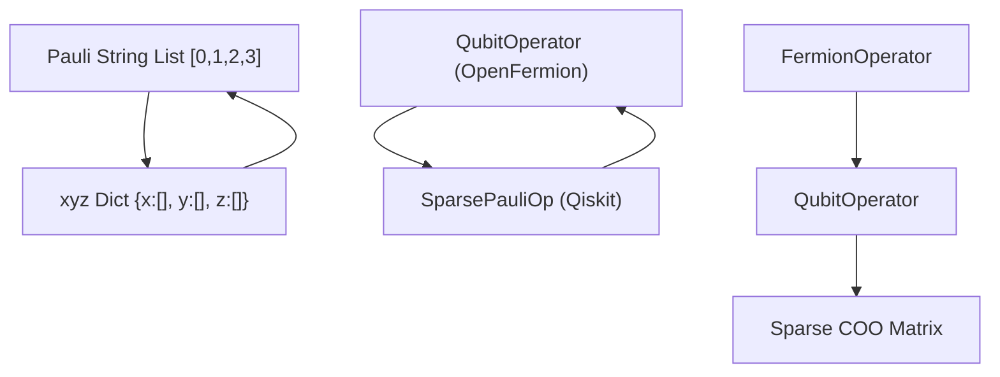
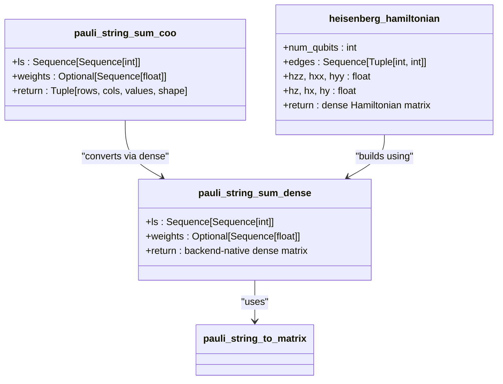
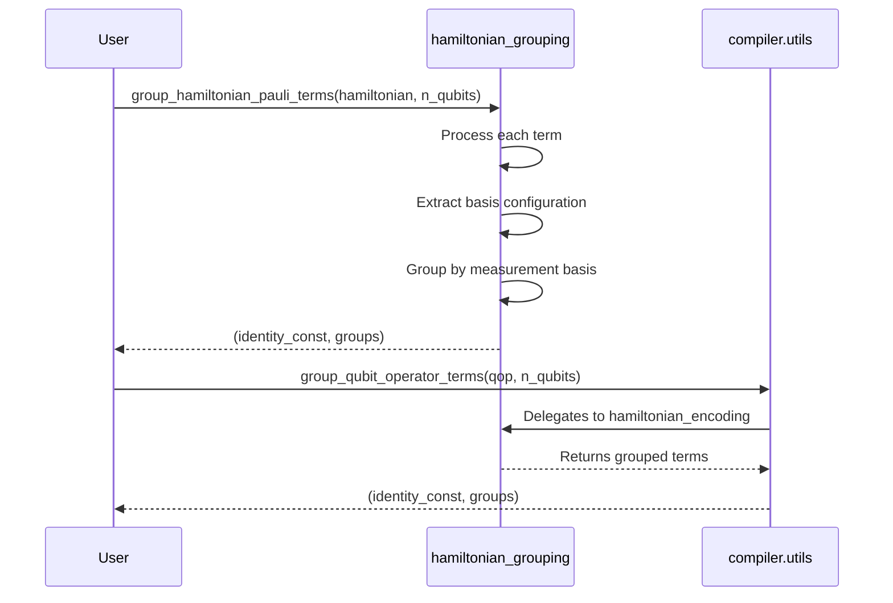
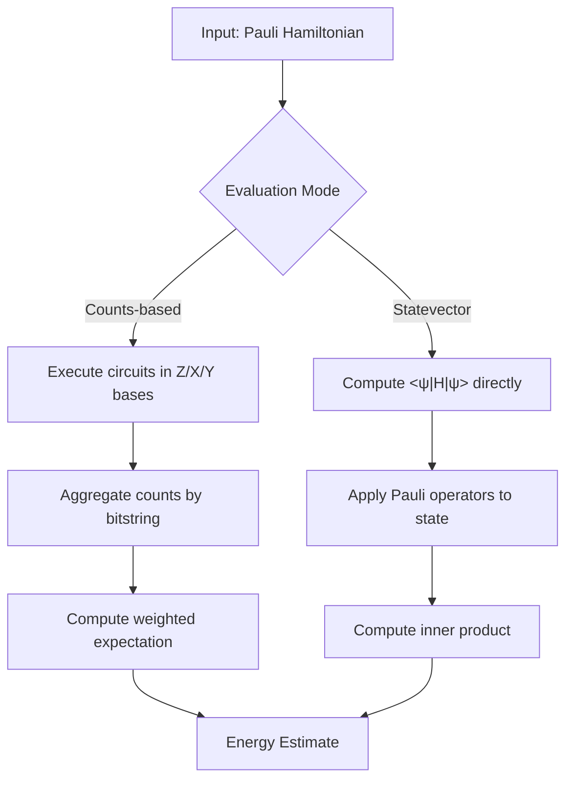
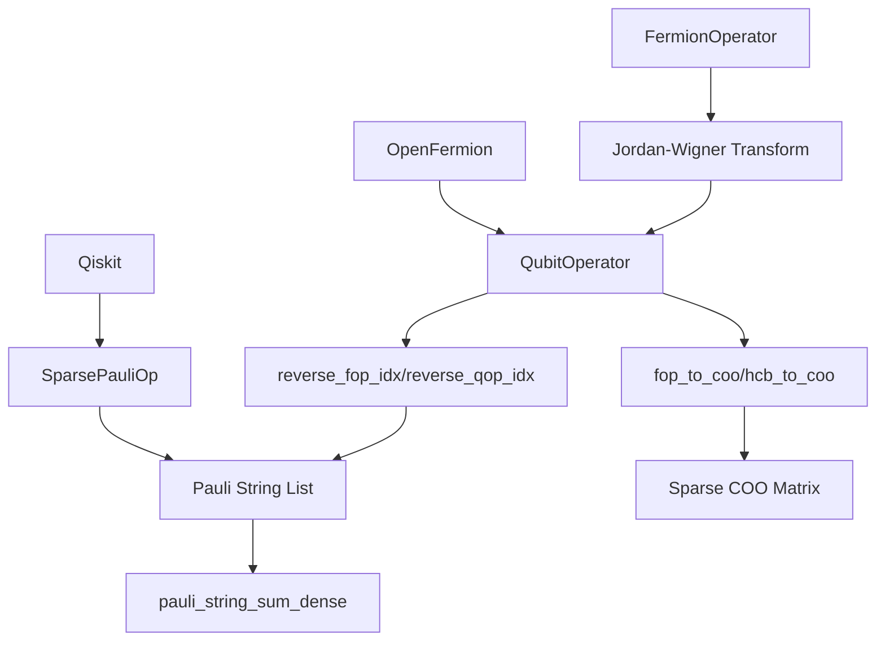
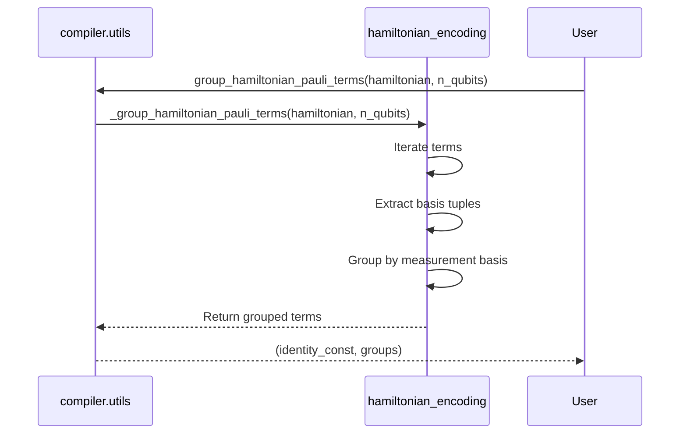
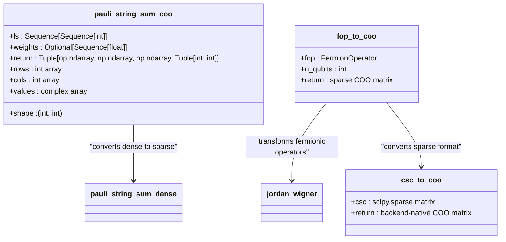
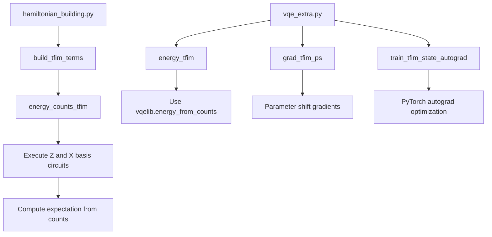

# Pauli Operator Kernels

<cite>
**Referenced Files in This Document**   
- [pauli.py](file://src/tyxonq/libs/quantum_library/kernels/pauli.py)
- [pauli_io.py](file://src/tyxonq/libs/hamiltonian_encoding/pauli_io.py)
- [hamiltonian_grouping.py](file://src/tyxonq/compiler/utils/hamiltonian_grouping.py)
- [hamiltonian_building.py](file://examples/hamiltonian_building.py)
- [vqe_extra.py](file://examples/vqe_extra.py)
</cite>

## Table of Contents
1. [Introduction](#introduction)
2. [Pauli Word Manipulation](#pauli-word-manipulation)
3. [Hamiltonian Construction and Representation](#hamiltonian-construction-and-representation)
4. [Commutator and Grouping Operations](#commutator-and-grouping-operations)
5. [Expectation Value Estimation](#expectation-value-estimation)
6. [Integration with Hamiltonian Encoding](#integration-with-hamiltonian-encoding)
7. [Measurement Grouping in Compiler Pipeline](#measurement-grouping-in-compiler-pipeline)
8. [Sparse Pauli Sum Support](#sparse-pauli-sum-support)
9. [Performance Considerations](#performance-considerations)
10. [Example Applications](#example-applications)
11. [Backend-Optimized Tensor Contractions](#backend-optimized-tensor-contractions)

## Introduction
The Pauli operator kernel module in TyxonQ provides essential functionality for quantum observable manipulation, particularly in variational algorithms like VQE and QAOA. This documentation details the core APIs for Pauli word operations, Hamiltonian decomposition, and expectation value computation. The module supports both dense and sparse representations, integrates with Hamiltonian encoding workflows, and enables efficient measurement grouping through compiler-level optimizations. Key components include binary symplectic representation utilities, sparse COO format conversion, and backend-agnostic numeric operations.

## Pauli Word Manipulation
The Pauli kernel provides bidirectional conversion between different Pauli string representations, enabling flexible manipulation of quantum operators.

**Diagram sources**
- [pauli.py](file://src/tyxonq/libs/quantum_library/kernels/pauli.py#L17-L49)
- [pauli_io.py](file://src/tyxonq/libs/hamiltonian_encoding/pauli_io.py#L75-L83)

The `ps2xyz` and `xyz2ps` functions enable conversion between integer-encoded Pauli strings and dictionary-based XYZ index mappings. This facilitates efficient indexing and filtering operations on Pauli terms. The binary symplectic representation is implicitly supported through these transformations, where X and Z components are separated into distinct index lists.

**Section sources**
- [pauli.py](file://src/tyxonq/libs/quantum_library/kernels/pauli.py#L17-L49)

## Hamiltonian Construction and Representation
The module provides multiple pathways for constructing and representing Hamiltonians, from explicit Pauli sums to dense matrix forms.

**Diagram sources**
- [pauli.py](file://src/tyxonq/libs/quantum_library/kernels/pauli.py#L73-L117)

The `pauli_string_sum_dense` function constructs a full-rank Hamiltonian matrix from a list of Pauli strings using Kronecker products and backend-native operations. For sparse representations, `pauli_string_sum_coo` returns coordinate format data suitable for large-scale simulations. The `heisenberg_hamiltonian` utility builds spin models from edge lists and coupling parameters, demonstrating domain-specific application of Pauli arithmetic.

**Section sources**
- [pauli.py](file://src/tyxonq/libs/quantum_library/kernels/pauli.py#L73-L117)

## Commutator and Grouping Operations
Pauli term grouping is essential for reducing measurement overhead in variational algorithms. The kernel provides interfaces for grouping commuting terms.

**Diagram sources**
- [hamiltonian_grouping.py](file://src/tyxonq/libs/hamiltonian_encoding/hamiltonian_grouping.py#L47-L65)
- [hamiltonian_grouping.py](file://src/tyxonq/compiler/utils/hamiltonian_grouping.py#L19-L20)

The `group_hamiltonian_pauli_terms` function partitions a Hamiltonian into measurement-compatible groups based on shared Pauli bases. This enables simultaneous measurement of commuting terms, significantly reducing circuit executions. The grouping algorithm uses tuple-based basis keys (e.g., ("Z","Z","X")) to hash and collect compatible terms.

**Section sources**
- [hamiltonian_grouping.py](file://src/tyxonq/libs/hamiltonian_encoding/hamiltonian_grouping.py#L47-L65)
- [hamiltonian_grouping.py](file://src/tyxonq/compiler/utils/hamiltonian_grouping.py#L19-L20)

## Expectation Value Estimation
The kernel supports multiple methods for estimating observable expectations, from shot-based sampling to exact statevector computation.

**Diagram sources**
- [hamiltonian_building.py](file://examples/hamiltonian_building.py#L50-L76)
- [vqe_extra.py](file://examples/vqe_extra.py#L38-L47)

The expectation value estimation workflow involves either physical measurement (via counts) or numerical simulation (via statevector). In the counts-based approach, separate circuits are executed for each measurement basis (Z, X via H, Y via S†H). The statevector method computes expectations directly through tensor contractions, enabling gradient computation via autograd.

**Section sources**
- [hamiltonian_building.py](file://examples/hamiltonian_building.py#L50-L76)
- [vqe_extra.py](file://examples/vqe_extra.py#L38-L47)

## Integration with Hamiltonian Encoding
The Pauli kernel integrates with the Hamiltonian encoding module for cross-framework operator translation and preprocessing.

**Diagram sources**
- [pauli_io.py](file://src/tyxonq/libs/hamiltonian_encoding/pauli_io.py#L61-L72)
- [pauli.py](file://src/tyxonq/libs/quantum_library/kernels/pauli.py#L73-L86)

The `fop_to_coo` and `hcb_to_coo` functions convert FermionOperator and QubitOperator instances to sparse COO matrices through Jordan-Wigner transformation and index reversal. The `qop_to_qiskit` utility enables interoperability with Qiskit's SparsePauliOp format, facilitating hybrid workflows.

**Section sources**
- [pauli_io.py](file://src/tyxonq/libs/hamiltonian_encoding/pauli_io.py#L61-L83)

## Measurement Grouping in Compiler Pipeline
The compiler's measurement grouping utilities leverage Pauli kernel functions to optimize observable evaluation.

**Diagram sources**
- [hamiltonian_grouping.py](file://src/tyxonq/compiler/utils/hamiltonian_grouping.py#L19-L20)
- [hamiltonian_grouping.py](file://src/tyxonq/libs/hamiltonian_encoding/hamiltonian_grouping.py#L47-L65)

The compiler pipeline exposes grouping functionality through a thin wrapper that delegates to the core Hamiltonian encoding implementation. This separation allows backend-specific optimizations while maintaining a consistent API for measurement reduction.

**Section sources**
- [hamiltonian_grouping.py](file://src/tyxonq/compiler/utils/hamiltonian_grouping.py#L15-L20)

## Sparse Pauli Sum Support
For large-scale Hamiltonians, the kernel provides sparse representations to manage memory and computational complexity.

**Diagram sources**
- [pauli.py](file://src/tyxonq/libs/quantum_library/kernels/pauli.py#L97-L117)
- [pauli_io.py](file://src/tyxonq/libs/hamiltonian_encoding/pauli_io.py#L61-L65)

The `pauli_string_sum_coo` function generates sparse coordinate format data from Pauli strings, while `fop_to_coo` and `hcb_to_coo` provide direct conversion from quantum chemistry operators. These functions support large Hamiltonians by avoiding full matrix materialization.

**Section sources**
- [pauli.py](file://src/tyxonq/libs/quantum_library/kernels/pauli.py#L97-L117)
- [pauli_io.py](file://src/tyxonq/libs/hamiltonian_encoding/pauli_io.py#L61-L72)

## Performance Considerations
The Pauli kernel is optimized for both small-scale dense operations and large-scale sparse computations.

For small systems (n < 16), dense Hamiltonian construction via `pauli_string_sum_dense` is efficient and enables exact diagonalization. For larger systems, sparse representations (`pauli_string_sum_coo`) prevent memory explosion. The grouping functions minimize measurement circuits by maximizing simultaneous observables.

Backend-optimized tensor contractions are achieved through the `NumericBackend` abstraction, which dispatches to NumPy, CuPy, or PyTorch based on configuration. The `get_fermion_phase` function uses bit-level parallelism for efficient phase calculation in fermionic simulations.

**Section sources**
- [pauli.py](file://src/tyxonq/libs/quantum_library/kernels/pauli.py#L73-L117)
- [pauli_io.py](file://src/tyxonq/libs/hamiltonian_encoding/pauli_io.py#L168-L205)

## Example Applications
The examples demonstrate practical usage of Pauli kernel functionality in quantum algorithms.

**Diagram sources**
- [hamiltonian_building.py](file://examples/hamiltonian_building.py#L17-L27)
- [vqe_extra.py](file://examples/vqe_extra.py#L38-L65)

The `hamiltonian_building.py` example constructs a transverse field Ising model and estimates energy via measurement counts. The `vqe_extra.py` example implements a full VQE workflow with parameter-shift gradients and PyTorch-based autodifferentiation, showcasing the integration between Pauli operations and machine learning frameworks.

**Section sources**
- [hamiltonian_building.py](file://examples/hamiltonian_building.py#L17-L76)
- [vqe_extra.py](file://examples/vqe_extra.py#L38-L65)

## Backend-Optimized Tensor Contractions
The Pauli kernel leverages TyxonQ's numeric backend system for optimized tensor operations.

All matrix constructions and Kronecker products use the `NumericBackend` interface, enabling execution on CPU (NumPy), GPU (CuPy), or PyTorch tensors. The `nb.kron` operation is optimized for the selected backend, and memory layout considerations are handled automatically. This allows seamless scaling from small test cases to large production simulations without code changes.

**Section sources**
- [pauli.py](file://src/tyxonq/libs/quantum_library/kernels/pauli.py#L64-L70)
- [vqe_extra.py](file://examples/vqe_extra.py#L133-L167)