# Quantum Library Kernels

<cite>
**Referenced Files in This Document**   
- [statevector.py](file://src/tyxonq/libs/quantum_library/kernels/statevector.py)
- [density_matrix.py](file://src/tyxonq/libs/quantum_library/kernels/density_matrix.py)
- [matrix_product_state.py](file://src/tyxonq/libs/quantum_library/kernels/matrix_product_state.py)
- [unitary.py](file://src/tyxonq/libs/quantum_library/kernels/unitary.py)
- [pauli.py](file://src/tyxonq/libs/quantum_library/kernels/pauli.py)
- [gates.py](file://src/tyxonq/libs/quantum_library/kernels/gates.py)
- [common.py](file://src/tyxonq/libs/quantum_library/kernels/common.py)
- [timeevolution_trotter.py](file://examples/timeevolution_trotter.py)
- [sample_value_gradient.py](file://examples/sample_value_gradient.py)
</cite>

## Table of Contents
1. [Introduction](#introduction)
2. [Project Structure](#project-structure)
3. [Core Components](#core-components)
4. [Architecture Overview](#architecture-overview)
5. [Detailed Component Analysis](#detailed-component-analysis)
6. [Dependency Analysis](#dependency-analysis)
7. [Performance Considerations](#performance-considerations)
8. [Troubleshooting Guide](#troubleshooting-guide)
9. [Conclusion](#conclusion)

## Introduction
This document provides comprehensive API documentation for the quantum simulation kernels in TyxonQ, focusing on state representations (statevector, density matrix, matrix product state), unitary operations, Pauli algebra, and supporting utilities. The kernels are designed for integration with multiple numerical backends (NumPy, PyTorch, CuPyNumeric) and are used within device simulators for quantum circuit execution. Practical examples demonstrate time evolution and gradient computation workflows.

## Project Structure
The quantum library kernels reside in `src/tyxonq/libs/quantum_library/kernels/` and provide low-level computational primitives for quantum state manipulation. These modules are utilized by higher-level simulators in `src/tyxonq/devices/simulators/` and application examples in the `examples/` directory.

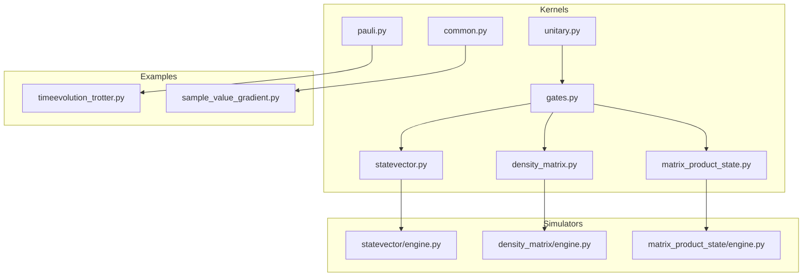

**Diagram sources**
- [statevector.py](file://src/tyxonq/libs/quantum_library/kernels/statevector.py)
- [density_matrix.py](file://src/tyxonq/libs/quantum_library/kernels/density_matrix.py)
- [matrix_product_state.py](file://src/tyxonq/libs/quantum_library/kernels/matrix_product_state.py)
- [unitary.py](file://src/tyxonq/libs/quantum_library/kernels/unitary.py)
- [pauli.py](file://src/tyxonq/libs/quantum_library/kernels/pauli.py)
- [gates.py](file://src/tyxonq/libs/quantum_library/kernels/gates.py)
- [common.py](file://src/tyxonq/libs/quantum_library/kernels/common.py)
- [timeevolution_trotter.py](file://examples/timeevolution_trotter.py)
- [sample_value_gradient.py](file://examples/sample_value_gradient.py)

**Section sources**
- [statevector.py](file://src/tyxonq/libs/quantum_library/kernels/statevector.py)
- [density_matrix.py](file://src/tyxonq/libs/quantum_library/kernels/density_matrix.py)
- [matrix_product_state.py](file://src/tyxonq/libs/quantum_library/kernels/matrix_product_state.py)
- [unitary.py](file://src/tyxonq/libs/quantum_library/kernels/unitary.py)
- [pauli.py](file://src/tyxonq/libs/quantum_library/kernels/pauli.py)
- [gates.py](file://src/tyxonq/libs/quantum_library/kernels/gates.py)
- [common.py](file://src/tyxonq/libs/quantum_library/kernels/common.py)
- [timeevolution_trotter.py](file://examples/timeevolution_trotter.py)
- [sample_value_gradient.py](file://examples/sample_value_gradient.py)

## Core Components
The quantum library kernels provide five core state representations: statevector, density matrix, matrix product state (MPS), unitary, and Pauli operators. These are supported by common utilities and gate operations that enable quantum circuit simulation across different numerical backends.

**Section sources**
- [statevector.py](file://src/tyxonq/libs/quantum_library/kernels/statevector.py)
- [density_matrix.py](file://src/tyxonq/libs/quantum_library/kernels/density_matrix.py)
- [matrix_product_state.py](file://src/tyxonq/libs/quantum_library/kernels/matrix_product_state.py)
- [unitary.py](file://src/tyxonq/libs/quantum_library/kernels/unitary.py)
- [pauli.py](file://src/tyxonq/libs/quantum_library/kernels/pauli.py)

## Architecture Overview
The quantum library architecture follows a modular design where each kernel provides state-specific operations that can be integrated with any supported numerical backend. The system enables both exact simulation (statevector, density matrix) and approximate compressed-state simulation (MPS).

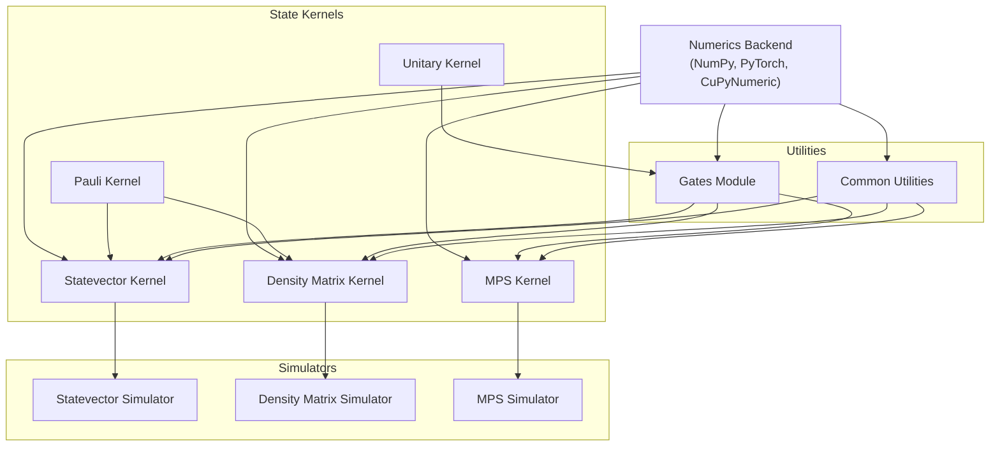

**Diagram sources**
- [statevector.py](file://src/tyxonq/libs/quantum_library/kernels/statevector.py)
- [density_matrix.py](file://src/tyxonq/libs/quantum_library/kernels/density_matrix.py)
- [matrix_product_state.py](file://src/tyxonq/libs/quantum_library/kernels/matrix_product_state.py)
- [unitary.py](file://src/tyxonq/libs/quantum_library/kernels/unitary.py)
- [pauli.py](file://src/tyxonq/libs/quantum_library/kernels/pauli.py)
- [gates.py](file://src/tyxonq/libs/quantum_library/kernels/gates.py)
- [common.py](file://src/tyxonq/libs/quantum_library/kernels/common.py)

## Detailed Component Analysis

### Statevector Kernel Analysis
The statevector kernel provides functions for initializing and manipulating pure quantum states using the full statevector representation.

#### Statevector Class Diagram
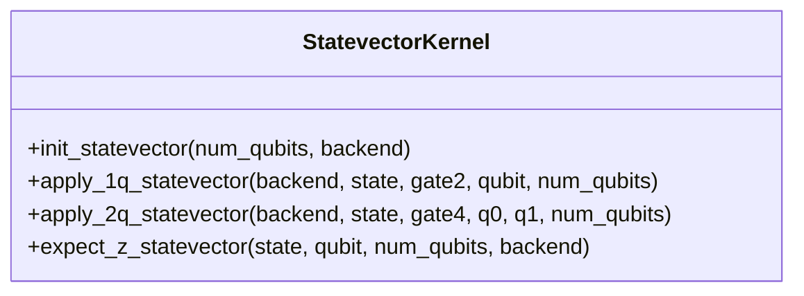

**Diagram sources**
- [statevector.py](file://src/tyxonq/libs/quantum_library/kernels/statevector.py#L8-L53)

#### Statevector Operation Sequence
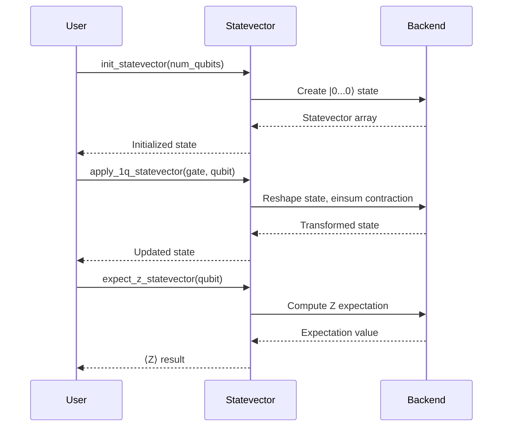

**Diagram sources**
- [statevector.py](file://src/tyxonq/libs/quantum_library/kernels/statevector.py#L8-L53)

**Section sources**
- [statevector.py](file://src/tyxonq/libs/quantum_library/kernels/statevector.py#L8-L53)

### Density Matrix Kernel Analysis
The density matrix kernel provides functions for initializing and manipulating mixed quantum states using the density matrix representation.

#### Density Matrix Class Diagram
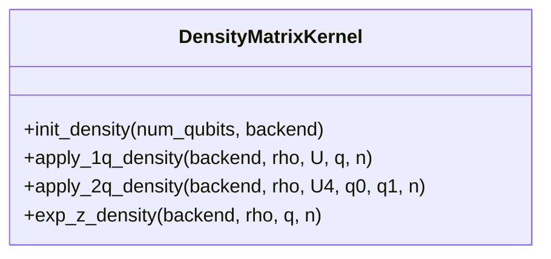

**Diagram sources**
- [density_matrix.py](file://src/tyxonq/libs/quantum_library/kernels/density_matrix.py#L8-L72)

#### Density Matrix Operation Flow
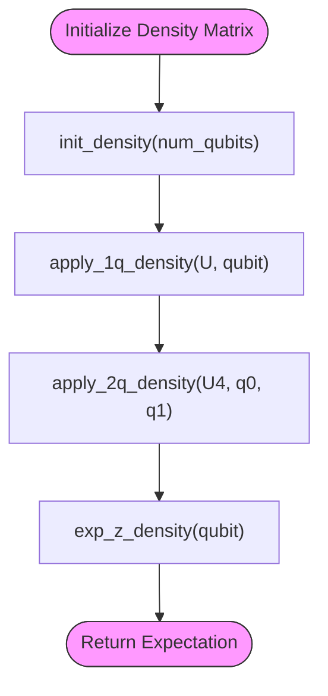

**Diagram sources**
- [density_matrix.py](file://src/tyxonq/libs/quantum_library/kernels/density_matrix.py#L8-L72)

**Section sources**
- [density_matrix.py](file://src/tyxonq/libs/quantum_library/kernels/density_matrix.py#L8-L72)

### Matrix Product State Kernel Analysis
The MPS kernel provides a compressed-state representation for efficient simulation of certain quantum states, particularly useful for 1D systems.

#### MPS Class Structure
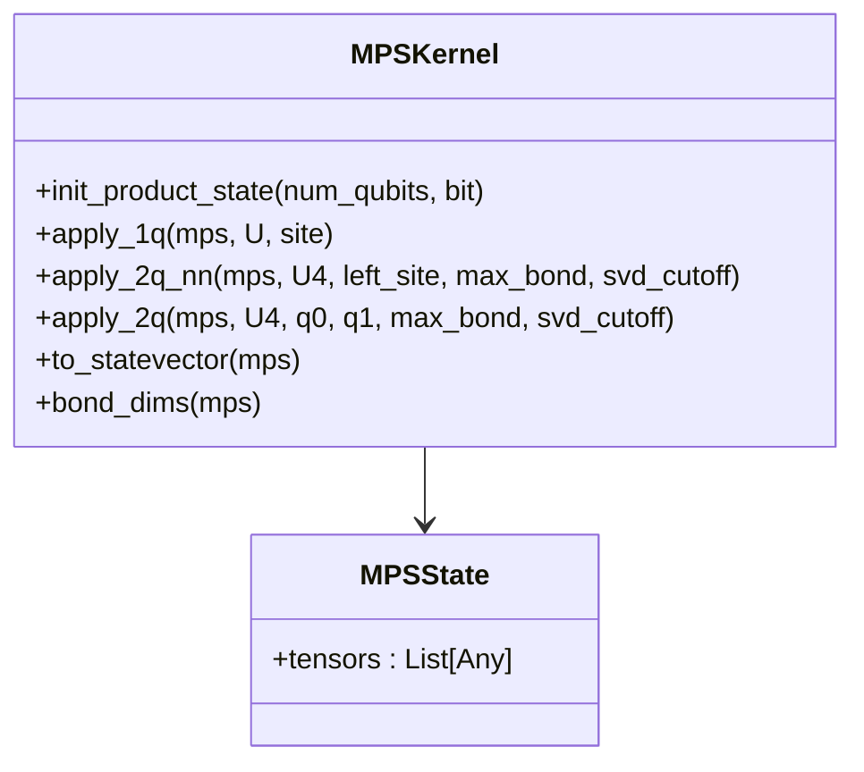

**Diagram sources**
- [matrix_product_state.py](file://src/tyxonq/libs/quantum_library/kernels/matrix_product_state.py#L36-L223)

#### MPS Two-Qubit Gate Flow
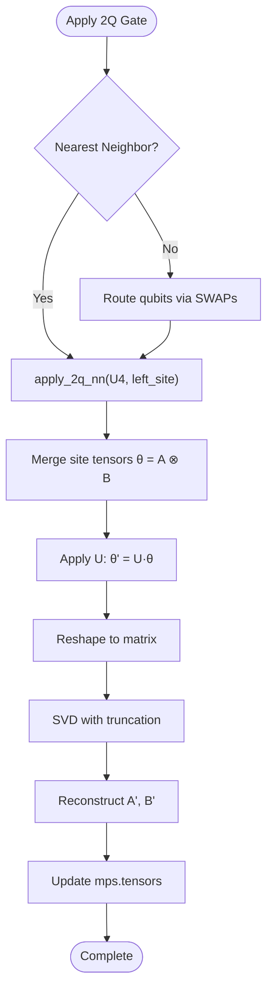

**Diagram sources**
- [matrix_product_state.py](file://src/tyxonq/libs/quantum_library/kernels/matrix_product_state.py#L101-L148)

**Section sources**
- [matrix_product_state.py](file://src/tyxonq/libs/quantum_library/kernels/matrix_product_state.py#L36-L223)

### Unitary and Pauli Kernels Analysis
The unitary and Pauli kernels provide gate definitions and Pauli algebra operations for quantum circuit construction and Hamiltonian simulation.

#### Unitary and Pauli Functionality
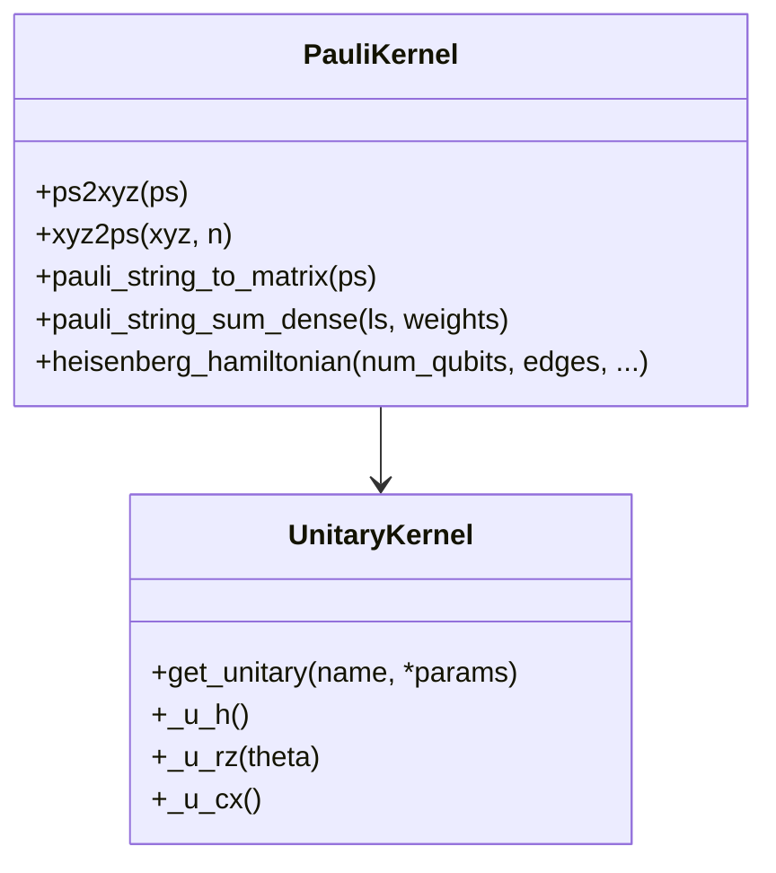

**Diagram sources**
- [unitary.py](file://src/tyxonq/libs/quantum_library/kernels/unitary.py#L8-L82)
- [pauli.py](file://src/tyxonq/libs/quantum_library/kernels/pauli.py#L8-L174)

**Section sources**
- [unitary.py](file://src/tyxonq/libs/quantum_library/kernels/unitary.py#L8-L82)
- [pauli.py](file://src/tyxonq/libs/quantum_library/kernels/pauli.py#L8-L174)

### Gates and Common Utilities Analysis
The gates and common modules provide gate matrix implementations and shared utilities for quantum simulation.

#### Gates Module Structure
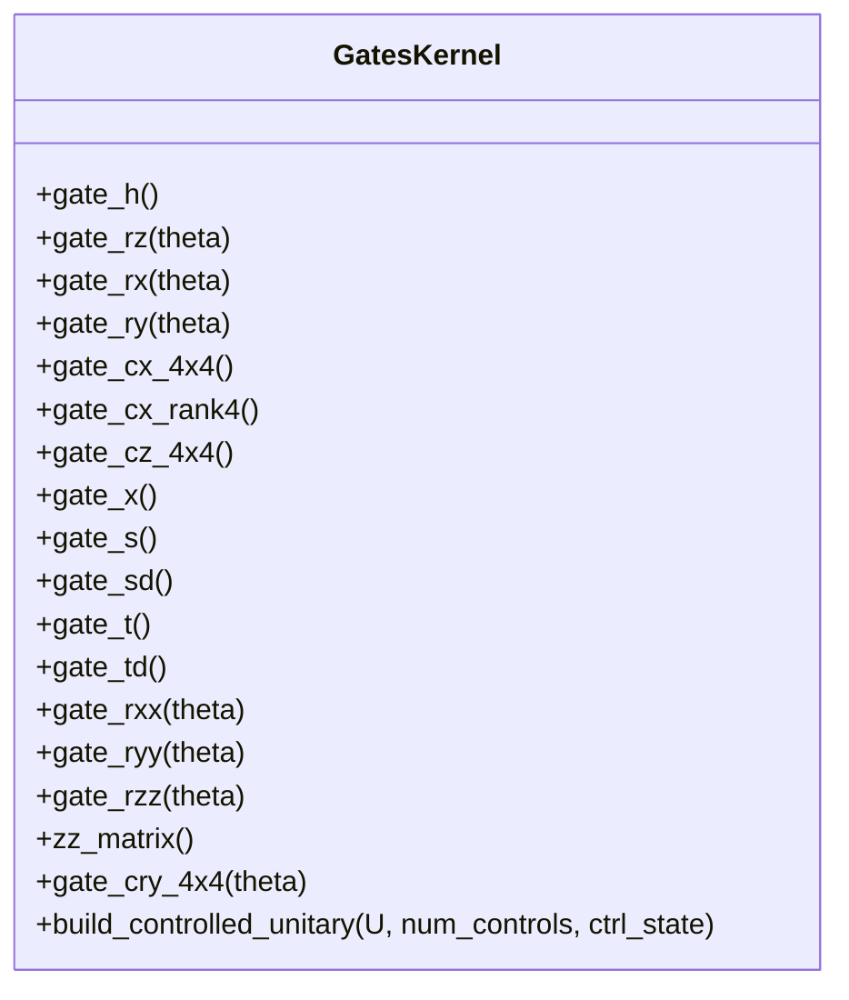

**Diagram sources**
- [gates.py](file://src/tyxonq/libs/quantum_library/kernels/gates.py#L8-L205)

#### Common Utilities Flow
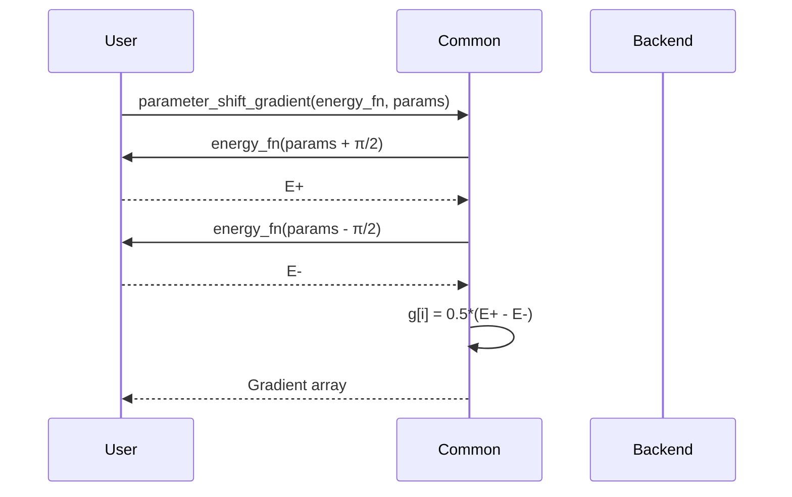

**Diagram sources**
- [common.py](file://src/tyxonq/libs/quantum_library/kernels/common.py#L8-L26)

**Section sources**
- [gates.py](file://src/tyxonq/libs/quantum_library/kernels/gates.py#L8-L205)
- [common.py](file://src/tyxonq/libs/quantum_library/kernels/common.py#L8-L26)

## Dependency Analysis
The quantum library kernels have a layered dependency structure where higher-level operations depend on lower-level primitives and the numerical backend abstraction.

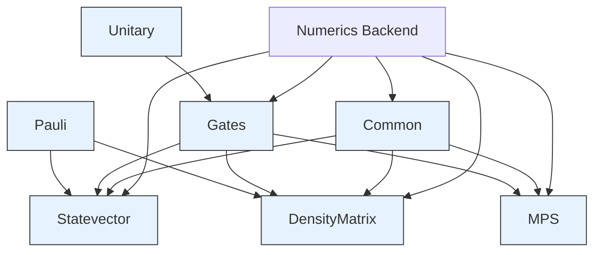

**Diagram sources**
- [statevector.py](file://src/tyxonq/libs/quantum_library/kernels/statevector.py)
- [density_matrix.py](file://src/tyxonq/libs/quantum_library/kernels/density_matrix.py)
- [matrix_product_state.py](file://src/tyxonq/libs/quantum_library/kernels/matrix_product_state.py)
- [unitary.py](file://src/tyxonq/libs/quantum_library/kernels/unitary.py)
- [pauli.py](file://src/tyxonq/libs/quantum_library/kernels/pauli.py)
- [gates.py](file://src/tyxonq/libs/quantum_library/kernels/gates.py)
- [common.py](file://src/tyxonq/libs/quantum_library/kernels/common.py)

**Section sources**
- [statevector.py](file://src/tyxonq/libs/quantum_library/kernels/statevector.py)
- [density_matrix.py](file://src/tyxonq/libs/quantum_library/kernels/density_matrix.py)
- [matrix_product_state.py](file://src/tyxonq/libs/quantum_library/kernels/matrix_product_state.py)
- [unitary.py](file://src/tyxonq/libs/quantum_library/kernels/unitary.py)
- [pauli.py](file://src/tyxonq/libs/quantum_library/kernels/pauli.py)
- [gates.py](file://src/tyxonq/libs/quantum_library/kernels/gates.py)
- [common.py](file://src/tyxonq/libs/quantum_library/kernels/common.py)

## Performance Considerations
Different state representations have distinct performance characteristics:

- **Statevector**: O(2^N) memory, O(2^N) per gate operation for 1Q, O(4^N) for 2Q
- **Density Matrix**: O(4^N) memory, O(8^N) per gate operation
- **MPS**: O(d*D^2) memory where D is bond dimension, O(D^3) per NN 2Q gate
- **Backend Impact**: PyTorch enables GPU acceleration, CuPyNumeric provides distributed array support, NumPy is CPU-only

The choice of representation should consider system size, entanglement structure, and available hardware resources.

## Troubleshooting Guide
Common issues and solutions:

- **Memory exhaustion**: Use MPS representation for large 1D systems with limited entanglement
- **Numerical instability**: Ensure proper normalization of states; use svd_cutoff in MPS operations
- **Backend errors**: Verify backend compatibility; use set_backend() before kernel operations
- **Gate application errors**: Check qubit indices are within bounds; ensure proper gate matrix dimensions
- **Gradient noise**: Increase shot count in sampling-based gradient estimation

**Section sources**
- [statevector.py](file://src/tyxonq/libs/quantum_library/kernels/statevector.py)
- [density_matrix.py](file://src/tyxonq/libs/quantum_library/kernels/density_matrix.py)
- [matrix_product_state.py](file://src/tyxonq/libs/quantum_library/kernels/matrix_product_state.py)
- [common.py](file://src/tyxonq/libs/quantum_library/kernels/common.py)

## Conclusion
The TyxonQ quantum library kernels provide a comprehensive set of tools for quantum state simulation with support for multiple representations and numerical backends. The modular design enables efficient implementation of quantum algorithms while maintaining flexibility for different use cases. The integration of exact and approximate methods allows users to select the appropriate trade-off between accuracy and computational resources.