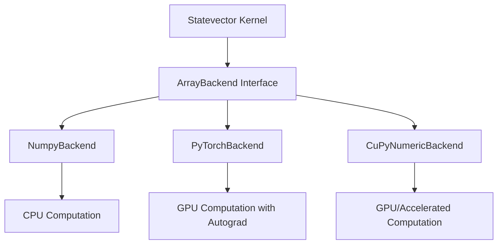
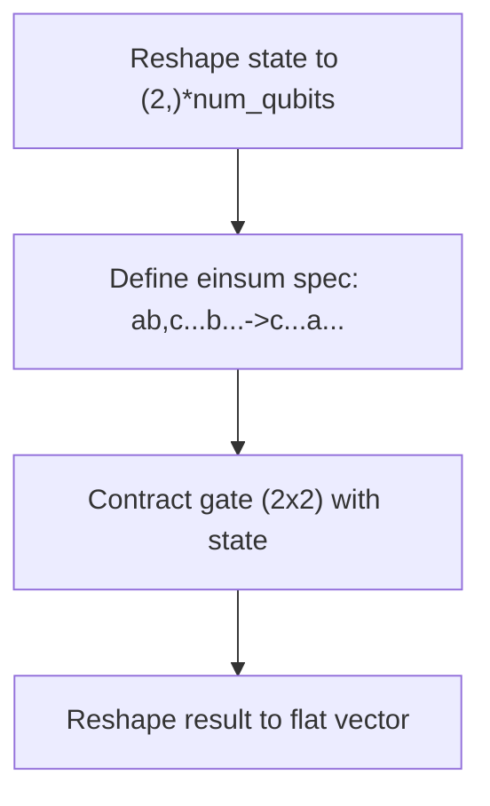
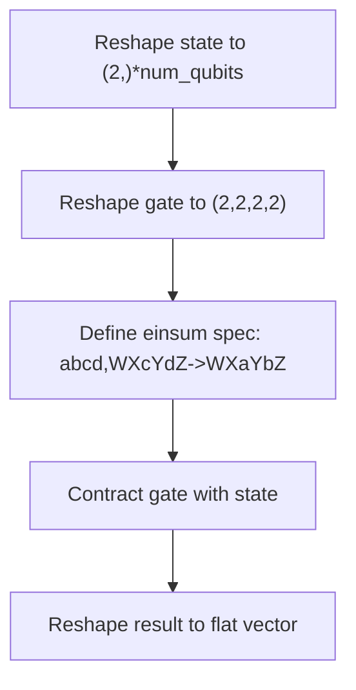

# Statevector Kernels

<cite>
**Referenced Files in This Document**   
- [statevector.py](file://src/tyxonq/libs/quantum_library/kernels/statevector.py)
- [timeevolution_trotter.py](file://examples/timeevolution_trotter.py)
- [sample_value_gradient.py](file://examples/sample_value_gradient.py)
- [numpy_backend.py](file://src/tyxonq/numerics/backends/numpy_backend.py)
- [pytorch_backend.py](file://src/tyxonq/numerics/backends/pytorch_backend.py)
- [cupynumeric_backend.py](file://src/tyxonq/numerics/backends/cupynumeric_backend.py)
</cite>

## Table of Contents
1. [Introduction](#introduction)
2. [Core Functions](#core-functions)
3. [Numerics Backend Integration](#numerics-backend-integration)
4. [Statevector Initialization](#statevector-initialization)
5. [Statevector Evolution](#statevector-evolution)
6. [Measurement and Expectation](#measurement-and-expectation)
7. [Overlap and Gradient Computation](#overlap-and-gradient-computation)
8. [Practical Usage Examples](#practical-usage-examples)
9. [Performance Considerations](#performance-considerations)
10. [Conclusion](#conclusion)

## Introduction
The Statevector kernel module in TyxonQ provides fundamental operations for quantum state simulation using full statevector representation. This document details the core functions responsible for statevector initialization, unitary evolution, measurement, and expectation value computation. The module integrates with multiple numerics backends (NumPy, PyTorch, CuPyNumeric) to support both CPU and GPU-accelerated simulations. The statevector simulator enables exact quantum dynamics simulation and is used in applications such as time evolution, variational algorithms, and gradient computation.

**Section sources**
- [statevector.py](file://src/tyxonq/libs/quantum_library/kernels/statevector.py#L1-L54)

## Core Functions
The Statevector kernel module exposes four primary functions for quantum state manipulation:

| Function | Purpose | Key Parameters |
|--------|--------|----------------|
| `init_statevector` | Initializes a quantum state in computational basis | `num_qubits`, `backend` |
| `apply_1q_statevector` | Applies a single-qubit gate to statevector | `state`, `gate2`, `qubit`, `num_qubits` |
| `apply_2q_statevector` | Applies a two-qubit gate to statevector | `state`, `gate4`, `q0`, `q1`, `num_qubits` |
| `expect_z_statevector` | Computes expectation of Pauli-Z on a qubit | `state`, `qubit`, `num_qubits`, `backend` |

These functions form the computational backbone for statevector-based quantum simulation in TyxonQ.

**Section sources**
- [statevector.py](file://src/tyxonq/libs/quantum_library/kernels/statevector.py#L8-L53)

## Numerics Backend Integration
The Statevector kernel seamlessly integrates with TyxonQ's numerics backend system, allowing execution on NumPy, PyTorch, or CuPyNumeric. The backend abstraction enables consistent API usage across different computational frameworks while leveraging their respective optimizations.

**Diagram sources**
- [statevector.py](file://src/tyxonq/libs/quantum_library/kernels/statevector.py#L1-L54)
- [numpy_backend.py](file://src/tyxonq/numerics/backends/numpy_backend.py#L1-L165)
- [pytorch_backend.py](file://src/tyxonq/numerics/backends/pytorch_backend.py#L1-L259)
- [cupynumeric_backend.py](file://src/tyxonq/numerics/backends/cupynumeric_backend.py#L1-L255)

**Section sources**
- [statevector.py](file://src/tyxonq/libs/quantum_library/kernels/statevector.py#L8-L53)
- [numpy_backend.py](file://src/tyxonq/numerics/backends/numpy_backend.py#L1-L165)
- [pytorch_backend.py](file://src/tyxonq/numerics/backends/pytorch_backend.py#L1-L259)
- [cupynumeric_backend.py](file://src/tyxonq/numerics/backends/cupynumeric_backend.py#L1-L255)

## Statevector Initialization
The `init_statevector` function creates a normalized quantum state vector in the computational basis |0⟩⊗n. For n qubits, it returns a complex vector of dimension 2^n with the first element set to 1.0+0.0j and all others to 0.0+0.0j.

**Memory Layout**: The statevector uses little-endian ordering where qubit 0 is the least significant bit. The k-th amplitude corresponds to the computational basis state |q_{n-1}...q_1q_0⟩ with k = Σ q_i·2^i.

**Numerical Stability**: The function ensures proper complex128 precision across all backends and handles edge cases (num_qubits ≤ 0) by returning a scalar state.

**Section sources**
- [statevector.py](file://src/tyxonq/libs/quantum_library/kernels/statevector.py#L8-L14)

## Statevector Evolution
Quantum gates are applied to the statevector through tensor contraction using Einstein summation (einsum). The kernel supports both single-qubit and two-qubit operations with optimized contraction patterns.

### Single-Qubit Gate Application

**Tensor Contraction Pattern**: For a single-qubit gate on qubit i, the einsum specification follows "ab,XYZ->XYZ" where the input axis for qubit i is replaced from 'b' to 'a' in the output.

### Two-Qubit Gate Application

**Tensor Contraction Pattern**: For two-qubit gates on qubits i and j, the einsum specification uses "abcd" for the gate and replaces the corresponding input axes with output axes 'a','b'.

**Numerical Considerations**: The implementation avoids explicit matrix construction of multi-qubit operators, reducing memory complexity from O(4^n) to O(2^n). Gate applications preserve unitarity through backend-specific complex arithmetic.

**Diagram sources**
- [statevector.py](file://src/tyxonq/libs/quantum_library/kernels/statevector.py#L17-L44)

**Section sources**
- [statevector.py](file://src/tyxonq/libs/quantum_library/kernels/statevector.py#L17-L44)

## Measurement and Expectation
The `expect_z_statevector` function computes the expectation value of Pauli-Z operator on a specified qubit. This is implemented through axis permutation and probability summation.

**Algorithm**:
1. Reshape state to tensor form (2,)*num_qubits
2. Move target qubit axis to front using moveaxis
3. Reshape to (2, -1) and compute |ψ|² for both basis states
4. Sum probabilities and return ⟨Z⟩ = P(0) - P(1)

**Performance**: The method avoids full state projection by working with marginal probabilities, reducing computational overhead. The operation is O(2^n) in time but benefits from backend-specific optimized reductions.

**Section sources**
- [statevector.py](file://src/tyxonq/libs/quantum_library/kernels/statevector.py#L47-L53)

## Overlap and Gradient Computation
While not directly implemented in the kernel, overlap and gradient computations are enabled through the combination of statevector operations and backend autograd capabilities. The PyTorch backend provides automatic differentiation via `value_and_grad`, enabling analytic gradient computation for variational circuits.

**Gradient Flow**:
- Parameter-shift gradients are computed using finite differences in the numerical backends
- PyTorch backend leverages autograd for efficient gradient computation
- CuPyNumeric and NumPy use finite-difference fallbacks

**Section sources**
- [pytorch_backend.py](file://src/tyxonq/numerics/backends/pytorch_backend.py#L1-L259)
- [numpy_backend.py](file://src/tyxonq/numerics/backends/numpy_backend.py#L1-L165)
- [cupynumeric_backend.py](file://src/tyxonq/numerics/backends/cupynumeric_backend.py#L1-L255)

## Practical Usage Examples
The Statevector kernel is used in various quantum simulation workflows as demonstrated in the example scripts.

### Time Evolution with Trotterization
The `timeevolution_trotter.py` example demonstrates Hamiltonian simulation using Trotter decomposition. The workflow:
1. Construct Pauli-term Hamiltonian
2. Build Trotterized circuit using `build_trotter_circuit`
3. Execute on statevector simulator with Z-basis measurements
4. Obtain exact expectation values

This pattern leverages the statevector kernel for precise time evolution without sampling noise.

### Gradient Computation in Variational Circuits
The `sample_value_gradient.py` example shows parameter-shift gradient computation for a variational quantum circuit. Key aspects:
- Uses statevector simulator for exact expectation evaluation
- Implements parameter-shift rule with ±π/2 shifts
- Compares with finite-difference gradients
- Demonstrates integration with PyTorch autograd when available

The example highlights the kernel's role in hybrid quantum-classical optimization.

**Section sources**
- [timeevolution_trotter.py](file://examples/timeevolution_trotter.py#L1-L58)
- [sample_value_gradient.py](file://examples/sample_value_gradient.py#L1-L169)

## Performance Considerations
Full statevector simulation has exponential memory and time complexity O(2^n) in the number of qubits n. The practical limits depend on backend and hardware:

| Backend | Memory Location | Max Qubits (16GB RAM) | Key Optimizations |
|--------|----------------|---------------------|------------------|
| NumPy | CPU | ~30 | Einsum optimization, vectorized operations |
| PyTorch | GPU | ~34 | GPU acceleration, autograd integration |
| CuPyNumeric | GPU/Accelerated | ~34 | Parallel execution, memory efficiency |

**Backend-Specific Optimizations**:
- **NumPy**: Leverages BLAS/LAPACK for einsum operations
- **PyTorch**: Enables GPU acceleration and JIT compilation via `torch.compile`
- **CuPyNumeric**: Provides GPU acceleration with NumPy-compatible API

**Memory Layout**: All backends maintain statevectors in contiguous memory with complex128 precision. The einsum-based gate application minimizes temporary memory allocation through optimized contraction paths.

For large Hilbert spaces, consider using matrix product state (MPS) or other approximate simulators instead of full statevector simulation.

**Section sources**
- [statevector.py](file://src/tyxonq/libs/quantum_library/kernels/statevector.py#L1-L54)
- [numpy_backend.py](file://src/tyxonq/numerics/backends/numpy_backend.py#L1-L165)
- [pytorch_backend.py](file://src/tyxonq/numerics/backends/pytorch_backend.py#L1-L259)
- [cupynumeric_backend.py](file://src/tyxonq/numerics/backends/cupynumeric_backend.py#L1-L255)

## Conclusion
The Statevector kernel module provides essential functionality for exact quantum state simulation in TyxonQ. Its backend-agnostic design enables flexible deployment across CPU and GPU platforms while maintaining a consistent API. The einsum-based tensor contraction approach ensures efficient gate application and numerical stability. When combined with the numerics backend system, the kernel supports both simulation and gradient computation for variational quantum algorithms. For applications requiring exact results without sampling noise, the statevector simulator remains the method of choice, though users should be mindful of the exponential resource scaling with qubit count.