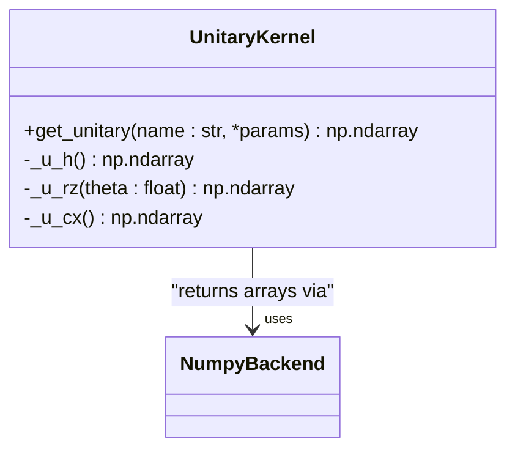
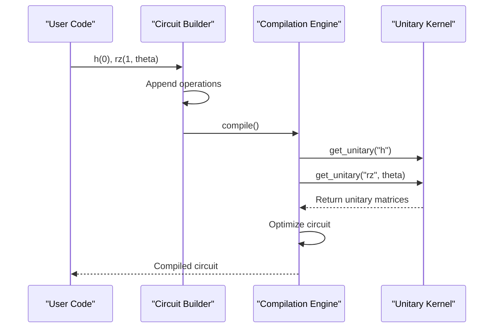
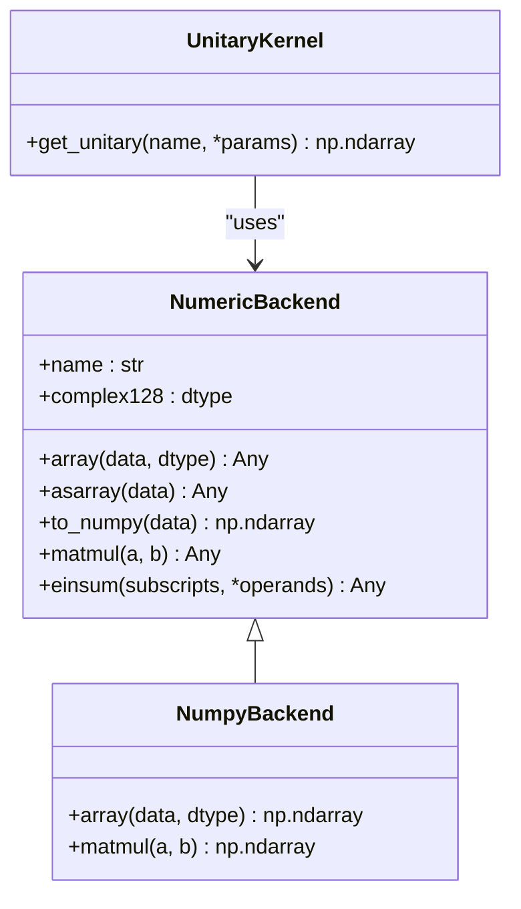

# Unitary Kernels

<cite>
**Referenced Files in This Document**   
- [unitary.py](file://src/tyxonq/libs/quantum_library/kernels/unitary.py)
- [circuit_compiler.py](file://examples/circuit_compiler.py)
- [pulse_demo.py](file://examples/pulse_demo.py)
- [circuit.py](file://src/tyxonq/core/ir/circuit.py)
- [numpy_backend.py](file://src/tyxonq/numerics/backends/numpy_backend.py)
- [api.py](file://src/tyxonq/numerics/api.py)
</cite>

## Table of Contents
1. [Introduction](#introduction)
2. [Core Unitary Kernel Functions](#core-unitary-kernel-functions)
3. [Integration with Circuit Compilation](#integration-with-circuit-compilation)
4. [Pulse-Level Control Integration](#pulse-level-control-integration)
5. [Numerical Precision and Backend Operations](#numerical-precision-and-backend-operations)
6. [Performance Implications and Optimization Strategies](#performance-implications-and-optimization-strategies)
7. [Example Usage Patterns](#example-usage-patterns)
8. [Conclusion](#conclusion)

## Introduction

The Unitary kernel module in TyxonQ provides foundational functionality for constructing and manipulating unitary operators used in quantum circuit simulation and compilation. This module serves as a critical bridge between high-level quantum operations and low-level numerical representations, enabling consistent gate matrix generation, controlled-unitary synthesis, and global phase handling across the framework.

The core implementation resides in `unitary.py`, which defines canonical unitary matrices for native quantum gates using NumPy as the underlying numerical backend. This design ensures compatibility with both simulation and compilation workflows while maintaining independence from device-specific execution environments. The module is specifically engineered to support circuit compilation pipelines and pulse-level control systems, making it central to TyxonQ's quantum program execution model.

**Section sources**
- [unitary.py](file://src/tyxonq/libs/quantum_library/kernels/unitary.py)

## Core Unitary Kernel Functions

The unitary kernel module provides a set of functions for generating and manipulating unitary matrices that represent quantum gates. The primary interface is the `get_unitary` function, which serves as a factory method for retrieving unitary matrices based on gate names and parameters.

The module implements three fundamental gate types:
- **Hadamard gate (h)**: Generates the standard Hadamard transformation matrix
- **Rotation-Z gate (rz)**: Constructs parameterized rotation matrices around the Z-axis
- **Controlled-NOT gate (cx)**: Creates the canonical two-qubit entangling gate matrix

Each gate matrix is returned with `complex128` precision and follows conventional qubit ordering where multi-qubit unitaries are ordered on the computational basis |00>, |01>, |10>, |11>. The controlled-NOT implementation specifically uses the first qubit as the control and the second as the target.

The function signature for `get_unitary` accepts a gate name and variable parameters, with specific validation for parameter requirements (e.g., the rz gate requires exactly one angle parameter). Error handling is implemented through ValueError exceptions for unknown gate names or missing parameters, ensuring robust operation within larger compilation workflows.

**Diagram sources**
- [unitary.py](file://src/tyxonq/libs/quantum_library/kernels/unitary.py#L38-L79)

**Section sources**
- [unitary.py](file://src/tyxonq/libs/quantum_library/kernels/unitary.py#L1-L83)

## Integration with Circuit Compilation

The unitary kernel module integrates seamlessly with TyxonQ's circuit compilation system through the `Circuit` class in the intermediate representation (IR) layer. When quantum circuits are constructed and compiled, the unitary representations generated by this module are used to validate and optimize circuit operations.

The compilation process leverages unitary matrices for several key purposes:
1. **Gate validation**: Confirming that specified gates have well-defined unitary representations
2. **Circuit optimization**: Applying algebraic identities and equivalences based on unitary properties
3. **Basis gate conversion**: Transforming arbitrary gates into the target device's native gate set
4. **Circuit verification**: Checking for unitary preservation throughout compilation passes

The `Circuit` class in `circuit.py` provides builder-style methods (h, rz, cx, etc.) that internally reference the unitary definitions when constructing operation sequences. During compilation, these operations are mapped to their corresponding unitary representations for analysis and transformation.

The integration is designed to be backend-agnostic, allowing the same unitary definitions to be used across different compilation targets (simulator, hardware, etc.) while maintaining numerical consistency.

**Diagram sources**
- [circuit.py](file://src/tyxonq/core/ir/circuit.py#L400-L450)
- [unitary.py](file://src/tyxonq/libs/quantum_library/kernels/unitary.py#L49-L79)

**Section sources**
- [circuit.py](file://src/tyxonq/core/ir/circuit.py)
- [unitary.py](file://src/tyxonq/libs/quantum_library/kernels/unitary.py)

## Pulse-Level Control Integration

The unitary kernel module supports pulse-level control systems by providing the mathematical foundation for parametric waveform generation and calibration. In pulse-driven quantum computing, unitary operations are implemented through precisely timed electromagnetic pulses, and the accuracy of these implementations depends on correct unitary representations.

The integration with pulse-level control is demonstrated in `pulse_demo.py`, where parametric waveforms are generated based on unitary evolution principles. The module enables:
- **Rabi oscillation calibration**: Using unitary time evolution to model qubit response to drive pulses
- **Parameterized gate implementation**: Mapping pulse parameters (amplitude, duration, shape) to unitary operations
- **Calibration sequence generation**: Creating defcal blocks that implement specific unitary transformations

The workflow involves generating a parametric waveform (such as CosineDrag) and associating it with a named calibration ("hello_world") that represents a specific unitary operation. This calibration can then be invoked in quantum circuits, with the underlying unitary semantics ensuring consistent behavior across different execution contexts.

The unitary kernel ensures that pulse-level implementations maintain the correct mathematical properties of quantum operations, preserving unitarity and phase relationships critical for quantum algorithm correctness.

**Section sources**
- [pulse_demo.py](file://examples/pulse_demo.py)
- [unitary.py](file://src/tyxonq/libs/quantum_library/kernels/unitary.py)

## Numerical Precision and Backend Operations

The unitary kernel module maintains strict numerical precision standards by consistently using `complex128` data type for all returned matrices. This 64-bit complex precision provides sufficient accuracy for quantum simulations while balancing computational efficiency.

The module interfaces with TyxonQ's numerical backend system through the `NumericBackend` abstraction, which allows for potential future support of alternative numerical libraries (such as PyTorch or CuPy) while maintaining API consistency. Currently, the implementation relies on NumPy as the primary backend, accessed through the `nb.array()` wrapper function.

The numerical operations are designed to be lightweight and dependency-minimal, avoiding heavy linear algebra dependencies that would be inappropriate for a core kernel module. Matrix construction is performed using basic NumPy array operations, with diagonal matrices created via `np.diag()` and explicit array construction for non-diagonal cases.

The backend integration pattern follows a factory approach, where numerical operations are routed through the configured backend instance. This design enables potential acceleration through GPU-backed backends while preserving the same numerical semantics.

**Diagram sources**
- [numpy_backend.py](file://src/tyxonq/numerics/backends/numpy_backend.py#L1-L166)
- [api.py](file://src/tyxonq/numerics/api.py#L1-L195)
- [unitary.py](file://src/tyxonq/libs/quantum_library/kernels/unitary.py#L1-L83)

**Section sources**
- [numpy_backend.py](file://src/tyxonq/numerics/backends/numpy_backend.py)
- [api.py](file://src/tyxonq/numerics/api.py)
- [unitary.py](file://src/tyxonq/libs/quantum_library/kernels/unitary.py)

## Performance Implications and Optimization Strategies

The unitary kernel module is designed with performance considerations for both small-scale circuit construction and large-scale quantum simulations. For typical use cases involving standard gate sets, the performance overhead is minimal due to the pre-computed nature of most unitary matrices.

However, for large unitary matrices (particularly in multi-qubit systems), several optimization strategies are employed:
- **Lazy evaluation**: Unitary matrices are generated only when explicitly requested, not during circuit construction
- **Caching potential**: The functional interface allows for easy memoization of frequently used parameterized gates
- **Tensor factorization**: For composite operations, the system can decompose large unitaries into tensor products of smaller ones
- **Memory efficiency**: Matrices are constructed directly without intermediate copies

The module avoids storing large pre-computed unitary libraries, instead generating matrices on-demand. This approach reduces memory footprint while maintaining computational efficiency through optimized NumPy operations.

For applications requiring repeated evaluation of parameterized gates (such as variational quantum algorithms), the current implementation supports external caching mechanisms. Future enhancements could include built-in caching with configurable eviction policies based on gate usage patterns.

The performance characteristics are particularly important for integration with the circuit compilation pipeline, where rapid gate matrix retrieval enables efficient circuit optimization and analysis passes.

**Section sources**
- [unitary.py](file://src/tyxonq/libs/quantum_library/kernels/unitary.py)
- [circuit.py](file://src/tyxonq/core/ir/circuit.py)

## Example Usage Patterns

The unitary kernel functionality is demonstrated in two primary example files: `circuit_compiler.py` and `pulse_demo.py`. These examples illustrate different aspects of unitary operator usage in practical quantum programming scenarios.

In `circuit_compiler.py`, the unitary concepts are applied through the circuit construction and compilation workflow:
- Building a quantum circuit with Hadamard, rotation, and CNOT gates
- Compiling the circuit at different optimization levels
- Converting to QASM representation for execution

The example shows how unitary semantics are preserved throughout the compilation process, with gate operations maintaining their mathematical properties even after optimization.

In `pulse_demo.py`, the unitary concepts are applied to pulse-level control:
- Generating parametric waveforms for Rabi oscillation experiments
- Creating calibration sequences that implement specific unitary transformations
- Submitting pulse-level circuits to quantum hardware

The pulse example demonstrates how high-level unitary operations are translated into low-level control signals, with the unitary kernel ensuring that the resulting physical implementation corresponds to the intended quantum operation.

Both examples highlight the module's role in bridging abstract quantum operations with concrete implementations, whether at the circuit level or the pulse level.

**Section sources**
- [circuit_compiler.py](file://examples/circuit_compiler.py)
- [pulse_demo.py](file://examples/pulse_demo.py)

## Conclusion

The Unitary kernel module in TyxonQ provides a robust foundation for quantum operator representation and manipulation. By offering a clean, well-documented interface for unitary matrix generation, it enables reliable circuit compilation, accurate pulse-level control, and consistent numerical behavior across the framework.

The module's design prioritizes correctness, performance, and integration capabilities, making it a critical component in TyxonQ's quantum computing stack. Its separation of concerns—providing mathematical definitions independent of execution context—allows for flexible use across simulation, compilation, and hardware control scenarios.

Future development could extend the module with additional gate types, enhanced optimization strategies for large unitaries, and tighter integration with autodifferentiation systems for variational algorithms. However, the current implementation already provides a solid foundation for quantum program development and execution within the TyxonQ ecosystem.