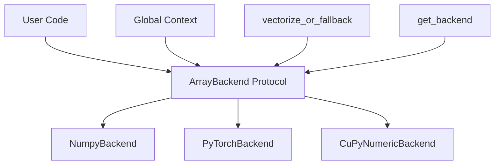
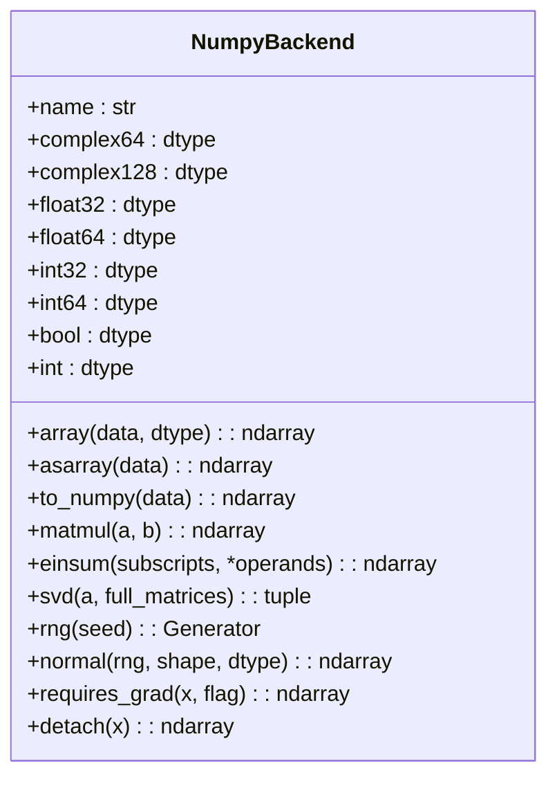
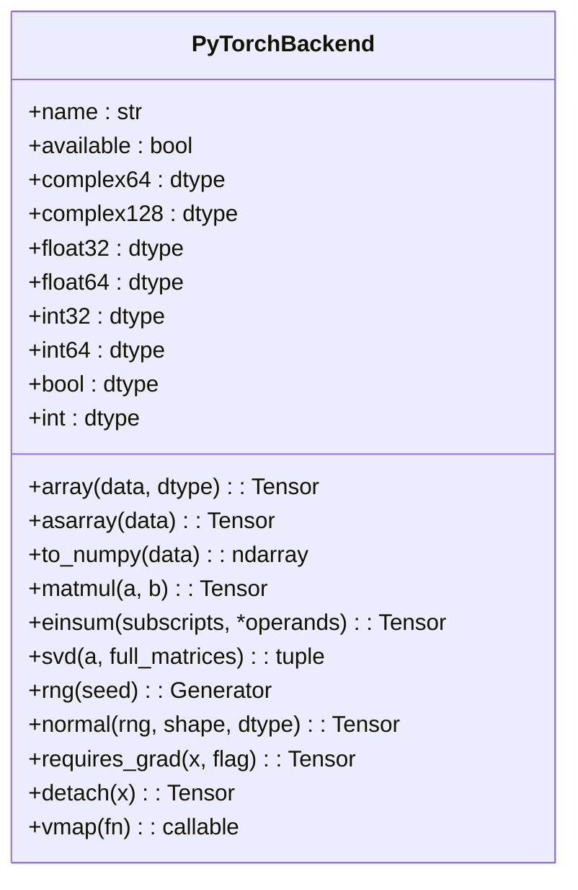
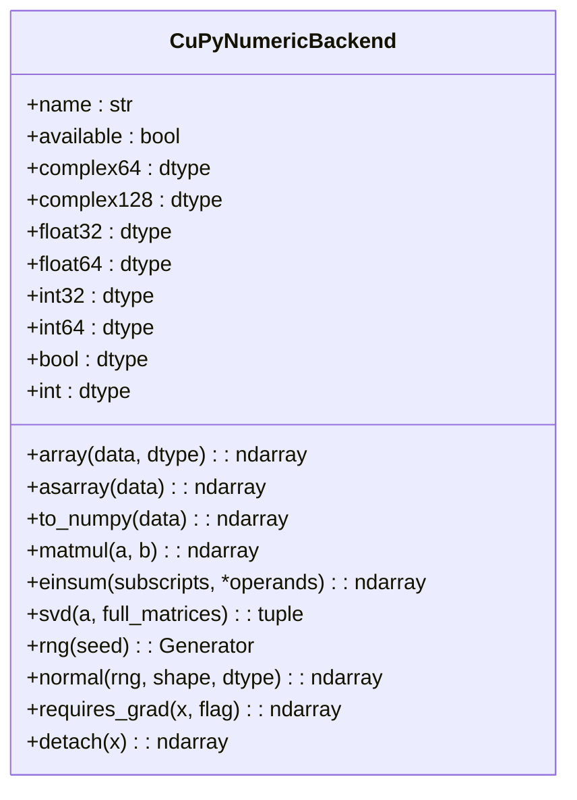
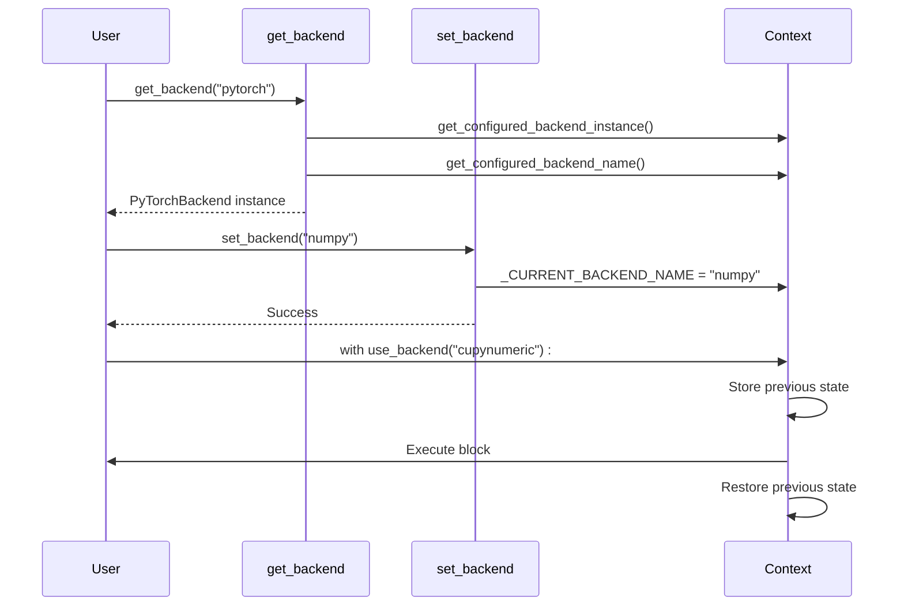
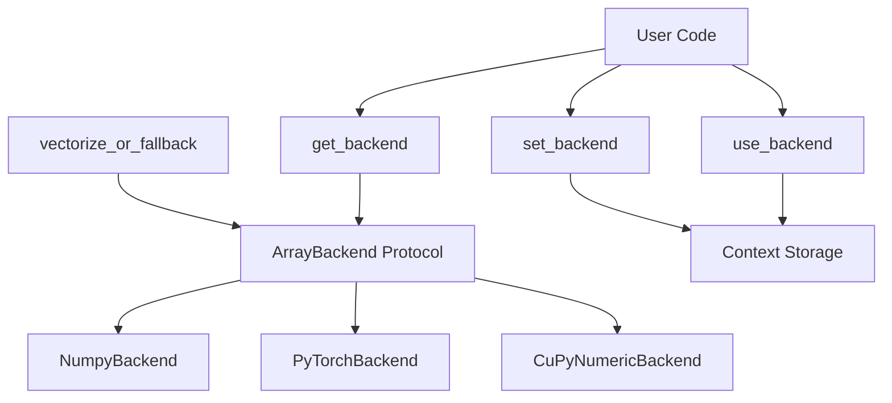

# ArrayBackend Protocol

<cite>
**Referenced Files in This Document**   
- [api.py](file://src/tyxonq/numerics/api.py)
- [numpy_backend.py](file://src/tyxonq/numerics/backends/numpy_backend.py)
- [pytorch_backend.py](file://src/tyxonq/numerics/backends/pytorch_backend.py)
- [cupynumeric_backend.py](file://src/tyxonq/numerics/backends/cupynumeric_backend.py)
- [context.py](file://src/tyxonq/numerics/context.py)
</cite>

## Table of Contents
1. [Introduction](#introduction)
2. [Core Components](#core-components)
3. [Architecture Overview](#architecture-overview)
4. [Detailed Component Analysis](#detailed-component-analysis)
5. [Dependency Analysis](#dependency-analysis)
6. [Performance Considerations](#performance-considerations)
7. [Troubleshooting Guide](#troubleshooting-guide)
8. [Conclusion](#conclusion)

## Introduction
The ArrayBackend Protocol is a foundational component of the TyxonQ framework, serving as a unified interface for numerical computation backends. It enables seamless integration and switching between different numerical libraries such as NumPy, PyTorch, and CuPyNumeric. By defining a consistent contract through Python's Protocol feature, it ensures that backend-specific implementations adhere to a standardized set of operations, promoting code reusability and maintainability across diverse computational environments.

**Section sources**
- [api.py](file://src/tyxonq/numerics/api.py#L18-L101)

## Core Components

The ArrayBackend Protocol defines a comprehensive set of required attributes, methods, and optional extensions that all numerical backends must implement. These components ensure consistent behavior across different numerical libraries while supporting advanced features like autodiff and vectorization.

### Required Attributes
- **name**: A string identifier for the backend (e.g., "numpy", "pytorch").
- **dtype constants**: Backend-specific data type tokens including `complex64`, `complex128`, `float32`, `float64`, `int32`, `int64`, `bool`, and `int`.

### Required Methods
#### Array Creation and Conversion
- `array(data, dtype)`: Creates an array from input data with optional dtype specification.
- `asarray(data)`: Converts input data into a backend-native array.
- `to_numpy(data)`: Converts backend-native arrays to NumPy ndarrays for interoperability.

#### Mathematical Operations
- `matmul(a, b)`: Performs matrix multiplication.
- `einsum(subscripts, *operands)`: Executes Einstein summation.
- `exp(a)`, `sin(a)`, `cos(a)`, `sqrt(a)`, `log(a)`, `log2(a)`: Elementary mathematical functions.

#### Linear Algebra
- `svd(a, full_matrices=False)`: Computes singular value decomposition.

#### Random Number Generation
- `rng(seed)`: Returns a random number generator handle.
- `normal(rng, shape, dtype)`: Generates normally distributed random values.

#### Autodiff Integration
- `requires_grad(x, flag=True)`: Marks tensors for gradient computation if supported.
- `detach(x)`: Detaches tensors from computational graphs to prevent gradient tracking.

### Optional Methods
- `vmap(fn)`: Provides vectorized execution along the leading axis, enabling efficient batch processing.

**Section sources**
- [api.py](file://src/tyxonq/numerics/api.py#L18-L101)

## Architecture Overview

The ArrayBackend architecture enables backend-agnostic development by abstracting numerical operations behind a unified interface. This design allows developers to write algorithms once and execute them across multiple numerical libraries without modification.



**Diagram sources**
- [api.py](file://src/tyxonq/numerics/api.py#L18-L101)
- [context.py](file://src/tyxonq/numerics/context.py#L1-L52)

## Detailed Component Analysis

### Backend Implementations

Each backend implementation conforms to the ArrayBackend Protocol while leveraging library-specific capabilities.

#### NumpyBackend
The NumpyBackend provides CPU-based numerical operations using NumPy. It implements all required methods using NumPy equivalents and includes finite-difference based gradient computation as a fallback mechanism.



**Diagram sources**
- [numpy_backend.py](file://src/tyxonq/numerics/backends/numpy_backend.py#L1-L165)

#### PyTorchBackend
The PyTorchBackend leverages PyTorch's tensor operations and native autograd system. It supports GPU acceleration and provides JIT compilation through `torch.compile`. The implementation includes sophisticated autograd integration with fallback to numerical differentiation when symbolic gradients are unavailable.



**Diagram sources**
- [pytorch_backend.py](file://src/tyxonq/numerics/backends/pytorch_backend.py#L1-L259)

#### CuPyNumericBackend
The CuPyNumericBackend provides GPU-accelerated numerical computing through cupynumeric. While it supports most operations on GPU, certain functions like SVD fall back to NumPy for compatibility. This hybrid approach ensures functionality while maintaining performance benefits for supported operations.



**Diagram sources**
- [cupynumeric_backend.py](file://src/tyxonq/numerics/backends/cupynumeric_backend.py#L1-L255)

### Backend Factory and Context Management

The system provides dynamic backend selection through factory patterns and context management.



**Diagram sources**
- [api.py](file://src/tyxonq/numerics/api.py#L103-L194)
- [context.py](file://src/tyxonq/numerics/context.py#L1-L52)

## Dependency Analysis

The ArrayBackend ecosystem demonstrates a clean separation of concerns with well-defined dependencies.



**Diagram sources**
- [api.py](file://src/tyxonq/numerics/api.py#L18-L194)
- [context.py](file://src/tyxonq/numerics/context.py#L1-L52)

## Performance Considerations

The ArrayBackend Protocol enables performance optimization through several mechanisms:

1. **Vectorization**: The `vmap` method (when available) enables efficient batch processing without explicit loops.
2. **Hardware Acceleration**: Backends like PyTorch and CuPyNumeric can leverage GPUs for accelerated computation.
3. **JIT Compilation**: PyTorchBackend supports `torch.compile` for optimized execution.
4. **Memory Efficiency**: The protocol encourages zero-copy conversions where possible through methods like `asarray`.

However, performance characteristics vary by backend:
- **NumpyBackend**: CPU-bound, ideal for small to medium datasets
- **PyTorchBackend**: Supports GPU acceleration and automatic differentiation
- **CuPyNumericBackend**: GPU-optimized for large-scale numerical operations

Developers should consider these factors when selecting backends for specific use cases.

## Troubleshooting Guide

Common issues and their solutions when working with the ArrayBackend Protocol:

### Backend Import Errors
**Issue**: `RuntimeError: pytorch backend requested but torch module not importable`
**Solution**: Ensure required dependencies are installed:
```bash
pip install torch
```

### Missing vmap Support
**Issue**: Vectorized operations fall back to element-wise processing
**Solution**: For PyTorch, ensure version compatibility:
```python
try:
    from torch.func import vmap
except ImportError:
    # Fall back to loop-based implementation
    pass
```

### Dtype Mismatch Issues
**Issue**: Operations fail due to incompatible data types
**Solution**: Explicitly specify dtypes using backend constants:
```python
backend.array(data, dtype=backend.float32)
```

### SVD Performance Bottlenecks
**Issue**: CuPyNumericBackend falls back to CPU for SVD operations
**Solution**: For large matrices, consider alternative decomposition methods or pre-convert data:
```python
# Pre-convert to numpy for SVD
data_np = backend.to_numpy(data)
U, S, Vh = np.linalg.svd(data_np)
```

**Section sources**
- [pytorch_backend.py](file://src/tyxonq/numerics/backends/pytorch_backend.py#L1-L259)
- [cupynumeric_backend.py](file://src/tyxonq/numerics/backends/cupynumeric_backend.py#L1-L255)
- [numpy_backend.py](file://src/tyxonq/numerics/backends/numpy_backend.py#L1-L165)

## Conclusion

The ArrayBackend Protocol represents a sophisticated abstraction layer that enables backend-agnostic numerical computing in TyxonQ. By defining a comprehensive interface that encompasses array creation, mathematical operations, linear algebra, random number generation, and autodiff integration, it provides a unified programming model across diverse numerical libraries. The protocol's design supports both immediate execution and advanced features like vectorization, while the accompanying context management system enables flexible backend switching. This architecture not only simplifies development but also future-proofs applications against changes in underlying numerical libraries, making it a cornerstone of TyxonQ's computational framework.