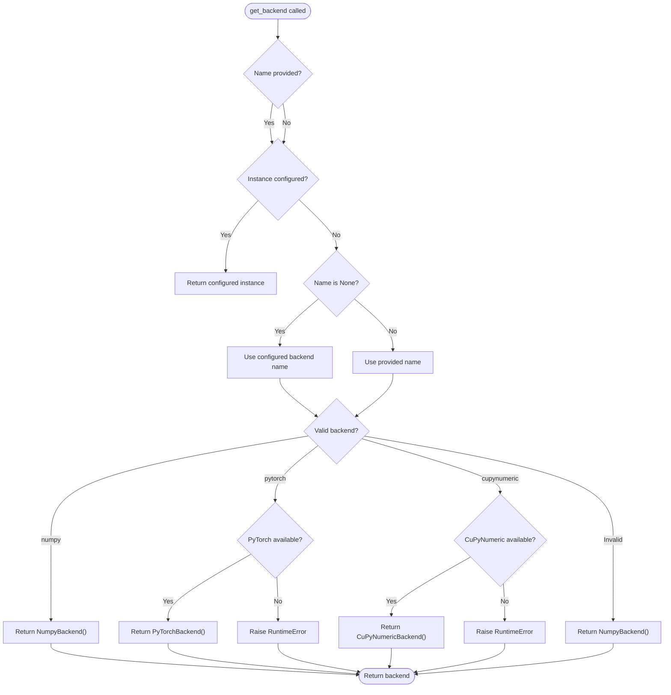
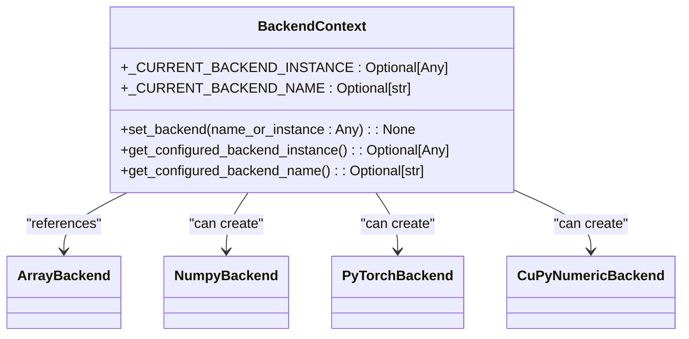
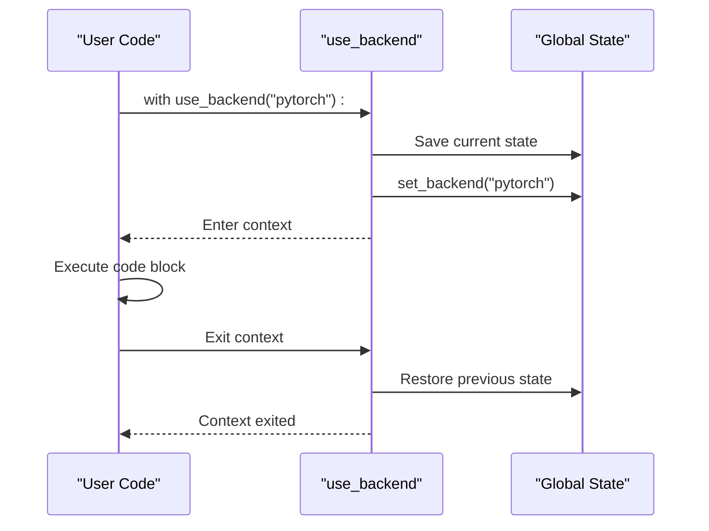
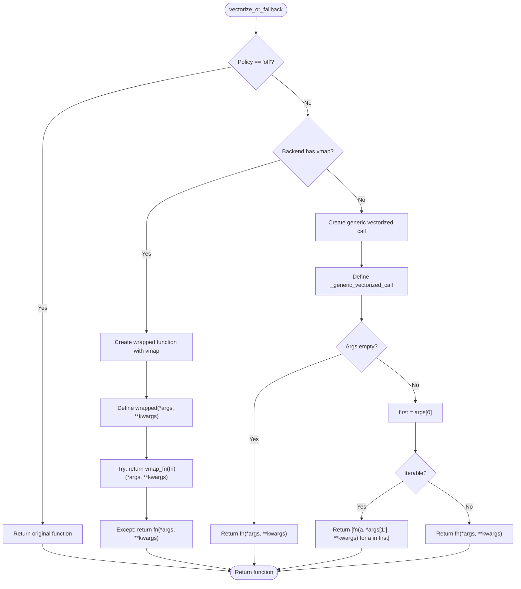

# Backend Management and Configuration

<cite>
**Referenced Files in This Document**   
- [api.py](file://src/tyxonq/numerics/api.py)
- [context.py](file://src/tyxonq/numerics/context.py)
- [config.py](file://src/tyxonq/config.py)
- [numpy_backend.py](file://src/tyxonq/numerics/backends/numpy_backend.py)
- [pytorch_backend.py](file://src/tyxonq/numerics/backends/pytorch_backend.py)
- [cupynumeric_backend.py](file://src/tyxonq/numerics/backends/cupynumeric_backend.py)
</cite>

## Table of Contents
1. [Introduction](#introduction)
2. [Backend Factory Function: get_backend](#backend-factory-function-get_backend)
3. [Global Configuration State](#global-configuration-state)
4. [Context Manager Utilities](#context-manager-utilities)
5. [Vectorization Policy and Utility](#vectorization-policy-and-utility)
6. [Backend Implementations](#backend-implementations)
7. [Lazy Resolution Mechanism](#lazy-resolution-mechanism)
8. [Configuration Examples](#configuration-examples)
9. [Common Pitfalls and Best Practices](#common-pitfalls-and-best-practices)
10. [Dependency Requirements](#dependency-requirements)

## Introduction
The TyxonQ numerics layer provides a flexible backend management system that enables seamless switching between different numerical computing libraries. This system is designed to support multiple backends including NumPy, PyTorch, and CuPyNumeric, allowing users to select the most appropriate computational engine for their specific use case and hardware environment. The backend management system combines global configuration state with context managers and factory functions to provide both simplicity and flexibility in backend selection and usage.

**Section sources**
- [api.py](file://src/tyxonq/numerics/api.py#L1-L50)
- [context.py](file://src/tyxonq/numerics/context.py#L1-L20)

## Backend Factory Function: get_backend
The `get_backend` function serves as the primary factory for creating backend instances in the TyxonQ numerics layer. This function accepts an optional backend name and returns an appropriate `ArrayBackend` instance based on the requested backend or current global configuration.

When no explicit backend name is provided, `get_backend` first checks for a configured backend instance, and if none exists, falls back to the configured backend name. The function supports three primary backends: 'numpy', 'pytorch', and 'cupynumeric'. For 'pytorch' and 'cupynumeric' backends, the function performs comprehensive error checking to ensure the required dependencies are available and properly importable. If dependency checks fail, appropriate `RuntimeError` exceptions are raised with descriptive messages. The function implements a safe fallback mechanism, defaulting to the NumPy backend when an unsupported or invalid backend name is specified.



**Diagram sources**
- [api.py](file://src/tyxonq/numerics/api.py#L159-L191)

**Section sources**
- [api.py](file://src/tyxonq/numerics/api.py#L159-L191)

## Global Configuration State
The backend management system maintains global configuration state through two key variables: `_CURRENT_BACKEND_INSTANCE` and `_CURRENT_BACKEND_NAME`. These variables are defined in the `context.py` module and serve as the foundation for the system's state management.

The `_CURRENT_BACKEND_INSTANCE` variable stores a direct reference to a configured backend instance, effectively pinning the system to a specific backend object. In contrast, `_CURRENT_BACKEND_NAME` stores a string identifier for a backend that should be lazily resolved when needed. This dual-state approach enables two distinct configuration patterns: direct instance binding and name-based resolution.

The global state is managed through the `set_backend` function, which determines the storage strategy based on the input type. When a string is provided, it is stored in `_CURRENT_BACKEND_NAME` and `_CURRENT_BACKEND_INSTANCE` is set to `None`, enabling lazy resolution. When a backend instance is provided, it is stored directly in `_CURRENT_BACKEND_INSTANCE` and `_CURRENT_BACKEND_NAME` is set to `None`, creating a direct reference.



**Diagram sources**
- [context.py](file://src/tyxonq/numerics/context.py#L17-L29)

**Section sources**
- [context.py](file://src/tyxonq/numerics/context.py#L1-L37)

## Context Manager Utilities
The `use_backend` context manager provides a powerful mechanism for temporarily changing the backend configuration within a specific code block. This utility enables localized backend selection without affecting the global configuration, making it ideal for testing, debugging, or executing specific operations with different computational backends.

The context manager follows a standard pattern of saving the current state, applying the new configuration, executing the code block, and then restoring the original state. This ensures that any changes made within the context are automatically reverted when the context exits, even if an exception occurs. The implementation uses Python's `contextmanager` decorator to create a generator-based context manager that properly handles the setup and teardown process.



**Diagram sources**
- [context.py](file://src/tyxonq/numerics/context.py#L41-L49)

**Section sources**
- [context.py](file://src/tyxonq/numerics/context.py#L41-L49)

## Vectorization Policy and Utility
The vectorization system in TyxonQ is governed by the `VectorizationPolicy` enum, which defines three possible policies: 'auto', 'force', and 'off'. This policy controls how functions are vectorized when executed on different backends.

The `vectorize_or_fallback` utility function implements the vectorization logic based on the specified policy. When the policy is set to 'off', the original function is returned unchanged. When the policy is 'auto' or 'force', the function attempts to apply vectorization using the backend's `vmap` method if available. If the backend does not provide a `vmap` method, a generic vectorization fallback is used that applies the function element-wise along the leading axis.

The utility includes robust error handling, with a try-except block that catches any exceptions during vectorized execution and falls back to eager execution. This ensures that functions continue to work even when vectorization fails, providing a reliable fallback mechanism.



**Diagram sources**
- [api.py](file://src/tyxonq/numerics/api.py#L127-L166)

**Section sources**
- [api.py](file://src/tyxonq/numerics/api.py#L15-L15)
- [config.py](file://src/tyxonq/config.py#L39-L44)

## Backend Implementations
The TyxonQ numerics layer provides three distinct backend implementations that adhere to the `ArrayBackend` protocol: `NumpyBackend`, `PyTorchBackend`, and `CuPyNumericBackend`. Each implementation provides a consistent interface while leveraging the specific capabilities of its underlying library.

The `NumpyBackend` serves as the default and most widely supported option, providing comprehensive NumPy functionality with additional utilities for autodiff and JIT compilation. The `PyTorchBackend` extends this with GPU acceleration and advanced autograd capabilities, including integration with PyTorch's `torch.func.vmap` for efficient vectorization. The `CuPyNumericBackend` provides GPU-accelerated computing through the CuPyNumeric library, with fallback mechanisms for operations not natively supported on GPU.

All backends implement the core `ArrayBackend` protocol methods including array creation, mathematical operations, linear algebra, and random number generation. They also provide optional methods like `vmap` and `jit` where supported by the underlying library.

**Section sources**
- [numpy_backend.py](file://src/tyxonq/numerics/backends/numpy_backend.py#L1-L165)
- [pytorch_backend.py](file://src/tyxonq/numerics/backends/pytorch_backend.py#L1-L259)
- [cupynumeric_backend.py](file://src/tyxonq/numerics/backends/cupynumeric_backend.py#L1-L255)

## Lazy Resolution Mechanism
The lazy resolution mechanism is a key architectural feature of the TyxonQ backend management system. This mechanism allows backend selection to be deferred until the point of actual use, providing significant benefits for modularity and testing.

When a backend name is configured (rather than an instance), the actual backend creation is delayed until `get_backend` is called without an explicit name parameter. This approach enables configuration to be set early in the application lifecycle while deferring the potentially expensive import and initialization of backend libraries until they are actually needed.

The lazy resolution mechanism enhances modularity by decoupling configuration from implementation. It allows applications to specify their preferred backend without requiring all possible backend dependencies to be installed. This is particularly valuable in testing environments where different test cases may require different backends, or in deployment scenarios where the available hardware determines the optimal backend.

**Section sources**
- [context.py](file://src/tyxonq/numerics/context.py#L17-L29)
- [api.py](file://src/tyxonq/numerics/api.py#L159-L191)

## Configuration Examples
The backend management system supports multiple configuration patterns for different use cases. For global configuration, the `set_backend` function can be used to establish a default backend for the entire application:

```python
from tyxonq.numerics import set_backend, get_backend

# Set global backend to PyTorch
set_backend("pytorch")

# Later in the code, get_backend with no arguments will return PyTorch backend
backend = get_backend(None)
```

For temporary, localized configuration changes, the `use_backend` context manager provides a clean syntax:

```python
from tyxonq.numerics import use_backend, get_backend

# Use NumPy for a specific computation
with use_backend("numpy"):
    numpy_backend = get_backend(None)
    # Perform NumPy-specific operations
    result = numpy_backend.array([1, 2, 3])

# Outside the context, previous backend is restored
```

Direct instance configuration is also supported for advanced use cases:

```python
from tyxonq.numerics import set_backend, get_backend
from tyxonq.numerics.backends import PyTorchBackend

# Create and configure a specific backend instance
custom_backend = PyTorchBackend()
set_backend(custom_backend)

# get_backend will return the exact instance
backend = get_backend(None)
```

**Section sources**
- [context.py](file://src/tyxonq/numerics/context.py#L17-L29)
- [context.py](file://src/tyxonq/numerics/context.py#L41-L49)
- [api.py](file://src/tyxonq/numerics/api.py#L159-L191)

## Common Pitfalls and Best Practices
When working with the TyxonQ backend management system, several common pitfalls should be avoided. One frequent issue is attempting to use a backend without ensuring its dependencies are installed. For example, requesting the 'pytorch' backend without having PyTorch installed will raise a `RuntimeError`. To avoid this, applications should either ensure all required dependencies are available or implement proper error handling around backend selection.

Another common pitfall is misunderstanding the difference between name-based and instance-based configuration. When using name-based configuration, the actual backend creation is deferred, which means that dependency errors may not be detected until the backend is actually used. For production applications, it may be preferable to configure backends using instances to catch configuration errors early.

Best practices include:
- Using context managers for temporary backend changes to ensure proper state restoration
- Implementing fallback strategies for critical operations that depend on specific backends
- Testing code with multiple backends to ensure compatibility
- Using the lazy resolution mechanism to improve startup performance in applications that may not use all available backends

**Section sources**
- [api.py](file://src/tyxonq/numerics/api.py#L159-L191)
- [context.py](file://src/tyxonq/numerics/context.py#L17-L29)

## Dependency Requirements
The TyxonQ backend management system has different dependency requirements depending on the selected backend. The base system requires only NumPy, which is included as a core dependency. For the 'pytorch' backend, the PyTorch library must be installed, while the 'cupynumeric' backend requires the CuPyNumeric package.

The system uses optional imports with try-except blocks to handle missing dependencies gracefully. When a backend module cannot be imported, the corresponding backend class is set to `None`, and attempts to use that backend will raise descriptive `RuntimeError` exceptions. This design allows the core system to function without all possible backend dependencies being installed, while still providing clear error messages when a requested backend is unavailable.

**Section sources**
- [api.py](file://src/tyxonq/numerics/api.py#L7-L13)
- [pytorch_backend.py](file://src/tyxonq/numerics/backends/pytorch_backend.py#L4-L10)
- [cupynumeric_backend.py](file://src/tyxonq/numerics/backends/cupynumeric_backend.py#L4-L10)