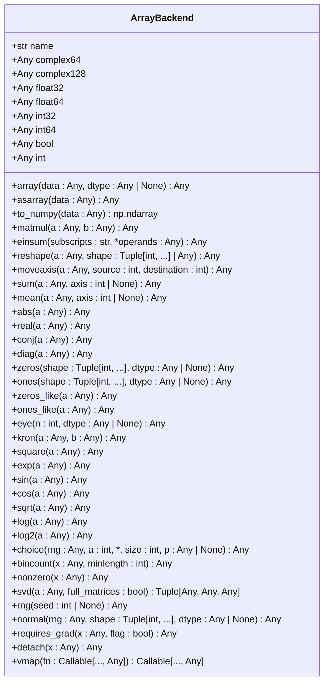
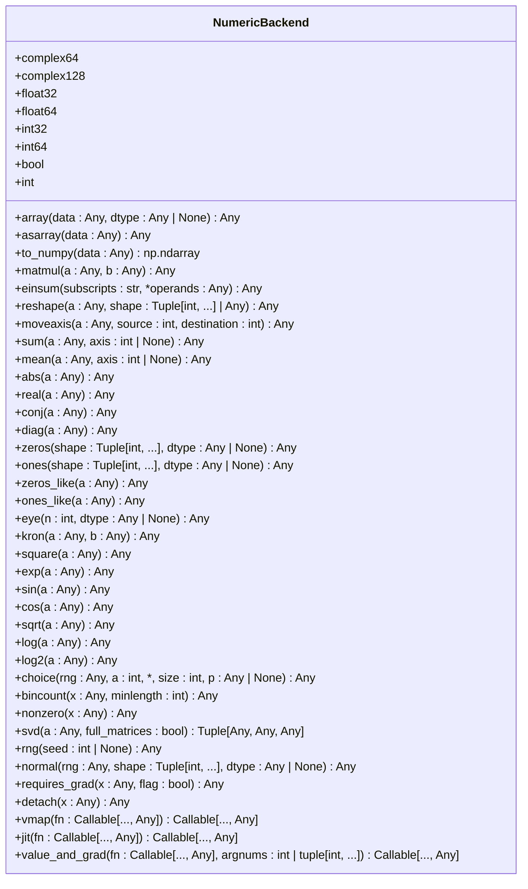
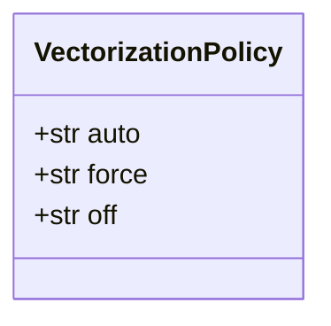
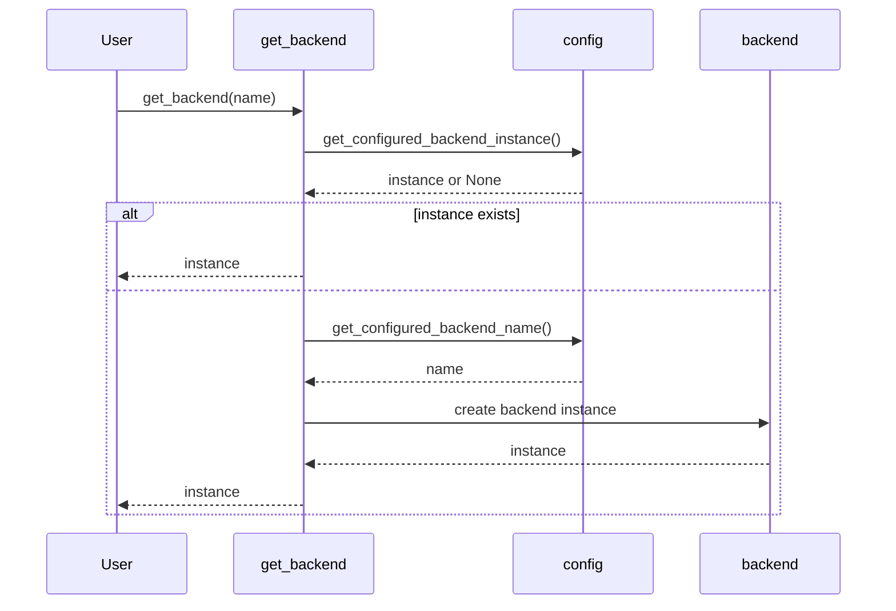

# Core Interface

<cite>
**Referenced Files in This Document**   
- [api.py](file://src/tyxonq/numerics/api.py)
- [context.py](file://src/tyxonq/numerics/context.py)
- [numpy_backend.py](file://src/tyxonq/numerics/backends/numpy_backend.py)
- [pytorch_backend.py](file://src/tyxonq/numerics/backends/pytorch_backend.py)
- [cupynumeric_backend.py](file://src/tyxonq/numerics/backends/cupynumeric_backend.py)
- [__init__.py](file://src/tyxonq/numerics/__init__.py)
</cite>

## Table of Contents
1. [Introduction](#introduction)
2. [ArrayBackend Protocol](#arraybackend-protocol)
3. [NumericBackend Class](#numericbackend-class)
4. [VectorizationPolicy Enum](#vectorizationpolicy-enum)
5. [Backend Resolution Mechanism](#backend-resolution-mechanism)
6. [Usage Examples](#usage-examples)
7. [Role in Backend-Agnostic Code](#role-in-backend-agnostic-code)

## Introduction
The Numerics API interface in TyxonQ provides a unified abstraction layer for numerical computations across different backend libraries such as NumPy, PyTorch, and CuPyNumeric. This document details the core components of this interface, including the `ArrayBackend` protocol, the `NumericBackend` class-level proxy, the `VectorizationPolicy` enum, and the global backend resolution mechanism. The interface enables seamless integration of various numerical backends, supporting backend-agnostic code development for simulators, postprocessing, and gradient computation.

## ArrayBackend Protocol
The `ArrayBackend` protocol defines the foundational contract that all numerical backends must implement. It specifies a comprehensive set of methods and attributes required for array creation, mathematical operations, linear algebra, random number generation, and autodiff integration.

### Required Attributes and Methods
- **name**: A string identifier for the backend.
- **dtype constants**: `complex64`, `complex128`, `float32`, `float64`, `int32`, `int64`, `bool`, and `int`.
- **Array creation and conversion**: `array`, `asarray`, `to_numpy`.
- **Algebraic operations**: `matmul`, `einsum`, `reshape`, `moveaxis`, `sum`, `mean`, `abs`, `real`, `conj`, `diag`, `zeros`, `ones`, `zeros_like`, `ones_like`, `eye`, `kron`, `square`.
- **Elementary math functions**: `exp`, `sin`, `cos`, `sqrt`, `log`, `log2`.
- **Discrete operations and sampling helpers**: `choice`, `bincount`, `nonzero`.
- **Linear algebra**: `svd`.
- **Random number generation**: `rng`, `normal`.
- **Autodiff bridge**: `requires_grad`, `detach`.

### Optional Methods
- **vmap**: Returns a vectorized version of a given function along the leading axis.



**Diagram sources**
- [api.py](file://src/tyxonq/numerics/api.py#L18-L101)

**Section sources**
- [api.py](file://src/tyxonq/numerics/api.py#L18-L101)

## NumericBackend Class
The `NumericBackend` class provides a class-level proxy pattern for accessing backend functionality without requiring instantiation. This allows users to interact with the current backend through static method calls.

### Key Features
- **Dtype constants**: Accessed via class properties, these constants are dynamically resolved from the current backend.
- **Unified API**: All methods delegate to the currently active backend obtained via `get_backend(None)`.
- **Optional helpers**: Methods like `vmap`, `jit`, and `value_and_grad` provide additional functionality if supported by the backend.



**Diagram sources**
- [__init__.py](file://src/tyxonq/numerics/__init__.py#L21-L192)

**Section sources**
- [__init__.py](file://src/tyxonq/numerics/__init__.py#L21-L192)

## VectorizationPolicy Enum
The `VectorizationPolicy` enum defines the policy for vectorization behavior, with three possible values: `'auto'`, `'force'`, and `'off'`.

### Policy Descriptions
- **auto**: Attempts to use vectorization if available, falling back to eager execution on any error.
- **force**: Forces vectorization, raising an exception if vectorization fails.
- **off**: Disables vectorization, executing functions eagerly.



**Diagram sources**
- [api.py](file://src/tyxonq/numerics/api.py#L15-L15)

**Section sources**
- [api.py](file://src/tyxonq/numerics/api.py#L15-L15)

## Backend Resolution Mechanism
The `get_backend` function is responsible for resolving and returning an `ArrayBackend` instance based on the provided name or the global configuration.

### Resolution Logic
1. If no name is provided, it first checks for a configured backend instance.
2. If no instance is found, it uses the configured backend name.
3. Supported backends include `'numpy'`, `'pytorch'`, and `'cupynumeric'`.
4. If the requested backend is not available, appropriate exceptions are raised.



**Diagram sources**
- [api.py](file://src/tyxonq/numerics/api.py#L159-L191)
- [context.py](file://src/tyxonq/numerics/context.py#L39-L52)

**Section sources**
- [api.py](file://src/tyxonq/numerics/api.py#L159-L191)
- [context.py](file://src/tyxonq/numerics/context.py#L39-L52)

## Usage Examples
Users interact with the unified interface through the `NumericBackend` class, enabling backend-agnostic code.

### Common Numerical Operations
- **Matrix multiplication**: `NumericBackend.matmul(a, b)`
- **Einstein summation**: `NumericBackend.einsum(subscripts, *operands)`
- **Singular value decomposition**: `NumericBackend.svd(a, full_matrices=False)`
- **Normal distribution sampling**: `NumericBackend.normal(rng, shape, dtype)`

### Example Code
```python
import tyxonq.numerics as tn

# Set the backend
tn.set_backend('pytorch')

# Perform operations
a = tn.NumericBackend.array([[1.0, 2.0], [3.0, 4.0]])
b = tn.NumericBackend.array([[1.0], [0.5]])
c = tn.NumericBackend.matmul(a, b)
rng = tn.NumericBackend.rng(0)
x = tn.NumericBackend.normal(rng, (2,))
```

**Section sources**
- [api.py](file://src/tyxonq/numerics/api.py)
- [__init__.py](file://src/tyxonq/numerics/__init__.py)
- [context.py](file://src/tyxonq/numerics/context.py)

## Role in Backend-Agnostic Code
The Numerics API interface plays a crucial role in enabling backend-agnostic code across various components of TyxonQ, including simulators, postprocessing, and gradient computation. By abstracting the underlying numerical backend, it allows developers to write code that is independent of the specific backend implementation, facilitating easier testing, debugging, and performance optimization.

**Section sources**
- [api.py](file://src/tyxonq/numerics/api.py)
- [__init__.py](file://src/tyxonq/numerics/__init__.py)
- [context.py](file://src/tyxonq/numerics/context.py)