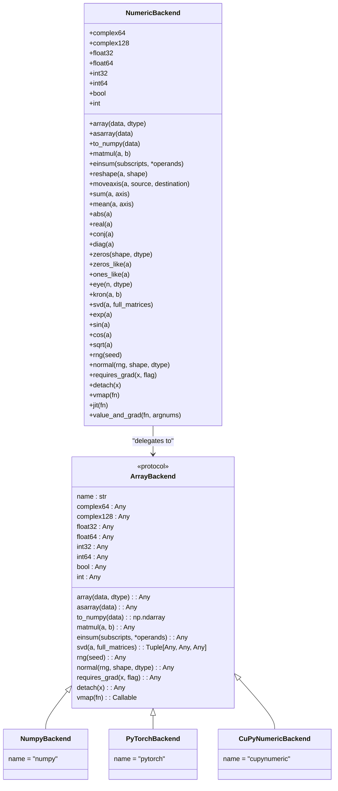
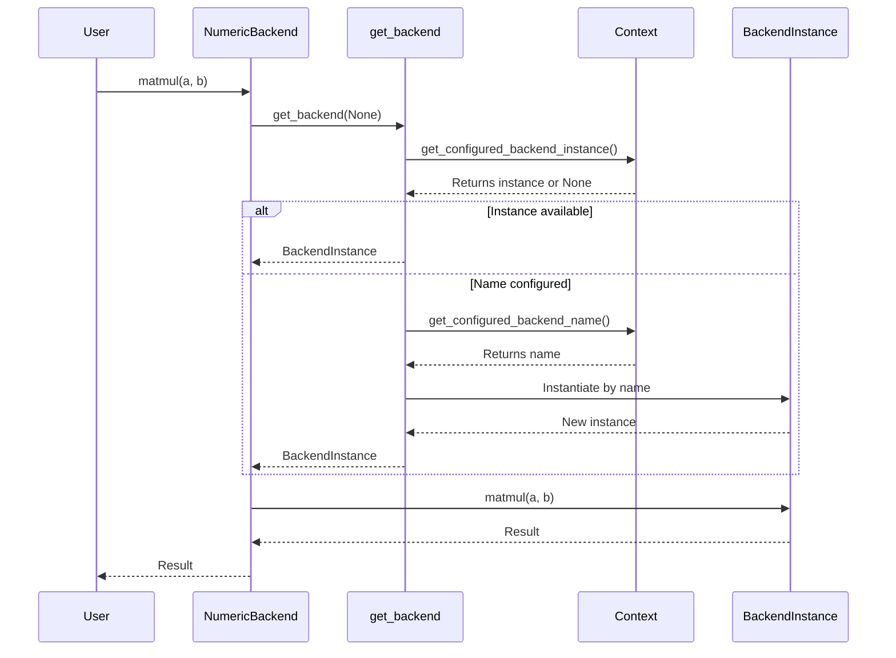
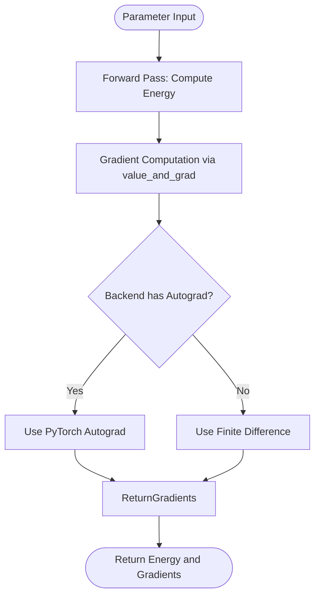
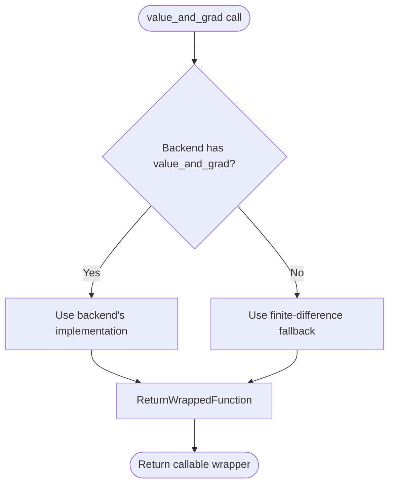

# NumericBackend Class Proxy

<cite>
**Referenced Files in This Document**   
- [__init__.py](file://src/tyxonq/numerics/__init__.py)
- [api.py](file://src/tyxonq/numerics/api.py)
- [context.py](file://src/tyxonq/numerics/context.py)
- [numpy_backend.py](file://src/tyxonq/numerics/backends/numpy_backend.py)
- [pytorch_backend.py](file://src/tyxonq/numerics/backends/pytorch_backend.py)
- [cupynumeric_backend.py](file://src/tyxonq/numerics/backends/cupynumeric_backend.py)
- [aces_for_setting_numeric_backend.py](file://examples-ng/aces_for_setting_numeric_backend.py)
</cite>

## Table of Contents
1. [Introduction](#introduction)
2. [Core Architecture](#core-architecture)
3. [Backend Delegation Mechanism](#backend-delegation-mechanism)
4. [Exposed Methods and Constants](#exposed-methods-and-constants)
5. [Usage Patterns](#usage-patterns)
6. [Advanced Features](#advanced-features)
7. [Error Handling and Performance](#error-handling-and-performance)
8. [Conclusion](#conclusion)

## Introduction

The `NumericBackend` class serves as a class-level proxy that provides global access to the active numerical backend without requiring instantiation. It enables seamless switching between different numerical computing backends (NumPy, PyTorch, CuPyNumeric) while maintaining a consistent interface for tensor operations, mathematical functions, and automatic differentiation utilities. This design allows users and internal components to interact with numerical operations in a backend-agnostic manner, promoting flexibility and portability across simulation, postprocessing, and gradient computation workflows.

**Section sources**
- [__init__.py](file://src/tyxonq/numerics/__init__.py#L21-L192)

## Core Architecture

The `NumericBackend` is implemented as a static class using class methods and properties, eliminating the need for object instantiation. It acts as a facade over various backend implementations through a unified protocol defined by the `ArrayBackend` interface. The architecture follows a proxy pattern where all method calls are delegated to the currently configured backend instance retrieved via `get_backend(None)`.

The system supports three primary backends:
- **NumPy**: CPU-based numerical computations
- **PyTorch**: GPU-accelerated tensor operations with autograd support
- **CuPyNumeric**: GPU/accelerated computing via CuPy-compatible API

Each backend implements the same core set of operations, ensuring API consistency regardless of the underlying computational engine.



**Diagram sources**
- [__init__.py](file://src/tyxonq/numerics/__init__.py#L21-L192)
- [api.py](file://src/tyxonq/numerics/api.py#L26-L58)
- [numpy_backend.py](file://src/tyxonq/numerics/backends/numpy_backend.py#L0-L53)
- [pytorch_backend.py](file://src/tyxonq/numerics/backends/pytorch_backend.py#L0-L53)
- [cupynumeric_backend.py](file://src/tyxonq/numerics/backends/cupynumeric_backend.py#L0-L53)

## Backend Delegation Mechanism

The delegation mechanism is centered around the `get_backend()` function, which resolves the active backend based on global configuration. When a method is called on `NumericBackend`, it internally invokes `get_backend(None)` to obtain the current backend instance and delegates the operation to it.

The resolution order is:
1. Check for a configured backend instance
2. Fall back to configured backend name
3. Default to NumPy if no configuration exists

This mechanism allows both named backends (e.g., "pytorch") and direct instances to be used, providing flexibility in configuration management. The global state is managed through `_CURRENT_BACKEND_INSTANCE` and `_CURRENT_BACKEND_NAME` variables in the context module, enabling dynamic backend switching during execution.



**Diagram sources**
- [__init__.py](file://src/tyxonq/numerics/__init__.py#L21-L192)
- [api.py](file://src/tyxonq/numerics/api.py#L159-L191)
- [context.py](file://src/tyxonq/numerics/context.py#L17-L29)

## Exposed Methods and Constants

### Data Type Constants

The `NumericBackend` exposes standard data type constants that map directly to the active backend's dtype objects:

- `float64`: Double-precision floating point
- `complex128`: Double-precision complex numbers
- `float32`: Single-precision floating point
- `complex64`: Single-precision complex numbers
- `int64`, `int32`: Integer types
- `bool`: Boolean type
- `int`: Common integer alias (maps to `int64`)

These are implemented as `_classproperty` descriptors that resolve to the corresponding backend-specific dtype on access.

### Core Operations

The class provides comprehensive access to fundamental numerical operations:

#### Tensor Creation and Conversion
- `array(data, dtype)`: Create tensor from data
- `asarray(data)`: Convert to backend-native array
- `to_numpy(data)`: Convert to NumPy ndarray
- `zeros(shape, dtype)`, `ones_like(a)`, `eye(n, dtype)`: Tensor creation utilities

#### Mathematical and Algebraic Operations
- `matmul(a, b)`: Matrix multiplication
- `einsum(subscripts, *operands)`: Einstein summation
- `svd(a, full_matrices)`: Singular value decomposition
- `exp(a)`, `sin(a)`, `cos(a)`, `sqrt(a)`: Elementary functions
- `sum(a, axis)`, `mean(a, axis)`: Reduction operations
- `abs(a)`, `real(a)`, `conj(a)`: Complex number operations

#### Random Number Generation
- `rng(seed)`: Create random number generator
- `normal(rng, shape, dtype)`: Generate normal distribution samples

#### Automatic Differentiation
- `requires_grad(x, flag)`: Mark tensor for gradient tracking
- `detach(x)`: Detach from computation graph

**Section sources**
- [__init__.py](file://src/tyxonq/numerics/__init__.py#L21-L192)

## Usage Patterns

### Backend Configuration

The active backend can be set globally using `set_backend()` or within a context using `use_backend()`:

```python
import tyxonq as tq

# Global setting
tq.set_backend("pytorch")

# Context-local setting
with tq.use_backend("cupynumeric"):
    # Operations use CuPyNumeric here
    result = tq.NumericBackend.matmul(a, b)
# Back to previous backend
```

### Simulation and Postprocessing Workflows

In quantum circuit simulation, the `NumericBackend` is used extensively for state vector manipulation, measurement processing, and expectation value calculations:

```python
# Example from aces_for_setting_numeric_backend.py
def _bell_circuit():
    c = tq.Circuit(2).H(0).CX(0, 1)
    c.measure_z(0).measure_z(1)
    return c

# The backend setting affects all numerical operations
results = c.compile().device(...).postprocessing(...).run()
```

### Gradient Computation

For variational quantum algorithms, the automatic differentiation capabilities enable efficient gradient computation:



**Diagram sources**
- [aces_for_setting_numeric_backend.py](file://examples-ng/aces_for_setting_numeric_backend.py#L0-L50)
- [__init__.py](file://src/tyxonq/numerics/__init__.py#L161-L194)

## Advanced Features

### Vectorization with vmap

The `vmap` method provides automatic vectorization along the leading axis:

```python
@tq.NumericBackend.vmap
def single_circuit(params):
    # Process single parameter set
    return simulate_circuit(params)

# Automatically processes batched inputs
batch_results = single_circuit(batched_params)
```

Implementation varies by backend:
- **PyTorch**: Uses `torch.func.vmap` when available
- **NumPy/CuPyNumeric**: Falls back to element-wise application

### Just-In-Time Compilation with jit

The `jit` wrapper enables optional compilation for performance optimization:

```python
compiled_fn = tq.NumericBackend.jit(expensive_computation)
result = compiled_fn(inputs)
```

Backend behavior:
- **PyTorch**: Uses `torch.compile` when available
- **NumPy/CuPyNumeric**: Returns original function (no-op)

### Gradient Computation with value_and_grad

The `value_and_grad` method provides a unified interface for computing both function values and gradients:

```python
energy_and_gradient = tq.NumericBackend.value_and_grad(compute_energy)
energy, grad = energy_and_gradient(parameters)
```

This method implements a sophisticated fallback strategy:
1. Attempt autograd-based differentiation (PyTorch)
2. Fall back to finite-difference approximation (NumPy, CuPyNumeric)
3. Raise error if neither is available



**Diagram sources**
- [__init__.py](file://src/tyxonq/numerics/__init__.py#L161-L194)
- [pytorch_backend.py](file://src/tyxonq/numerics/backends/pytorch_backend.py#L200-L259)
- [numpy_backend.py](file://src/tyxonq/numerics/backends/numpy_backend.py#L100-L165)

## Error Handling and Performance

### Error Handling for Optional Features

The proxy pattern includes robust error handling for optional features:

- Missing backend modules raise `RuntimeError` with clear messages
- Unsupported operations fall back to alternatives when possible
- `value_and_grad` raises `AttributeError` only when no fallback exists
- Optional methods are marked with `# pragma: no cover` for test coverage accuracy

### Performance Implications

The proxy pattern introduces minimal overhead due to:
- Direct method delegation without intermediate processing
- Class-level caching of backend instances
- Avoidance of unnecessary object instantiation

However, certain operations have backend-specific performance characteristics:
- **PyTorch**: Best performance on GPU with JIT compilation
- **CuPyNumeric**: High performance on GPU for large tensor operations
- **NumPy**: Optimal for small to medium CPU-based computations

The `vectorize_or_fallback` utility provides configurable vectorization policies ("auto", "force", "off") to balance performance and reliability.

**Section sources**
- [__init__.py](file://src/tyxonq/numerics/__init__.py#L21-L192)
- [api.py](file://src/tyxonq/numerics/api.py#L100-L150)
- [context.py](file://src/tyxonq/numerics/context.py#L41-L49)

## Conclusion

The `NumericBackend` class provides a powerful, flexible interface for numerical computing in the TyxonQ framework. By implementing a class-level proxy pattern, it enables global access to numerical operations without requiring instantiation, while supporting seamless switching between multiple backend engines. The design effectively abstracts away backend-specific details, allowing users to focus on quantum algorithm development rather than numerical implementation concerns. With comprehensive support for tensor operations, mathematical functions, and automatic differentiation—including sophisticated fallback mechanisms for advanced features—the `NumericBackend` serves as a critical foundation for quantum simulation, optimization, and machine learning workflows.