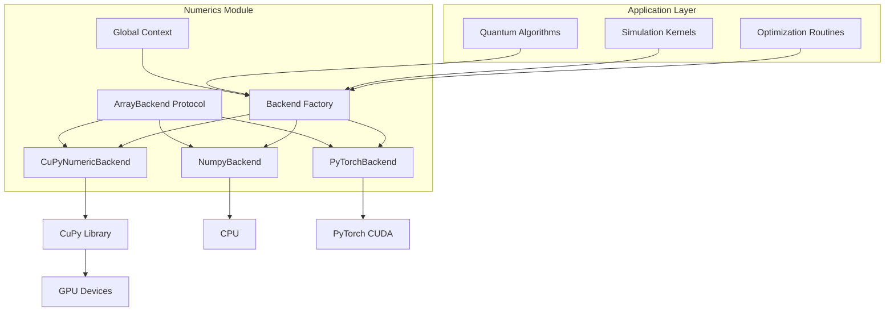
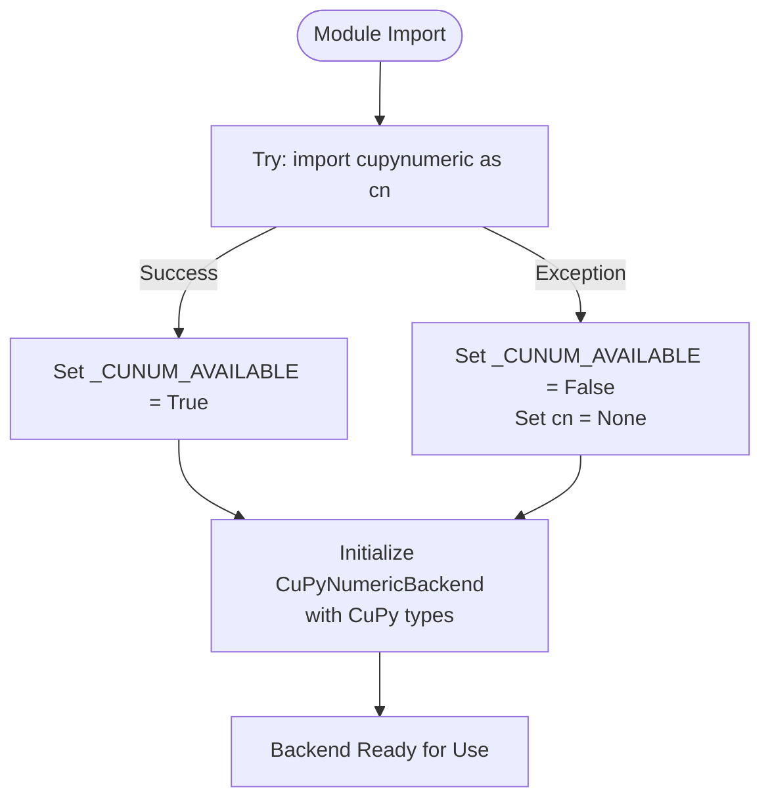
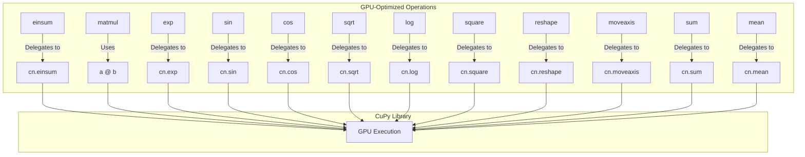
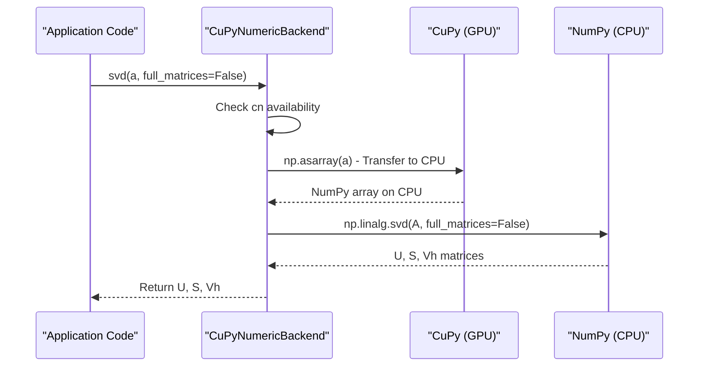

# CuPyNumeric Backend

<cite>
**Referenced Files in This Document**   
- [cupynumeric_backend.py](file://src/tyxonq/numerics/backends/cupynumeric_backend.py)
- [api.py](file://src/tyxonq/numerics/api.py)
- [context.py](file://src/tyxonq/numerics/context.py)
- [numpy_backend.py](file://src/tyxonq/numerics/backends/numpy_backend.py)
- [vectorization_checks.py](file://src/tyxonq/numerics/vectorization_checks.py)
</cite>

## Table of Contents
1. [Introduction](#introduction)
2. [Architecture Overview](#architecture-overview)
3. [Core Components](#core-components)
4. [Conditional Import and Availability Checking](#conditional-import-and-availability-checking)
5. [GPU-Optimized Operations](#gpu-optimized-operations)
6. [Linear Algebra and SVD Implementation](#linear-algebra-and-svd-implementation)
7. [Random Number Generation and Sampling](#random-number-generation-and-sampling)
8. [Gradient Computation and Autodiff](#gradient-computation-and-autodiff)
9. [Performance Considerations](#performance-considerations)
10. [Usage Examples and Integration](#usage-examples-and-integration)
11. [Conclusion](#conclusion)

## Introduction

The CuPyNumericBackend is a high-performance numerical computing backend within the TyxonQ framework that provides GPU acceleration for quantum simulations through the CuPy library. This backend implements the ArrayBackend protocol, enabling NumPy-compatible operations while leveraging GPU resources for computationally intensive tasks. Designed for large-scale quantum system simulations, the CuPyNumericBackend offers significant performance improvements over CPU-based alternatives for tensor operations, linear algebra computations, and matrix manipulations.

The backend serves as a drop-in replacement for the standard NumPy backend, allowing users to accelerate their quantum simulations without modifying their core algorithms. It supports distributed computing scenarios and is particularly beneficial for applications requiring extensive computational resources, such as variational quantum eigensolvers (VQE), quantum approximate optimization algorithms (QAOA), and time-evolution simulations of large quantum systems.

**Section sources**
- [cupynumeric_backend.py](file://src/tyxonq/numerics/backends/cupynumeric_backend.py#L12-L252)
- [api.py](file://src/tyxonq/numerics/api.py#L18-L101)

## Architecture Overview

The CuPyNumericBackend is part of a modular numerical computing architecture in TyxonQ that abstracts array operations behind a unified interface. This design enables seamless switching between different computational backends while maintaining consistent API behavior. The architecture follows a protocol-based approach where the ArrayBackend protocol defines the required methods and attributes that all numerical backends must implement.



**Diagram sources**
- [api.py](file://src/tyxonq/numerics/api.py#L18-L101)
- [cupynumeric_backend.py](file://src/tyxonq/numerics/backends/cupynumeric_backend.py#L12-L252)
- [context.py](file://src/tyxonq/numerics/context.py#L1-L52)

**Section sources**
- [api.py](file://src/tyxonq/numerics/api.py#L18-L101)
- [cupynumeric_backend.py](file://src/tyxonq/numerics/backends/cupynumeric_backend.py#L12-L252)
- [context.py](file://src/tyxonq/numerics/context.py#L1-L52)

## Core Components

The CuPyNumericBackend class is the central component that implements the ArrayBackend protocol using CuPy as the underlying computational engine. The backend provides a comprehensive set of array operations optimized for GPU execution, including tensor contractions, matrix multiplication, and element-wise mathematical functions. Each method in the backend includes availability checking to ensure graceful degradation when CuPy is not installed or accessible.

The backend's implementation follows a consistent pattern where operations are delegated to the corresponding CuPy functions when available, with appropriate error handling for cases where the cupynumeric module cannot be imported. This design ensures that code written against the backend interface remains portable while enabling GPU acceleration when the appropriate hardware and software dependencies are present.

```mermaid
classDiagram
class ArrayBackend {
<<protocol>>
+name : str
+complex64 : Any
+complex128 : Any
+float32 : Any
+float64 : Any
+int32 : Any
+int64 : Any
+bool : Any
+int : Any
+array(data, dtype) : Any
+asarray(data) : Any
+to_numpy(data) : np.ndarray
+matmul(a, b) : Any
+einsum(subscripts, *operands) : Any
+reshape(a, shape) : Any
+moveaxis(a, source, destination) : Any
+sum(a, axis) : Any
+mean(a, axis) : Any
+abs(a) : Any
+real(a) : Any
+conj(a) : Any
+diag(a) : Any
+zeros(shape, dtype) : Any
+ones(shape, dtype) : Any
+zeros_like(a) : Any
+ones_like(a) : Any
+eye(n, dtype) : Any
+kron(a, b) : Any
+square(a) : Any
+exp(a) : Any
+sin(a) : Any
+cos(a) : Any
+sqrt(a) : Any
+log(a) : Any
+log2(a) : Any
+svd(a, full_matrices) : Tuple[Any, Any, Any]
+rng(seed) : Any
+normal(rng, shape, dtype) : Any
+choice(rng, a, size, p) : Any
+bincount(x, minlength) : Any
+nonzero(x) : Any
+requires_grad(x, flag) : Any
+detach(x) : Any
+jit(fn) : Any
+value_and_grad(fn, argnums) : Any
}
class CuPyNumericBackend {
-name : str
-available : bool
+complex64 : Any
+complex128 : Any
+float32 : Any
+float64 : Any
+int32 : Any
+int64 : Any
+bool : Any
+int : Any
+array(data, dtype) : Any
+asarray(data) : Any
+to_numpy(data) : Any
+matmul(a, b) : Any
+einsum(subscripts, *operands) : Any
+reshape(a, shape) : Any
+moveaxis(a, source, destination) : Any
+sum(a, axis) : Any
+mean(a, axis) : Any
+abs(a) : Any
+real(a) : Any
+conj(a) : Any
+diag(a) : Any
+zeros(shape, dtype) : Any
+ones(shape, dtype) : Any
+zeros_like(a) : Any
+ones_like(a) : Any
+eye(n, dtype) : Any
+kron(a, b) : Any
+square(a) : Any
+exp(a) : Any
+sin(a) : Any
+cos(a) : Any
+sqrt(a) : Any
+log(a) : Any
+log2(a) : Any
+svd(a, full_matrices) : Tuple[Any, Any, Any]
+rng(seed) : Any
+normal(rng, shape, dtype) : Any
+choice(rng, a, size, p) : Any
+bincount(x, minlength) : Any
+nonzero(x) : Any
+requires_grad(x, flag) : Any
+detach(x) : Any
+jit(fn) : Any
+value_and_grad(fn, argnums) : Any
}
ArrayBackend <|.. CuPyNumericBackend : implements
```



**Diagram sources**
- [api.py](file://src/tyxonq/numerics/api.py#L18-L101)
- [cupynumeric_backend.py](file://src/tyxonq/numerics/backends/cupynumeric_backend.py#L12-L252)

**Section sources**
- [cupynumeric_backend.py](file://src/tyxonq/numerics/backends/cupynumeric_backend.py#L12-L252)
- [api.py](file://src/tyxonq/numerics/api.py#L18-L101)

## Conditional Import and Availability Checking

The CuPyNumericBackend implements a robust conditional import mechanism that allows the TyxonQ framework to function even when the cupynumeric package is not installed. This approach uses a try-except block to attempt importing cupynumeric, setting a module-level flag `_CUNUM_AVAILABLE` to indicate availability. When cupynumeric is unavailable, the backend sets `cn` to None and marks itself as unavailable, enabling the system to gracefully fall back to alternative backends.

This conditional import pattern prevents runtime errors in environments lacking GPU acceleration capabilities while maintaining the ability to leverage GPU resources when available. The availability check is performed at import time, ensuring that subsequent operations can quickly determine whether GPU acceleration is possible without repeated import attempts.



**Diagram sources**
- [cupynumeric_backend.py](file://src/tyxonq/numerics/backends/cupynumeric_backend.py#L1-L25)

**Section sources**
- [cupynumeric_backend.py](file://src/tyxonq/numerics/backends/cupynumeric_backend.py#L1-L25)

## GPU-Optimized Operations

The CuPyNumericBackend provides GPU-optimized implementations of key numerical operations essential for quantum simulations. These operations leverage CuPy's GPU-accelerated computing capabilities to deliver significant performance improvements over CPU-based implementations, particularly for large tensor operations and matrix computations.

The backend implements tensor contraction through the `einsum` method, which directly delegates to CuPy's einsum function for efficient GPU-based tensor operations. Matrix multiplication is implemented using Python's matrix multiplication operator (@), which CuPy optimizes for GPU execution. These operations are fundamental to quantum circuit simulation, state vector evolution, and Hamiltonian computations.

Element-wise mathematical functions such as `exp`, `sin`, `cos`, `sqrt`, `log`, and `square` are also GPU-accelerated, enabling efficient computation of quantum gate operations and probability amplitudes. Array manipulation operations like `reshape`, `moveaxis`, `sum`, and `mean` are similarly optimized for GPU execution, supporting the tensor reshaping and contraction patterns common in quantum algorithms.



**Diagram sources**
- [cupynumeric_backend.py](file://src/tyxonq/numerics/backends/cupynumeric_backend.py#L50-L74)
- [cupynumeric_backend.py](file://src/tyxonq/numerics/backends/cupynumeric_backend.py#L128-L146)

**Section sources**
- [cupynumeric_backend.py](file://src/tyxonq/numerics/backends/cupynumeric_backend.py#L50-L74)
- [cupynumeric_backend.py](file://src/tyxonq/numerics/backends/cupynumeric_backend.py#L128-L146)

## Linear Algebra and SVD Implementation

The CuPyNumericBackend provides comprehensive linear algebra operations optimized for GPU execution, with a specialized implementation for singular value decomposition (SVD). While most operations leverage CuPy's GPU-accelerated functions, the SVD implementation employs a strategic fallback to NumPy for optimal performance and numerical stability.

For SVD operations, the backend transfers data from GPU to CPU memory and utilizes NumPy's highly optimized LAPACK-based implementation. This hybrid approach recognizes that while CuPy provides GPU acceleration for many linear algebra operations, traditional CPU-based libraries like LAPACK often remain more efficient and numerically stable for certain decompositions. The implementation first converts the input array to a NumPy array using `np.asarray()`, then performs the SVD decomposition, returning the resulting matrices.

This design pattern balances the benefits of GPU acceleration with the maturity and optimization of established CPU-based linear algebra libraries. It ensures reliable and accurate results for SVD operations while maintaining compatibility with the rest of the GPU-accelerated computational pipeline. The method signature preserves the same interface as other backends, enabling seamless integration with algorithms that require SVD, such as quantum state purification, Schmidt decomposition, and low-rank approximations.



**Diagram sources**
- [cupynumeric_backend.py](file://src/tyxonq/numerics/backends/cupynumeric_backend.py#L164-L171)

**Section sources**
- [cupynumeric_backend.py](file://src/tyxonq/numerics/backends/cupynumeric_backend.py#L164-L171)

## Random Number Generation and Sampling

The CuPyNumericBackend implements GPU-optimized random number generation and sampling operations essential for quantum simulations involving stochastic processes, Monte Carlo methods, and randomized algorithms. The backend provides a two-tiered approach to random number generation, combining CuPy's GPU-accelerated random functions with NumPy's mature random number generation capabilities.

The `rng` method creates a random number generator using NumPy's `default_rng` function, which provides access to modern random number generation algorithms with excellent statistical properties. The `normal` method generates normally distributed random numbers, first creating samples with the NumPy generator and then converting them to the appropriate data type. This approach ensures compatibility with the rest of the numerical computing pipeline while leveraging established, well-tested random number generation algorithms.

For discrete sampling operations, the backend implements the `choice` method, which allows sampling from a discrete distribution. This method delegates to the NumPy random generator's choice function, supporting both uniform and weighted sampling through the optional probability parameter `p`. The `bincount` and `nonzero` methods provide additional discrete operations for histogram computation and finding non-zero elements, respectively, both of which are optimized through CuPy's GPU-accelerated implementations.

```mermaid
flowchart TD
subgraph "Random Generation"
A[rng(seed)] --> B[np.random.default_rng(seed)]
B --> C[Random Generator]
C --> D[normal(rng, shape, dtype)]
D --> E[rng.normal(size=shape)]
E --> F[out.astype(dtype)]
C --> G[choice(rng, a, size, p)]
G --> H[rng.choice(a, size=size, p=p)]
end
subgraph "Discrete Operations"
I[bincount(x, minlength)] --> J[cn.bincount(x, minlength)]
K[nonzero(x)] --> L[cn.nonzero(x)]
end
C --> GPU[CuPy GPU Operations]
J --> GPU
L --> GPU
```

**Diagram sources**
- [cupynumeric_backend.py](file://src/tyxonq/numerics/backends/cupynumeric_backend.py#L173-L198)
- [cupynumeric_backend.py](file://src/tyxonq/numerics/backends/cupynumeric_backend.py#L195-L203)

**Section sources**
- [cupynumeric_backend.py](file://src/tyxonq/numerics/backends/cupynumeric_backend.py#L173-L203)

## Gradient Computation and Autodiff

The CuPyNumericBackend implements a finite-difference based gradient computation system through its `value_and_grad` method, providing automatic differentiation capabilities for optimization algorithms in quantum computing. Unlike the PyTorch backend which can leverage native autograd, the CuPyNumericBackend uses a numerical differentiation approach that converts arrays to NumPy format and applies finite differences to compute gradients.

The `value_and_grad` implementation follows a systematic approach to gradient computation. It first converts input arrays to NumPy format using a helper function that handles both CuPy and NumPy arrays. Then, for each parameter with respect to which gradients are required, it applies a central difference formula by perturbing the parameter in both positive and negative directions. The gradient is computed as the difference in function values divided by twice the perturbation step size.

This numerical differentiation approach ensures compatibility across different backends while providing a reliable method for gradient computation in variational quantum algorithms. The implementation supports gradients with respect to multiple parameters through the `argnums` parameter, which can be either a single integer or a tuple of integers indicating which function arguments to differentiate with respect to.

```mermaid
flowchart TD
A[Start value_and_grad] --> B[Convert inputs to NumPy]
B --> C{For each argnum}
C --> D[Perturb parameter +ε]
D --> E[Evaluate function]
C --> F[Perturb parameter -ε]
F --> G[Evaluate function]
E --> H[Compute (f+ - f-)/(2ε)]
G --> H
H --> I[Store gradient]
C --> |All parameters| J[Return value and gradients]
```

**Diagram sources**
- [cupynumeric_backend.py](file://src/tyxonq/numerics/backends/cupynumeric_backend.py#L215-L252)

**Section sources**
- [cupynumeric_backend.py](file://src/tyxonq/numerics/backends/cupynumeric_backend.py#L215-L252)

## Performance Considerations

The CuPyNumericBackend offers significant performance advantages for large-scale quantum simulations by leveraging GPU acceleration for computationally intensive operations. The performance benefits are most pronounced for tensor contractions (einsum), matrix multiplication (matmul), and element-wise mathematical operations on large arrays, where GPU parallelization can provide orders of magnitude speedup compared to CPU-based implementations.

However, the backend's performance characteristics include important trade-offs that users should consider. The SVD implementation's fallback to NumPy involves data transfer between GPU and CPU memory, which can introduce latency for workflows requiring frequent SVD operations. This hybrid approach prioritizes numerical stability and algorithmic efficiency over pure GPU acceleration, recognizing that established CPU-based linear algebra libraries often outperform GPU implementations for certain decomposition algorithms.

Memory management is another critical consideration, as GPU memory is typically more limited than system RAM. Large quantum state vectors and operator matrices may exceed available GPU memory, requiring careful resource management or algorithmic modifications. The backend's design allows for mixed CPU-GPU workflows, where computationally intensive operations are accelerated on GPU while memory-intensive data structures remain on CPU.

For optimal performance, users should minimize data transfers between CPU and GPU by batching operations and maintaining data on the GPU for as long as possible. The backend's NumPy-compatible interface facilitates this by allowing seamless integration with existing quantum algorithms while providing transparent access to GPU acceleration.

**Section sources**
- [cupynumeric_backend.py](file://src/tyxonq/numerics/backends/cupynumeric_backend.py#L164-L171)
- [cupynumeric_backend.py](file://src/tyxonq/numerics/backends/cupynumeric_backend.py#L50-L53)
- [cupynumeric_backend.py](file://src/tyxonq/numerics/backends/cupynumeric_backend.py#L45-L48)

## Usage Examples and Integration

Integrating the CuPyNumericBackend into quantum simulations is straightforward through TyxonQ's backend configuration system. Users can set the backend globally using the `tq.set_backend("cupynumeric")` function, which configures the entire computational pipeline to use GPU acceleration. The framework automatically handles availability checking, falling back to alternative backends if CuPy is not installed.

The backend can be used with existing quantum algorithms without code modifications, thanks to the unified ArrayBackend interface. For example, variational quantum eigensolvers, quantum approximate optimization algorithms, and time-evolution simulations can all benefit from GPU acceleration by simply changing the backend configuration. The example code demonstrates how to test backend availability and switch between different computational backends based on system capabilities.

When the cupynumeric package is available, quantum simulations involving large tensor contractions, matrix multiplications, and element-wise operations will automatically execute on GPU, providing significant speedup for computationally intensive tasks. This seamless integration allows researchers to develop and test algorithms on CPU-based systems and deploy them on GPU-accelerated hardware without code changes.

**Section sources**
- [aces_test_for_numeric_backend.py](file://examples-ng/aces_test_for_numeric_backend.py#L38-L41)
- [context.py](file://src/tyxonq/numerics/context.py#L1-L52)
- [api.py](file://src/tyxonq/numerics/api.py#L159-L191)

## Conclusion

The CuPyNumericBackend provides a powerful GPU-accelerated computing option for the TyxonQ quantum computing framework, enabling high-performance simulations of large quantum systems. By implementing the ArrayBackend protocol with CuPy as the underlying engine, the backend offers seamless integration with existing quantum algorithms while delivering significant performance improvements for tensor operations, matrix computations, and mathematical functions.

The backend's design balances GPU acceleration with practical considerations like numerical stability and compatibility, exemplified by its hybrid approach to SVD computation that leverages NumPy's optimized CPU-based implementation. This pragmatic approach ensures reliable results while maximizing performance across different computational tasks.

For researchers and developers working with large-scale quantum systems, the CuPyNumericBackend represents a valuable tool for accelerating simulations and exploring complex quantum phenomena. Its integration into the TyxonQ ecosystem allows for flexible deployment across different hardware configurations, from CPU-only workstations to GPU-accelerated computing clusters, supporting the full spectrum of quantum computing research and development.