# NumPy Backend

<cite>
**Referenced Files in This Document**   
- [numpy_backend.py](file://src/tyxonq/numerics/backends/numpy_backend.py)
- [api.py](file://src/tyxonq/numerics/api.py)
- [context.py](file://src/tyxonq/numerics/context.py)
- [aces_for_setting_numeric_backend.py](file://examples-ng/aces_for_setting_numeric_backend.py)
</cite>

## Table of Contents
1. [Introduction](#introduction)
2. [Core Implementation](#core-implementation)
3. [Backend Protocol Compliance](#backend-protocol-compliance)
4. [Array Creation and Manipulation](#array-creation-and-manipulation)
5. [Mathematical and Linear Algebra Operations](#mathematical-and-linear-algebra-operations)
6. [Random Number Generation](#random-number-generation)
7. [Autodiff Support](#autodiff-support)
8. [Backend Selection and Configuration](#backend-selection-and-configuration)
9. [Usage Examples](#usage-examples)
10. [Limitations](#limitations)

## Introduction
The NumPy backend in TyxonQ serves as the default fallback numerical computation engine, providing zero-dependency CPU-based numerical operations through standard NumPy implementations. As the foundational ArrayBackend implementation, NumpyBackend enables prototyping and simulation workflows without requiring specialized hardware or additional library installations. This documentation details how NumpyBackend fulfills the ArrayBackend protocol, its role in the numerical computing stack, and its capabilities and limitations compared to GPU-accelerated alternatives.

**Section sources**
- [numpy_backend.py](file://src/tyxonq/numerics/backends/numpy_backend.py#L1-L20)
- [api.py](file://src/tyxonq/numerics/api.py#L18-L101)

## Core Implementation
The NumpyBackend class implements the ArrayBackend protocol using native NumPy operations, providing a comprehensive set of numerical computing capabilities. As the default backend, it requires no external dependencies beyond NumPy itself, making it ideal for CPU-based simulations and development environments. The implementation exposes standard NumPy data types through class-level constants and delegates all operations to corresponding NumPy functions, ensuring compatibility with the broader scientific Python ecosystem.

**Diagram sources**
- [numpy_backend.py](file://src/tyxonq/numerics/backends/numpy_backend.py#L7-L162)

**Section sources**
- [numpy_backend.py](file://src/tyxonq/numerics/backends/numpy_backend.py#L7-L50)

## Backend Protocol Compliance
NumpyBackend fully implements the ArrayBackend protocol, providing all required methods and attributes for array manipulation, mathematical operations, and numerical computing. The protocol compliance ensures interoperability with TyxonQ's numerical computing infrastructure, allowing seamless switching between backends. The implementation includes dtype constants, array creation and conversion methods, algebraic operations, and specialized functions for quantum computing workflows, all mapped directly to their NumPy equivalents.

**Diagram sources**
- [api.py](file://src/tyxonq/numerics/api.py#L18-L101)
- [numpy_backend.py](file://src/tyxonq/numerics/backends/numpy_backend.py#L7-L162)

**Section sources**
- [api.py](file://src/tyxonq/numerics/api.py#L18-L101)

## Array Creation and Manipulation
The NumpyBackend provides comprehensive array creation and manipulation capabilities through direct delegation to NumPy functions. This includes standard array creation methods like array, zeros, ones, and eye, as well as reshaping and axis manipulation operations. The implementation supports all basic array operations required for quantum circuit simulation and numerical computation, enabling efficient CPU-based processing of quantum states and operators.

**Section sources**
- [numpy_backend.py](file://src/tyxonq/numerics/backends/numpy_backend.py#L50-L90)

## Mathematical and Linear Algebra Operations
NumpyBackend implements a full suite of mathematical and linear algebra operations essential for quantum computing simulations. This includes elementary mathematical functions (exp, sin, cos, sqrt, log), matrix operations (matmul, einsum, kron), and specialized linear algebra routines like singular value decomposition (svd). The svd implementation uses NumPy's linalg.svd function with configurable full_matrices parameter, providing the decomposition functionality required for quantum state analysis and circuit optimization.

**Section sources**
- [numpy_backend.py](file://src/tyxonq/numerics/backends/numpy_backend.py#L90-L120)

## Random Number Generation
The backend implements random number generation using numpy.random.Generator, providing a modern and reproducible random number interface. The rng method creates a Generator instance with optional seed, while the normal method generates normally distributed arrays from the generator. Additional sampling utilities like choice and bincount support statistical analysis and Monte Carlo simulations in quantum algorithms. The implementation ensures consistent random number behavior across different execution environments.

**Section sources**
- [numpy_backend.py](file://src/tyxonq/numerics/backends/numpy_backend.py#L120-L140)

## Autodiff Support
NumpyBackend provides basic autodiff support through requires_grad and detach methods, implemented as no-operations in the pure NumPy context. The requires_grad method returns the input unchanged, while detach converts the input to a NumPy array. For gradient computation, the backend includes a finite-difference based value_and_grad implementation that approximates gradients using central differences. This allows API compatibility with autodiff workflows, though with significantly lower efficiency compared to proper gradient-based backends.

```mermaid
sequenceDiagram
participant User as "User Code"
participant Backend as "NumpyBackend"
participant NumPy as "NumPy"
User->>Backend : value_and_grad(fn, argnums)
Backend->>Backend : Create wrapped function
loop For each argument
Backend->>Backend : Perturb input by ±eps
Backend->>User : Evaluate fn(x+eps)
Backend->>User : Evaluate fn(x-eps)
Backend->>Backend : Compute (f_plus - f_minus) / (2*eps)
end
Backend-->>User : Return (value, gradients)
```

**Diagram sources**
- [numpy_backend.py](file://src/tyxonq/numerics/backends/numpy_backend.py#L140-L162)

**Section sources**
- [numpy_backend.py](file://src/tyxonq/numerics/backends/numpy_backend.py#L140-L162)

## Backend Selection and Configuration
The NumPy backend can be selected as the global default through the set_backend function, which configures the numerical computing context for the entire application. The backend selection system provides a fallback mechanism where 'numpy' is used when other backends are unavailable. The configuration is managed through the context module, allowing both global settings and context-managed temporary backend changes.

**Diagram sources**
- [api.py](file://src/tyxonq/numerics/api.py#L162-L191)
- [context.py](file://src/tyxonq/numerics/context.py#L0-L37)

**Section sources**
- [api.py](file://src/tyxonq/numerics/api.py#L162-L191)
- [context.py](file://src/tyxonq/numerics/context.py#L0-L37)

## Usage Examples
The NumPy backend can be used for quantum circuit simulation and numerical computation through the standard TyxonQ interface. After setting the backend with set_backend('numpy'), all numerical operations are performed using NumPy arrays. This enables CPU-based simulation of quantum circuits, ideal for prototyping and development. The example demonstrates creating a Bell state circuit and executing it with the NumPy backend.

**Diagram sources**
- [aces_for_setting_numeric_backend.py](file://examples-ng/aces_for_setting_numeric_backend.py#L7-L50)

**Section sources**
- [aces_for_setting_numeric_backend.py](file://examples-ng/aces_for_setting_numeric_backend.py#L7-L50)

## Limitations
The NumPy backend has several limitations compared to specialized backends. It lacks GPU acceleration, limiting performance for large-scale quantum simulations. The autodiff capabilities are restricted to finite-difference approximations rather than true automatic differentiation, resulting in lower efficiency and accuracy. The backend does not support JIT compilation or vectorization optimizations available in other backends. These limitations make it unsuitable for production-scale quantum computing tasks but ideal for educational purposes, prototyping, and CPU-limited environments.

**Section sources**
- [numpy_backend.py](file://src/tyxonq/numerics/backends/numpy_backend.py#L140-L162)
- [api.py](file://src/tyxonq/numerics/api.py#L162-L191)