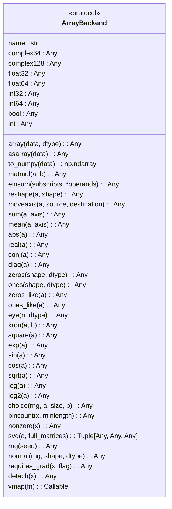
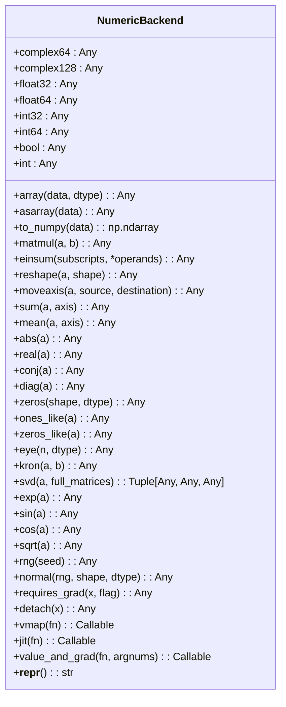
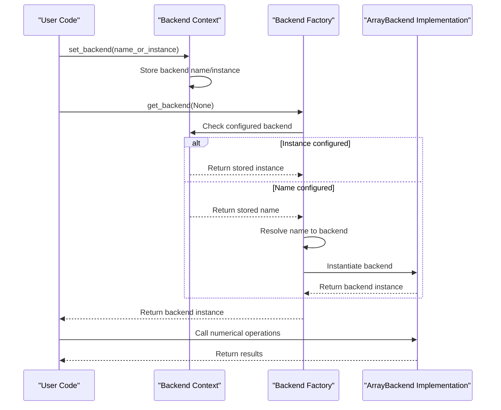
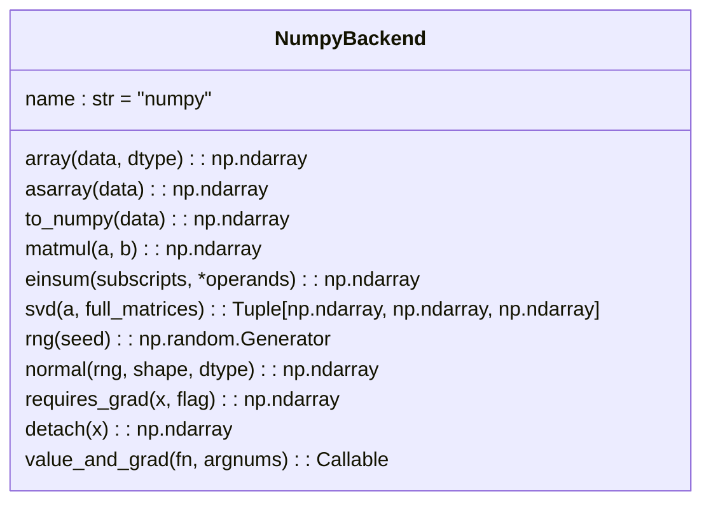
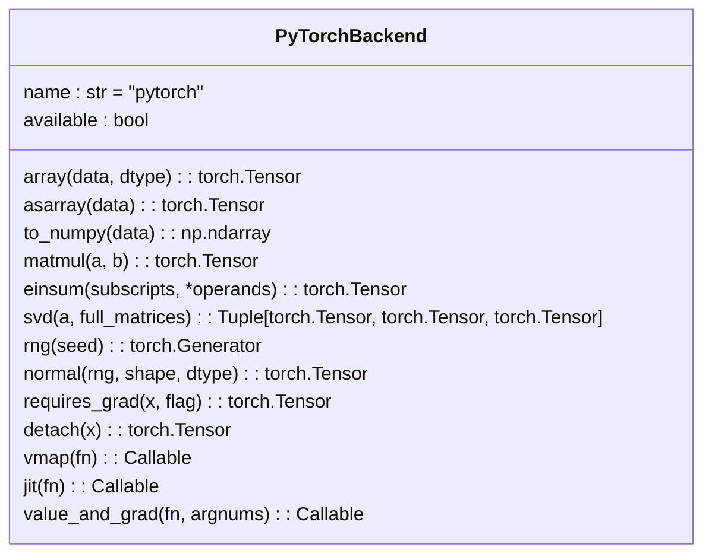
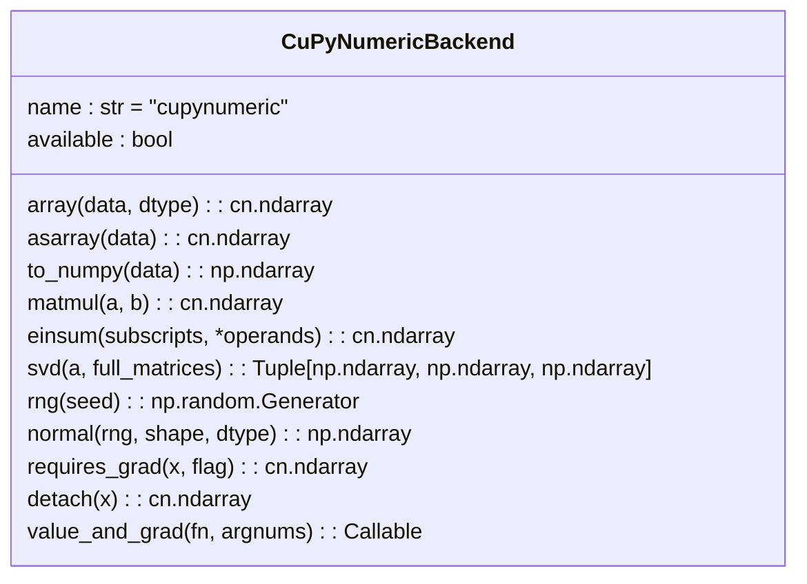
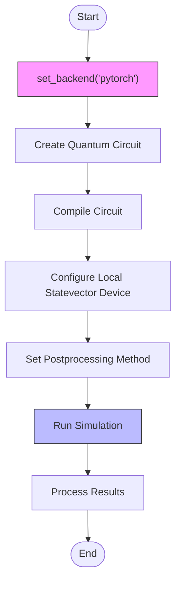

# Numerics API

<cite>
**Referenced Files in This Document**   
- [api.py](file://src/tyxonq/numerics/api.py)
- [context.py](file://src/tyxonq/numerics/context.py)
- [__init__.py](file://src/tyxonq/numerics/__init__.py)
- [numpy_backend.py](file://src/tyxonq/numerics/backends/numpy_backend.py)
- [pytorch_backend.py](file://src/tyxonq/numerics/backends/pytorch_backend.py)
- [cupynumeric_backend.py](file://src/tyxonq/numerics/backends/cupynumeric_backend.py)
- [aces_for_setting_numeric_backend.py](file://examples-ng/aces_for_setting_numeric_backend.py)
- [aces_test_for_numeric_backend.py](file://examples-ng/aces_test_for_numeric_backend.py)
</cite>

## Table of Contents
1. [Introduction](#introduction)
2. [ArrayBackend Protocol and VectorizationPolicy](#arraybackend-protocol-and-vectorizationpolicy)
3. [NumericBackend Class Interface](#numericbackend-class-interface)
4. [Backend Selection Mechanism](#backend-selection-mechanism)
5. [Supported Backends](#supported-backends)
6. [Usage Examples](#usage-examples)
7. [Integration with Simulators and Postprocessing](#integration-with-simulators-and-postprocessing)
8. [Conclusion](#conclusion)

## Introduction
The Numerics module in TyxonQ provides a unified interface for numerical computations across different computational backends. It enables seamless switching between array/tensor libraries while maintaining consistent APIs for array operations, linear algebra, random number generation, and automatic differentiation. This document details the core components of the numerics system, including the `ArrayBackend` protocol, `VectorizationPolicy`, `NumericBackend` class, and backend selection mechanism. The design supports integration with quantum simulators, postprocessing pipelines, and gradient-based optimization workflows.

## ArrayBackend Protocol and VectorizationPolicy

The `ArrayBackend` protocol defines a unified interface for array and tensor operations across different numerical computing libraries. It ensures consistent behavior regardless of the underlying implementation, enabling backend-agnostic code development.



**Diagram sources**
- [api.py](file://src/tyxonq/numerics/api.py#L18-L101)

The `VectorizationPolicy` is a type alias that defines the allowed values for controlling vectorization behavior in numerical operations. It specifies three possible policies:
- `"auto"`: Automatically determine whether to apply vectorization based on backend capabilities
- `"force"`: Force vectorization even if it may not be optimal
- `"off"`: Disable vectorization entirely

This policy mechanism allows fine-grained control over performance characteristics when executing batched operations.

**Section sources**
- [api.py](file://src/tyxonq/numerics/api.py#L15-L15)

## NumericBackend Class Interface

The `NumericBackend` class serves as a class-level proxy to the currently active numerical backend. It provides static methods that delegate to the underlying backend implementation without requiring instantiation.



**Diagram sources**
- [__init__.py](file://src/tyxonq/numerics/__init__.py#L21-L192)

The class provides comprehensive coverage of numerical operations organized into categories:
- **Data type constants**: Access to backend-specific data types through class properties
- **Array creation and conversion**: Methods for creating arrays and converting between formats
- **Algebraic operations**: Matrix multiplication, Einstein summation, and element-wise operations
- **Linear algebra**: Singular value decomposition and other matrix operations
- **Elementary mathematical functions**: Exponential, trigonometric, and logarithmic functions
- **Random number generation**: Random state management and normal distribution sampling
- **Automatic differentiation**: Gradient computation support through `requires_grad`, `detach`, and `value_and_grad`
- **Performance optimization**: Optional `vmap` and `jit` methods for vectorization and just-in-time compilation

**Section sources**
- [__init__.py](file://src/tyxonq/numerics/__init__.py#L21-L192)

## Backend Selection Mechanism

TyxonQ provides a flexible mechanism for selecting and managing numerical backends through the `set_backend` and `get_backend` functions. This system allows both global configuration and context-specific overrides.



**Diagram sources**
- [context.py](file://src/tyxonq/numerics/context.py#L17-L29)
- [api.py](file://src/tyxonq/numerics/api.py#L159-L191)

The `set_backend` function accepts either a string identifier (e.g., "numpy", "pytorch", "cupynumeric") or a direct backend instance. When a string is provided, the backend is resolved lazily upon first use. When an instance is provided, it is used directly without resolution.

The `get_backend` function implements the factory pattern to return an appropriate backend instance based on the requested name or current configuration. It handles optional dependencies gracefully, raising descriptive errors when requested backends are not available due to missing packages.

**Section sources**
- [context.py](file://src/tyxonq/numerics/context.py#L17-L29)
- [api.py](file://src/tyxonq/numerics/api.py#L159-L191)

## Supported Backends

TyxonQ supports three primary numerical backends, each with specific capabilities and use cases.

### NumPy Backend
The NumPy backend provides CPU-based numerical computing using the standard NumPy library. It serves as the default fallback and is suitable for small to medium-scale computations.



**Diagram sources**
- [numpy_backend.py](file://src/tyxonq/numerics/backends/numpy_backend.py#L1-L165)

Key characteristics:
- Pure CPU execution
- No native automatic differentiation (finite-difference approximation provided)
- Minimal dependencies
- Ideal for prototyping and small-scale simulations

### PyTorch Backend
The PyTorch backend leverages the PyTorch library for both CPU and GPU computing with native automatic differentiation support.



**Diagram sources**
- [pytorch_backend.py](file://src/tyxonq/numerics/backends/pytorch_backend.py#L1-L259)

Key characteristics:
- CPU and GPU support
- Native automatic differentiation via PyTorch's autograd
- JIT compilation support through `torch.compile`
- Vectorization via `torch.func.vmap`
- Required dependency: torch

### CuPyNumeric Backend
The CuPyNumeric backend provides GPU-accelerated computing through the CuPyNumeric library, designed for high-performance numerical computations.



**Diagram sources**
- [cupynumeric_backend.py](file://src/tyxonq/numerics/backends/cupynumeric_backend.py#L1-L255)

Key characteristics:
- GPU acceleration for compute-intensive operations
- NumPy-compatible API for easy migration
- Fallback to CPU for operations not supported on GPU (e.g., SVD)
- Required dependency: cupynumeric
- Limited automatic differentiation (finite-difference approximation)

**Section sources**
- [numpy_backend.py](file://src/tyxonq/numerics/backends/numpy_backend.py#L1-L165)
- [pytorch_backend.py](file://src/tyxonq/numerics/backends/pytorch_backend.py#L1-L259)
- [cupynumeric_backend.py](file://src/tyxonq/numerics/backends/cupynumeric_backend.py#L1-L255)

## Usage Examples

The following examples demonstrate how to use the numerics API for backend switching and numerical operations.



**Diagram sources**
- [aces_for_setting_numeric_backend.py](file://examples-ng/aces_for_setting_numeric_backend.py#L1-L50)
- [aces_test_for_numeric_backend.py](file://examples-ng/aces_test_for_numeric_backend.py#L1-L44)

Example 1: Setting backend and running a Bell state circuit
```python
import tyxonq as tq

def demo_with(backend_name: str = "numpy"):
    tq.set_backend(backend_name)
    c = tq.Circuit(2).H(0).CX(0, 1)
    c.measure_z(0).measure_z(1)
    results = (
        c.compile()
         .device(provider="local", device="statevector", shots=0)
         .postprocessing(method=None)
         .run()
    )
    print(f"[{backend_name}] results:", results)
    return results
```

Example 2: Switching between available backends
```python
def demo():
    out = []
    out.append(demo_with("numpy"))
    try:
        out.append(demo_with("pytorch"))
    except Exception:
        pass
    try:
        import cupynumeric
        out.append(demo_with("cupynumeric"))
    except Exception:
        pass
    return out
```

These examples show how to configure the global backend and execute quantum circuits with different numerical backends, allowing comparison of performance and results across implementations.

**Section sources**
- [aces_for_setting_numeric_backend.py](file://examples-ng/aces_for_setting_numeric_backend.py#L1-L50)
- [aces_test_for_numeric_backend.py](file://examples-ng/aces_test_for_numeric_backend.py#L1-L44)

## Integration with Simulators and Postprocessing

The numerics system integrates seamlessly with quantum simulators and postprocessing pipelines in TyxonQ. When a circuit is executed on a local simulator, the numerical backend handles all array operations required for state evolution, measurement, and result processing.

The integration follows this workflow:
1. Circuit compilation generates an intermediate representation
2. Simulator selects appropriate numerical backend based on global configuration
3. Statevector or density matrix evolution uses backend-specific array operations
4. Measurement outcomes are processed using backend-appropriate statistical methods
5. Postprocessing steps (e.g., error mitigation, classical shadows) leverage the same backend
6. Gradient computation for variational algorithms uses automatic differentiation when available

This unified approach ensures consistency across the computational pipeline while allowing performance optimization through backend selection. For example, PyTorch backend enables end-to-end differentiable quantum-classical workflows, while CuPyNumeric accelerates large-scale statevector simulations on GPU hardware.

**Section sources**
- [aces_for_setting_numeric_backend.py](file://examples-ng/aces_for_setting_numeric_backend.py#L1-L50)
- [aces_test_for_numeric_backend.py](file://examples-ng/aces_test_for_numeric_backend.py#L1-L44)

## Conclusion
The Numerics module in TyxonQ provides a flexible, extensible framework for numerical computations in quantum computing workflows. By abstracting array operations behind the `ArrayBackend` protocol and providing a unified `NumericBackend` interface, it enables seamless switching between computational backends without modifying application code. The backend selection mechanism supports both global configuration and context-specific overrides, accommodating diverse performance requirements and hardware availability. Integration with simulators, postprocessing, and gradient computation pipelines creates a cohesive ecosystem for quantum algorithm development and execution across different computational environments.