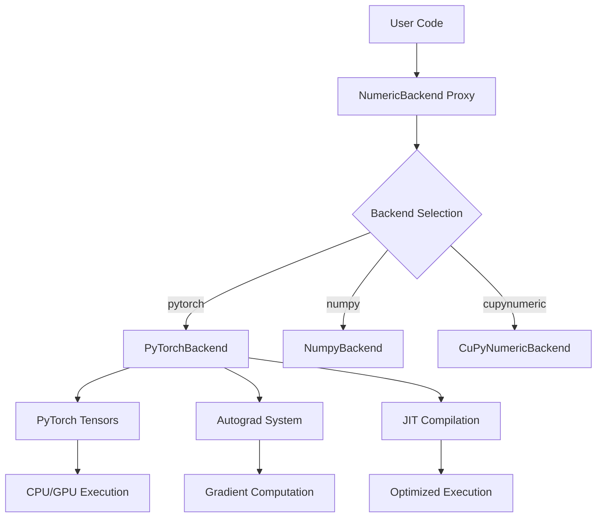
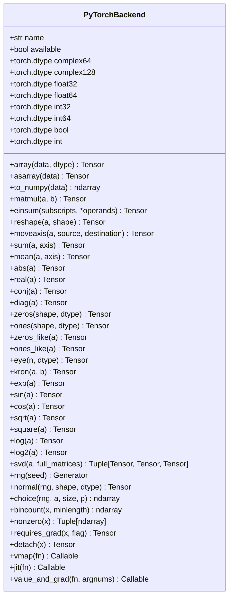
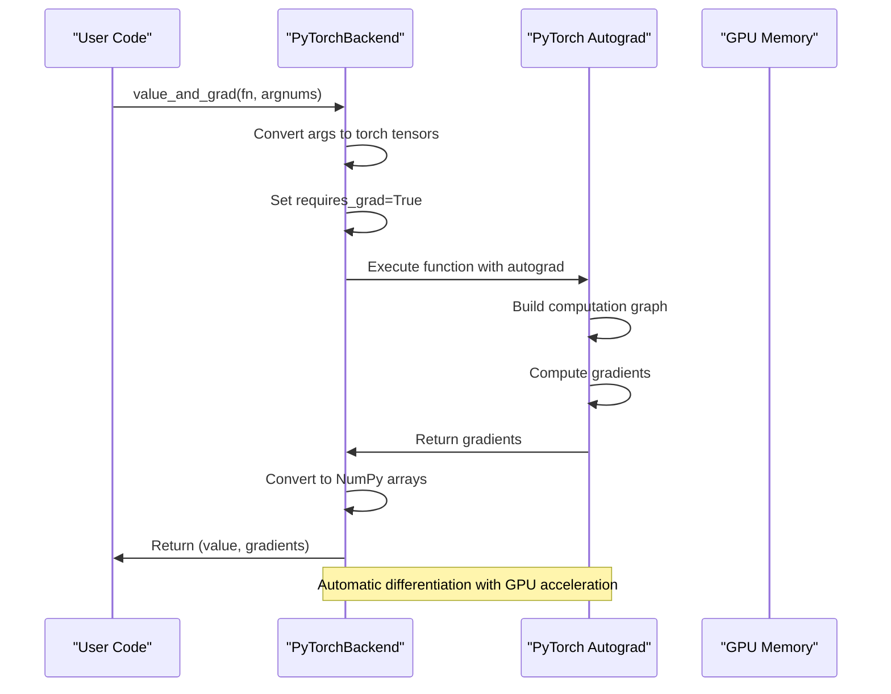
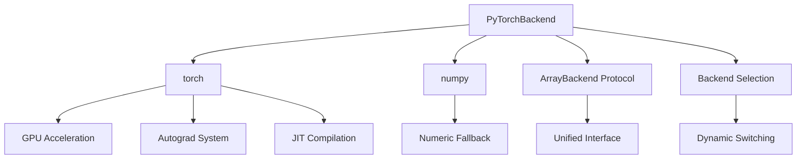

# PyTorch Backend

<cite>
**Referenced Files in This Document**   
- [pytorch_backend.py](file://src/tyxonq/numerics/backends/pytorch_backend.py)
- [api.py](file://src/tyxonq/numerics/api.py)
- [__init__.py](file://src/tyxonq/numerics/__init__.py)
- [config.py](file://src/tyxonq/config.py)
- [sample_value_gradient.py](file://examples/sample_value_gradient.py)
- [autograd_vs_counts.py](file://examples/autograd_vs_counts.py)
- [hybrid_gpu_pipeline.py](file://examples-ng/hybrid_gpu_pipeline.py)
- [2_tc_vg.py](file://examples-ng/apicomparison/2_tc_vg.py)
</cite>

## Table of Contents
1. [Introduction](#introduction)
2. [Architecture Overview](#architecture-overview)
3. [Core Components](#core-components)
4. [Detailed Component Analysis](#detailed-component-analysis)
5. [Dependency Analysis](#dependency-analysis)
6. [Performance Considerations](#performance-considerations)
7. [Troubleshooting Guide](#troubleshooting-guide)
8. [Conclusion](#conclusion)

## Introduction
The PyTorch backend in TyxonQ provides a high-performance tensor computation engine with native support for GPU acceleration and automatic differentiation. It implements the ArrayBackend protocol using PyTorch tensors and operations, enabling seamless integration with quantum machine learning workflows and differentiable quantum circuits. This backend is specifically designed for gradient-based optimization in variational algorithms, leveraging PyTorch's autograd system for efficient gradient computation. The implementation includes conditional import mechanisms to handle optional dependencies and provides JIT compilation capabilities through torch.jit for performance optimization.

## Architecture Overview
The PyTorch backend architecture follows a modular design pattern where PyTorchBackend implements the ArrayBackend protocol. The system integrates with TyxonQ's numeric abstraction layer, allowing users to switch between different computational backends (numpy, pytorch, cupynumeric) without modifying their core algorithm code. The backend provides a comprehensive set of tensor operations that map directly to PyTorch functions, ensuring optimal performance and memory efficiency. It supports both CPU and GPU computation through PyTorch's device abstraction, with automatic data transfer between devices when necessary.

**Diagram sources**
- [pytorch_backend.py](file://src/tyxonq/numerics/backends/pytorch_backend.py#L12-L256)
- [api.py](file://src/tyxonq/numerics/api.py#L26-L58)

## Core Components
The PyTorchBackend class serves as the primary component, implementing all required methods of the ArrayBackend protocol. Key components include tensor creation and manipulation functions, mathematical operations, linear algebra routines, and specialized methods for automatic differentiation and JIT compilation. The backend provides seamless conversion between PyTorch tensors and NumPy arrays through the to_numpy method, facilitating interoperability with other scientific computing libraries. The implementation includes robust error handling for cases where PyTorch is not available, ensuring graceful degradation to alternative backends.

**Section sources**
- [pytorch_backend.py](file://src/tyxonq/numerics/backends/pytorch_backend.py#L12-L256)
- [api.py](file://src/tyxonq/numerics/api.py#L26-L58)

## Detailed Component Analysis

### PyTorchBackend Implementation
The PyTorchBackend class implements the ArrayBackend protocol with comprehensive tensor operations. It provides methods for array creation (array, zeros, ones), mathematical operations (exp, sin, cos), linear algebra (svd, matmul), and specialized quantum computing operations (kron, einsum). The implementation leverages PyTorch's optimized C++ backend for maximum performance while maintaining a Pythonic interface.

#### Class Structure

**Diagram sources**
- [pytorch_backend.py](file://src/tyxonq/numerics/backends/pytorch_backend.py#L12-L256)

### GPU Acceleration and Automatic Differentiation
The PyTorch backend fully supports GPU acceleration through PyTorch's device abstraction. Tensors can be moved between CPU and GPU memory using standard PyTorch methods, enabling high-performance computation on compatible hardware. The backend integrates with PyTorch's autograd system to provide automatic differentiation capabilities, which are essential for gradient-based optimization in variational quantum algorithms. The requires_grad and detach methods provide fine-grained control over gradient computation and memory management.

#### Gradient Computation Flow

**Diagram sources**
- [pytorch_backend.py](file://src/tyxonq/numerics/backends/pytorch_backend.py#L199-L256)
- [autograd_vs_counts.py](file://examples/autograd_vs_counts.py#L45-L90)

### JIT Compilation and Vectorization
The backend supports JIT compilation through PyTorch's torch.compile functionality, which can significantly improve execution performance for repeated operations. The jit method attempts to compile functions using torch.compile, falling back to the original function if compilation fails. The vmap method provides vectorization capabilities, either through PyTorch's native vmap function or through a generic fallback implementation. These features enable high-performance execution of quantum algorithms with minimal overhead.

**Section sources**
- [pytorch_backend.py](file://src/tyxonq/numerics/backends/pytorch_backend.py#L248-L256)
- [api.py](file://src/tyxonq/numerics/api.py#L127-L166)

## Dependency Analysis
The PyTorch backend has a conditional dependency on the PyTorch library, which is imported within a try-except block to handle cases where PyTorch is not installed. The backend checks for PyTorch availability during initialization and sets the available flag accordingly. It depends on the ArrayBackend protocol definition in api.py and integrates with the global backend selection mechanism in __init__.py. The implementation also relies on NumPy for certain operations in the numeric fallback path, particularly in the value_and_grad method.

**Diagram sources**
- [pytorch_backend.py](file://src/tyxonq/numerics/backends/pytorch_backend.py#L1-L259)
- [api.py](file://src/tyxonq/numerics/api.py#L0-L194)

## Performance Considerations
The PyTorch backend offers significant performance advantages for quantum machine learning applications, particularly when using GPU acceleration. The JIT compilation feature can provide substantial speedups for repeated operations by optimizing the computation graph. However, there are some overhead considerations: the conditional import mechanism adds minimal startup time, and the numeric fallback in value_and_grad may be slower than native autograd computation. For optimal performance, users should ensure that PyTorch is properly installed with CUDA support when using GPU acceleration, and should leverage JIT compilation for computationally intensive operations.

## Troubleshooting Guide
Common issues with the PyTorch backend typically relate to installation and configuration. If PyTorch is not installed, the backend will raise a RuntimeError when selected. Users should ensure that PyTorch is installed via pip install torch or conda install pytorch. For GPU acceleration, users must install the appropriate CUDA-enabled version of PyTorch. The backend's conditional import mechanism may cause confusion if PyTorch is installed but not functioning correctly; in such cases, checking the torch installation with import torch and torch.cuda.is_available() can help diagnose issues. When using value_and_grad, users should ensure that their functions are compatible with PyTorch's autograd system, avoiding operations that break the computation graph.

**Section sources**
- [pytorch_backend.py](file://src/tyxonq/numerics/backends/pytorch_backend.py#L3-L11)
- [config.py](file://src/tyxonq/config.py#L70-L96)

## Conclusion
The PyTorch backend in TyxonQ provides a powerful and flexible computational engine for quantum machine learning and differentiable quantum circuits. By implementing the ArrayBackend protocol with PyTorch tensors and operations, it enables seamless integration of quantum algorithms with deep learning workflows. The backend's support for GPU acceleration, automatic differentiation, and JIT compilation makes it particularly well-suited for gradient-based optimization in variational algorithms. Its conditional import mechanism ensures robust operation even when PyTorch is not available, while the unified interface allows users to switch between computational backends without modifying their core algorithm code. This design enables researchers and developers to leverage the full power of PyTorch's ecosystem while maintaining compatibility with TyxonQ's quantum computing capabilities.