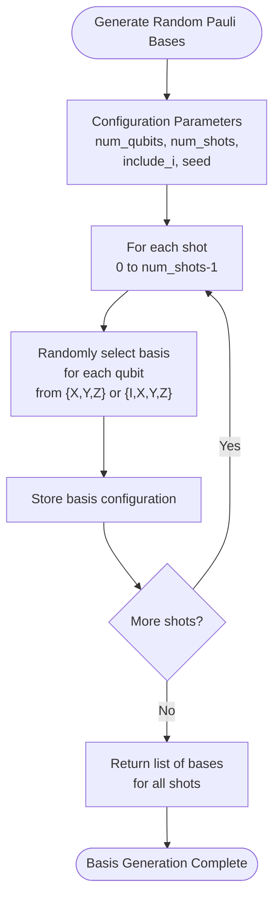
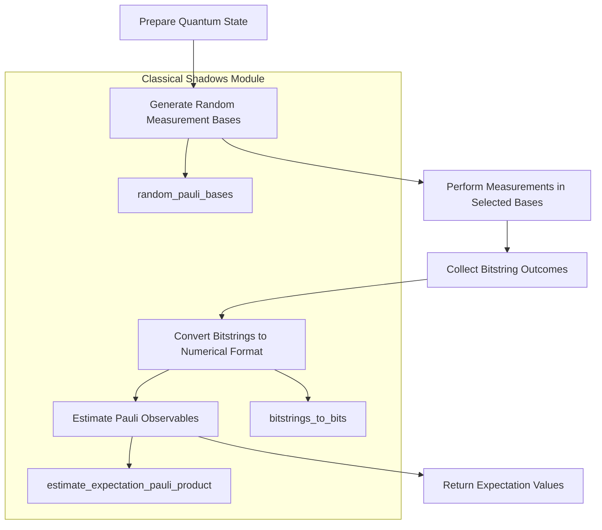
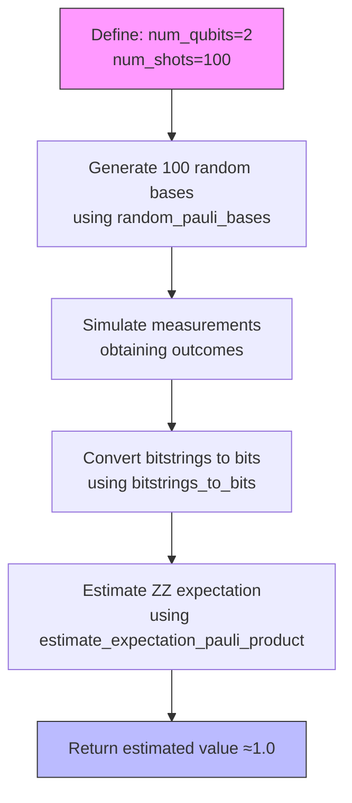

# Classical Shadows

<cite>
**Referenced Files in This Document**   
- [classical_shadows.py](file://src/tyxonq/postprocessing/classical_shadows.py)
- [test_postprocessing_shadows.py](file://tests_core_module/test_postprocessing_shadows.py)
</cite>

## Table of Contents
1. [Introduction](#introduction)
2. [Core Functions](#core-functions)
3. [Classical Shadow Estimation Workflow](#classical-shadow-estimation-workflow)
4. [Usage Examples](#usage-examples)
5. [Function Reference](#function-reference)
6. [Conclusion](#conclusion)

## Introduction

The classical_shadows module in TyxonQ provides a set of lightweight utilities for implementing the classical shadow formalism, a powerful technique for efficiently estimating quantum observables with minimal measurements. This postprocessing layer enables the reconstruction of Pauli observables from randomized measurement data, allowing for the estimation of many observables from a single set of measurements. The approach is particularly valuable in variational quantum algorithms where multiple observable evaluations are required, as it significantly reduces the measurement overhead compared to traditional methods.

Classical shadows work by performing random Pauli measurements on a quantum state and then using the resulting data to reconstruct the expectation values of target observables. This method provides a way to estimate many different observables from the same measurement data, making it highly efficient for applications like variational quantum eigensolvers (VQE) and quantum machine learning.

**Section sources**
- [classical_shadows.py](file://src/tyxonq/postprocessing/classical_shadows.py#L1-L10)

## Core Functions

The classical_shadows module provides several key functions for generating randomized measurement bases and estimating observables. These functions work together to implement the classical shadow formalism, enabling efficient post-processing of quantum measurement data.

### Random Pauli Basis Generation

The module includes two functions for generating random Pauli measurement bases: `random_pauli_basis` for single-shot basis selection and `random_pauli_bases` for generating bases across multiple shots. These functions select measurement bases uniformly at random from the Pauli operators {X, Y, Z}, or optionally including the identity operator I when the `include_i` parameter is set to True.

The random basis selection is essential for the classical shadow protocol, as it ensures that measurements are performed in a diverse set of bases, enabling the reconstruction of various observables from the same dataset. The functions support optional seeding for reproducible results, which is particularly useful for testing and debugging.

**Diagram sources**
- [classical_shadows.py](file://src/tyxonq/postprocessing/classical_shadows.py#L13-L44)

### Expectation Value Estimation

The module provides utilities for estimating expectation values from measurement data. The `estimate_z_from_counts` function computes single-qubit Z expectation values directly from bitstring counts, while the core `estimate_expectation_pauli_product` function implements the full classical shadow protocol for arbitrary Pauli observables.

These estimation functions are designed to work with the output of quantum circuit executions, converting raw measurement data into meaningful physical quantities. The estimation process involves analyzing the correlation between measurement bases and outcomes to reconstruct the expectation value of the target observable.

**Section sources**
- [classical_shadows.py](file://src/tyxonq/postprocessing/classical_shadows.py#L24-L102)

## Classical Shadow Estimation Workflow

The classical shadow estimation process follows a systematic workflow that transforms quantum measurement data into observable estimates. This workflow consists of several key steps that leverage the functions provided in the classical_shadows module.

**Diagram sources**
- [classical_shadows.py](file://src/tyxonq/postprocessing/classical_shadows.py#L13-L102)

The workflow begins with the preparation of a quantum state through a quantum circuit. Then, random Pauli measurement bases are generated for each qubit and shot using the `random_pauli_bases` function. Measurements are performed in these randomly selected bases, and the resulting bitstring outcomes are collected. These bitstrings are then converted to a numerical format using `bitstrings_to_bits`, preparing them for post-processing. Finally, the `estimate_expectation_pauli_product` function uses the bases and outcomes to estimate the expectation value of the target Pauli observable.

This approach allows for the estimation of multiple observables from the same measurement data, as different Pauli products can be evaluated using the same set of bases and outcomes. The efficiency of this method makes it particularly suitable for variational algorithms where many observable evaluations are required during optimization.

## Usage Examples

The classical_shadows module can be integrated into quantum workflows to estimate observables efficiently. The following examples demonstrate typical usage patterns for the module's functions.

### Basic Pauli Measurement Simulation

**Diagram sources**
- [classical_shadows.py](file://src/tyxonq/postprocessing/classical_shadows.py#L62-L102)
- [test_postprocessing_shadows.py](file://tests_core_module/test_postprocessing_shadows.py#L28-L36)

This example demonstrates a complete workflow for estimating the expectation value of a ZZ operator on a Bell state. The test case in the codebase verifies that when measuring a Bell state |Φ+⟩ in the Z-basis repeatedly, the estimated expectation value of Z⊗Z is approximately 1.0, which matches the theoretical value.

### Single-Qubit Z Expectation

The `estimate_z_from_counts` function provides a direct way to compute single-qubit Z expectation values from measurement counts. For example, with counts {"0": 75, "1": 25} on a single qubit, the function correctly computes the expectation value as 0.5, reflecting the probability difference between the |0⟩ and |1⟩ states.

This functionality is useful for quick analysis of single-qubit measurements and can be used independently of the full classical shadow protocol when only single-qubit observables are of interest.

**Section sources**
- [classical_shadows.py](file://src/tyxonq/postprocessing/classical_shadows.py#L24-L37)
- [test_postprocessing_shadows.py](file://tests_core_module/test_postprocessing_shadows.py#L20-L26)

## Function Reference

### random_pauli_basis
Generates a random single-qubit Pauli basis configuration for a specified number of qubits. Returns a list of length `num_qubits` with entries from {X, Y, Z} by default, or {I, X, Y, Z} if `include_i=True`. Supports optional seeding for reproducible results.

**Section sources**
- [classical_shadows.py](file://src/tyxonq/postprocessing/classical_shadows.py#L13-L21)

### random_pauli_bases
Generates multiple random Pauli basis configurations for repeated measurements. Returns a list of `num_shots` basis configurations, each containing a measurement basis for every qubit. This function is typically used to prepare the measurement schedule for classical shadow experiments.

**Section sources**
- [classical_shadows.py](file://src/tyxonq/postprocessing/classical_shadows.py#L40-L44)

### estimate_z_from_counts
Estimates the Z expectation value on a specific qubit from bitstring counts. Assumes little-endian bitstring representation where the rightmost bit corresponds to qubit 0. Handles edge cases such as empty counts and automatically pads bitstrings if necessary.

**Section sources**
- [classical_shadows.py](file://src/tyxonq/postprocessing/classical_shadows.py#L24-L37)

### bitstrings_to_bits
Converts a sequence of little-endian bitstring representations to numerical arrays. Processes each bitstring by stripping whitespace, padding if necessary, and reversing the order to match the little-endian convention where index 0 corresponds to qubit 0.

**Section sources**
- [classical_shadows.py](file://src/tyxonq/postprocessing/classical_shadows.py#L47-L59)

### estimate_expectation_pauli_product
Core function for estimating the expectation value of a Pauli product observable using the classical shadow formalism. Takes the number of qubits, a specification of the target Pauli operator, the measurement bases used, and the measurement outcomes to compute the estimated expectation value.

**Section sources**
- [classical_shadows.py](file://src/tyxonq/postprocessing/classical_shadows.py#L62-L102)

## Conclusion

The classical_shadows module in TyxonQ provides an efficient implementation of the classical shadow formalism for quantum observable estimation. By leveraging random Pauli measurements and post-processing techniques, this module enables the estimation of multiple observables with significantly fewer measurements than traditional methods. The functions are designed to be lightweight and easy to integrate into existing quantum workflows, making them valuable tools for variational algorithms and other applications requiring frequent observable evaluation. The module's comprehensive test coverage ensures reliability and correctness, while its simple interface makes it accessible for both research and practical applications in quantum computing.