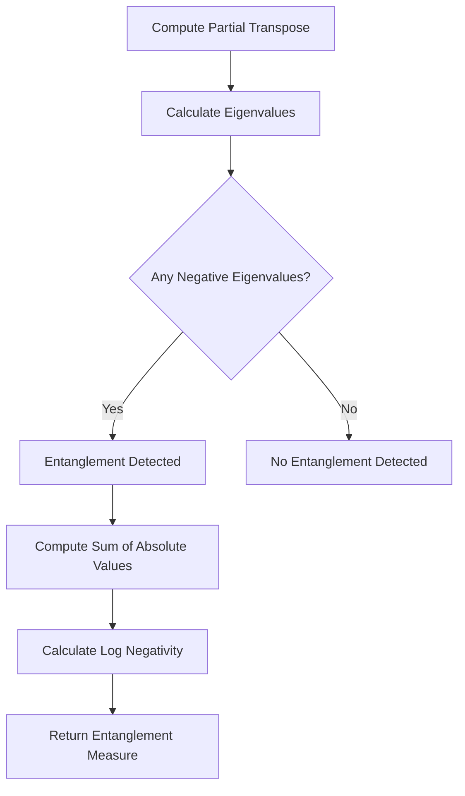

# Metrics and Analysis

<cite>
**Referenced Files in This Document**   
- [metrics.py](file://src/tyxonq/postprocessing/metrics.py)
</cite>

## Table of Contents
1. [Introduction](#introduction)
2. [Statistical and Quantum Information Metrics](#statistical-and-quantum-information-metrics)
3. [Quantum State Metrics](#quantum-state-metrics)
4. [Thermodynamic Quantities](#thermodynamic-quantities)
5. [Entanglement Measures](#entanglement-measures)
6. [Subsystem Analysis Utilities](#subsystem-analysis-utilities)
7. [Numerical Stability and Performance](#numerical-stability-and-performance)
8. [Interpretation and Application](#interpretation-and-application)

## Introduction

The metrics module in TyxonQ's postprocessing system provides a comprehensive suite of analytical tools for quantum computation and quantum information processing. This module enables researchers and developers to extract meaningful insights from quantum simulations and experimental results by computing various statistical, thermodynamic, and entanglement-related quantities. The implementation is designed to be lightweight and dependency-free, focusing on core mathematical operations essential for quantum algorithm analysis and verification.

The metrics module supports analysis of both discrete measurement outcomes (bitstring counts) and continuous quantum state representations (density matrices and state vectors). It provides functions for probability distribution conversion, distribution comparison, observable evaluation, and advanced quantum information measures. These tools are essential for assessing algorithm convergence, quantifying errors, and understanding the physical properties of quantum systems under study.

**Section sources**
- [metrics.py](file://src/tyxonq/postprocessing/metrics.py#L1-L50)

## Statistical and Quantum Information Metrics

This section details the statistical and quantum information metrics available in the TyxonQ postprocessing system, which are essential for analyzing measurement outcomes and comparing probability distributions.

### Normalized Count for Probability Distribution Conversion

The `normalized_count` function converts raw measurement counts into a probability distribution by normalizing the counts. This conversion is fundamental for interpreting quantum measurement results, as it transforms discrete sampling outcomes into continuous probability values that can be used in subsequent statistical analyses. The function ensures numerical stability by preventing division by zero through a minimum shot count of 1.

### KL Divergence for Distribution Comparison

The Kullback-Leibler (KL) divergence function `kl_divergence` quantifies the difference between two probability distributions derived from measurement counts. This metric is crucial for comparing experimental results with theoretical predictions or for assessing the fidelity of quantum state preparation. The implementation includes epsilon clipping (default: 1e-12) to handle zero probabilities and ensure numerical stability during logarithmic calculations.

### Expectation for Diagonal Observable Evaluation

The `expectation` function computes the expectation value of diagonal observables from bitstring counts. It supports two modes of operation: specifying qubits measured in the Z-basis or providing custom diagonal operators for each qubit. This flexibility allows for the evaluation of arbitrary diagonal Hamiltonians or cost functions in variational quantum algorithms. The function handles both pure computational basis measurements and mixed I/Z measurements, making it suitable for a wide range of quantum algorithms.

**Section sources**
- [metrics.py](file://src/tyxonq/postprocessing/metrics.py#L15-L53)

## Quantum State Metrics

This section covers the metrics for analyzing quantum states represented as density matrices or state vectors, which are essential for characterizing quantum systems and their properties.

### Entropy and Renyi Entropy

The `entropy` function computes the von Neumann entropy of a density matrix, which quantifies the uncertainty or mixedness of a quantum state. The implementation uses eigenvalue decomposition of the density matrix, with numerical safeguards including clipping of eigenvalues to ensure they represent valid probabilities (non-negative and sum to one). The `renyi_entropy` function generalizes this concept, computing Renyi entropy of order k, which provides a family of entropy measures that can reveal different aspects of quantum correlations and information content.

### Fidelity and Trace Distance

The `fidelity` function measures the similarity between two quantum states, returning a value between 0 and 1 where 1 indicates identical states. It is computed using the Uhlmann fidelity formula, which involves matrix square roots of density operators. The `trace_distance` function provides an alternative measure of state distinguishability, representing the maximum probability of distinguishing two states through measurements. Both metrics are fundamental for quantum state tomography, benchmarking, and error analysis.

### Mutual Information

The `mutual_information` function quantifies the correlation between subsystems of a quantum system. It is computed as the sum of entropies of individual subsystems minus the entropy of the joint system. This metric is particularly valuable for analyzing entanglement structure and information flow in quantum circuits. The implementation automatically handles both pure state vectors and density matrix representations, computing reduced density matrices for subsystems as needed.

**Section sources**
- [metrics.py](file://src/tyxonq/postprocessing/metrics.py#L56-L214)

## Thermodynamic Quantities

This section describes the thermodynamic metrics available for quantum statistical mechanics applications, which connect quantum information theory with statistical physics.

### Free Energy and Renyi Free Energy

The `free_energy` function computes the Helmholtz free energy of a quantum system at a given inverse temperature (beta). It combines the expected energy (computed as the trace of ρH) with the von Neumann entropy, following the standard thermodynamic relation F = E - TS. The `renyi_free_energy` function provides a generalized version using Renyi entropy instead of von Neumann entropy, which can be useful for analyzing systems with non-standard thermodynamic behavior or for computational efficiency in certain contexts.

These thermodynamic quantities are essential for studying quantum phase transitions, thermalization in closed quantum systems, and the performance of quantum algorithms for quantum chemistry and materials science. The implementation includes numerical safeguards to handle edge cases such as zero-temperature limits or nearly degenerate energy spectra.

**Section sources**
- [metrics.py](file://src/tyxonq/postprocessing/metrics.py#L78-L89)

## Entanglement Measures

This section details the entanglement measures implemented in the module, which are crucial for characterizing quantum correlations in multipartite systems.

### Partial Transpose Method

The entanglement measures are based on the partial transpose operation, implemented in the `partial_transpose` function. This operation transposes the density matrix with respect to a specified subset of qubits, which is a fundamental step in detecting entanglement through the Peres-Horodecki criterion. The implementation efficiently reshapes the density matrix into a tensor representation, swaps the appropriate indices, and then reshapes back to matrix form.

### Entanglement Negativity and Log Negativity

The `entanglement_negativity` and `log_negativity` functions quantify entanglement using the spectrum of the partially transposed density matrix. Entanglement negativity is defined as the sum of the absolute values of the negative eigenvalues of the partially transposed state, while log negativity provides a logarithmic scaling that makes it an entanglement monotone. These measures are particularly valuable because they can detect bound entanglement and are computable for mixed states, unlike simpler entanglement measures that only work for pure states.

The implementation handles numerical precision issues by working with the eigenvalues of the partially transposed matrix and provides options for different logarithmic bases in the log negativity calculation.

**Diagram sources**
- [metrics.py](file://src/tyxonq/postprocessing/metrics.py#L133-L160)

**Section sources**
- [metrics.py](file://src/tyxonq/postprocessing/metrics.py#L133-L160)

## Subsystem Analysis Utilities

This section covers the utilities for analyzing subsystems of larger quantum systems, which are essential for studying localized properties and reduced dynamics.

### Reduced Density Matrix

The `reduced_density_matrix` function computes the density matrix of a subsystem by tracing out specified qubits from the full system state. This operation is fundamental for analyzing local properties, computing subsystem entropies, and studying open quantum system dynamics. The implementation handles both pure state vectors and density matrix inputs, using tensor reshaping and contraction operations to efficiently compute the partial trace. For pure states with measurement probabilities, it supports weighted averaging over measurement outcomes.

### Reduced Wavefunction

The `reduced_wavefunction` function projects a quantum state onto specific measurement outcomes for a subset of qubits and returns the resulting state of the remaining qubits. This operation is essential for analyzing post-measurement states, implementing measurement-based quantum computing protocols, and studying quantum error correction. The function allows specification of both the qubits to measure and the desired measurement outcomes, with default behavior of projecting onto the all-zero measurement outcome.

These utilities enable detailed analysis of quantum systems at various scales, from individual qubits to complex multipartite entangled states.

**Section sources**
- [metrics.py](file://src/tyxonq/postprocessing/metrics.py#L163-L278)

## Numerical Stability and Performance

This section addresses the numerical considerations and performance implications of the metrics implementation.

### Epsilon Clipping and Numerical Safeguards

The metrics module incorporates several numerical stability measures to handle floating-point precision limitations and edge cases. Epsilon clipping (typically 1e-12) is used throughout the implementation to prevent division by zero, ensure positive definiteness of density matrices, and handle logarithmic calculations with near-zero probabilities. Eigenvalue clipping ensures that density matrix eigenvalues remain within valid probability bounds [0,1], and trace normalization prevents accumulation of numerical errors in iterative calculations.

### Performance Implications of Eigenvalue Decompositions

Many quantum metrics, particularly those involving entropy and fidelity calculations, require eigenvalue decompositions of density matrices. These operations have O(n³) complexity for n×n matrices, making them computationally expensive for large systems. The implementation leverages efficient LAPACK routines through NumPy, but users should be aware of the scaling when analyzing systems with more than approximately 15 qubits, where the 2^n×2^n density matrices become computationally challenging.

The module avoids unnecessary recomputation by structuring functions to reuse intermediate results when possible, and the lightweight design minimizes memory overhead. For very large systems, alternative approaches such as tensor network representations may be more appropriate, though they are outside the scope of this metrics module.

**Section sources**
- [metrics.py](file://src/tyxonq/postprocessing/metrics.py#L1-L304)

## Interpretation and Application

This section provides guidance on interpreting metric values in the context of quantum algorithm development and error analysis.

### Algorithm Convergence Monitoring

The metrics in this module are invaluable for monitoring the convergence of variational quantum algorithms. Expectation values of problem Hamiltonians can track optimization progress, while entropy measures can indicate whether the system is reaching a pure ground state. KL divergence between successive iterations can quantify the rate of convergence, and fidelity with respect to a target state provides a direct measure of solution quality.

### Error Analysis Framework

The suite of metrics enables comprehensive error analysis of quantum computations. Trace distance and fidelity can quantify errors introduced by noise, imperfect gates, or finite sampling. Comparing theoretical predictions with experimental results using KL divergence helps identify systematic errors in quantum hardware. Entanglement measures can reveal unintended correlations introduced by crosstalk or other error mechanisms.

### Best Practices for Metric Selection

When analyzing quantum systems, selecting appropriate metrics depends on the specific question being addressed. For state characterization, fidelity and trace distance provide complementary perspectives on state similarity. For correlation analysis, mutual information and entanglement negativity reveal different aspects of quantum and classical correlations. Thermodynamic quantities are most relevant for systems at finite temperature or when studying thermalization dynamics.

Users should consider the computational cost of metrics involving full density matrices versus those computable from measurement samples alone, and balance numerical precision requirements with performance constraints in their specific applications.

**Section sources**
- [metrics.py](file://src/tyxonq/postprocessing/metrics.py#L1-L304)