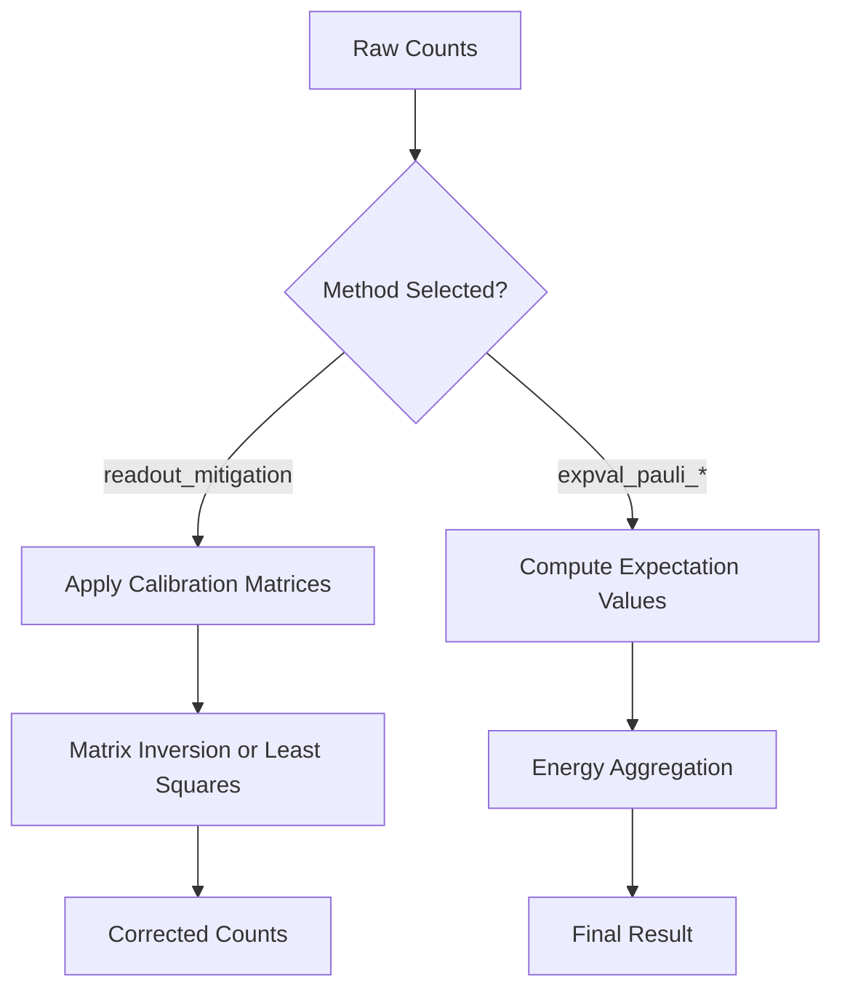
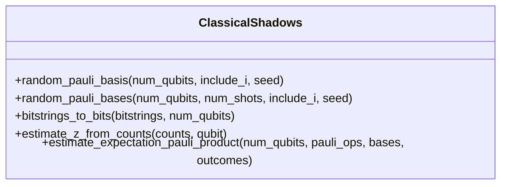
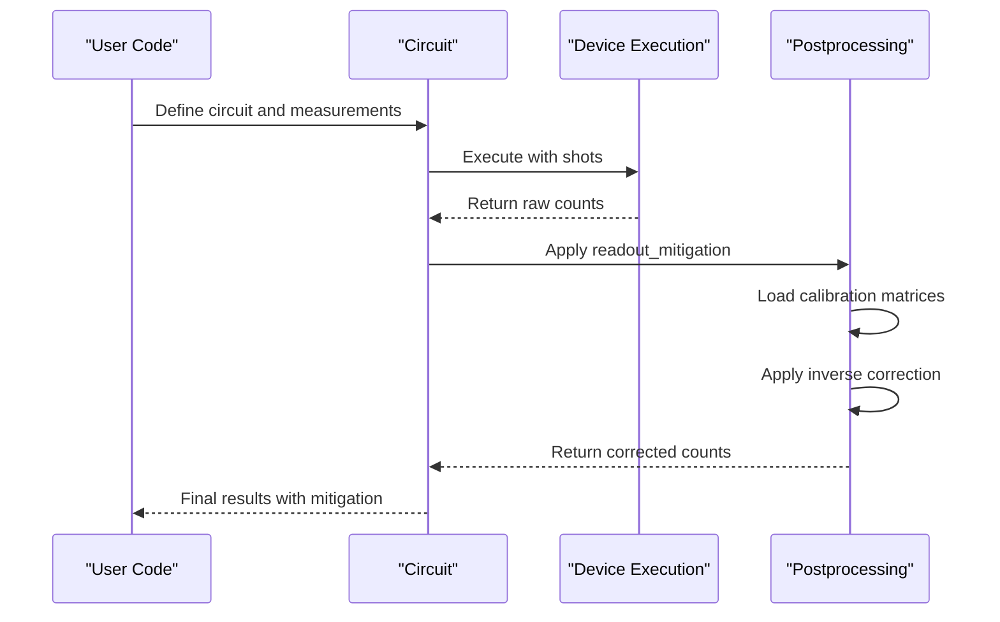

# Postprocessing API

<cite>
**Referenced Files in This Document**   
- [apply_postprocessing](file://src/tyxonq/postprocessing/__init__.py#L15-L132)
- [classical_shadows.py](file://src/tyxonq/postprocessing/classical_shadows.py)
- [counts_expval.py](file://src/tyxonq/postprocessing/counts_expval.py)
- [error_mitigation.py](file://src/tyxonq/postprocessing/error_mitigation.py)
- [io.py](file://src/tyxonq/postprocessing/io.py)
- [metrics.py](file://src/tyxonq/postprocessing/metrics.py)
- [readout.py](file://src/tyxonq/postprocessing/readout.py)
- [readout_mitigation.py](file://examples/readout_mitigation.py)
</cite>

## Table of Contents
1. [Introduction](#introduction)
2. [Core Entry Point: apply_postprocessing](#core-entry-point-apply_postprocessing)
3. [Error Mitigation Techniques](#error-mitigation-techniques)
4. [Expectation Value Computation](#expectation-value-computation)
5. [Classical Shadows Implementation](#classical-shadows-implementation)
6. [Metrics Module for Result Analysis](#metrics-module-for-result-analysis)
7. [IO Module for Data Handling](#io-module-for-data-handling)
8. [Example Workflows](#example-workflows)
9. [Integration with Device Execution](#integration-with-device-execution)
10. [Configuration Options](#configuration-options)

## Introduction
The Postprocessing module of TyxonQ provides a comprehensive suite of tools for analyzing and refining quantum computation results. This API documentation details the core functionality available for postprocessing quantum circuit execution outputs, with a focus on error mitigation, expectation value computation, classical shadows, metrics analysis, and data handling. The module supports integration with device execution results and offers configurable methods for various postprocessing needs.

## Core Entry Point: apply_postprocessing
The `apply_postprocessing` function serves as the main entry point for the postprocessing module, implementing counts-first semantics to handle quantum measurement results. It processes a result dictionary containing measurement outcomes and applies specified postprocessing methods based on configuration options.

The function accepts two parameters: `result`, which contains the raw execution output with counts or measurement results, and `options`, which specifies the postprocessing method and associated parameters. It returns a structured dictionary containing the method applied and the processed results.

Supported methods include readout mitigation, Pauli expectation value computation, and other quantum-specific postprocessing techniques. The function handles various input formats including raw counts, statevector data, and probability distributions, making it versatile for different execution backends and simulation types.

**Section sources**
- [apply_postprocessing](file://src/tyxonq/postprocessing/__init__.py#L15-L132)

## Error Mitigation Techniques
The postprocessing module implements several error mitigation techniques to improve the accuracy of quantum computation results. The primary method is readout mitigation, which addresses measurement errors through calibration-based correction.

The `readout_mitigation` method uses calibration matrices to correct for readout errors. It supports different mitigation strategies, with "inverse" being the default method that applies matrix inversion to recover ideal counts from noisy measurements. The implementation uses per-qubit calibration matrices that are combined via Kronecker product for multi-qubit systems.

Additional error mitigation placeholders include Zero-Noise Extrapolation (ZNE), Dynamical Decoupling (DD), and Randomized Compilation (RC), which are designed for future integration with advanced error mitigation frameworks. These methods currently provide basic averaging functionality with extensibility for more sophisticated implementations.

**Diagram sources**
- [readout.py](file://src/tyxonq/postprocessing/readout.py#L0-L142)
- [error_mitigation.py](file://src/tyxonq/postprocessing/error_mitigation.py#L0-L81)

**Section sources**
- [readout.py](file://src/tyxonq/postprocessing/readout.py#L0-L142)
- [error_mitigation.py](file://src/tyxonq/postprocessing/error_mitigation.py#L0-L81)

## Expectation Value Computation
The module provides robust functionality for computing expectation values of Pauli terms and sums, which is essential for variational quantum algorithms and energy estimation in quantum chemistry applications.

The `expval_pauli_term` function computes the expectation value of a single Pauli operator product from measurement counts. For multiple terms, `expval_pauli_terms` returns a list of individual expectation values. The `expval_pauli_sum` function aggregates these values with coefficients to compute total energy, including an optional identity constant.

The implementation supports both shot-based estimation from counts and analytic computation from statevector or probability data. When calibration data is provided, readout mitigation can be applied within the expectation value computation pipeline. The functions handle various input formats and automatically infer qubit counts from measurement data.

**Section sources**
- [counts_expval.py](file://src/tyxonq/postprocessing/counts_expval.py#L0-L114)

## Classical Shadows Implementation
The classical_shadows module provides efficient estimation of quantum observables through the classical shadows protocol. This technique enables estimation of many observables from relatively few measurements by storing randomized measurement outcomes.

Key functions include `random_pauli_basis` for generating random measurement bases and `estimate_expectation_pauli_product` for computing expectation values from shadow data. The implementation supports both single-shot and batched shadow estimation, with options to include identity operations in the measurement basis selection.

The classical shadows approach is particularly valuable for estimating properties of quantum states without full state tomography, providing exponential savings in measurement requirements for certain tasks. The module includes utilities for converting between bitstring representations and numerical formats suitable for shadow processing.

**Diagram sources**
- [classical_shadows.py](file://src/tyxonq/postprocessing/classical_shadows.py#L0-L114)

**Section sources**
- [classical_shadows.py](file://src/tyxonq/postprocessing/classical_shadows.py#L0-L114)

## Metrics Module for Result Analysis
The metrics module offers a comprehensive set of functions for analyzing quantum computation results, including normalization, divergence measures, and various quantum information metrics.

Core functionality includes `normalized_count` for converting raw counts to probability distributions and `kl_divergence` for measuring statistical distance between distributions. The module provides quantum-specific metrics such as `entropy`, `fidelity`, and `trace_distance` for comparing quantum states.

Additional advanced metrics include entanglement measures like `log_negativity` and `mutual_information`, as well as thermodynamic quantities like `free_energy` and `renyi_free_energy`. The implementation is designed to be lightweight and dependency-free, using only NumPy for numerical operations.

**Section sources**
- [metrics.py](file://src/tyxonq/postprocessing/metrics.py#L0-L304)

## IO Module for Data Handling
The io module provides utilities for input/output operations related to quantum measurement data. It supports various data formats and transformations for counts, probabilities, and samples.

Key functions include `counts_to_csv` and `csv_to_counts` for CSV format conversion, `count2vec` and `vec2count` for vector representations, and `sort_count` and `reverse_count` for count manipulation. The module also includes sampling utilities like `sample2all` for converting between different data representations.

For visualization, the module provides `plot_histogram` (requiring Qiskit) and `marginal_count` for computing reduced distributions. These functions facilitate data exchange between different quantum computing frameworks and enable integration with external analysis tools.

**Section sources**
- [io.py](file://src/tyxonq/postprocessing/io.py#L0-L221)

## Example Workflows
The examples directory contains demonstrations of postprocessing workflows, with `readout_mitigation.py` providing a comprehensive example of error mitigation in practice.

This example constructs a Bell-like circuit, generates synthetic counts with readout errors, and applies mitigation to recover ideal results. It demonstrates both direct numeric application of mitigation and integration through the circuit execution pipeline. The workflow shows how calibration matrices are defined, applied, and validated through comparison of raw and corrected counts.

Additional examples in the repository illustrate various postprocessing scenarios, including expectation value computation for Hamiltonian terms and classical shadows estimation. These examples serve as templates for implementing postprocessing in quantum algorithms and applications.

**Diagram sources**
- [readout_mitigation.py](file://examples/readout_mitigation.py#L0-L133)

**Section sources**
- [readout_mitigation.py](file://examples/readout_mitigation.py#L0-L133)

## Integration with Device Execution
The postprocessing module integrates seamlessly with device execution results through the circuit execution pipeline. When executing circuits with the `.postprocessing()` method, results are automatically processed according to specified options.

The integration supports both simulator and hardware backends, with postprocessing applied after result retrieval. For statevector simulations (shots=0), the module can compute analytic expectation values directly from the statevector. For shot-based execution, it processes measurement counts through the specified postprocessing chain.

The architecture allows for chaining multiple postprocessing steps and combining results from different execution modes. This enables hybrid workflows where classical postprocessing enhances quantum computation outcomes.

**Section sources**
- [apply_postprocessing](file://src/tyxonq/postprocessing/__init__.py#L15-L132)
- [readout_mitigation.py](file://examples/readout_mitigation.py#L0-L133)

## Configuration Options
The postprocessing module offers flexible configuration options through the `options` parameter in `apply_postprocessing`. Key configuration parameters include:

- **method**: Specifies the postprocessing technique (e.g., "readout_mitigation", "expval_pauli_sum")
- **cals** or **readout_cals**: Calibration matrices for readout mitigation
- **mitigation**: Method for readout correction ("inverse" or constrained least squares)
- **terms** or **items**: Pauli terms for expectation value computation
- **identity_const**: Constant term in Hamiltonian energy calculation
- **qubits**: Specific qubits to process in partial mitigation

These options can be combined to create complex postprocessing pipelines tailored to specific quantum algorithms and hardware characteristics. The configuration system is designed to be extensible for future postprocessing methods.

**Section sources**
- [apply_postprocessing](file://src/tyxonq/postprocessing/__init__.py#L15-L132)
- [readout.py](file://src/tyxonq/postprocessing/readout.py#L0-L142)