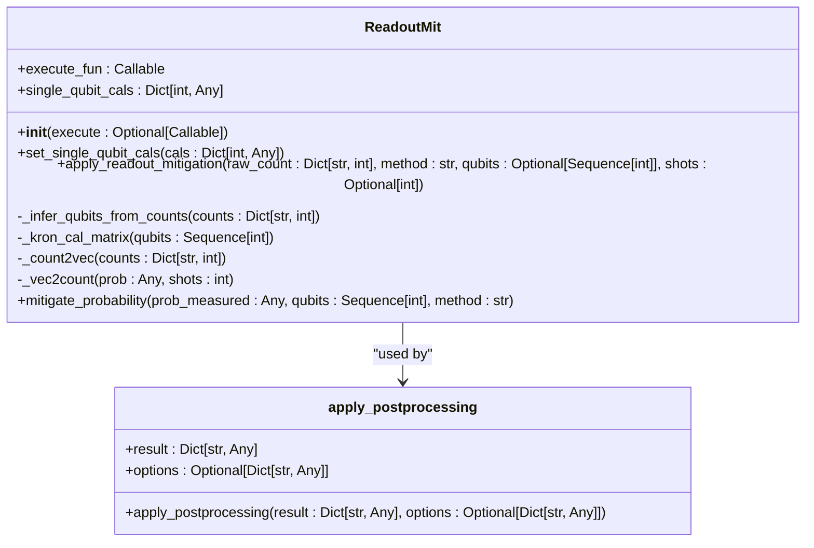
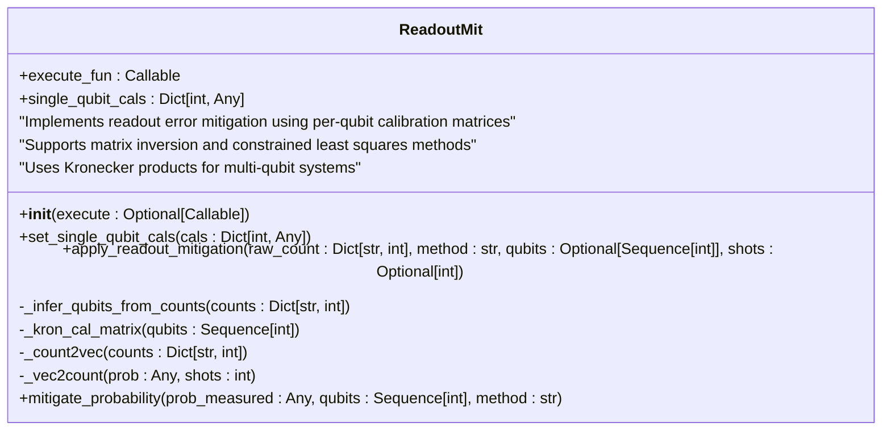
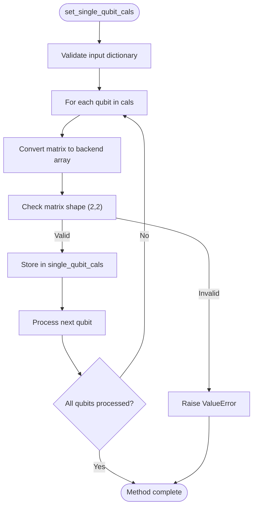
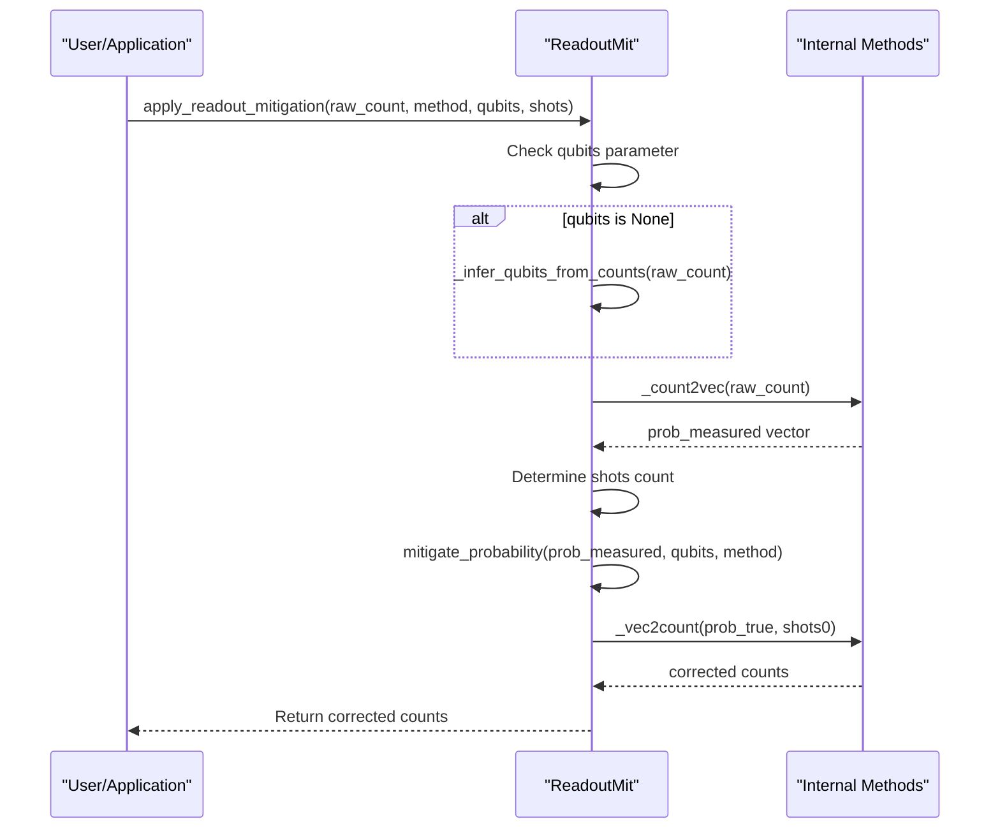
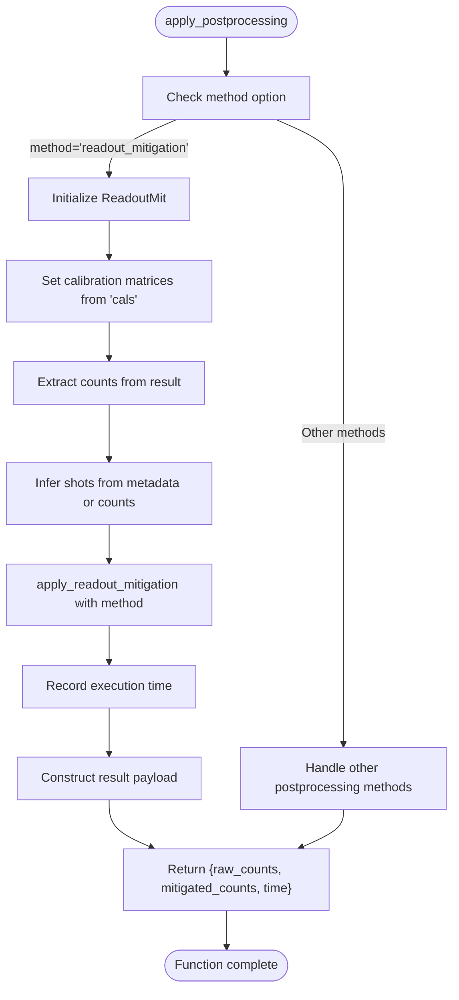

# Readout Mitigation

<cite>
**Referenced Files in This Document**   
- [readout.py](file://src/tyxonq/postprocessing/readout.py)
- [__init__.py](file://src/tyxonq/postprocessing/__init__.py)
- [readout_mitigation.py](file://examples/readout_mitigation.py)
</cite>

## Table of Contents
1. [Introduction](#introduction)
2. [Core Components](#core-components)
3. [Architecture Overview](#architecture-overview)
4. [Detailed Component Analysis](#detailed-component-analysis)
5. [Integration with apply_postprocessing](#integration-with-apply_postprocessing)
6. [Error Handling](#error-handling)
7. [Performance Considerations](#performance-considerations)
8. [Compatibility and Execution Paths](#compatibility-and-execution-paths)
9. [Conclusion](#conclusion)

## Introduction

The ReadoutMit class in TyxonQ's Postprocessing module provides a robust framework for mitigating readout errors in quantum computing experiments. This documentation details the implementation and usage of the `ReadoutMit` class, focusing on its core methods: `set_single_qubit_cals` for configuring per-qubit calibration matrices and `apply_readout_mitigation` for correcting measured counts. The system supports both numeric and device execution paths, enabling seamless integration into quantum workflows. The calibration matrices follow a row-stochastic 2x2 format that maps true probabilities to measured probabilities, with multi-qubit systems utilizing tensor product channels through Kronecker products of per-qubit matrices.

**Section sources**
- [readout.py](file://src/tyxonq/postprocessing/readout.py#L14-L136)

## Core Components

The ReadoutMit class serves as the primary interface for readout error mitigation, implementing a refactored architecture that avoids legacy module dependencies. It maintains a dictionary of single-qubit calibration matrices and provides methods to configure these calibrations and apply mitigation strategies to measured counts. The implementation leverages numeric backend operations for tensor computations while interfacing with NumPy and SciPy for optimization routines, ensuring compatibility across different execution environments.

**Section sources**
- [readout.py](file://src/tyxonq/postprocessing/readout.py#L14-L30)

## Architecture Overview

**Diagram sources**
- [readout.py](file://src/tyxonq/postprocessing/readout.py#L14-L136)
- [__init__.py](file://src/tyxonq/postprocessing/__init__.py#L15-L132)

## Detailed Component Analysis

### ReadoutMit Class Analysis

The ReadoutMit class implements a comprehensive solution for readout error mitigation in quantum computing systems. It maintains internal state through two primary fields: `execute_fun` for optional execution functions and `single_qubit_cals` for storing per-qubit calibration matrices. The class follows an initialization pattern that allows for optional execution function injection while establishing an empty dictionary for calibration data.

#### Class Diagram

**Diagram sources**
- [readout.py](file://src/tyxonq/postprocessing/readout.py#L14-L136)

**Section sources**
- [readout.py](file://src/tyxonq/postprocessing/readout.py#L14-L136)

### set_single_qubit_cals Method Analysis

The `set_single_qubit_cals` method configures the per-qubit calibration matrices that form the foundation of the readout mitigation system. It accepts a dictionary mapping qubit indices to 2x2 calibration matrices, validating each matrix's shape before storage. The method ensures data integrity by converting input matrices to the numeric backend array format and performs strict validation to maintain the expected 2x2 dimensionality.

#### Flowchart

**Diagram sources**
- [readout.py](file://src/tyxonq/postprocessing/readout.py#L32-L42)

**Section sources**
- [readout.py](file://src/tyxonq/postprocessing/readout.py#L32-L42)

### apply_readout_mitigation Method Analysis

The `apply_readout_mitigation` method implements the core functionality for correcting measured counts using configured calibration data. It serves as the primary interface for applying readout error correction, orchestrating the conversion of count data to probability vectors, applying the selected mitigation strategy, and transforming the corrected probabilities back into count format.

#### Sequence Diagram

**Diagram sources**
- [readout.py](file://src/tyxonq/postprocessing/readout.py#L130-L136)

**Section sources**
- [readout.py](file://src/tyxonq/postprocessing/readout.py#L130-L136)

## Integration with apply_postprocessing

The ReadoutMit functionality integrates with the broader postprocessing framework through the `apply_postprocessing` function, which serves as a router for various postprocessing methods. When the method option is set to 'readout_mitigation', the function instantiates a ReadoutMit object, configures it with provided calibration data, and applies mitigation to the result counts. This integration supports both direct usage and incorporation within circuit execution workflows.

**Diagram sources**
- [__init__.py](file://src/tyxonq/postprocessing/__init__.py#L15-L132)

**Section sources**
- [__init__.py](file://src/tyxonq/postprocessing/__init__.py#L15-L132)

## Error Handling

The ReadoutMit implementation includes comprehensive error handling to ensure robust operation in various scenarios. The system validates calibration matrix dimensions, handles missing qubit calibrations, and manages edge cases in probability normalization. The `apply_postprocessing` function wraps the mitigation process in exception handlers to prevent failures from propagating to the circuit execution layer, instead returning structured payloads with error indicators.

**Section sources**
- [readout.py](file://src/tyxonq/postprocessing/readout.py#L38-L40)
- [__init__.py](file://src/tyxonq/postprocessing/__init__.py#L50-L55)

## Performance Considerations

The implementation balances accuracy and performance through several design choices. Matrix inversion uses SciPy's pseudo-inverse for numerical stability, while the constrained least squares method employs SLSQP optimization with appropriate bounds and constraints. The system minimizes data conversions between numeric backends and NumPy, particularly during the critical path of probability mitigation. Performance metrics are captured when integrated through `apply_postprocessing`, providing execution time measurements in milliseconds.

**Section sources**
- [readout.py](file://src/tyxonq/postprocessing/readout.py#L78-L80)
- [__init__.py](file://src/tyxonq/postprocessing/__init__.py#L65-L68)

## Compatibility and Execution Paths

The ReadoutMit system supports both numeric and device execution paths, enabling flexible integration into quantum workflows. In numeric paths, users directly instantiate the class and apply mitigation to synthetic or recorded counts. In device paths, the mitigation integrates with circuit execution through the `postprocessing` parameter, allowing for end-to-end workflows that include noise injection and correction. The example in `readout_mitigation.py` demonstrates both approaches, showing synthetic noise application and correction workflows.

**Section sources**
- [readout_mitigation.py](file://examples/readout_mitigation.py#L90-L130)

## Conclusion

The ReadoutMit class provides a comprehensive solution for readout error mitigation in quantum computing applications. By implementing both matrix inversion and constrained least squares methods, it offers flexibility in correction strategies while maintaining compatibility across different execution environments. The integration with the `apply_postprocessing` framework enables seamless incorporation into circuit workflows, supporting both direct usage and automated postprocessing pipelines. The system's design emphasizes data integrity through rigorous validation, numerical stability through appropriate algorithm selection, and performance through efficient backend utilization.