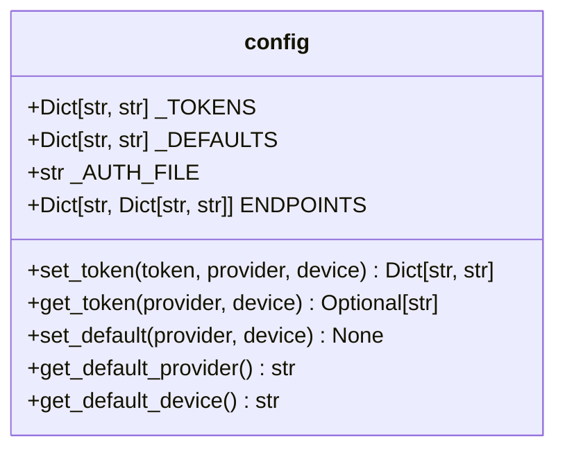
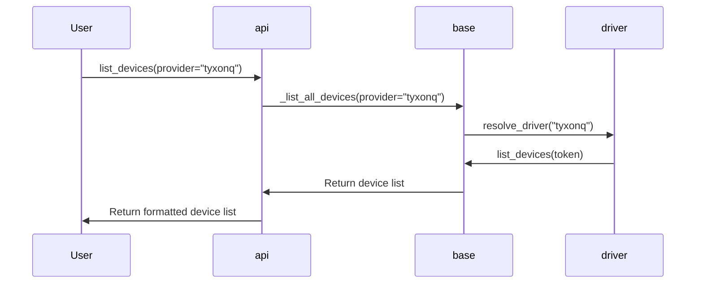
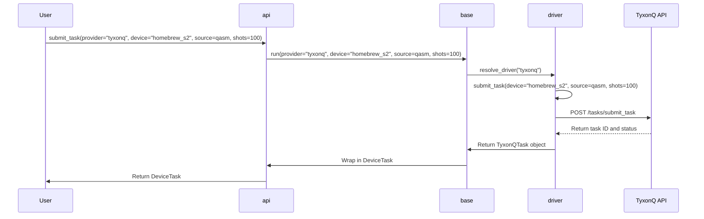
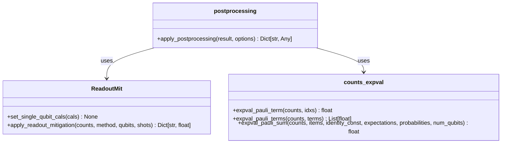

# Cloud Integration

<cite>
**Referenced Files in This Document**   
- [api.py](file://src/tyxonq/cloud/api.py)
- [cloud_api_devices.py](file://examples/cloud_api_devices.py)
- [cloud_api_task.py](file://examples/cloud_api_task.py)
- [base.py](file://src/tyxonq/devices/base.py)
- [config.py](file://src/tyxonq/devices/hardware/config.py)
- [circuit.py](file://src/tyxonq/core/ir/circuit.py)
- [driver.py](file://src/tyxonq/devices/hardware/tyxonq/driver.py)
- [driver.py](file://src/tyxonq/devices/simulators/driver.py)
- [__init__.py](file://src/tyxonq/postprocessing/__init__.py)
</cite>

## Table of Contents
1. [Introduction](#introduction)
2. [Core API Interface](#core-api-interface)
3. [Authentication and Configuration](#authentication-and-configuration)
4. [Device Discovery and Management](#device-discovery-and-management)
5. [Task Submission and Execution](#task-submission-and-execution)
6. [Result Retrieval and Asynchronous Monitoring](#result-retrieval-and-asynchronous-monitoring)
7. [Data Serialization and Circuit Compilation](#data-serialization-and-circuit-compilation)
8. [Error Handling and Fault Tolerance](#error-handling-and-fault-tolerance)
9. [Security and Connection Resilience](#security-and-connection-resilience)
10. [Postprocessing and Result Enhancement](#postprocessing-and-result-enhancement)
11. [Troubleshooting Guide](#troubleshooting-guide)
12. [Best Practices for Efficient Resource Utilization](#best-practices-for-efficient-resource-utilization)

## Introduction

This document provides a comprehensive overview of the cloud integration system within the TyxonQ framework, focusing on distributed quantum computing via RESTful APIs. The architecture is designed to abstract the complexities of interacting with remote quantum processors and simulators, providing a unified interface for task submission, device discovery, and result retrieval. The system supports multiple providers, including the native TyxonQ cloud, local simulators, and third-party platforms like IBM Quantum, enabling seamless switching between execution backends. The design emphasizes modularity, with clear separation between the cloud API facade, device drivers, and core circuit representation, ensuring extensibility and maintainability.

## Core API Interface

The cloud API interface, defined in `api.py`, serves as a minimal facade for interacting with quantum computing resources. It provides a set of high-level functions that abstract the underlying complexity of device drivers and network communication. The primary entry points include `submit_task` for executing quantum circuits, `list_devices` for discovering available hardware, and `get_task_details` for monitoring job status. The API is designed to be chainable and composable, allowing for fluent programming patterns. All functions delegate their core logic to lower-level modules in the `devices` and `core.ir` packages, ensuring a clean separation of concerns. The interface supports both direct source submission (e.g., OpenQASM) and compiled circuit execution, providing flexibility for different use cases and optimization requirements.

**Section sources**
- [api.py](file://src/tyxonq/cloud/api.py#L1-L124)

## Authentication and Configuration

Authentication and configuration are managed through a centralized token system implemented in the `devices.hardware.config` module. The `set_token` function allows users to configure API credentials for specific providers and devices, storing them in an in-memory dictionary and falling back to environment variables. The configuration system supports hierarchical token scoping, where a provider-level token can be overridden by a device-specific token. Default provider and device settings are managed by `set_default` and `get_default`, allowing users to establish a preferred execution environment. The system also supports reading tokens from a local configuration file (`~/.tyxonq.auth.json`), providing a persistent storage option. This multi-layered approach ensures flexibility in credential management while maintaining security by avoiding hard-coded secrets in source code.



**Diagram sources**
- [config.py](file://src/tyxonq/devices/hardware/config.py#L1-L68)

**Section sources**
- [config.py](file://src/tyxonq/devices/hardware/config.py#L1-L68)

## Device Discovery and Management

Device discovery is facilitated by the `list_devices` function, which aggregates available resources from all configured providers. The system maintains a unified device namespace, where each device is identified by a `provider::device_id` string. The discovery process first queries the local simulator drivers for their available backends (e.g., statevector, matrix product state) and then polls remote providers like TyxonQ and IBM Quantum for their hardware inventory. The `device_descriptor` function normalizes device specifications, resolving ambiguous names and applying default values. This abstraction allows users to refer to devices using simple names (e.g., "homebrew_s2") while the system handles the full provider-qualified identifier. The example in `cloud_api_devices.py` demonstrates a simple workflow for listing all available TyxonQ devices, showcasing the ease of device enumeration.



**Diagram sources**
- [api.py](file://src/tyxonq/cloud/api.py#L1-L124)
- [base.py](file://src/tyxonq/devices/base.py#L1-L404)
- [driver.py](file://src/tyxonq/devices/hardware/tyxonq/driver.py#L1-L193)

**Section sources**
- [api.py](file://src/tyxonq/cloud/api.py#L1-L124)
- [base.py](file://src/tyxonq/devices/base.py#L1-L404)
- [cloud_api_devices.py](file://examples/cloud_api_devices.py#L1-L29)

## Task Submission and Execution

Task submission is orchestrated through the `submit_task` function, which delegates to the `devices.base.run` method for unified execution logic. The process begins with the resolution of the target provider and device, followed by the selection of the appropriate hardware driver. For remote execution, the circuit or source code is packaged into a JSON payload and submitted via a POST request to the provider's API endpoint. The TyxonQ driver implements a robust submission protocol, including error handling for failed tasks and diagnostic information retrieval. The system supports both single and batched task submissions, with the driver normalizing the return value into a list of `DeviceTask` objects for consistent handling. The `DeviceTask` wrapper encapsulates the provider-specific task handle and provides a unified interface for result polling and cancellation.



**Diagram sources**
- [api.py](file://src/tyxonq/cloud/api.py#L1-L124)
- [base.py](file://src/tyxonq/devices/base.py#L1-L404)
- [driver.py](file://src/tyxonq/devices/hardware/tyxonq/driver.py#L1-L193)

**Section sources**
- [api.py](file://src/tyxonq/cloud/api.py#L1-L124)
- [base.py](file://src/tyxonq/devices/base.py#L1-L404)
- [driver.py](file://src/tyxonq/devices/hardware/tyxonq/driver.py#L1-L193)
- [cloud_api_task.py](file://examples/cloud_api_task.py#L1-L65)

## Result Retrieval and Asynchronous Monitoring

Result retrieval and asynchronous monitoring are handled by the `get_task_details` function, which provides a unified interface for querying task status across different providers. The function supports both synchronous and asynchronous modes, with the `wait` parameter controlling whether the call blocks until the task is complete. For asynchronous tasks, the system implements a polling loop with configurable `poll_interval` and `timeout` parameters. The `DeviceTask.get_result` method encapsulates this logic, normalizing the response format from different providers into a consistent structure containing the raw result and metadata. The example in `cloud_api_task.py` demonstrates both legacy-style direct source submission and chain-style circuit compilation and execution, highlighting the flexibility of the result retrieval system.

```mermaid
sequenceDiagram
participant User
participant api
participant base
participant driver
User->>api : get_task_details(task, wait=True, timeout=60.0)
api->>base : get_task_details(task, wait=True, timeout=60.0)
base->>driver : resolve_driver(task.provider, task.device)
loop Polling
driver->>TyxonQ API : POST /tasks/detail
TyxonQ API-->>driver : Return task status
alt Task Complete
break
else Timeout
break
end
end
driver->>base : Return normalized result
base->>api : Return result with metadata
api->>User : Return final result
```

**Diagram sources**
- [api.py](file://src/tyxonq/cloud/api.py#L1-L124)
- [base.py](file://src/tyxonq/devices/base.py#L1-L404)
- [driver.py](file://src/tyxonq/devices/hardware/tyxonq/driver.py#L1-L193)

**Section sources**
- [api.py](file://src/tyxonq/cloud/api.py#L1-L124)
- [base.py](file://src/tyxonq/devices/base.py#L1-L404)
- [driver.py](file://src/tyxonq/devices/hardware/tyxonq/driver.py#L1-L193)
- [cloud_api_task.py](file://examples/cloud_api_task.py#L1-L65)

## Data Serialization and Circuit Compilation

Data serialization and circuit compilation are integral to the cloud integration workflow. The system supports multiple input formats, including native circuit IR and OpenQASM source code. When a circuit object is submitted, it is automatically compiled to the target provider's native format using the `compiler.api.compile` function. For the TyxonQ provider, this typically involves conversion to OpenQASM 2.0, which is then submitted as a string payload. The `Circuit.to_openqasm` method provides a direct serialization path, while the `compile` method offers a more flexible interface with configurable options. The system also supports direct submission of pre-compiled source code, allowing users to bypass the compilation step when they have already optimized their circuits. This dual-path approach ensures maximum flexibility for both interactive experimentation and production workflows.

**Section sources**
- [api.py](file://src/tyxonq/cloud/api.py#L1-L124)
- [circuit.py](file://src/tyxonq/core/ir/circuit.py#L1-L779)
- [base.py](file://src/tyxonq/devices/base.py#L1-L404)

## Error Handling and Fault Tolerance

Error handling and fault tolerance are implemented at multiple levels of the cloud integration stack. The system employs a layered exception model, where low-level network errors are caught and wrapped in higher-level application exceptions. The `submit_task` function includes comprehensive error handling, with failed submissions triggering diagnostic queries to retrieve device status and properties. The `get_task_details` function normalizes error responses from different providers into a consistent format, making it easier for users to diagnose issues. The system also implements connection resilience strategies, including automatic token refresh and fallback to alternative endpoints. For critical operations, the API provides synchronous execution modes that block until completion, reducing the risk of race conditions and ensuring predictable behavior in production environments.

**Section sources**
- [api.py](file://src/tyxonq/cloud/api.py#L1-L124)
- [driver.py](file://src/tyxonq/devices/hardware/tyxonq/driver.py#L1-L193)
- [base.py](file://src/tyxonq/devices/base.py#L1-L404)

## Security and Connection Resilience

Security and connection resilience are paramount in the cloud integration design. The system uses HTTPS for all API communications, with authentication handled via bearer tokens. The token management system ensures that credentials are never exposed in plaintext, with tokens stored in memory and transmitted securely over encrypted channels. The API endpoints are designed to be stateless, reducing the attack surface and improving scalability. Connection resilience is achieved through configurable timeouts and retry mechanisms, with the system automatically handling transient network failures. The `DeviceTask` wrapper provides a consistent interface for task cancellation, allowing users to terminate long-running jobs that may be consuming excessive resources. The system also includes rate limiting at the client level, preventing accidental denial-of-service conditions and ensuring fair usage of shared resources.

**Section sources**
- [api.py](file://src/tyxonq/cloud/api.py#L1-L124)
- [driver.py](file://src/tyxonq/devices/hardware/tyxonq/driver.py#L1-L193)
- [config.py](file://src/tyxonq/devices/hardware/config.py#L1-L68)

## Postprocessing and Result Enhancement

Postprocessing and result enhancement are provided through the `postprocessing.apply_postprocessing` function, which applies various corrections and transformations to raw quantum results. The system supports readout error mitigation, where calibration data is used to correct for measurement inaccuracies. It also includes expectation value calculation for Pauli operators, enabling the computation of physical observables from raw measurement counts. The postprocessing pipeline is configurable via the `postprocessing_method` parameter, allowing users to select the appropriate correction algorithm for their use case. The results are returned in a structured format that includes both the raw and processed data, enabling users to validate the effectiveness of the corrections. This modular design ensures that new postprocessing techniques can be easily integrated without modifying the core execution logic.



**Diagram sources**
- [__init__.py](file://src/tyxonq/postprocessing/__init__.py#L1-L136)

**Section sources**
- [__init__.py](file://src/tyxonq/postprocessing/__init__.py#L1-L136)
- [circuit.py](file://src/tyxonq/core/ir/circuit.py#L1-L779)

## Troubleshooting Guide

Common issues in the cloud integration system typically fall into three categories: authentication errors, device unavailability, and task execution failures. Authentication errors are often caused by invalid or expired tokens; users should verify their credentials and ensure they are using the correct provider and device identifiers. Device unavailability can occur when a requested hardware backend is offline or overloaded; users should check the device status using `list_devices` and consider alternative backends. Task execution failures may result from circuit compilation errors or resource limits; users should validate their circuits locally using simulators before submitting to remote hardware. Network timeouts can be mitigated by increasing the `timeout` parameter in `get_task_details` or by implementing exponential backoff in their polling loops. For persistent issues, users should consult the provider's status page and contact support with the relevant task IDs and error messages.

**Section sources**
- [api.py](file://src/tyxonq/cloud/api.py#L1-L124)
- [driver.py](file://src/tyxonq/devices/hardware/tyxonq/driver.py#L1-L193)
- [base.py](file://src/tyxonq/devices/base.py#L1-L404)

## Best Practices for Efficient Resource Utilization

To maximize efficiency and minimize costs when using the cloud integration system, users should follow several best practices. First, they should leverage local simulators for circuit development and debugging, reserving remote hardware for final validation and production runs. Second, they should optimize their circuits for the target hardware, minimizing gate count and depth to reduce execution time and error rates. Third, they should batch multiple experiments into a single task submission when possible, reducing API overhead and improving throughput. Fourth, they should implement efficient result polling strategies, using appropriate `poll_interval` and `timeout` values to balance responsiveness with network load. Finally, they should monitor their resource usage and adjust their workflows accordingly, taking advantage of the system's flexibility to switch between different providers and backends based on availability and performance.