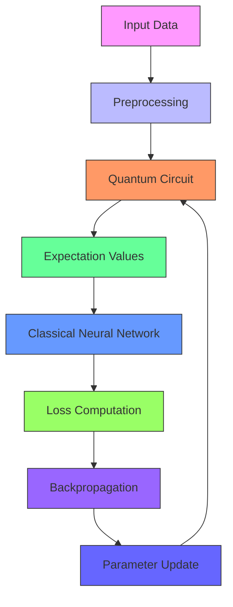
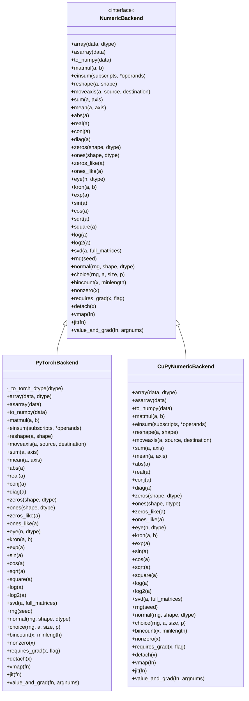
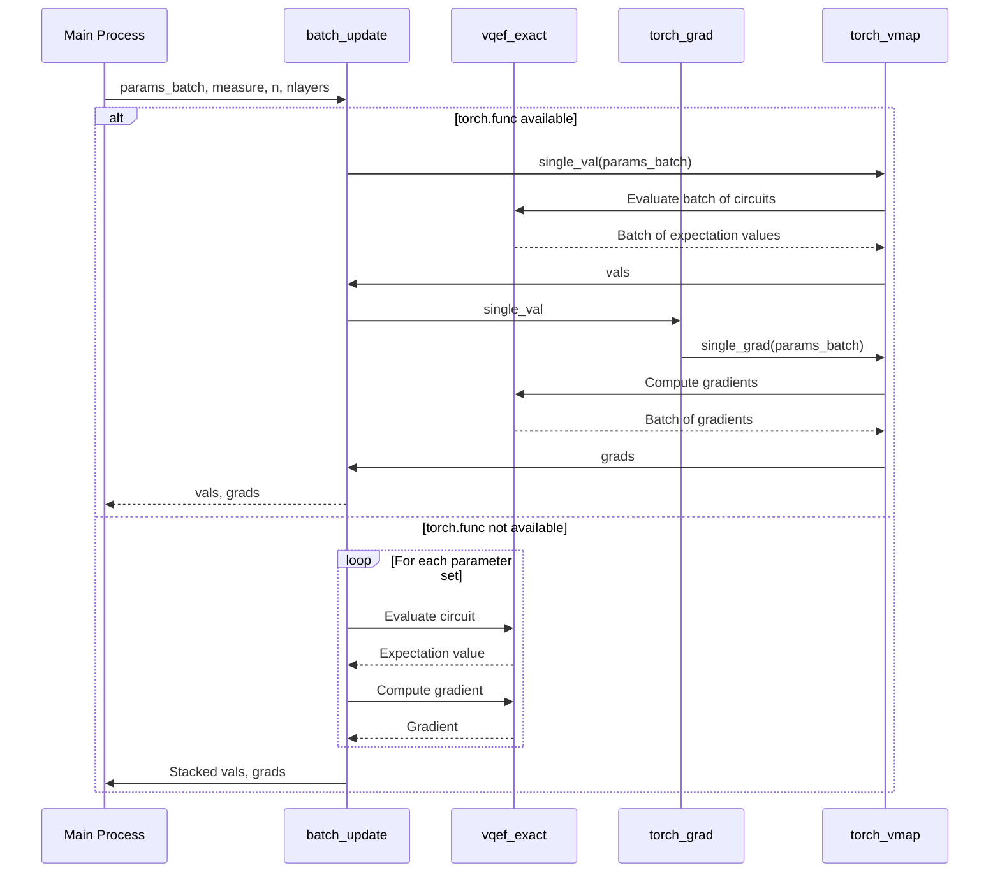
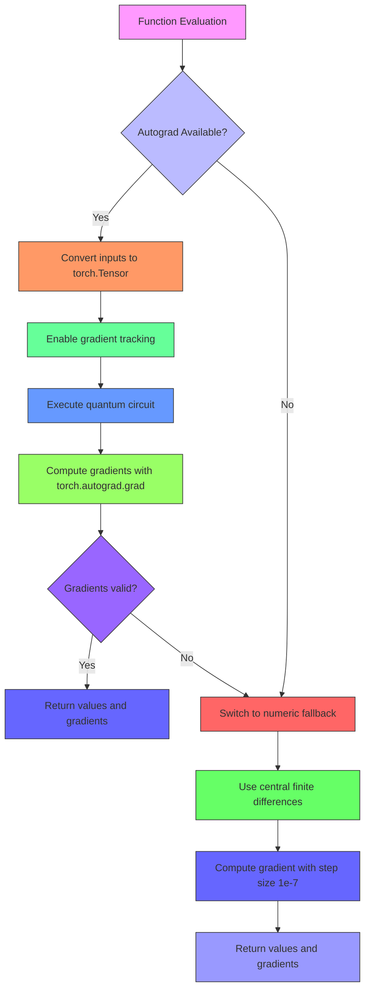

# Hybrid Quantum-Classical Workflows

<cite>
**Referenced Files in This Document**   
- [hybrid_gpu_pipeline.py](file://examples-ng/hybrid_gpu_pipeline.py)
- [vqe_parallel_pmap.py](file://examples/vqe_parallel_pmap.py)
- [pytorch_backend.py](file://src/tyxonq/numerics/backends/pytorch_backend.py)
- [cupynumeric_backend.py](file://src/tyxonq/numerics/backends/cupynumeric_backend.py)
- [statevector.py](file://src/tyxonq/libs/quantum_library/kernels/statevector.py)
- [gates.py](file://src/tyxonq/libs/quantum_library/kernels/gates.py)
- [circuit.py](file://src/tyxonq/core/ir/circuit.py)
</cite>

## Table of Contents
1. [Introduction](#introduction)
2. [GPU-Accelerated Hybrid Pipeline Architecture](#gpu-accelerated-hybrid-pipeline-architecture)
3. [Backend Interoperability and Numerics Layer](#backend-interoperability-and-numerics-layer)
4. [Parallel Execution Patterns](#parallel-execution-patterns)
5. [Gradient Computation and Automatic Differentiation](#gradient-computation-and-automatic-differentiation)
6. [Memory Optimization Techniques](#memory-optimization-techniques)
7. [Use Cases in Quantum Machine Learning](#use-cases-in-quantum-machine-learning)
8. [Performance Considerations](#performance-considerations)
9. [Common Bottlenecks and Debugging Strategies](#common-bottlenecks-and-debugging-strategies)
10. [Conclusion](#conclusion)

## Introduction
This document provides a comprehensive analysis of hybrid quantum-classical workflows within the TyxonQ framework, focusing on the integration of quantum computation with classical high-performance computing systems. The architecture enables seamless data flow between quantum simulators and PyTorch-based classical processors, leveraging GPU acceleration for enhanced performance. Key components include the hybrid_gpu_pipeline.py reference implementation, parallel execution patterns demonstrated in vqe_parallel_pmap.py, and backend interoperability between TyxonQ's numerics layer and machine learning frameworks. The system supports variational algorithms and quantum machine learning applications requiring large-scale classical postprocessing, with optimized data transfer, device synchronization, and distributed training capabilities.

## GPU-Accelerated Hybrid Pipeline Architecture
The hybrid quantum-classical pipeline architecture is exemplified by the hybrid_gpu_pipeline.py implementation, which demonstrates a fully integrated workflow where both quantum and classical components operate on GPU resources. The architecture begins with dataset preparation using torchvision for MNIST data loading, followed by preprocessing steps that include filtering to specific classes (1 and 5), bilinear interpolation to reduce image size to 3x3 pixels, and binarization of pixel values. The quantum component is implemented as a parameterized quantum circuit with 9 qubits and 2 layers, where input data is encoded via RX gates and trainable parameters are applied through RX and RY gates. The circuit outputs expectation values for Z-basis measurements on each qubit, which are then processed by classical neural network layers.

The integration between quantum and classical components is achieved through the TorchLayer wrapper, which enables the quantum circuit to function as a differentiable layer within a PyTorch neural network. This allows for end-to-end training using standard optimization techniques like Adam. The pipeline leverages DLPack for efficient data transfer between the quantum simulator and PyTorch tensors, minimizing memory overhead and maximizing throughput. The architecture supports batch processing with configurable batch sizes and training epochs, enabling scalable execution on GPU-accelerated hardware.

**Diagram sources**
- [hybrid_gpu_pipeline.py](file://examples-ng/hybrid_gpu_pipeline.py#L1-L123)

**Section sources**
- [hybrid_gpu_pipeline.py](file://examples-ng/hybrid_gpu_pipeline.py#L1-L123)

## Backend Interoperability and Numerics Layer
The TyxonQ framework implements a flexible numerics layer that enables seamless interoperability between quantum computation and machine learning frameworks through pluggable backends. The architecture is centered around the PyTorchBackend and CuPyNumericBackend classes, which provide unified interfaces for array operations, linear algebra, and mathematical functions. The PyTorchBackend class exposes a comprehensive set of operations including array creation, tensor manipulation, element-wise mathematical functions, and linear algebra routines, all of which are implemented as thin wrappers around PyTorch functionality. This enables quantum algorithms to leverage PyTorch's automatic differentiation, GPU acceleration, and distributed training capabilities.

The backend system supports dynamic switching between different computational backends through the set_backend function, allowing users to select between PyTorch and CuPyNumeric based on their hardware and performance requirements. The CuPyNumericBackend provides GPU-accelerated computation through the cupynumeric library, offering compatibility with NumPy syntax while executing on GPU devices. Both backends implement a consistent API that includes array operations (reshape, moveaxis, sum), mathematical functions (exp, sin, cos), and linear algebra routines (svd, matmul). The system also provides K-like helpers such as jit and value_and_grad that enable just-in-time compilation and automatic differentiation, respectively.

The numerics layer serves as an abstraction layer between quantum algorithms and the underlying computational framework, allowing quantum circuits to be expressed in a backend-agnostic manner. This enables the same quantum algorithm to be executed on different hardware platforms without modification. The backend system also handles data type conversion, device placement, and memory management, ensuring efficient execution across different computing environments. The integration with PyTorch is particularly important for quantum machine learning applications, as it enables seamless composition of quantum circuits with classical neural network layers.

**Diagram sources**
- [pytorch_backend.py](file://src/tyxonq/numerics/backends/pytorch_backend.py#L12-L256)
- [cupynumeric_backend.py](file://src/tyxonq/numerics/backends/cupynumeric_backend.py#L12-L252)

**Section sources**
- [pytorch_backend.py](file://src/tyxonq/numerics/backends/pytorch_backend.py#L12-L256)
- [cupynumeric_backend.py](file://src/tyxonq/numerics/backends/cupynumeric_backend.py#L12-L252)

## Parallel Execution Patterns
The vqe_parallel_pmap.py example demonstrates sophisticated parallel execution patterns for variational quantum algorithms, leveraging PyTorch's functional programming capabilities to achieve high-performance batch processing. The implementation supports two distinct execution paths: an exact path using statevector simulation with automatic differentiation, and a counts-based path using finite-shot sampling. The parallel execution is achieved through the batch_update function, which processes multiple parameter sets simultaneously using either torch.func.vmap for efficient vectorization or a fallback loop-based approach when the functional API is unavailable.

The exact path utilizes the vqef_exact function to compute expectation values via statevector kernels, which directly manipulate the quantum state vector to calculate measurement outcomes. This approach provides precise results without statistical noise but requires exponential memory scaling with the number of qubits. The counts-based path uses the vqef_counts function to simulate finite-shot measurements, which more closely approximates real quantum hardware behavior but introduces statistical uncertainty. Both paths support batch processing of parameter sets, enabling efficient evaluation of multiple circuit configurations in parallel.

The parallel execution pattern is particularly valuable for variational algorithms like VQE (Variational Quantum Eigensolver), where multiple parameter updates are required during optimization. By processing batches of parameter sets simultaneously, the implementation achieves significant performance improvements compared to sequential execution. The use of torch.func.vmap enables automatic vectorization across the batch dimension, eliminating the need for explicit loops and reducing Python overhead. The fallback implementation ensures compatibility with older PyTorch versions while maintaining the same functional interface.

**Diagram sources**
- [vqe_parallel_pmap.py](file://examples/vqe_parallel_pmap.py#L0-L163)

**Section sources**
- [vqe_parallel_pmap.py](file://examples/vqe_parallel_pmap.py#L0-L163)

## Gradient Computation and Automatic Differentiation
The TyxonQ framework implements robust gradient computation capabilities through its integration with PyTorch's automatic differentiation system, enabling efficient training of hybrid quantum-classical models. The gradient computation is centered around the value_and_grad method in the PyTorchBackend class, which provides a unified interface for computing both function values and gradients. This method supports two distinct approaches: an autograd path that leverages PyTorch's built-in automatic differentiation, and a numeric fallback that uses finite differences for compatibility with non-differentiable operations.

The autograd path converts input arguments to PyTorch tensors with gradient tracking enabled, executes the quantum circuit, and computes gradients using torch.autograd.grad. This approach is highly efficient and supports higher-order derivatives, making it ideal for variational quantum algorithms and quantum machine learning applications. When automatic differentiation fails (e.g., due to non-differentiable operations), the system automatically falls back to a numeric differentiation scheme that uses central finite differences with a small step size (1e-7). This ensures robust gradient computation even in complex scenarios where symbolic differentiation is not possible.

The framework also supports advanced gradient computation patterns through the torch.func module, including vectorized map (vmap) and just-in-time compilation (jit). The vmap function enables automatic batching of gradient computations across multiple parameter sets, significantly improving performance for batched optimization tasks. The jit function leverages PyTorch's compilation capabilities to optimize the execution of quantum circuits, reducing overhead and improving computational efficiency. These features are particularly valuable for large-scale quantum simulations and optimization problems requiring extensive parameter tuning.

**Diagram sources**
- [pytorch_backend.py](file://src/tyxonq/numerics/backends/pytorch_backend.py#L200-L256)

**Section sources**
- [pytorch_backend.py](file://src/tyxonq/numerics/backends/pytorch_backend.py#L200-L256)

## Memory Optimization Techniques
The TyxonQ framework employs several memory optimization techniques to enable efficient execution of hybrid quantum-classical workflows, particularly for large-scale quantum simulations and machine learning applications. The most significant optimization is the use of DLPack for zero-copy data transfer between the quantum simulator and PyTorch tensors, which eliminates the need for intermediate data copies and reduces memory overhead. This is particularly important for GPU-accelerated workflows where data transfer between CPU and GPU memory can be a significant bottleneck.

The framework also implements efficient memory management through the use of tensor views and in-place operations where possible. The quantum circuit simulation kernels in statevector.py use einsum operations with carefully constructed index specifications to minimize intermediate tensor creation during gate application. This approach reduces memory allocation and garbage collection overhead, enabling more efficient execution of deep quantum circuits. The use of moveaxis operations to reorganize tensor dimensions before computation further optimizes memory access patterns and cache utilization.

For large-scale simulations, the framework supports batch processing with configurable batch sizes, allowing users to balance memory usage and computational efficiency. The parallel execution patterns demonstrated in vqe_parallel_pmap.py enable processing of multiple parameter sets simultaneously without duplicating the quantum circuit structure, significantly reducing memory requirements for variational algorithms. The system also provides options for gradient computation that balance memory usage and computational efficiency, including the ability to disable gradient retention for intermediate computations when higher-order derivatives are not required.

The numerics layer implements additional memory optimizations through the use of specialized data types and memory layouts. The backend classes support mixed precision computation, allowing users to trade off numerical accuracy for reduced memory usage and improved computational speed. The framework also provides options for memory-efficient random number generation and sampling operations, which are particularly important for Monte Carlo simulations and finite-shot quantum measurements.

**Section sources**
- [hybrid_gpu_pipeline.py](file://examples-ng/hybrid_gpu_pipeline.py#L1-L123)
- [pytorch_backend.py](file://src/tyxonq/numerics/backends/pytorch_backend.py#L1-L256)
- [statevector.py](file://src/tyxonq/libs/quantum_library/kernels/statevector.py#L1-L54)

## Use Cases in Quantum Machine Learning
The hybrid quantum-classical workflows in TyxonQ are particularly well-suited for quantum machine learning applications that require large-scale classical postprocessing and optimization. The framework supports a wide range of use cases, including quantum neural networks, variational quantum classifiers, and quantum-enhanced optimization algorithms. The hybrid_gpu_pipeline.py example demonstrates a quantum neural network for binary classification of MNIST digits, where a quantum circuit serves as a feature extractor and a classical neural network performs the final classification.

Variational algorithms like VQE (Variational Quantum Eigensolver) and QAOA (Quantum Approximate Optimization Algorithm) are natural applications for the framework, as they require iterative optimization of quantum circuit parameters using classical optimization techniques. The vqe_parallel_pmap.py example illustrates this use case, demonstrating how multiple parameter sets can be evaluated in parallel to accelerate the optimization process. The framework's support for automatic differentiation enables efficient gradient-based optimization, while the ability to simulate finite-shot measurements provides realistic estimates of algorithm performance on actual quantum hardware.

Other important use cases include quantum generative models, quantum autoencoders, and quantum reinforcement learning. The framework's integration with PyTorch enables seamless composition of quantum circuits with classical deep learning architectures, allowing for the creation of hybrid models that leverage the strengths of both quantum and classical computation. The ability to execute on GPU-accelerated hardware makes the framework suitable for training large-scale quantum machine learning models that would be impractical on CPU-only systems.

The framework also supports quantum-enhanced classical algorithms, where quantum computation is used to accelerate specific subroutines within a larger classical algorithm. Examples include quantum linear algebra for machine learning, quantum sampling for probabilistic modeling, and quantum optimization for combinatorial problems. The modular design of the framework allows these quantum subroutines to be easily integrated into existing classical workflows, enabling gradual adoption of quantum computing capabilities.

**Section sources**
- [hybrid_gpu_pipeline.py](file://examples-ng/hybrid_gpu_pipeline.py#L1-L123)
- [vqe_parallel_pmap.py](file://examples/vqe_parallel_pmap.py#L0-L163)

## Performance Considerations
The performance of hybrid quantum-classical workflows in TyxonQ is influenced by several key factors, including data transfer overhead, device synchronization, and computational efficiency. The most significant performance bottleneck is typically data transfer between the quantum simulator and classical processing components, particularly when moving data between CPU and GPU memory. The framework mitigates this through the use of DLPack for zero-copy data transfer and careful memory management to minimize unnecessary data movement.

Device synchronization is another critical performance consideration, especially in distributed training scenarios where multiple processes or devices are involved. The framework provides options for asynchronous execution and result fetching, allowing computation to proceed while waiting for quantum simulation results. This overlapping of computation and communication can significantly improve overall throughput, particularly for iterative algorithms like variational quantum eigensolvers.

Computational efficiency is optimized through several mechanisms, including just-in-time compilation of quantum circuits, vectorized execution of batched operations, and efficient implementation of quantum gate operations. The use of PyTorch's torch.compile functionality enables optimization of the computational graph, reducing overhead and improving execution speed. The vectorized execution patterns supported by torch.func.vmap eliminate Python loop overhead and enable efficient utilization of GPU parallelism.

For large-scale simulations, memory bandwidth and capacity can become limiting factors, particularly for statevector-based simulations that require exponential memory scaling with the number of qubits. The framework addresses this through batch processing with configurable batch sizes, allowing users to balance memory usage and computational efficiency. The use of mixed precision computation and memory-efficient data types further reduces memory requirements and improves computational speed.

The performance characteristics of the framework vary significantly depending on the specific use case and hardware configuration. GPU-accelerated workflows typically achieve substantial speedups compared to CPU-only execution, particularly for deep quantum circuits and large batch sizes. However, the overhead of quantum simulation can still dominate execution time for complex circuits, making circuit optimization and compilation important considerations for achieving optimal performance.

**Section sources**
- [hybrid_gpu_pipeline.py](file://examples-ng/hybrid_gpu_pipeline.py#L1-L123)
- [vqe_parallel_pmap.py](file://examples/vqe_parallel_pmap.py#L0-L163)
- [pytorch_backend.py](file://src/tyxonq/numerics/backends/pytorch_backend.py#L1-L256)

## Common Bottlenecks and Debugging Strategies
Hybrid quantum-classical workflows can encounter several common bottlenecks that impact performance and correctness. The most frequent bottleneck is data transfer overhead between quantum and classical components, particularly when moving data between CPU and GPU memory. This can be mitigated by using DLPack for zero-copy transfers and minimizing unnecessary data movement through careful memory management. Another common bottleneck is inefficient quantum circuit simulation, which can be addressed by optimizing circuit structure, using appropriate simulation methods (e.g., statevector vs. shot-based), and leveraging just-in-time compilation.

Debugging mixed-stack execution requires careful attention to data types, device placement, and gradient computation. Common issues include mismatched data types between quantum and classical components, incorrect device placement (CPU vs. GPU), and problems with gradient computation due to non-differentiable operations. The framework provides several debugging strategies, including detailed error messages, fallback mechanisms for gradient computation, and comprehensive logging of computational steps.

For performance debugging, the framework supports profiling of individual components, allowing users to identify bottlenecks in the computational pipeline. This includes timing of quantum circuit execution, data transfer operations, and classical postprocessing steps. The use of batch processing and vectorized execution can be verified by monitoring GPU utilization and memory bandwidth usage.

When debugging variational algorithms, it is important to verify the correctness of gradient computation and parameter updates. The framework's support for both automatic differentiation and numeric gradient computation provides a valuable cross-check mechanism. Users can compare gradients computed through both methods to verify correctness and identify potential issues with automatic differentiation.

Other debugging strategies include using small-scale test cases to verify algorithm correctness before scaling up, monitoring convergence behavior during optimization, and validating results against known analytical solutions when available. The framework's modular design enables isolation of individual components for testing and debugging, making it easier to identify and resolve issues in complex hybrid workflows.

**Section sources**
- [hybrid_gpu_pipeline.py](file://examples-ng/hybrid_gpu_pipeline.py#L1-L123)
- [vqe_parallel_pmap.py](file://examples/vqe_parallel_pmap.py#L0-L163)
- [pytorch_backend.py](file://src/tyxonq/numerics/backends/pytorch_backend.py#L1-L256)

## Conclusion
The TyxonQ framework provides a comprehensive platform for hybrid quantum-classical workflows, enabling seamless integration of quantum computation with classical high-performance computing systems. The architecture supports GPU-accelerated pipelines through efficient data transfer mechanisms like DLPack and optimized execution patterns that leverage PyTorch's capabilities for automatic differentiation and distributed training. The backend interoperability between TyxonQ's numerics layer and machine learning frameworks enables flexible deployment across different hardware platforms and computational environments.

The framework's support for parallel execution patterns, particularly through the torch.func module, enables efficient processing of multiple parameter sets in variational algorithms, significantly accelerating optimization processes. The robust gradient computation capabilities, including both automatic differentiation and numeric fallbacks, ensure reliable training of hybrid quantum-classical models. Memory optimization techniques, such as zero-copy data transfer and efficient tensor operations, enable execution of large-scale quantum simulations that would be impractical with naive implementations.

The use cases in quantum machine learning and variational algorithms demonstrate the framework's capability to handle complex workflows requiring large-scale classical postprocessing. Performance considerations around data transfer overhead, device synchronization, and computational efficiency are addressed through careful system design and optimization. The debugging strategies and tools provided help users identify and resolve common bottlenecks in mixed-stack execution.

Overall, the TyxonQ framework represents a significant advancement in hybrid quantum-classical computing, providing researchers and developers with powerful tools for exploring the intersection of quantum and classical computation. The combination of high-level abstractions for quantum circuit design with low-level optimizations for performance-critical operations makes it well-suited for both research and production applications in quantum machine learning and quantum-enhanced algorithms.