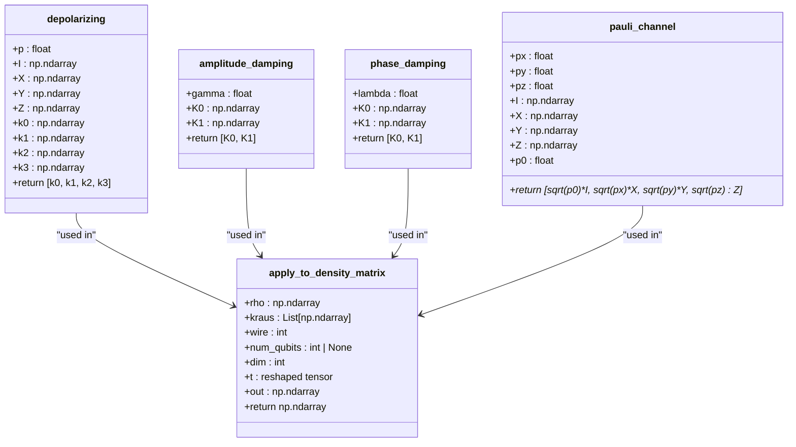
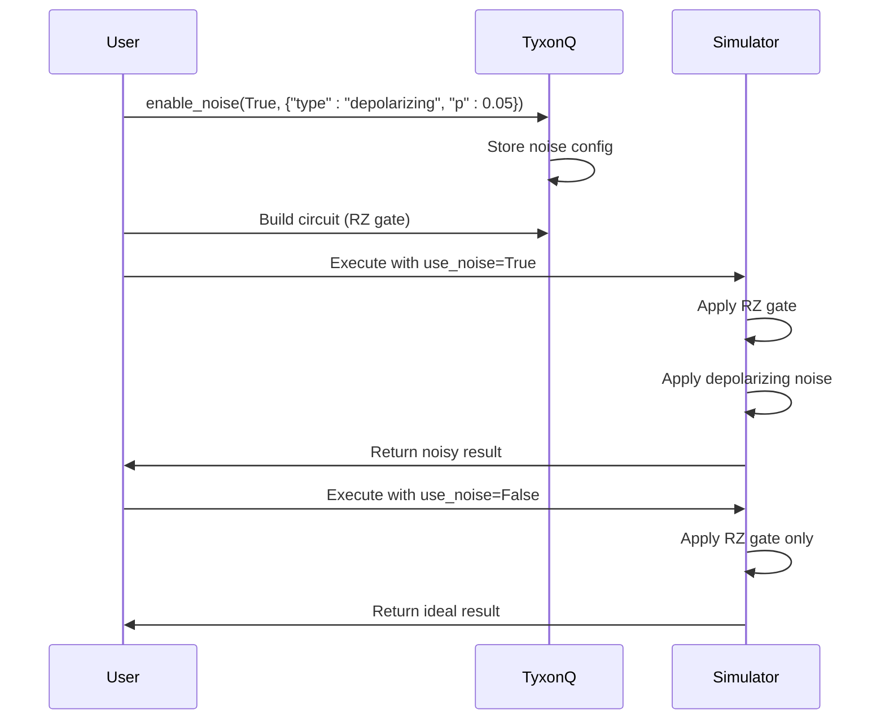
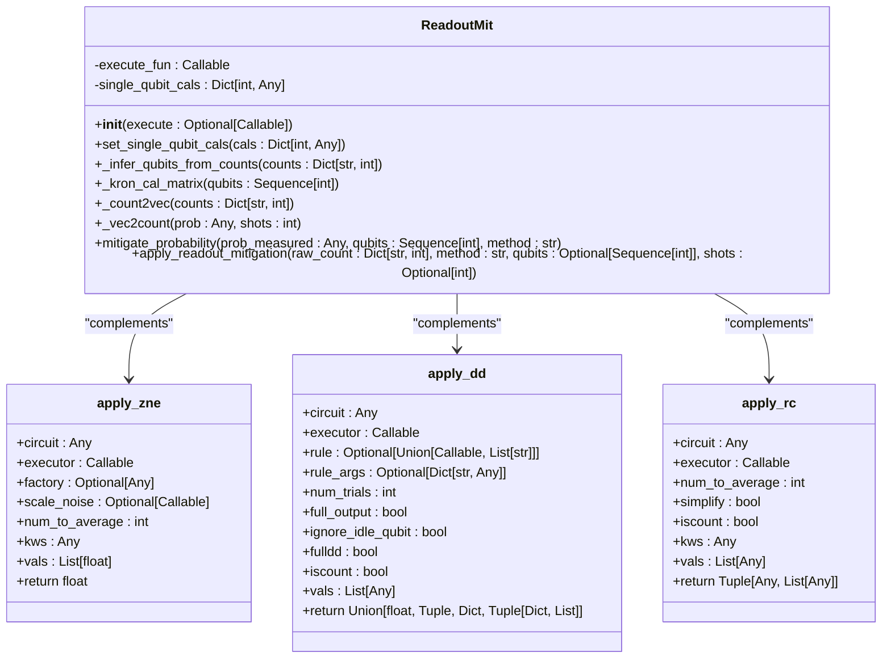

# Noise Modeling and Calibration

<cite>
**Referenced Files in This Document**   
- [channels.py](file://src/tyxonq/devices/simulators/noise/channels.py)
- [noise_controls_demo.py](file://examples/noise_controls_demo.py)
- [noisy_qml.py](file://examples-ng/noisy_qml.py)
- [error_mitigation.py](file://src/tyxonq/postprocessing/error_mitigation.py)
- [readout.py](file://src/tyxonq/postprocessing/readout.py)
</cite>

## Table of Contents
1. [Introduction](#introduction)
2. [Quantum Noise Channel Implementation](#quantum-noise-channel-implementation)
3. [Noise Model Configuration and Integration](#noise-model-configuration-and-integration)
4. [Calibration Workflows and Characterization](#calibration-workflows-and-characterization)
5. [Error Mitigation in Postprocessing](#error-mitigation-in-postprocessing)
6. [Noise-Aware Compilation and Variational Algorithms](#noise-aware-compilation-and-variational-algorithms)
7. [Common Challenges and Best Practices](#common-challenges-and-best-practices)
8. [Conclusion](#conclusion)

## Introduction
This document provides a comprehensive overview of noise modeling and calibration within the TyxonQ framework, focusing on simulating and mitigating quantum errors in quantum circuits. It details the implementation of fundamental quantum noise channels such as depolarizing, amplitude damping, and phase damping, and explains how these are integrated into simulator backends. The documentation covers noise model configuration, calibration workflows using demonstration scripts, and advanced error mitigation techniques including readout correction and zero-noise extrapolation. Additionally, it explores noise-aware compilation strategies and illustrates robust variational quantum algorithms under realistic noise conditions through practical examples. The guide also addresses common issues such as over-approximation of noise effects, calibration drift, and computational overhead, offering best practices for balancing simulation fidelity with performance efficiency.

## Quantum Noise Channel Implementation

The core implementation of quantum noise channels is located in `channels.py`, which defines several standard noise models using Kraus operator formalism. These functions generate sets of Kraus operators that represent different physical noise processes affecting qubits during computation.

The `depolarizing` function implements a single-qubit depolarizing channel parameterized by probability `p`, returning four Kraus operators corresponding to identity and Pauli X, Y, Z operations scaled appropriately. This model simulates random Pauli errors occurring with uniform probability across all bases.

The `amplitude_damping` channel models energy relaxation in a qubit, parameterized by damping rate `gamma`. It returns two Kraus operators representing the decay from |1⟩ to |0⟩ state, capturing T1 relaxation effects commonly observed in superconducting qubits.

The `phase_damping` function implements pure dephasing noise with parameter `lambda`, returning two Kraus operators that describe loss of coherence without energy exchange, corresponding to T2* effects.

The `pauli_channel` function generalizes the depolarizing model by allowing independent probabilities `px`, `py`, and `pz` for X, Y, and Z errors respectively, enabling asymmetric noise modeling.

All these channels are applied to density matrices via the `apply_to_density_matrix` function, which uses tensor contraction through Einstein summation (`einsum`) to efficiently apply the Kraus operators to a specific qubit within a multi-qubit system. This approach supports simulation of noise effects in both statevector and density matrix backends.

**Diagram sources**
- [channels.py](file://src/tyxonq/devices/simulators/noise/channels.py#L6-L61)

**Section sources**
- [channels.py](file://src/tyxonq/devices/simulators/noise/channels.py#L6-L61)

## Noise Model Configuration and Integration

Noise models are configured and integrated into quantum circuit execution through global and device-level settings. The `noise_controls_demo.py` example demonstrates this configuration workflow, showing how noise can be enabled globally or overridden at the device level.

The `tq.enable_noise()` function activates global noise simulation with a specified noise configuration dictionary that includes the noise type (e.g., "depolarizing") and parameters (e.g., "p": 0.05). This configuration is accessible via `tq.get_noise_config()` and affects all subsequent circuit executions unless explicitly overridden.

At the device level, noise can be controlled through the `.device()` method's `use_noise` parameter and explicit `noise` configuration. This allows selective comparison between ideal (noise-free) and noisy executions of the same circuit, as demonstrated in the example where a simple RZ gate circuit is executed both with and without depolarizing noise.

The integration mechanism supports various simulator backends including statevector and density matrix simulators, with noise application occurring during gate evolution. The noise channels are applied after native quantum gates according to the specified noise model, modifying the quantum state through the Kraus operator formalism implemented in `apply_to_density_matrix`.

**Diagram sources**
- [noise_controls_demo.py](file://examples/noise_controls_demo.py#L1-L46)

**Section sources**
- [noise_controls_demo.py](file://examples/noise_controls_demo.py#L1-L46)

## Calibration Workflows and Characterization

The framework supports noise calibration workflows through explicit configuration of noise parameters and characterization of device behavior under noisy conditions. The calibration process involves measuring circuit outputs with and without noise to quantify error rates and validate mitigation strategies.

The `noise_controls_demo.py` script exemplifies a basic calibration workflow by comparing expectation values of a simple circuit under ideal and noisy conditions. By measuring the Z expectation after an RZ rotation, it demonstrates how depolarizing noise attenuates quantum signals, providing a quantitative measure of noise impact.

For more sophisticated characterization, the system allows per-experiment noise configuration, enabling systematic sweeps over noise parameters to build error models. This facilitates the creation of noise profiles that can be used for subsequent error mitigation or to inform circuit design decisions.

The modular design of noise channels in `channels.py` enables easy extension to new noise models, supporting characterization of custom error processes relevant to specific hardware platforms. The separation between noise definition and application allows flexible experimentation with different noise hypotheses during the calibration process.

**Section sources**
- [noise_controls_demo.py](file://examples/noise_controls_demo.py#L1-L46)
- [channels.py](file://src/tyxonq/devices/simulators/noise/channels.py#L6-L61)

## Error Mitigation in Postprocessing

Error mitigation techniques are implemented in the postprocessing module, providing methods to correct for noise effects after circuit execution. The primary components include readout error correction and basic implementations of zero-noise extrapolation (ZNE), dynamical decoupling (DD), and readout correction (RC).

The `ReadoutMit` class in `readout.py` implements readout error mitigation by applying inverse calibration matrices to measured counts. It supports per-qubit 2x2 calibration matrices that map true probabilities to measured probabilities, constructing full-system calibration matrices via Kronecker products. Two mitigation methods are available: direct matrix inversion using pseudo-inverse (`pinv`) and constrained least squares optimization that enforces probability simplex constraints.

For zero-noise extrapolation, the `apply_zne` function in `error_mitigation.py` provides a placeholder implementation that averages multiple circuit executions. This serves as a foundation for more sophisticated ZNE techniques that will incorporate noise scaling and extrapolation to the zero-noise limit.

The `apply_dd` and `apply_rc` functions implement dynamical decoupling and readout correction patterns respectively, currently averaging multiple circuit executions. These are designed as extensible frameworks that will support more advanced pulse-level DD sequences and comprehensive readout error correction protocols in future versions.

**Diagram sources**
- [readout.py](file://src/tyxonq/postprocessing/readout.py#L14-L136)
- [error_mitigation.py](file://src/tyxonq/postprocessing/error_mitigation.py#L6-L75)

**Section sources**
- [readout.py](file://src/tyxonq/postprocessing/readout.py#L14-L136)
- [error_mitigation.py](file://src/tyxonq/postprocessing/error_mitigation.py#L6-L75)

## Noise-Aware Compilation and Variational Algorithms

The framework supports noise-aware quantum algorithms through integration of noise simulation in variational workflows, as demonstrated in the `noisy_qml.py` example. This script implements a quantum machine learning task using a parameterized quantum circuit (PQC) under Monte Carlo noise simulation.

The example uses a variational quantum classifier for MNIST digit recognition, where noise is explicitly modeled through depolarizing channels applied after two-qubit gates in the circuit. The noise simulation is performed using vmapped Monte Carlo sampling, allowing efficient estimation of expectation values under noisy conditions.

Key features of the noise-aware compilation approach include:
- Integration of noise channels directly into circuit construction via `c.depolarizing()` operations
- Use of vectorized execution (vmap) for efficient Monte Carlo noise simulation
- Parameter-shift gradients computed under noisy conditions
- End-to-end training loop that optimizes parameters considering noise effects

The implementation demonstrates robustness of variational algorithms under realistic noise conditions, showing how quantum models can be trained to be inherently noise-resilient. The use of pytorch backend enables hybrid quantum-classical optimization with automatic differentiation, while the noise simulation provides realistic performance estimates.

**Section sources**
- [noisy_qml.py](file://examples-ng/noisy_qml.py#L1-L227)

## Common Challenges and Best Practices

Several challenges arise when simulating and mitigating quantum noise, including computational overhead, over-approximation of noise effects, and calibration drift. The framework addresses these through careful design choices and provides guidance for effective usage.

Computational overhead from noise simulation is managed through efficient tensor contraction in `apply_to_density_matrix` and vectorized execution patterns. However, users should be aware that full density matrix simulation scales exponentially with qubit count, making it suitable primarily for small to medium-sized circuits.

Over-approximation of noise effects can occur when noise models are too pessimistic or do not accurately reflect hardware behavior. Best practices include:
- Calibrating noise parameters against actual device measurements
- Using asymmetric Pauli channels rather than depolarizing noise when appropriate
- Validating noise models through comparison with experimental data

Calibration drift is addressed through explicit configuration management, allowing noise parameters to be updated as device characteristics change. The separation between noise definition and application enables easy adaptation to new calibration data.

Best practices for balancing simulation fidelity and performance include:
- Using statevector simulation with sampled noise for larger circuits
- Applying noise only to critical circuit sections rather than globally
- Leveraging error mitigation rather than full noise simulation when possible
- Employing circuit simplification and lightcone optimization before noise simulation

**Section sources**
- [channels.py](file://src/tyxonq/devices/simulators/noise/channels.py#L6-L61)
- [noisy_qml.py](file://examples-ng/noisy_qml.py#L1-L227)
- [error_mitigation.py](file://src/tyxonq/postprocessing/error_mitigation.py#L6-L75)

## Conclusion
The TyxonQ framework provides comprehensive support for quantum noise modeling and calibration, enabling realistic simulation and mitigation of quantum errors. Through well-defined noise channels in `channels.py`, flexible configuration mechanisms demonstrated in `noise_controls_demo.py`, and advanced error mitigation techniques in the postprocessing module, the system supports both research and practical applications in noisy intermediate-scale quantum computing. The integration of noise simulation into variational algorithms, as shown in `noisy_qml.py`, enables development of noise-resilient quantum applications. While current implementations provide foundational capabilities, the modular design allows for future enhancement of error mitigation techniques and more sophisticated noise models. By following best practices for calibration and performance optimization, users can effectively balance simulation fidelity with computational efficiency in their quantum computing workflows.