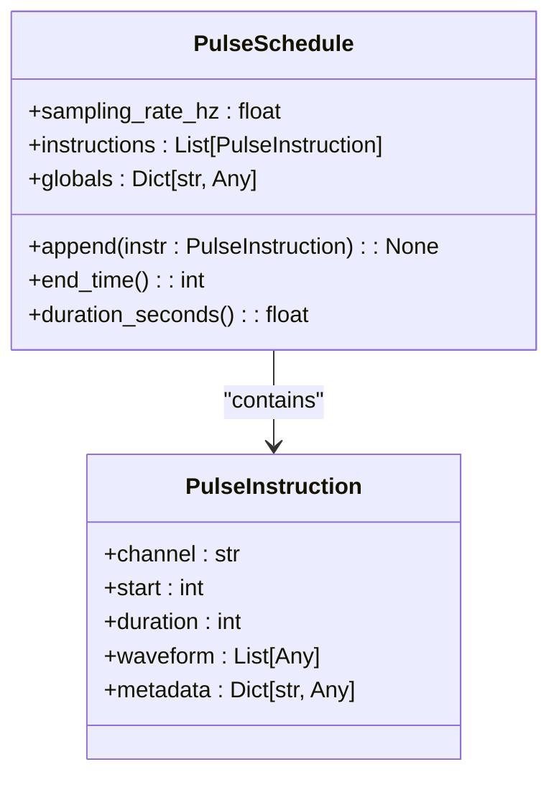
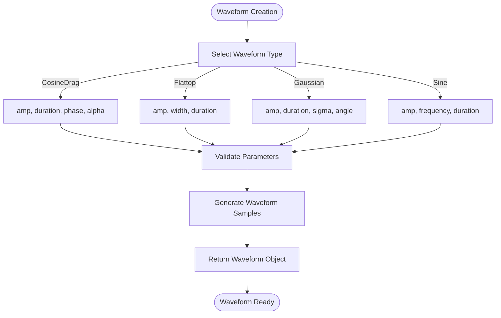
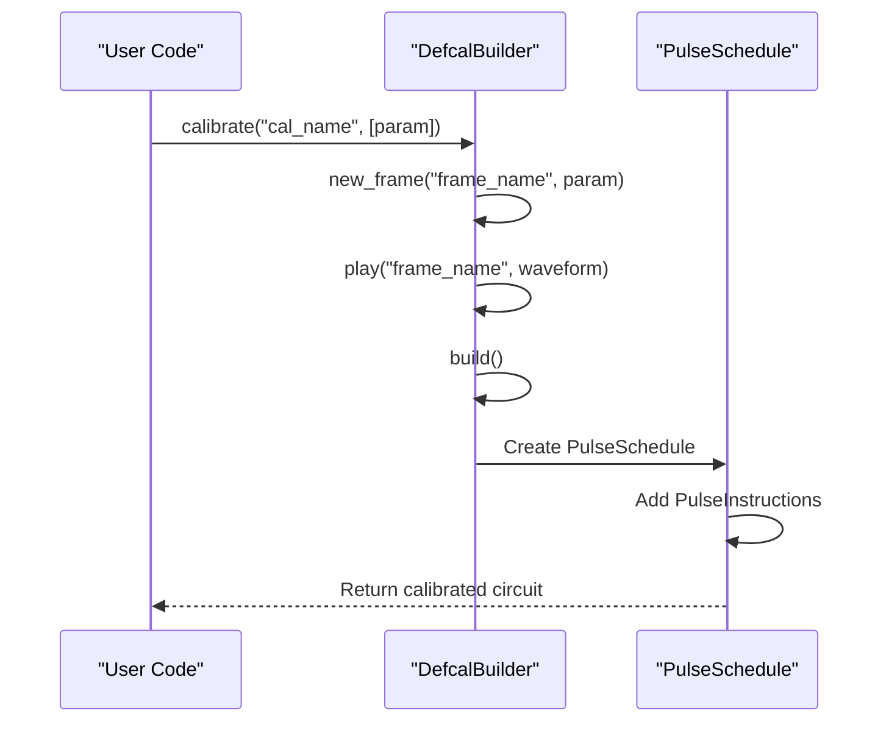
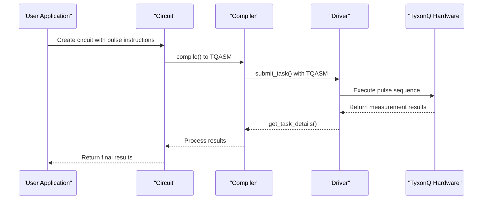

# Pulse-Level Control

<cite>
**Referenced Files in This Document**   
- [pulse.py](file://src/tyxonq/core/ir/pulse.py)
- [waveforms.py](file://src/tyxonq/waveforms.py)
- [pulse_demo.py](file://examples/pulse_demo.py)
- [pulse_demo_scan.py](file://examples/pulse_demo_scan.py)
- [driver.py](file://src/tyxonq/devices/hardware/tyxonq/driver.py)
- [docs/pulse_support_en.md](file://docs/pulse_support_en.md)
</cite>

## Table of Contents
1. [Introduction](#introduction)
2. [Pulse IR Design](#pulse-ir-design)
3. [Waveform Generation](#waveform-generation)
4. [Pulse Scheduling and Calibration](#pulse-scheduling-and-calibration)
5. [Pulse Compilation and Execution](#pulse-compilation-and-execution)
6. [Configuration Parameters](#configuration-parameters)
7. [Use Cases](#use-cases)
8. [Troubleshooting and Performance Tips](#troubleshooting-and-performance-tips)
9. [Conclusion](#conclusion)

## Introduction

Pulse-level control in TyxonQ enables direct manipulation of quantum hardware through low-level microwave pulses, allowing for precise quantum operations beyond standard gate-based quantum computing. This documentation details the Pulse IR design, waveform generation, pulse scheduling, calibration procedures, and execution flow on TyxonQ hardware. The system supports advanced quantum control techniques such as optimal gate calibration, dynamical decoupling, and custom gate implementation through parameterized waveforms and calibration programs.

The pulse-level interface is built on a stable intermediate representation (IR) that ensures consistent behavior across different backends. Pulse programs are defined using TQASM 0.2, a quantum assembly language that supports parameterized waveforms and frame declarations. The system integrates with the TyxonQ cloud API for task submission and result retrieval, enabling seamless execution on physical quantum processors.

**Section sources**
- [docs/pulse_support_en.md](file://docs/pulse_support_en.md#L0-L606)

## Pulse IR Design

The Pulse IR in TyxonQ is designed around two core dataclasses: `PulseInstruction` and `PulseSchedule`, defined in `pulse.py`. The `PulseInstruction` class represents a single pulse operation targeting a specific hardware channel, containing fields for channel identifier, start time, duration, waveform data, and metadata. The `PulseSchedule` class encapsulates a collection of timed pulse instructions with a specified sampling rate, providing methods to append instructions and calculate schedule duration.

The IR design follows a backend-agnostic approach, using sample counts as the time unit to maintain hardware independence. Time conversion to seconds is performed using the schedule's `sampling_rate_hz` field. This explicit stable IR design contrasts with implicit transpiler IRs in other frameworks, providing predictable and consistent behavior across different execution environments.

**Diagram sources**
- [pulse.py](file://src/tyxonq/core/ir/pulse.py#L1-L66)

**Section sources**
- [pulse.py](file://src/tyxonq/core/ir/pulse.py#L1-L66)

## Waveform Generation

TyxonQ supports multiple waveform types for pulse-level control, each with specific parameters and mathematical expressions. The supported waveforms include CosineDrag, Flattop, Gaussian, Sine, Drag, Constant, GaussianSquare, and Cosine, implemented in the `waveforms.py` module. Each waveform class is a dataclass with parameters defining its shape and characteristics.

The CosineDrag waveform is particularly important for suppressing leakage state transitions in superconducting qubits, using a DRAG coefficient to minimize errors. The Flattop waveform provides a flat-top section suitable for quantum state preparation, while Gaussian waveforms offer smooth transitions ideal for adiabatic evolution. Sine waveforms enable periodic oscillation experiments like Rabi oscillations.

**Diagram sources**
- [waveforms.py](file://src/tyxonq/waveforms.py#L0-L97)

**Section sources**
- [waveforms.py](file://src/tyxonq/waveforms.py#L0-L97)
- [docs/pulse_support_en.md](file://docs/pulse_support_en.md#L211-L349)

## Pulse Scheduling and Calibration

Pulse scheduling in TyxonQ is managed through the `PulseSchedule` class, which maintains an ordered list of pulse instructions and calculates the overall schedule duration. The scheduling system handles timing constraints and ensures that pulse instructions do not overlap when targeting the same hardware channel. Calibration procedures are implemented using the `DefcalBuilder` pattern, where users define parameterized calibration programs that can be reused across different circuits.

The calibration process involves creating a builder object, defining frames on target qubits, and playing waveforms on those frames. Multiple instructions can be combined in a single calibration program, enabling complex pulse sequences. The parameterization system allows for scan experiments where waveform parameters are varied systematically, as demonstrated in the `pulse_demo_scan.py` example.

**Diagram sources**
- [pulse_demo.py](file://examples/pulse_demo.py#L0-L80)
- [pulse_demo_scan.py](file://examples/pulse_demo_scan.py#L0-L48)

**Section sources**
- [pulse_demo.py](file://examples/pulse_demo.py#L0-L80)
- [pulse_demo_scan.py](file://examples/pulse_demo_scan.py#L0-L48)

## Pulse Compilation and Execution

Pulse-level programs are compiled and executed on TyxonQ hardware through the driver interface in `driver.py`. The compilation process converts high-level pulse definitions into low-level hardware instructions that can be executed on the quantum processor. The execution flow begins with circuit creation using the `Circuit` class, enabling pulse mode with `use_pulse()`, and defining calibration programs with parameterized waveforms.

The driver interface handles communication with the TyxonQ cloud API, submitting tasks with specified device parameters and optimization flags. The `submit_task` function in the driver module constructs the appropriate API request, including device selection, shot count, and source code in TQASM format. Task results are retrieved through the `get_task_details` function, which normalizes the response into a unified payload structure.

**Diagram sources**
- [driver.py](file://src/tyxonq/devices/hardware/tyxonq/driver.py#L0-L192)
- [pulse_demo.py](file://examples/pulse_demo.py#L0-L80)

**Section sources**
- [driver.py](file://src/tyxonq/devices/hardware/tyxonq/driver.py#L0-L192)
- [pulse_demo.py](file://examples/pulse_demo.py#L0-L80)

## Configuration Parameters

TyxonQ pulse-level control supports various configuration parameters for pulse shaping, timing constraints, and hardware-specific limitations. Waveform parameters have specific constraints to ensure physical realizability and hardware compatibility. For example, the CosineDrag waveform requires the amplitude to be within [-2, 2] and the DRAG coefficient within [-10, 10]. The Flattop waveform has a maximum duration of 100,000 sampling periods and width limited to 100.

Timing constraints are enforced through the pulse scheduler, which validates that pulse instructions do not violate hardware timing requirements. The system also supports parameterization through the `Param` class, allowing for scan experiments and optimization routines. Device-specific limitations are handled through the driver interface, which adapts pulse sequences to the target hardware's capabilities.

| Parameter | Waveform Type | Constraints | Description |
|---------|---------------|-------------|-------------|
| `amp` | All waveforms | \|amp\| ≤ 2 | Waveform amplitude |
| `duration` | CosineDrag, Gaussian, Sine | 0 < duration < 10000 | Pulse length in sampling periods |
| `duration` | Flattop | duration ≤ 100,000 | Pulse length in sampling periods |
| `width` | Flattop, GaussianSquare | width ≤ 100 | FWHM of Gaussian component |
| `alpha` | CosineDrag | \|alpha\| ≤ 10 | DRAG coefficient |
| `beta` | Drag | No restrictions | DRAG parameter for leakage suppression |
| `sigma` | Gaussian, Drag | No restrictions | Gaussian standard deviation |

**Section sources**
- [docs/pulse_support_en.md](file://docs/pulse_support_en.md#L211-L349)
- [waveforms.py](file://src/tyxonq/waveforms.py#L0-L97)

## Use Cases

TyxonQ's pulse-level control enables several advanced quantum computing use cases. Optimal gate calibration can be performed by scanning pulse parameters and measuring gate fidelity, as demonstrated in the Rabi oscillation experiments in `pulse_demo.py`. Dynamical decoupling sequences can be implemented by constructing precise pulse trains with specific timing and phase relationships.

Custom gate implementation is facilitated through parameterized calibration programs, allowing users to define novel quantum operations beyond standard gate sets. The parameterization system supports optimization routines where pulse parameters are adjusted to minimize error rates or maximize gate fidelity. Quantum optimal control techniques like GRAPE can be implemented by combining pulse-level access with gradient-based optimization.

The `pulse_demo_scan.py` example illustrates parameter scanning for Rabi oscillation experiments, varying frequency and amplitude parameters across multiple circuits. This approach enables systematic exploration of parameter space for calibration and characterization purposes. Complex calibration programs with multiple frames and waveforms can be constructed for multi-qubit operations and entangling gates.

**Section sources**
- [pulse_demo.py](file://examples/pulse_demo.py#L0-L80)
- [pulse_demo_scan.py](file://examples/pulse_demo_scan.py#L0-L48)

## Troubleshooting and Performance Tips

Common issues in pulse-level programming include unsupported waveform types, parameter type errors, undefined frames, and TQASM generation failures. To troubleshoot these issues, verify that waveform types match the predefined set, parameters are correctly typed (either `Param` objects or numerical values), frames are defined before playing waveforms, and calibration programs are properly built.

Performance can be optimized by minimizing pulse sequence duration through careful scheduling and parameter selection. Using appropriate waveform types for specific applications reduces errors and improves gate fidelity. For example, CosineDrag waveforms should be used for single-qubit gates to suppress leakage, while Flattop waveforms are preferred for state preparation.

When encountering pulse compilation errors, check the TQASM output for syntax correctness before submitting to hardware. Timing violations can be avoided by respecting hardware timing constraints and using the pulse scheduler to validate instruction timing. For optimal performance, use parameterized waveforms with scan experiments to find optimal pulse parameters for specific hardware conditions.

**Section sources**
- [docs/pulse_support_en.md](file://docs/pulse_support_en.md#L550-L606)
- [pulse_demo.py](file://examples/pulse_demo.py#L0-L80)

## Conclusion

TyxonQ's pulse-level control system provides a comprehensive framework for low-level quantum hardware manipulation. The explicit stable IR design ensures consistent behavior across different execution environments, while the parameterized waveform system enables flexible quantum control. The integration of pulse scheduling, calibration procedures, and hardware execution through a unified interface simplifies the development of advanced quantum algorithms and control sequences.

The system supports a wide range of applications from basic calibration experiments to complex quantum optimal control, making it suitable for both research and practical quantum computing tasks. By providing direct access to quantum hardware through well-defined APIs and data structures, TyxonQ enables researchers and developers to push the boundaries of quantum control and explore novel quantum computing techniques.