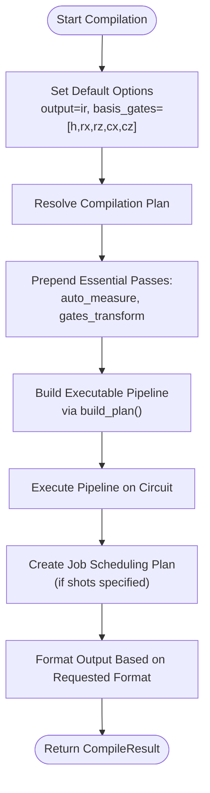
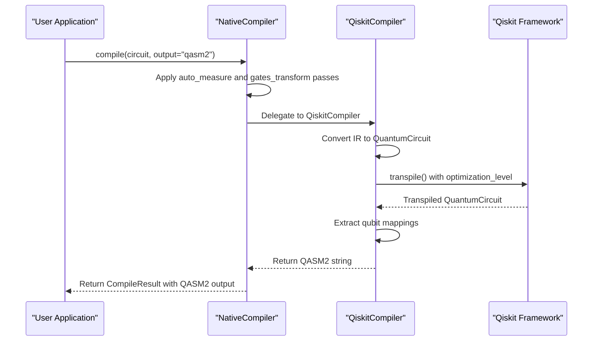
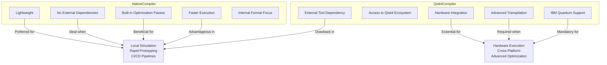
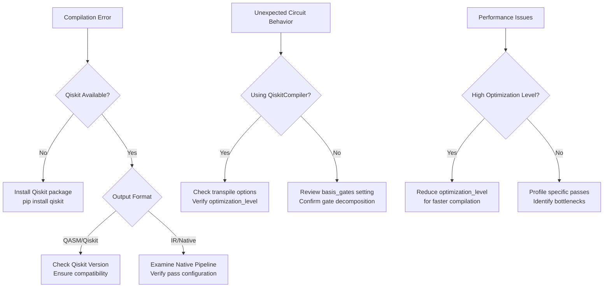

# Backend Compilers

<cite>
**Referenced Files in This Document**   
- [native_compiler.py](file://src/tyxonq/compiler/compile_engine/native/native_compiler.py)
- [qiskit_compiler.py](file://src/tyxonq/compiler/compile_engine/qiskit/qiskit_compiler.py)
- [compile_plan.py](file://src/tyxonq/compiler/compile_engine/native/compile_plan.py)
- [dialect.py](file://src/tyxonq/compiler/compile_engine/qiskit/dialect.py)
- [auto_measure.py](file://src/tyxonq/compiler/stages/rewrite/auto_measure.py)
- [gates_transform.py](file://src/tyxonq/compiler/stages/rewrite/gates_transform.py)
</cite>

## Table of Contents
1. [Introduction](#introduction)
2. [NativeCompiler Implementation](#nativecompiler-implementation)
3. [QiskitCompiler Implementation](#qiskitcompiler-implementation)
4. [Comparison and Use Cases](#comparison-and-use-cases)
5. [Troubleshooting Interoperability Issues](#troubleshooting-interoperability-issues)
6. [Conclusion](#conclusion)

## Introduction
The Compiler Pipeline in TyxonQ features two distinct backend compilers: NativeCompiler and QiskitCompiler. These implementations serve different purposes within the quantum computing workflow, offering trade-offs between lightweight execution and hardware integration capabilities. The NativeCompiler provides a dependency-free compilation path with built-in optimization passes, while the QiskitCompiler enables integration with IBM Quantum hardware through Qiskit's transpilation framework. This document analyzes both implementations, their respective strengths, and appropriate use cases.

**Section sources**
- [native_compiler.py](file://src/tyxonq/compiler/compile_engine/native/native_compiler.py#L1-L10)
- [qiskit_compiler.py](file://src/tyxonq/compiler/compile_engine/qiskit/qiskit_compiler.py#L1-L10)

## NativeCompiler Implementation

The NativeCompiler implements a lightweight, self-contained compilation pipeline that operates entirely within the TyxonQ ecosystem without external dependencies. Its design emphasizes simplicity and performance through a modular pass-based architecture.

### Default Pipeline Construction
The NativeCompiler constructs its compilation pipeline by combining essential normalization passes with user-specified compilation plans. The pipeline always begins with two fundamental passes: "rewrite/auto_measure" and "rewrite/gates_transform", which ensure circuit completeness and gate basis compliance respectively. These are followed by any additional passes specified in the compile_plan parameter.

The pipeline construction process follows this sequence:
1. Set default output format to "ir" if not specified
2. Establish default basis gates ["h", "rx", "rz", "cx", "cz"] unless overridden
3. Determine optimization level (default: 0)
4. Resolve the compilation plan from input parameters
5. Prepend essential normalization passes to the user's plan
6. Build the executable pipeline using build_plan()

**Diagram sources**
- [native_compiler.py](file://src/tyxonq/compiler/compile_engine/native/native_compiler.py#L20-L50)
- [compile_plan.py](file://src/tyxonq/compiler/compile_engine/native/compile_plan.py#L90-L94)

### Output Format Handling
The NativeCompiler supports multiple output formats through conditional logic. For "ir" or "tyxonq" outputs, it returns the optimized circuit in TyxonQ's internal representation. When "qasm" or "qasm2" formats are requested, the compiler delegates to QiskitCompiler through a thin interoperability layer, demonstrating a hybrid approach that leverages external tools only when necessary. This fallback mechanism ensures functionality even if Qiskit is not available, maintaining the compiler's robustness.

**Section sources**
- [native_compiler.py](file://src/tyxonq/compiler/compile_engine/native/native_compiler.py#L60-L95)

## QiskitCompiler Implementation

The QiskitCompiler provides an interoperability layer between TyxonQ's internal circuit representation and Qiskit's extensive quantum computing ecosystem. This implementation enables access to IBM Quantum hardware and Qiskit's sophisticated transpilation capabilities.

### Qiskit Interoperability Layer
The QiskitCompiler's core functionality revolves around bidirectional translation between TyxonQ's Circuit representation and Qiskit's QuantumCircuit. The implementation uses adapter functions defined in dialect.py to convert between these representations. The compilation process involves:

1. Converting the TyxonQ Circuit to Qiskit's QuantumCircuit via ir_to_qiskit()
2. Applying Qiskit's transpilation if requested
3. Extracting mapping information between logical and physical qubits
4. Formatting the output according to the requested format

The compiler handles optional features like automatic measurement insertion and transpilation control through configuration options, providing fine-grained control over the compilation process.

**Diagram sources**
- [native_compiler.py](file://src/tyxonq/compiler/compile_engine/native/native_compiler.py#L80-L95)
- [qiskit_compiler.py](file://src/tyxonq/compiler/compile_engine/qiskit/qiskit_compiler.py#L22-L76)

### Transpilation Framework Integration
The QiskitCompiler integrates with Qiskit's transpilation framework by normalizing input options through the normalize_transpile_options() function. This function ensures compatibility between TyxonQ's configuration schema and Qiskit's expectations, handling parameter name variations (like "opt_level" vs "optimization_level") and establishing default values for critical parameters such as basis_gates and optimization_level.

When transpilation is enabled, the compiler strips non-transpilation options before invoking Qiskit's transpile() function, preventing potential conflicts. The resulting transpiled circuit is accompanied by metadata that includes logical-to-physical qubit mappings, preserving important compilation artifacts for downstream processing.

**Section sources**
- [qiskit_compiler.py](file://src/tyxonq/compiler/compile_engine/qiskit/qiskit_compiler.py#L22-L76)
- [dialect.py](file://src/tyxonq/compiler/compile_engine/qiskit/dialect.py#L26-L39)

## Comparison and Use Cases

### Strengths and Characteristics
The two compiler implementations exhibit distinct characteristics that make them suitable for different scenarios:

**Diagram sources**
- [native_compiler.py](file://src/tyxonq/compiler/compile_engine/native/native_compiler.py)
- [qiskit_compiler.py](file://src/tyxonq/compiler/compile_engine/qiskit/qiskit_compiler.py)

### When to Use Each Backend
**NativeCompiler is preferred when:**
- Working in environments where minimizing dependencies is critical
- Performing rapid prototyping and local simulations
- Needing fast compilation turnaround for iterative development
- Targeting TyxonQ's native execution environment
- Running in constrained environments (CI/CD, containers, edge devices)

**QiskitCompiler is essential when:**
- Targeting execution on IBM Quantum hardware
- Requiring advanced transpilation optimizations (optimization_level > 2)
- Needing compatibility with Qiskit-based workflows and tools
- Integrating with existing Qiskit-centric quantum computing pipelines
- Leveraging Qiskit's extensive device calibration and error mitigation features

The hybrid design allows users to start with NativeCompiler for development and testing, then switch to QiskitCompiler for production deployment on quantum hardware.

**Section sources**
- [native_compiler.py](file://src/tyxonq/compiler/compile_engine/native/native_compiler.py)
- [qiskit_compiler.py](file://src/tyxonq/compiler/compile_engine/qiskit/qiskit_compiler.py)

## Troubleshooting Interoperability Issues

### Common Issues and Solutions
When using the compiler backends, particularly in interoperability scenarios, several common issues may arise:

**Diagram sources**
- [native_compiler.py](file://src/tyxonq/compiler/compile_engine/native/native_compiler.py)
- [qiskit_compiler.py](file://src/tyxonq/compiler/compile_engine/qiskit/qiskit_compiler.py)

### Key Troubleshooting Guidance
1. **Missing Qiskit Dependency**: When NativeCompiler attempts to delegate to QiskitCompiler for QASM output but fails, ensure Qiskit is properly installed in the environment.

2. **Gate Basis Mismatches**: Verify that the basis_gates parameter includes all required gate types for the target hardware or simulation backend.

3. **Optimization Level Discrepancies**: Be aware that NativeCompiler's optimization capabilities are more limited than Qiskit's, particularly at higher optimization levels.

4. **Measurement Handling**: The auto_measure pass in NativeCompiler may insert measurements differently than expected; explicitly define measurements when precise control is needed.

5. **Qubit Mapping Confusion**: When using QiskitCompiler, examine the logical_physical_mapping in the metadata to understand how logical qubits are mapped to physical device qubits.

**Section sources**
- [native_compiler.py](file://src/tyxonq/compiler/compile_engine/native/native_compiler.py)
- [qiskit_compiler.py](file://src/tyxonq/compiler/compile_engine/qiskit/qiskit_compiler.py)
- [auto_measure.py](file://src/tyxonq/compiler/stages/rewrite/auto_measure.py)
- [gates_transform.py](file://src/tyxonq/compiler/stages/rewrite/gates_transform.py)

## Conclusion
The Backend Compilers component of TyxonQ's Compiler Pipeline offers a flexible dual-approach to quantum circuit compilation. The NativeCompiler provides a lightweight, dependency-free solution ideal for development and local execution, while the QiskitCompiler enables integration with IBM Quantum hardware and Qiskit's advanced transpilation capabilities. The thoughtful design allows seamless interoperability between the two backends, enabling users to leverage the strengths of each implementation according to their specific use case. By understanding the characteristics and appropriate applications of each compiler, users can optimize their quantum computing workflows for both development efficiency and production performance.