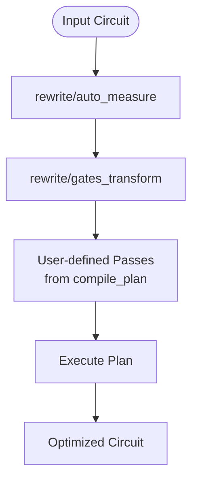
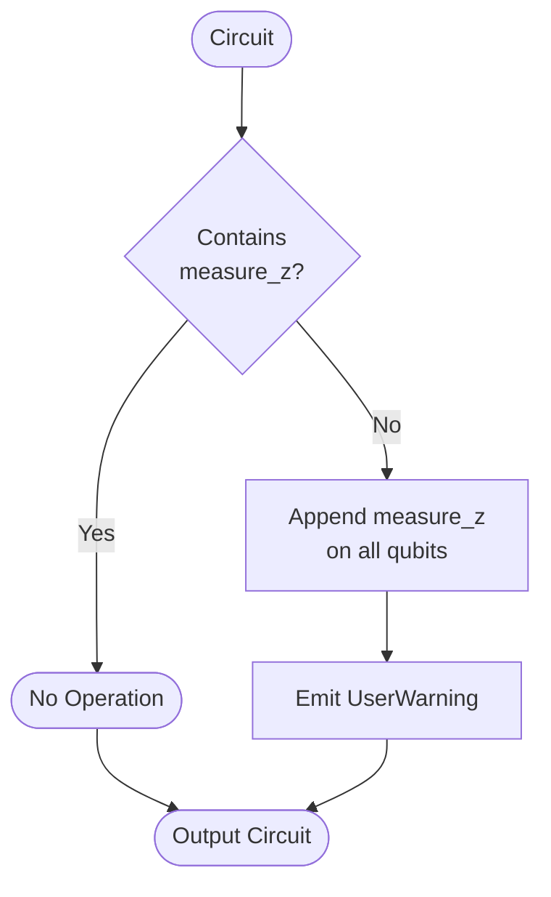
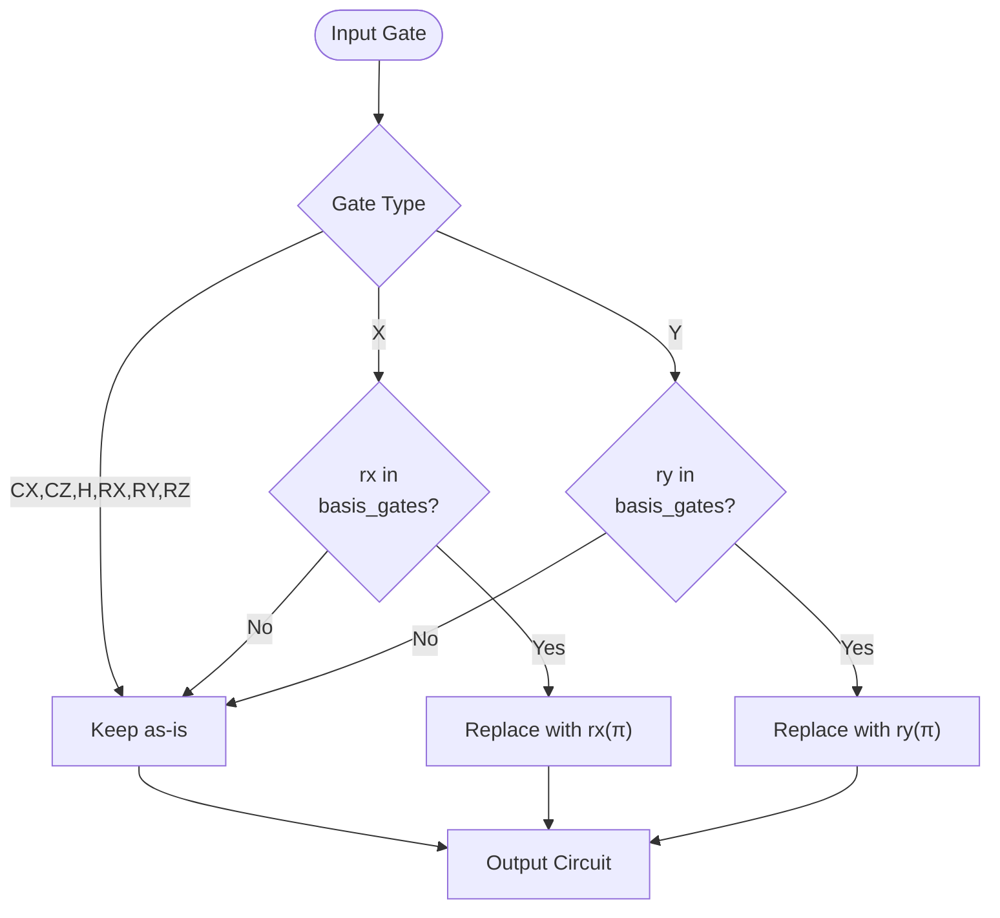
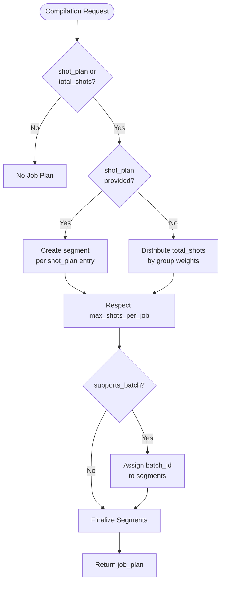
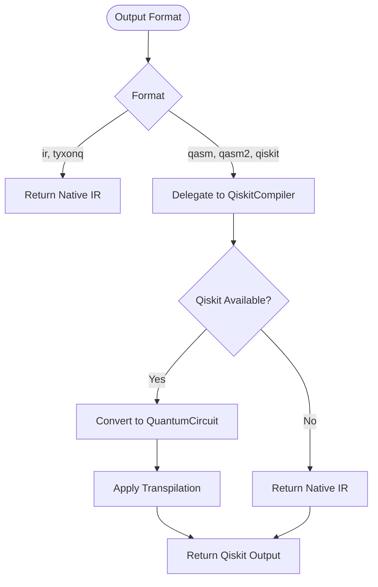

# Native Compiler

<cite>
**Referenced Files in This Document**   
- [native_compiler.py](file://src/tyxonq/compiler/compile_engine/native/native_compiler.py)
- [compile_plan.py](file://src/tyxonq/compiler/compile_engine/native/compile_plan.py)
- [auto_measure.py](file://src/tyxonq/compiler/stages/rewrite/auto_measure.py)
- [gates_transform.py](file://src/tyxonq/compiler/stages/rewrite/gates_transform.py)
- [shot_scheduler.py](file://src/tyxonq/compiler/stages/scheduling/shot_scheduler.py)
- [qiskit_compiler.py](file://src/tyxonq/compiler/compile_engine/qiskit/qiskit_compiler.py)
</cite>

## Table of Contents
1. [Introduction](#introduction)
2. [Default Compilation Pipeline](#default-compilation-pipeline)
3. [Normalization Passes](#normalization-passes)
4. [Custom Optimization with compile_plan](#custom-optimization-with-compile_plan)
5. [Shot Scheduling Integration](#shot-scheduling-integration)
6. [Output Format Handling](#output-format-handling)
7. [Practical Usage Examples](#practical-usage-examples)
8. [Troubleshooting Common Issues](#troubleshooting-common-issues)

## Introduction
The NativeCompiler is the default compilation engine within TyxonQ's backend compilers, designed to provide a lightweight, dependency-free compilation path optimized for the internal execution ecosystem. It operates directly on TyxonQ's intermediate representation (IR) and enables efficient circuit transformation and optimization without requiring external quantum software frameworks. The compiler supports customizable optimization workflows and integrates seamlessly with device-specific execution constraints through modular compilation passes.

**Section sources**
- [native_compiler.py](file://src/tyxonq/compiler/compile_engine/native/native_compiler.py#L12-L98)

## Default Compilation Pipeline
The NativeCompiler constructs its default compilation pipeline by automatically prepending essential normalization passes to any user-specified optimization sequence. This ensures consistent preprocessing regardless of the requested optimization level. The pipeline begins with two mandatory passes: 'rewrite/auto_measure' and 'rewrite/gates_transform'. These are followed by any additional passes specified in the `compile_plan` parameter. The pipeline execution is managed by the `build_plan` function, which resolves stage names into executable `Pass` instances and composes them into a `CompilePlan`. The final pipeline is executed sequentially on the input circuit, producing a transformed circuit that adheres to the specified optimization and device constraints.

**Diagram sources**
- [native_compiler.py](file://src/tyxonq/compiler/compile_engine/native/native_compiler.py#L50-L60)
- [compile_plan.py](file://src/tyxonq/compiler/compile_engine/native/compile_plan.py#L91-L94)

**Section sources**
- [native_compiler.py](file://src/tyxonq/compiler/compile_engine/native/native_compiler.py#L50-L65)
- [compile_plan.py](file://src/tyxonq/compiler/compile_engine/native/compile_plan.py#L91-L94)

## Normalization Passes
The NativeCompiler automatically inserts two critical normalization passes at the beginning of every compilation pipeline to ensure circuit consistency and gate compatibility.

### Auto-Measurement Pass
The `AutoMeasurePass` ensures that all circuits contain explicit measurement operations. When no `measure_z` operations are present in the input circuit, this pass automatically appends Z-basis measurements on all qubits. This behavior prevents execution failures due to missing measurements while maintaining circuit semantics. A non-fatal warning is emitted to inform users of this automatic insertion, promoting transparency in the compilation process.

**Diagram sources**
- [auto_measure.py](file://src/tyxonq/compiler/stages/rewrite/auto_measure.py#L10-L34)

### Gate Transformation Pass
The `GatesTransformPass` rewrites quantum gates according to the specified basis gate set. By default, it targets the native basis gates ["h", "rx", "rz", "cx", "cz"]. The pass performs gate substitutions such as converting X gates to RX(π) when RX is available, and Y gates to RY(π) when RY is supported. Gates that are already in the basis set are preserved, while unsupported gates remain unchanged to maintain circuit integrity. This transformation ensures compatibility with the target execution environment's native gate set.

**Diagram sources**
- [gates_transform.py](file://src/tyxonq/compiler/stages/rewrite/gates_transform.py#L9-L49)

**Section sources**
- [auto_measure.py](file://src/tyxonq/compiler/stages/rewrite/auto_measure.py#L10-L34)
- [gates_transform.py](file://src/tyxonq/compiler/stages/rewrite/gates_transform.py#L9-L49)

## Custom Optimization with compile_plan
The `compile_plan` parameter enables customization of the optimization workflow by allowing users to specify additional compilation passes beyond the default normalization steps. When provided, these passes are appended to the fixed sequence of 'rewrite/auto_measure' and 'rewrite/gates_transform'. The parameter accepts either a single pass name or a list of pass names, which are resolved into executable `Pass` instances by the `build_plan` function. This modular design allows for flexible optimization strategies, such as adding lightcone simplification (`simplify/lightcone`) or parameter shift gradient computation (`gradients/parameter_shift`). The optimization level, controlled by the `optimization_level` option, can be used to select predefined optimization strategies or enable specific passes conditionally.

**Section sources**
- [native_compiler.py](file://src/tyxonq/compiler/compile_engine/native/native_compiler.py#L55-L60)
- [compile_plan.py](file://src/tyxonq/compiler/compile_engine/native/compile_plan.py#L15-L94)

## Shot Scheduling Integration
The NativeCompiler integrates shot planning functionality through the `schedule` function when shot-related options are present in the compilation request. When either `shot_plan` or `total_shots` is specified in the options, the compiler invokes the shot scheduler to generate an execution plan. The scheduler operates in two modes: explicit and group-based. In explicit mode, it creates one segment per entry in the provided `shot_plan`. In group-based mode, it distributes `total_shots` across measurement groups using `estimated_shots_per_group` as weights. The resulting job plan includes segments with shot counts, measurement bases, wire mappings, and batch identifiers when supported by the device. The scheduler also respects device constraints such as `max_shots_per_job` by splitting oversized segments and supports batch execution when `supports_batch` is enabled.

**Diagram sources**
- [shot_scheduler.py](file://src/tyxonq/compiler/stages/scheduling/shot_scheduler.py#L43-L118)

**Section sources**
- [native_compiler.py](file://src/tyxonq/compiler/compile_engine/native/native_compiler.py#L67-L75)
- [shot_scheduler.py](file://src/tyxonq/compiler/stages/scheduling/shot_scheduler.py#L43-L118)

## Output Format Handling
The NativeCompiler handles multiple output formats through conditional delegation logic. For IR output (specified as "ir" or "tyxonq"), it returns the optimized circuit directly in TyxonQ's native intermediate representation. For QASM2 and Qiskit outputs, the compiler delegates to the `QiskitCompiler` when the requested format is "qasm", "qasm2", or "qiskit". This delegation occurs through a thin forwarding layer that converts the native IR to Qiskit's `QuantumCircuit` format using the `ir_to_qiskit` adapter. The delegation includes appropriate basis gate settings and transpilation options before invoking Qiskit's compilation pipeline. If the Qiskit dependency is unavailable or the compilation fails, the fallback behavior returns the native IR representation to ensure compilation success. This hybrid approach leverages external tools for industry-standard format support while maintaining independence from external dependencies for core functionality.

**Diagram sources**
- [native_compiler.py](file://src/tyxonq/compiler/compile_engine/native/native_compiler.py#L77-L98)
- [qiskit_compiler.py](file://src/tyxonq/compiler/compile_engine/qiskit/qiskit_compiler.py#L19-L76)

**Section sources**
- [native_compiler.py](file://src/tyxonq/compiler/compile_engine/native/native_compiler.py#L77-L98)
- [qiskit_compiler.py](file://src/tyxonq/compiler/compile_engine/qiskit/qiskit_compiler.py#L19-L76)

## Practical Usage Examples
The NativeCompiler can be invoked with various optimization levels and basis gate configurations to suit different use cases. For basic compilation with default settings, users can call the compiler without specifying a custom plan, relying on the automatic insertion of normalization passes. To apply aggressive optimization, users can include the `simplify/lightcone` pass in the `compile_plan` parameter. When targeting specific hardware with limited gate support, the `basis_gates` option can be used to constrain the output gate set. For execution planning, the `total_shots` parameter triggers shot scheduling, generating a structured job plan for efficient measurement execution. These examples demonstrate the flexibility of the NativeCompiler in adapting to diverse compilation requirements while maintaining a consistent interface.

**Section sources**
- [native_compiler.py](file://src/tyxonq/compiler/compile_engine/native/native_compiler.py#L20-L98)

## Troubleshooting Common Issues
Common issues when using the NativeCompiler include unexpected IR output and failed QASM2 fallbacks. Unexpected IR output may occur when the input circuit lacks explicit measurements, triggering the automatic insertion of Z-measurements by the `AutoMeasurePass`. Users should verify their circuit contains the expected measurement operations or explicitly disable auto-measurement if needed. QASM2 fallback failures typically result from missing Qiskit dependencies or incompatible circuit structures. When Qiskit is unavailable, the compiler gracefully falls back to returning native IR, but users expecting QASM2 output should ensure Qiskit is properly installed. Other issues may arise from incorrect `compile_plan` specifications or unsupported basis gates; validating pass names and gate sets against the available stages can prevent these errors. Monitoring compilation metadata provides insight into the applied optimization pipeline and output format decisions.

**Section sources**
- [native_compiler.py](file://src/tyxonq/compiler/compile_engine/native/native_compiler.py#L77-L98)
- [auto_measure.py](file://src/tyxonq/compiler/stages/rewrite/auto_measure.py#L10-L34)