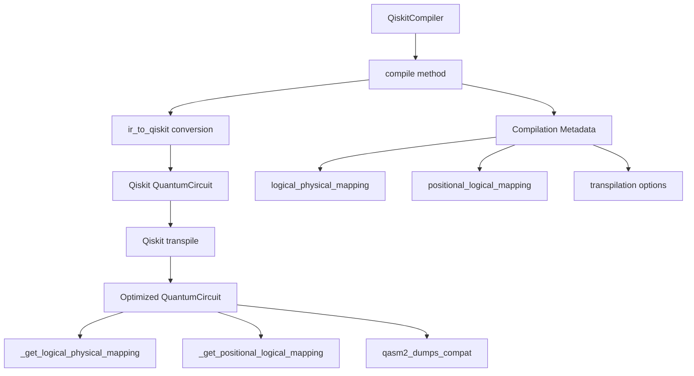
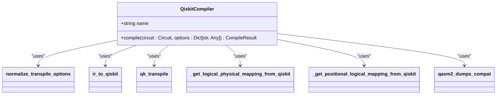
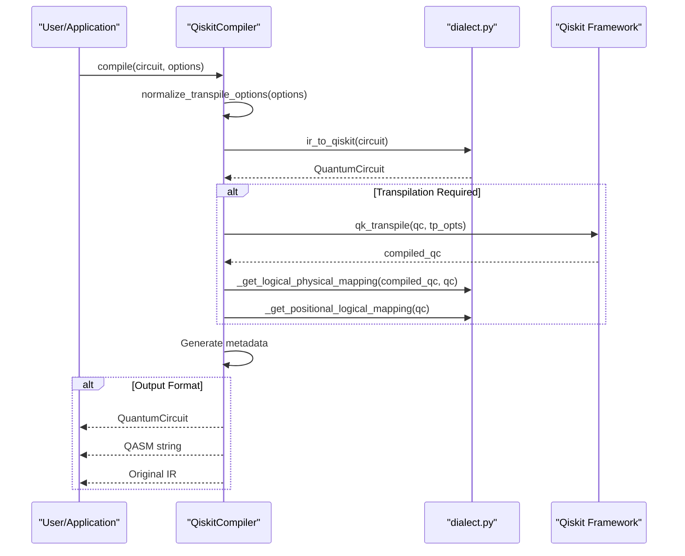
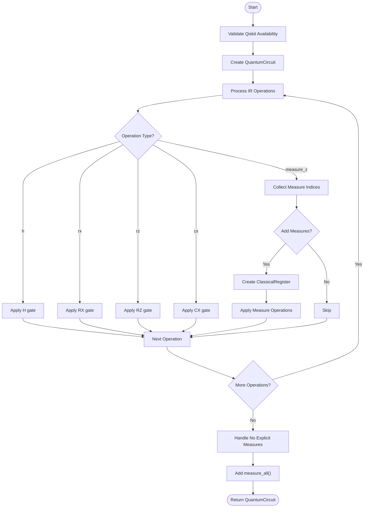
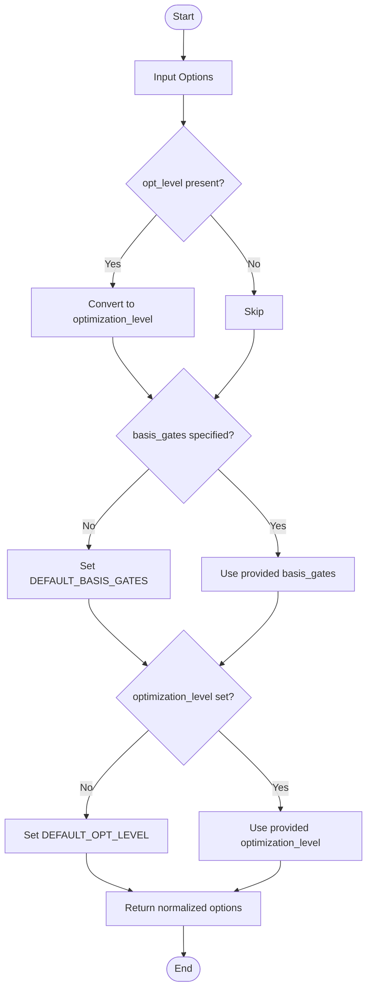
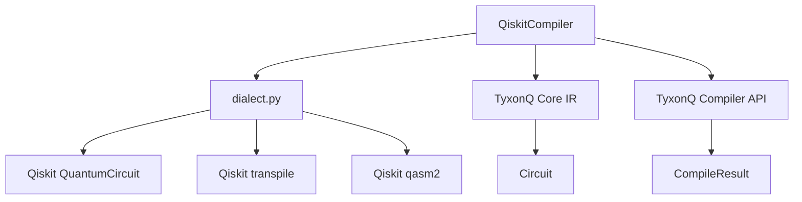

# Qiskit Compiler

<cite>
**Referenced Files in This Document**   
- [qiskit_compiler.py](file://src/tyxonq/compiler/compile_engine/qiskit/qiskit_compiler.py)
- [dialect.py](file://src/tyxonq/compiler/compile_engine/qiskit/dialect.py)
</cite>

## Table of Contents
1. [Introduction](#introduction)
2. [Core Components](#core-components)
3. [Architecture Overview](#architecture-overview)
4. [Detailed Component Analysis](#detailed-component-analysis)
5. [Dependency Analysis](#dependency-analysis)
6. [Performance Considerations](#performance-considerations)
7. [Troubleshooting Guide](#troubleshooting-guide)
8. [Conclusion](#conclusion)

## Introduction

The QiskitCompiler is a critical component within TyxonQ's Backend Compilers framework, serving as a bridge between TyxonQ's Intermediate Representation (IR) and IBM Quantum's Qiskit ecosystem. This compiler enables seamless integration with IBM Quantum hardware by leveraging Qiskit's comprehensive transpilation framework, allowing users to target specific quantum devices with optimized circuit configurations. The QiskitCompiler facilitates bidirectional conversion between TyxonQ's IR and Qiskit's QuantumCircuit representation, providing access to Qiskit's extensive optimization passes, device-aware compilation, and hardware-specific constraints.

This documentation details the implementation of the QiskitCompiler, focusing on its core conversion utilities, transpilation management, and qubit mapping extraction capabilities. The compiler supports multiple output formats including native Qiskit circuits, OpenQASM 2.0, and TyxonQ's IR, making it a versatile tool for quantum circuit development and execution across different platforms.

## Core Components

The QiskitCompiler implementation consists of two primary files: `qiskit_compiler.py` which contains the main compiler class and execution logic, and `dialect.py` which provides the conversion utilities and supporting functions. The compiler integrates with Qiskit's transpile function to perform circuit optimization and device-specific compilation, while maintaining compatibility with TyxonQ's internal circuit representation.

**Section sources**
- [qiskit_compiler.py](file://src/tyxonq/compiler/compile_engine/qiskit/qiskit_compiler.py#L1-L83)
- [dialect.py](file://src/tyxonq/compiler/compile_engine/qiskit/dialect.py#L1-L247)

## Architecture Overview

The QiskitCompiler follows a modular architecture that separates the compilation orchestration from the low-level conversion logic. The main `QiskitCompiler` class coordinates the compilation process, while the `dialect.py` module handles the actual translation between representations. This separation of concerns allows for maintainable code and clear responsibility boundaries.

**Diagram sources **
- [qiskit_compiler.py](file://src/tyxonq/compiler/compile_engine/qiskit/qiskit_compiler.py#L19-L76)
- [dialect.py](file://src/tyxonq/compiler/compile_engine/qiskit/dialect.py#L79-L121)

## Detailed Component Analysis

### QiskitCompiler Class Analysis

The `QiskitCompiler` class serves as the entry point for Qiskit-based compilation within the TyxonQ framework. It implements the standard compiler interface while providing Qiskit-specific functionality for circuit transpilation and device integration.

#### Class Structure

**Diagram sources **
- [qiskit_compiler.py](file://src/tyxonq/compiler/compile_engine/qiskit/qiskit_compiler.py#L19-L20)

**Section sources**
- [qiskit_compiler.py](file://src/tyxonq/compiler/compile_engine/qiskit/qiskit_compiler.py#L19-L76)

### Compilation Process Flow

The compilation process follows a sequential workflow that transforms TyxonQ's IR into executable quantum circuits, with optional transpilation and format conversion steps.

#### Compilation Sequence

**Diagram sources **
- [qiskit_compiler.py](file://src/tyxonq/compiler/compile_engine/qiskit/qiskit_compiler.py#L22-L76)
- [dialect.py](file://src/tyxonq/compiler/compile_engine/qiskit/dialect.py#L26-L39)

### Conversion Utilities Analysis

The dialect.py module provides essential utilities for bidirectional conversion between TyxonQ's IR and Qiskit's QuantumCircuit representation. These functions form the foundation of the interoperability between the two frameworks.

#### IR to Qiskit Conversion Logic

**Diagram sources **
- [dialect.py](file://src/tyxonq/compiler/compile_engine/qiskit/dialect.py#L124-L179)

### Transpilation Options Normalization

The `normalize_transpile_options` function ensures consistent parameter handling between TyxonQ's interface and Qiskit's transpile function, providing backward compatibility and sensible defaults.

#### Options Normalization Process

**Diagram sources **
- [dialect.py](file://src/tyxonq/compiler/compile_engine/qiskit/dialect.py#L26-L39)

## Dependency Analysis

The QiskitCompiler has a well-defined dependency structure that isolates Qiskit-specific functionality while maintaining integration with the broader TyxonQ framework. The compiler depends on Qiskit only when required for specific operations, allowing the rest of the system to function without this external dependency.

**Diagram sources **
- [qiskit_compiler.py](file://src/tyxonq/compiler/compile_engine/qiskit/qiskit_compiler.py#L1-L83)
- [dialect.py](file://src/tyxonq/compiler/compile_engine/qiskit/dialect.py#L1-L247)

## Performance Considerations

The QiskitCompiler is designed with performance in mind, minimizing unnecessary operations and leveraging Qiskit's efficient transpilation pipeline. The compiler only imports Qiskit components when required for specific operations, reducing startup overhead. The transpilation options are filtered to remove non-relevant parameters before being passed to Qiskit's transpile function, ensuring optimal performance. The bidirectional conversion utilities are implemented with direct operation mapping, avoiding intermediate representations that could introduce latency.

## Troubleshooting Guide

### Common Issues and Solutions

| Issue | Cause | Solution |
|------|------|----------|
| "qiskit not available" error | Qiskit package not installed | Install Qiskit using `pip install qiskit` |
| Transpilation failures | Invalid transpilation options | Validate options against Qiskit's transpile function documentation |
| Incorrect qubit mappings | Measurement operations not properly handled | Ensure measurement operations are correctly specified in the IR circuit |
| Empty output circuits | No operations in input circuit | Verify the input circuit contains valid quantum operations |

### Dependency Management

The QiskitCompiler uses optional imports for Qiskit components, which means the compiler can be imported and instantiated even when Qiskit is not available. However, attempting to perform compilation operations that require Qiskit will raise a RuntimeError with a descriptive message indicating the missing dependency.

**Section sources**
- [qiskit_compiler.py](file://src/tyxonq/compiler/compile_engine/qiskit/qiskit_compiler.py#L30-L37)
- [dialect.py](file://src/tyxonq/compiler/compile_engine/qiskit/dialect.py#L5-L10)

## Conclusion

The QiskitCompiler provides a robust bridge between TyxonQ's Intermediate Representation and IBM Quantum's Qiskit framework, enabling seamless integration with IBM Quantum hardware and access to Qiskit's advanced transpilation capabilities. Through its well-structured implementation, the compiler offers flexible output formats, comprehensive transpilation options, and detailed qubit mapping metadata. The separation of conversion logic from compilation orchestration ensures maintainability and extensibility, while the careful dependency management allows for graceful degradation when Qiskit is not available. This implementation positions TyxonQ as a versatile platform for quantum algorithm development that can leverage the strengths of both frameworks.