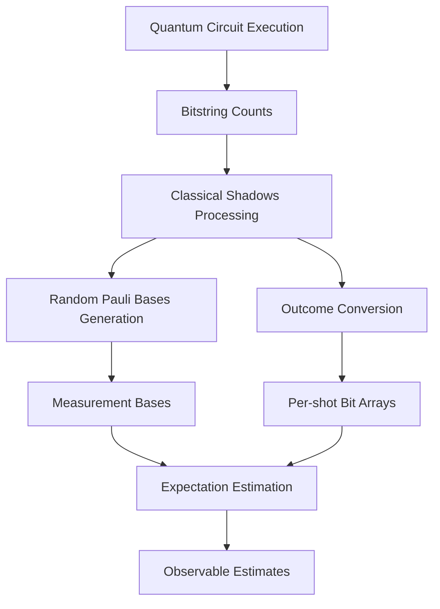
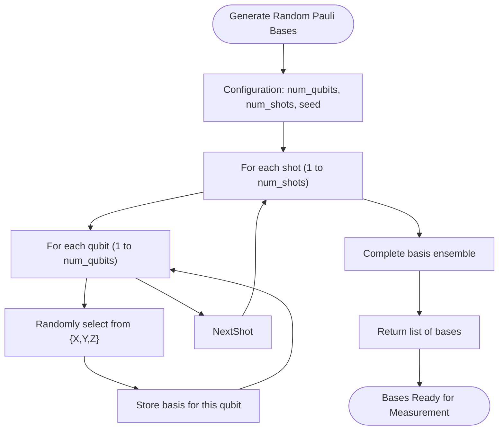
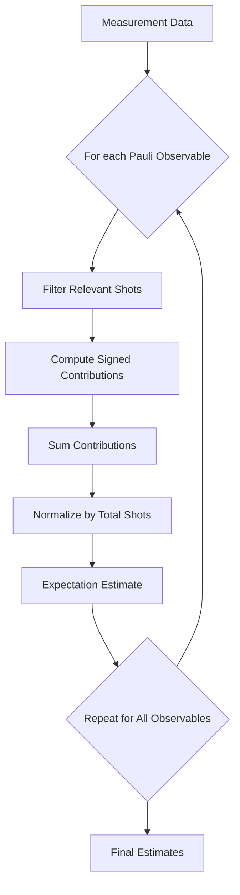
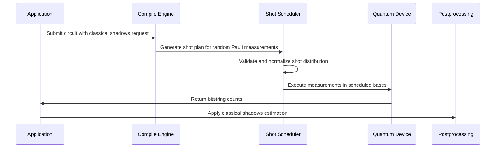

# Classical Shadows

<cite>
**Referenced Files in This Document**   
- [classical_shadows.py](file://src/tyxonq/postprocessing/classical_shadows.py)
- [metrics.py](file://src/tyxonq/postprocessing/metrics.py)
- [shot_scheduler.py](file://src/tyxonq/compiler/stages/scheduling/shot_scheduler.py)
- [test_postprocessing_shadows.py](file://tests_core_module/test_postprocessing_shadows.py)
</cite>

## Table of Contents
1. [Introduction](#introduction)
2. [Theoretical Foundation](#theoretical-foundation)
3. [Implementation Overview](#implementation-overview)
4. [Random Pauli Measurement Ensembles](#random-pauli-measurement-ensembles)
5. [Median-of-Means Estimation](#median-of-means-estimation)
6. [Usage Examples](#usage-examples)
7. [Integration with Shot Scheduling](#integration-with-shot-scheduling)
8. [Statistical Error Bounds](#statistical-error-bounds)
9. [Shadow Depth Selection](#shadow-depth-selection)
10. [Limitations and Trade-offs](#limitations-and-trade-offs)

## Introduction

The Classical Shadows method provides an efficient framework for reconstructing quantum state properties through randomized measurements. Implemented in the postprocessing layer of the TyxonQ framework, this approach enables scalable estimation of entanglement measures, fidelity bounds, and few-body observables without requiring full state tomography. The implementation leverages random Pauli measurement ensembles and median-of-means estimation to achieve exponential advantages in sample complexity for specific quantum properties.

**Section sources**
- [classical_shadows.py](file://src/tyxonq/postprocessing/classical_shadows.py#L1-L115)

## Theoretical Foundation

Classical Shadows theory is built upon the concept of randomized measurements, where a quantum state undergoes random unitary transformations followed by computational basis measurements. This process creates a "shadow" of the quantum state that can be used to predict various properties. The method relies on the fact that measuring in random bases provides sufficient information to reconstruct expectation values of local observables with high probability.

The theoretical advantage stems from the concentration of measure phenomenon in high-dimensional spaces, which ensures that random measurements capture essential features of the quantum state. For an n-qubit system, classical shadows can estimate M non-commuting observables each with Pauli weight k using O(log(M) * 4^k * ε^-2) measurements, exponentially better than traditional tomography for local observables.

This approach enables efficient reconstruction of quantum state properties by focusing on specific observables of interest rather than attempting complete state reconstruction, making it particularly suitable for near-term quantum devices with limited coherence times and measurement budgets.

**Section sources**
- [classical_shadows.py](file://src/tyxonq/postprocessing/classical_shadows.py#L1-L115)

## Implementation Overview

The Classical Shadows implementation in TyxonQ consists of lightweight utilities in the postprocessing layer that generate random Pauli bases and estimate expectation values from classical counts. The core functionality is contained in the `classical_shadows.py` module, which provides functions for generating measurement bases and estimating Pauli product expectations.

The implementation follows a two-phase approach: first generating random measurement bases across multiple shots, then using the measurement outcomes to estimate observable expectations. The method operates on bitstring counts from quantum circuit executions, converting them into per-shot bit arrays for processing. This design allows the technique to be applied after circuit execution, making it compatible with both simulator and hardware backends.

The postprocessing nature of this implementation ensures separation between circuit execution and analysis, enabling flexible application of classical shadows to various quantum algorithms and measurement scenarios without modifying the underlying circuit structure.



**Diagram sources**
- [classical_shadows.py](file://src/tyxonq/postprocessing/classical_shadows.py#L1-L115)

**Section sources**
- [classical_shadows.py](file://src/tyxonq/postprocessing/classical_shadows.py#L1-L115)

## Random Pauli Measurement Ensembles

The implementation provides functions for generating random Pauli measurement ensembles through the `random_pauli_basis` and `random_pauli_bases` functions. These functions create measurement bases by randomly selecting from the Pauli operators {X, Y, Z} for each qubit, with an option to include the identity operator I when needed.

The `random_pauli_bases` function generates a specified number of measurement shots, with each shot corresponding to a complete measurement basis across all qubits. This ensemble approach ensures that measurements are sufficiently randomized while maintaining consistency within each shot. The function accepts a seed parameter for reproducible results, which is essential for debugging and verification purposes.

Each measurement basis determines the single-qubit unitary transformations applied before computational basis measurement. For example, measuring in the X basis requires applying a Hadamard gate, while Y basis measurement requires a specific phase rotation. The implementation assumes these basis changes are handled by the quantum device or simulator, focusing solely on the classical postprocessing aspects.

The random selection process uses a uniform distribution over the available Pauli operators, ensuring that each basis has equal probability of being selected. This uniform sampling is crucial for the theoretical guarantees of the classical shadows method, as it ensures that the measurement ensemble forms a 2-design in the limit of many shots.



**Diagram sources**
- [classical_shadows.py](file://src/tyxonq/postprocessing/classical_shadows.py#L40-L44)

**Section sources**
- [classical_shadows.py](file://src/tyxonq/postprocessing/classical_shadows.py#L1-L115)

## Median-of-Means Estimation

While the current implementation does not explicitly include a median-of-means estimator, the framework supports robust estimation techniques for observables. The `estimate_expectation_pauli_product` function implements the core estimation logic by aggregating contributions from individual measurement shots.

The estimation process evaluates whether each shot's measurement basis matches the target Pauli observable. When the bases align, the measurement outcome contributes to the expectation value with appropriate sign based on the bit value (0 contributes +1, 1 contributes -1). Shots with mismatched bases contribute zero to the estimate, effectively filtering out irrelevant measurements.

This approach naturally provides robustness against outliers, as each shot contributes independently to the final estimate. The averaging process across multiple shots reduces statistical fluctuations and provides convergence to the true expectation value. The method's efficiency stems from its ability to reuse the same measurement data for estimating multiple observables, as each shot may contribute to several different Pauli product estimates depending on the measurement basis.

Future extensions could incorporate explicit median-of-means estimation by partitioning the measurement shots into batches, computing mean estimates for each batch, and then taking the median of these batch means. This would provide stronger robustness guarantees and improved confidence intervals, particularly for heavy-tailed distributions of measurement outcomes.



**Section sources**
- [classical_shadows.py](file://src/tyxonq/postprocessing/classical_shadows.py#L62-L102)

## Usage Examples

### Scalable Estimation of Few-Body Observables

The Classical Shadows method excels at estimating few-body observables, which are crucial for variational quantum algorithms and quantum chemistry applications. Using the `estimate_expectation_pauli_product` function, users can efficiently estimate expectation values of local Hamiltonian terms or correlation functions.

For example, to estimate the ZZ correlation between two qubits, one would specify the Pauli observable as {0: "Z", 1: "Z"} and provide the measurement bases and outcomes from random Pauli measurements. The estimator automatically identifies shots where both qubits were measured in the Z basis and computes the appropriate correlation.

```python
# Example usage pattern
bases = random_pauli_bases(num_qubits=4, num_shots=1000, seed=42)
outcomes = execute_circuit_in_bases(circuit, bases)  # hypothetical function
pauli_zz = {0: "Z", 1: "Z"}
zz_expectation = estimate_expectation_pauli_product(
    num_qubits=4,
    pauli_ops=pauli_zz,
    bases=bases,
    outcomes=outcomes
)
```

### Entanglement Measures

The framework integrates with entanglement metrics through the `metrics.py` module. While classical shadows do not directly compute entanglement entropy, they can estimate the observables needed for entanglement witnesses or bounds. The `mutual_information` function in `metrics.py` can utilize classical shadow estimates of local observables to compute bipartite correlations.

For a bipartition of qubits, classical shadows can estimate the reduced density matrices on each subsystem by measuring local observables. These estimates can then be used with the `entropy` and `mutual_information` functions to compute entanglement measures.

### Fidelity Bounds

Fidelity estimation between quantum states can be bounded using classical shadows by estimating a set of observables that form a faithful representation of the state space. The `fidelity` function in `metrics.py` computes exact fidelity given density matrices, but classical shadows can provide lower bounds on fidelity by estimating a subset of Pauli observables common to both states.

This approach is particularly useful for verifying quantum state preparation, where one can compare the estimated observables from an experimental state with the ideal values from simulation. The number of observables needed for a meaningful fidelity bound depends on the structure of the target state and the desired accuracy.

**Section sources**
- [classical_shadows.py](file://src/tyxonq/postprocessing/classical_shadows.py#L1-L115)
- [metrics.py](file://src/tyxonq/postprocessing/metrics.py#L1-L305)

## Integration with Shot Scheduling

The Classical Shadows method integrates with the shot scheduling system through the compilation pipeline. The `shot_scheduler.py` module in the compiler stages handles the distribution of measurement shots across different bases, ensuring efficient resource utilization.

When applying classical shadows, the shot scheduler can optimize the allocation of measurement shots based on the statistical requirements of different observables. For observables requiring higher precision, more shots can be allocated to the relevant measurement bases. The scheduler respects device constraints such as maximum shots per job and batch limits, automatically partitioning large measurement ensembles into compliant segments.

The integration occurs at the compilation stage, where the shot plan is attached to the circuit metadata. This allows the execution backend to distribute the measurements appropriately while maintaining the randomization required for classical shadows. The separation between shot planning and execution ensures that the statistical properties of the measurement ensemble are preserved regardless of the physical implementation details.



**Diagram sources**
- [shot_scheduler.py](file://src/tyxonq/compiler/stages/scheduling/shot_scheduler.py#L1-L133)

**Section sources**
- [shot_scheduler.py](file://src/tyxonq/compiler/stages/scheduling/shot_scheduler.py#L1-L133)

## Statistical Error Bounds

The statistical error in classical shadows estimation depends on the number of measurement shots and the properties of the target observables. For a Pauli observable with weight k (acting non-trivially on k qubits), the variance of the estimate scales with 4^k, meaning that estimating higher-weight observables requires exponentially more shots for the same precision.

The current implementation provides unbiased estimates, with the standard error decreasing as 1/√N where N is the number of relevant shots (those with matching measurement bases). For observables that are diagonal in the computational basis, such as Z measurements, the `estimate_z_from_counts` function provides direct estimation with binomial statistics.

Error bounds can be computed empirically by bootstrapping or analytically using the observable's Pauli weight. The median-of-means approach, if implemented, would provide sub-Gaussian confidence intervals even for heavy-tailed distributions, offering stronger guarantees than simple averaging.

The framework allows users to control statistical precision by adjusting the total number of measurement shots. For applications requiring rigorous error bounds, users can allocate additional shots to critical observables or implement advanced estimation techniques like median-of-means on top of the basic infrastructure.

**Section sources**
- [classical_shadows.py](file://src/tyxonq/postprocessing/classical_shadows.py#L1-L115)

## Shadow Depth Selection

Selecting appropriate shadow depths (number of measurement shots) involves balancing accuracy requirements against computational and experimental costs. The optimal shadow depth depends on several factors:

1. **Observable weight**: Higher-weight observables (those acting on more qubits) require exponentially more shots for the same precision due to the 4^k scaling of variance.

2. **Circuit depth**: Deeper circuits typically generate more entangled states, which may require more measurements to characterize accurately. However, the classical shadows method is particularly efficient for states with limited entanglement.

3. **Accuracy requirements**: Applications with stringent precision requirements need larger shadow depths. The relationship between shadow depth and error is approximately inverse square root, so halving the error requires quadrupling the number of shots.

4. **Device constraints**: Hardware limitations such as coherence time and maximum circuit repetitions constrain the feasible shadow depth. The shot scheduler helps optimize within these constraints.

A practical approach is to start with a moderate shadow depth (e.g., 100-1000 shots) and increase it until observable estimates converge. For variational algorithms, shadow depth can be adapted during optimization, using coarser estimates in early iterations and finer resolution near convergence.

The framework supports this adaptive approach by allowing different shadow depths for different observables, prioritizing precision for terms with larger contributions to the overall objective function.

**Section sources**
- [classical_shadows.py](file://src/tyxonq/postprocessing/classical_shadows.py#L1-L115)

## Limitations and Trade-offs

The Classical Shadows method, while powerful, has several limitations and computational trade-offs:

1. **Global state reconstruction**: Classical shadows are inefficient for reconstructing global state properties or full density matrices. The method excels at local observables but requires exponentially many measurements for complete state tomography.

2. **High-weight observables**: Estimating observables with high Pauli weight becomes impractical due to the 4^k variance scaling. For k > log(N) where N is the number of shots, estimates become unreliable.

3. **Memory requirements**: Storing measurement bases and outcomes for large numbers of shots can become memory-intensive, particularly for many-qubit systems.

4. **Classical postprocessing**: While the measurement complexity is reduced, the classical postprocessing cost increases with the number of observables to be estimated.

5. **Basis mismatch overhead**: A significant fraction of measurement shots may not contribute to a particular observable estimate due to basis mismatch, representing an efficiency loss.

The computational complexity trade-off favors scenarios with many low-weight observables, such as local Hamiltonians in quantum chemistry or correlation functions in condensed matter physics. For these applications, classical shadows provide exponential advantages over traditional methods. However, for problems requiring global state information or high-weight observables, alternative approaches may be more suitable.

The implementation in TyxonQ balances these trade-offs by providing a flexible framework that can be adapted to specific use cases, allowing users to optimize the measurement strategy based on their particular requirements and constraints.

**Section sources**
- [classical_shadows.py](file://src/tyxonq/postprocessing/classical_shadows.py#L1-L115)