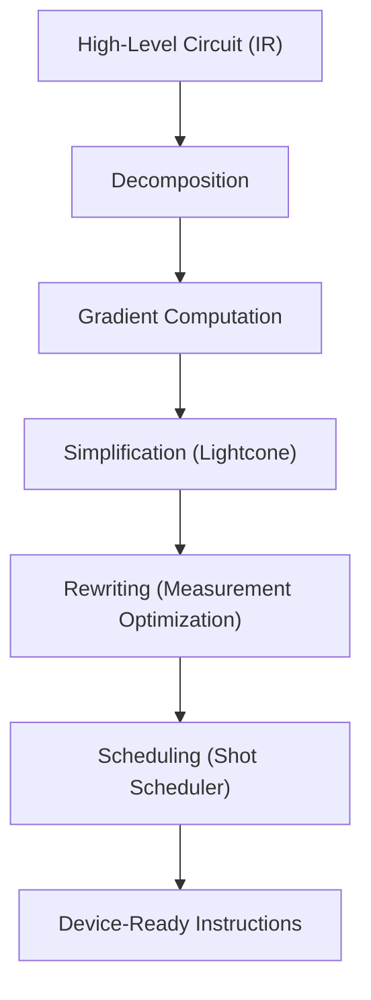
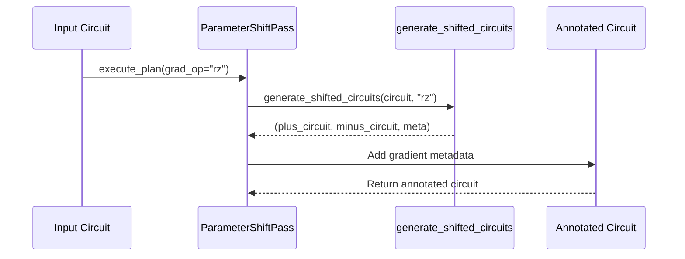
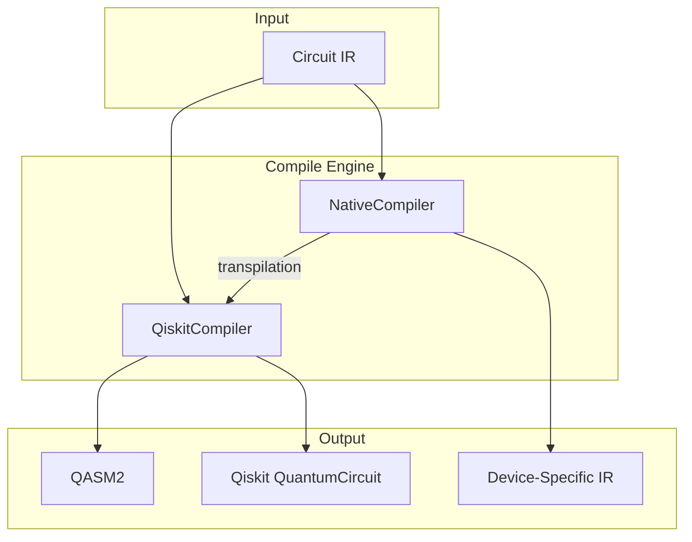

# Compiler Pipeline

<cite>
**Referenced Files in This Document**   
- [compiler.rst](file://docs-ng/source/next/user/compiler.rst)
- [lightcone.py](file://src/tyxonq/compiler/stages/simplify/lightcone.py)
- [parameter_shift_pass.py](file://src/tyxonq/compiler/stages/gradients/parameter_shift_pass.py)
- [parameter_shift.py](file://src/tyxonq/compiler/gradients/parameter_shift.py)
- [native_compiler.py](file://src/tyxonq/compiler/compile_engine/native/native_compiler.py)
- [qiskit_compiler.py](file://src/tyxonq/compiler/compile_engine/qiskit/qiskit_compiler.py)
</cite>

## Table of Contents
1. [Introduction](#introduction)
2. [Compilation Workflow Overview](#compilation-workflow-overview)
3. [Modular Compilation Stages](#modular-compilation-stages)
4. [Pluggable Backend Architecture](#pluggable-backend-architecture)
5. [Configuration and Compile Engine](#configuration-and-compile-engine)
6. [Gradient Computation Integration](#gradient-computation-integration)
7. [Troubleshooting Common Issues](#troubleshooting-common-issues)
8. [Conclusion](#conclusion)

## Introduction

The TyxonQ Compiler Pipeline provides a unified framework for transforming high-level quantum circuits into device-ready instructions through a series of optimization and transformation stages. The pipeline supports both native and external (Qiskit) compilation backends, enabling flexible integration with various quantum hardware and simulation targets. This document details the architecture, stages, configuration options, and practical usage patterns for circuit optimization within the TyxonQ ecosystem.

**Section sources**
- [compiler.rst](file://docs-ng/source/next/user/compiler.rst#L1-L7)

## Compilation Workflow Overview

The compiler pipeline executes a sequence of transformation passes that progressively optimize and adapt quantum circuits for execution. The workflow begins with a high-level circuit representation in TyxonQ's Intermediate Representation (IR) and proceeds through decomposition, gradient annotation, simplification, rewriting, and scheduling stages before final code generation.



**Diagram sources**
- [native_compiler.py](file://src/tyxonq/compiler/compile_engine/native/native_compiler.py#L12-L98)
- [lightcone.py](file://src/tyxonq/compiler/stages/simplify/lightcone.py#L9-L95)

## Modular Compilation Stages

### Decomposition Stage
The decomposition stage normalizes circuit operations into a standard set of basis gates. This ensures compatibility with downstream optimization passes and target device constraints. Gate transformations are applied to decompose higher-level or non-native operations into fundamental components such as RX, RZ, CX, and CZ gates.

### Gradient Computation Stage
This stage prepares circuits for gradient-based optimization by annotating parameterized operations with metadata required for derivative computation. The parameter shift method is implemented to enable analytical gradient evaluation.



**Diagram sources**
- [parameter_shift_pass.py](file://src/tyxonq/compiler/stages/gradients/parameter_shift_pass.py#L11-L28)
- [parameter_shift.py](file://src/tyxonq/compiler/gradients/parameter_shift.py#L8-L35)

**Section sources**
- [parameter_shift_pass.py](file://src/tyxonq/compiler/stages/gradients/parameter_shift_pass.py#L11-L28)
- [parameter_shift.py](file://src/tyxonq/compiler/gradients/parameter_shift.py#L8-L35)

### Simplification Stage (Lightcone)

The Lightcone simplification pass performs backward slicing to eliminate operations that do not affect measured qubits. This optimization reduces circuit depth by removing redundant gates outside the causal cone of measurement outcomes.

Key features:
- Supports explicit measurement collection
- Optional `assume_measure_all` mode for circuits without explicit measurements
- Preserves entanglement dependencies through two-qubit gates
- Maintains measurement operations in the final circuit

```mermaid
classDiagram
class LightconeSimplifyPass {
+name : str
+execute_plan(circuit : Circuit, device_rule : DeviceRule, assume_measure_all : bool) : Circuit
-collect_measured_qubits(ops) : List[int]
-op_qubits(op) : Tuple[List[int], bool]
-backward_slice(ops, measured) : List[int]
}
LightconeSimplifyPass : --> Circuit : processes
LightconeSimplifyPass : --> DeviceRule : optional constraint
```

**Diagram sources**
- [lightcone.py](file://src/tyxonq/compiler/stages/simplify/lightcone.py#L9-L95)

**Section sources**
- [lightcone.py](file://src/tyxonq/compiler/stages/simplify/lightcone.py#L9-L95)

### Rewriting Stage (Measurement Optimization)

The rewriting stage applies circuit rewriting rules to optimize measurement patterns and gate sequences. Key transformations include:
- Automatic insertion of measurement operations when missing
- Gate fusion and elimination through algebraic identities
- Pruning of redundant or canceling operations
- Standardization of gate representations

These optimizations improve circuit efficiency and reduce resource requirements for execution.

### Scheduling Stage (Shot Scheduler)

The shot scheduling stage determines the execution plan for circuit sampling, particularly when gradient information or expectation values are required. It coordinates the execution of multiple circuit variants (e.g., parameter-shifted circuits) and manages shot allocation across different measurement groups.

**Section sources**
- [native_compiler.py](file://src/tyxonq/compiler/compile_engine/native/native_compiler.py#L12-L98)

## Pluggable Backend Architecture

TyxonQ supports multiple compilation backends through a pluggable architecture. The system includes native and Qiskit-based compilers that can be selected based on output format and optimization requirements.



**Diagram sources**
- [native_compiler.py](file://src/tyxonq/compiler/compile_engine/native/native_compiler.py#L12-L98)
- [qiskit_compiler.py](file://src/tyxonq/compiler/compile_engine/qiskit/qiskit_compiler.py#L19-L76)

### Native Backend Compiler

The `NativeCompiler` implements the core optimization pipeline using TyxonQ's internal IR. It automatically prepends normalization passes and supports custom compilation plans. The native backend can delegate to Qiskit for QASM generation when needed.

Key characteristics:
- Default basis gates: h, rx, rz, cx, cz
- Configurable optimization levels
- Integrated shot scheduling
- Seamless fallback to Qiskit for QASM output

### Qiskit Backend Compiler

The `QiskitCompiler` provides integration with Qiskit's transpilation framework. It converts TyxonQ IR to Qiskit QuantumCircuit objects and leverages Qiskit's optimization and device mapping capabilities.

Features:
- Bidirectional IR conversion
- Transpilation support with device-aware optimization
- Logical-to-physical qubit mapping
- QASM2 serialization

**Section sources**
- [native_compiler.py](file://src/tyxonq/compiler/compile_engine/native/native_compiler.py#L12-L98)
- [qiskit_compiler.py](file://src/tyxonq/compiler/compile_engine/qiskit/qiskit_compiler.py#L19-L76)

## Configuration and Compile Engine

The compilation process is controlled through the `compile_engine` interface and stage-specific parameters. Configuration options include:

- `output`: Target format (ir, qasm2, qiskit)
- `basis_gates`: Allowed gate set for decomposition
- `optimization_level`: Aggressiveness of optimizations
- `compile_plan`: Custom sequence of compilation stages
- `total_shots`: Shot budget for execution
- `grad_op`: Target operation for gradient computation

The engine resolves compilation plans by prepending essential normalization passes to user-specified stages, ensuring consistent circuit preprocessing.

**Section sources**
- [native_compiler.py](file://src/tyxonq/compiler/compile_engine/native/native_compiler.py#L12-L98)

## Gradient Computation Integration

The compiler integrates with the numerics backend to support gradient computation through the parameter shift rule. When the `ParameterShiftPass` is applied with a specified `grad_op`, it generates plus and minus shifted circuit variants and attaches metadata for gradient reconstruction.

The `generate_shifted_circuits` function creates two modified circuit instances with parameters shifted by ±π/2 and returns a coefficient (0.5) for the finite difference calculation. This enables efficient gradient evaluation for variational algorithms.

**Section sources**
- [parameter_shift_pass.py](file://src/tyxonq/compiler/stages/gradients/parameter_shift_pass.py#L11-L28)
- [parameter_shift.py](file://src/tyxonq/compiler/gradients/parameter_shift.py#L8-L35)

## Troubleshooting Common Issues

### Compilation Failures
- **Missing Qiskit dependency**: Ensure Qiskit is installed when using `output=qiskit` or `output=qasm2`
- **Invalid compile_plan**: Verify stage names match registered pass identifiers
- **Unsupported gate types**: Check that all operations can be decomposed into the basis gate set

### Performance Bottlenecks
- **Excessive circuit depth**: Apply lightcone simplification to remove unused operations
- **Slow transpilation**: Reduce optimization level or simplify input circuits
- **Memory pressure**: Use incremental compilation or batch processing for large circuits

### Gradient Computation Issues
- **No gradient metadata**: Ensure `ParameterShiftPass` is included in the compilation plan
- **Incorrect shift application**: Verify the target operation name matches exactly
- **Numerical instability**: Check parameter ranges and consider alternative gradient methods

**Section sources**
- [parameter_shift_pass.py](file://src/tyxonq/compiler/stages/gradients/parameter_shift_pass.py#L11-L28)
- [lightcone.py](file://src/tyxonq/compiler/stages/simplify/lightcone.py#L9-L95)

## Conclusion

The TyxonQ Compiler Pipeline provides a comprehensive framework for quantum circuit optimization and transformation. Its modular architecture enables targeted optimizations through discrete stages, while the pluggable backend system supports both native and Qiskit-based compilation workflows. By leveraging the parameter shift gradient method and lightcone simplification, the compiler effectively prepares circuits for variational algorithms and efficient execution. Proper configuration through the compile engine interface allows users to balance optimization aggressiveness with compilation time, making it suitable for both research and production quantum computing applications.