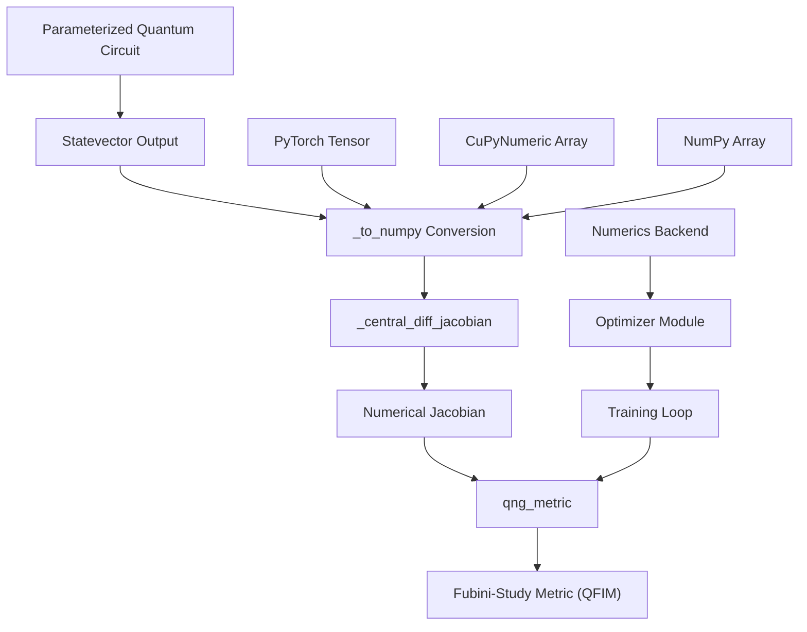
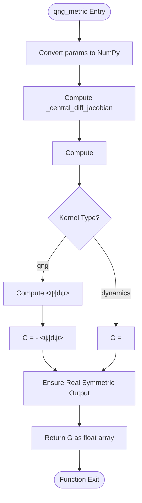
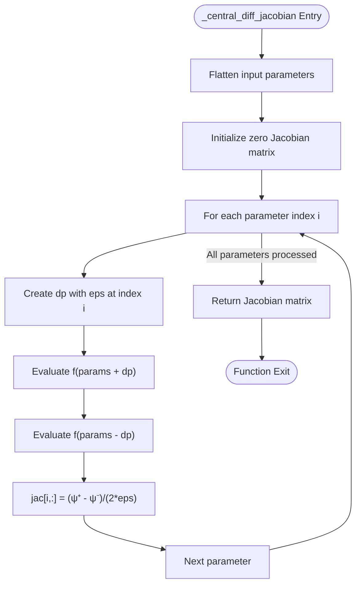
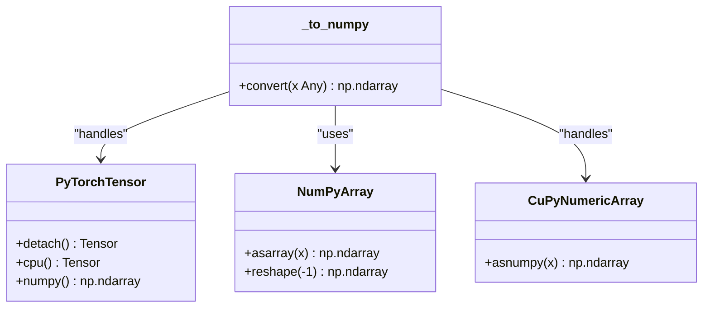

# Quantum Natural Gradient (QNG)

<cite>
**Referenced Files in This Document**  
- [qng.py](file://src/tyxonq/compiler/stages/gradients/qng.py)
- [pytorch_backend.py](file://src/tyxonq/numerics/backends/pytorch_backend.py)
- [cupynumeric_backend.py](file://src/tyxonq/numerics/backends/cupynumeric_backend.py)
- [numpy_backend.py](file://src/tyxonq/numerics/backends/numpy_backend.py)
- [api.py](file://src/tyxonq/numerics/api.py)
- [compiler.rst](file://docs-ng/source/next/user/compiler.rst)
</cite>

## Table of Contents
1. [Introduction](#introduction)
2. [Core Components](#core-components)
3. [Architecture Overview](#architecture-overview)
4. [Detailed Component Analysis](#detailed-component-analysis)
5. [Backend Integration and Compatibility](#backend-integration-and-compatibility)
6. [Performance and Numerical Stability](#performance-and-numerical-stability)
7. [Usage Examples and Training Loops](#usage-examples-and-training-loops)
8. [Conclusion](#conclusion)

## Introduction

The Quantum Natural Gradient (QNG) implementation in the Compiler Pipeline provides a backend-agnostic method for computing the Fubini-Study metric, also known as the Quantum Fisher Information Matrix (QFIM). This metric is essential for variational quantum algorithms, enabling optimization in the natural parameter space rather than the Euclidean space, which can lead to faster convergence and improved training stability. The implementation uses numerical Jacobians computed via central differences and supports two distinct kernel types: 'qng' for the projected metric and 'dynamics' for the unprojected inner product metric.

**Section sources**
- [qng.py](file://src/tyxonq/compiler/stages/gradients/qng.py#L1-L25)

## Core Components

The QNG implementation is centered around three primary functions: `qng_metric`, `_central_diff_jacobian`, and `_to_numpy`. These functions work in concert to compute the Fubini-Study metric from a parameterized quantum circuit's statevector output. The `qng_metric` function serves as the main entry point, orchestrating the computation of the quantum geometric tensor. The `_central_diff_jacobian` function calculates the numerical Jacobian by perturbing circuit parameters and evaluating the resulting statevectors. The `_to_numpy` function ensures backend compatibility by converting various array types (NumPy, PyTorch, CuPyNumeric) into a uniform NumPy array format for consistent numerical processing.

**Section sources**
- [qng.py](file://src/tyxonq/compiler/stages/gradients/qng.py#L30-L114)

## Architecture Overview



**Diagram sources**
- [qng.py](file://src/tyxonq/compiler/stages/gradients/qng.py#L30-L114)
- [api.py](file://src/tyxonq/numerics/api.py#L0-L194)

## Detailed Component Analysis

### qng_metric Function Analysis

The `qng_metric` function computes the Quantum Natural Gradient metric by combining the numerical Jacobian with the current statevector to form the Fubini-Study metric tensor. For the 'qng' kernel, it calculates the projected metric by subtracting the outer product of parameter gradients with the statevector from the raw inner products of parameter gradients. This projection ensures the metric accounts for gauge freedom in the quantum state representation. For the 'dynamics' kernel, it returns the unprojected inner product matrix, which is useful for analyzing the raw parameter sensitivity of the quantum circuit.



**Diagram sources**
- [qng.py](file://src/tyxonq/compiler/stages/gradients/qng.py#L72-L104)

**Section sources**
- [qng.py](file://src/tyxonq/compiler/stages/gradients/qng.py#L72-L104)

### _central_diff_jacobian Function Analysis

The `_central_diff_jacobian` function implements central finite differences to compute the numerical Jacobian of the quantum circuit's statevector with respect to its parameters. It flattens the input parameters for systematic perturbation, evaluates the circuit at both positive and negative perturbations, and computes the gradient as the difference quotient. This approach provides second-order accuracy in the finite difference approximation, reducing numerical errors compared to forward or backward differences. The function handles arbitrary parameter shapes by reconstructing them after each evaluation, ensuring compatibility with complex parameter structures in variational quantum algorithms.



**Diagram sources**
- [qng.py](file://src/tyxonq/compiler/stages/gradients/qng.py#L43-L69)

**Section sources**
- [qng.py](file://src/tyxonq/compiler/stages/gradients/qng.py#L43-L69)

### _to_numpy Function Analysis

The `_to_numpy` function provides critical backend interoperability by converting various array types into a standardized NumPy array format. It specifically handles PyTorch tensors by detaching them from the computation graph and moving them to CPU memory before conversion. For other array types, it uses NumPy's universal `asarray` function with reshaping to ensure a consistent 1D output format. This function enables the QNG implementation to work seamlessly across different numerical backends without requiring circuit implementations to return NumPy-specific arrays.



**Diagram sources**
- [qng.py](file://src/tyxonq/compiler/stages/gradients/qng.py#L30-L40)

**Section sources**
- [qng.py](file://src/tyxonq/compiler/stages/gradients/qng.py#L30-L40)

## Backend Integration and Compatibility

The QNG implementation achieves backend-agnostic behavior through the `_to_numpy` conversion function and the underlying numerics backend system. The system supports three primary backends: NumPy, PyTorch, and CuPyNumeric, each providing a consistent API through the `ArrayBackend` protocol. When a quantum circuit returns a statevector from any of these backends, `_to_numpy` ensures it is converted to a standard NumPy array for subsequent numerical operations. This design allows users to implement circuits using their preferred numerical framework while maintaining compatibility with the QNG optimizer.

```mermaid
graph TD
subgraph "Supported Backends"
A[NumPy] --> |Direct| C[_to_numpy]
B[PyTorch] --> |detach().cpu().numpy()| C
D[CuPyNumeric] --> |asnumpy()| C
end
C --> E["Standardized NumPy Array"]
E --> F["QNG Computation"]
G["Numerics Backend System"] --> A
G --> B
G --> D
G --> H["Backend Selection"]
H --> |"get_backend()"| I["Runtime Configuration"]
```

**Diagram sources**
- [qng.py](file://src/tyxonq/compiler/stages/gradients/qng.py#L30-L40)
- [api.py](file://src/tyxonq/numerics/api.py#L0-L194)
- [pytorch_backend.py](file://src/tyxonq/numerics/backends/pytorch_backend.py#L0-L260)
- [cupynumeric_backend.py](file://src/tyxonq/numerics/backends/cupynumeric_backend.py#L0-L256)
- [numpy_backend.py](file://src/tyxonq/numerics/backends/numpy_backend.py#L0-L166)

**Section sources**
- [qng.py](file://src/tyxonq/compiler/stages/gradients/qng.py#L30-L40)
- [api.py](file://src/tyxonq/numerics/api.py#L0-L194)

## Performance and Numerical Stability

The QNG implementation faces several performance and numerical stability challenges, particularly with high-dimensional state spaces and small step sizes (eps). The central difference method requires 2N circuit evaluations for N parameters, creating a significant computational overhead. Small eps values can lead to numerical instability due to floating-point precision limits, while large values introduce discretization errors. Mitigation strategies include adaptive step sizing, where eps is dynamically adjusted based on parameter scales, and regularization techniques such as eigenvalue clipping or Tikhonov regularization to stabilize the inverse of the QFIM. The implementation also includes numerical safeguards like `np.real_if_close` to handle small imaginary components arising from floating-point errors in the symmetric metric tensor.

**Section sources**
- [qng.py](file://src/tyxonq/compiler/stages/gradients/qng.py#L72-L104)

## Usage Examples and Training Loops

The QNG implementation integrates with the compiler pipeline to enable parameter-efficient training loops for variational quantum algorithms. In practice, users define a parameterized quantum circuit that returns a statevector, then pass this circuit and its parameters to the `qng_metric` function within an optimization loop. The resulting metric tensor can be used with natural gradient optimizers to update parameters in the direction of steepest descent in the natural parameter space. Practical examples in the documentation demonstrate how to incorporate QNG into variational quantum eigensolvers (VQE) and quantum approximate optimization algorithms (QAOA), showing significant convergence improvements compared to standard gradient descent methods.

**Section sources**
- [compiler.rst](file://docs-ng/source/next/user/compiler.rst#L0-L6)

## Conclusion

The Quantum Natural Gradient implementation in the Compiler Pipeline provides a robust, backend-agnostic solution for computing the Fubini-Study metric using numerical Jacobians. By leveraging central differences and careful backend conversion, it enables natural gradient optimization for variational quantum algorithms without requiring autodiff frameworks or specialized hardware. The distinction between 'qng' and 'dynamics' kernels offers flexibility for different optimization scenarios, while the integration with the numerics backend system ensures compatibility across NumPy, PyTorch, and CuPyNumeric. Despite computational overhead from finite differences, the implementation includes numerical safeguards and can be enhanced with adaptive step sizing and regularization for improved stability in high-dimensional spaces.