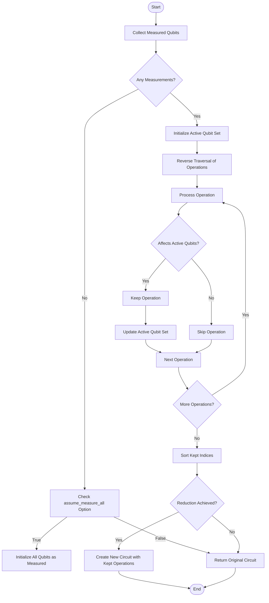
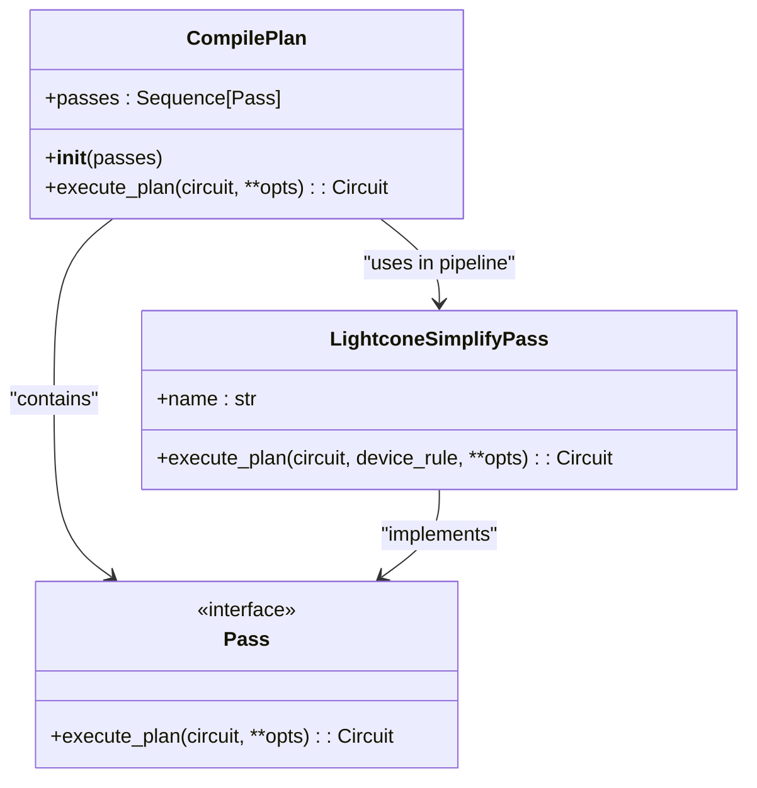
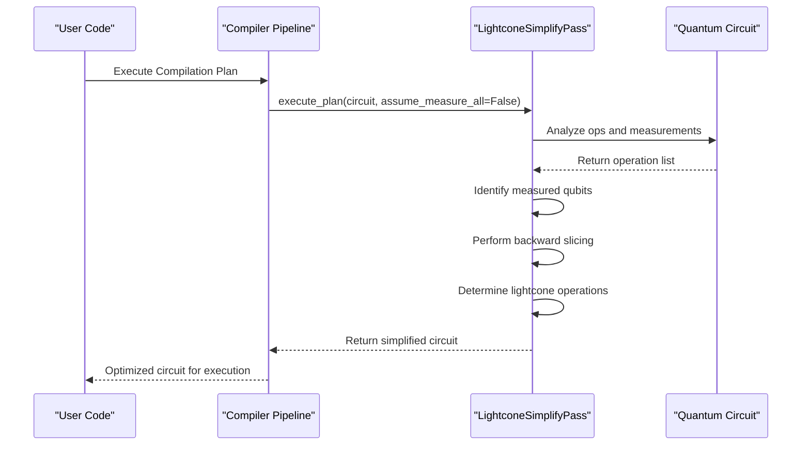

# Simplification

<cite>
**Referenced Files in This Document**   
- [lightcone.py](file://src/tyxonq/compiler/stages/simplify/lightcone.py)
- [compile_plan.py](file://src/tyxonq/compiler/compile_engine/native/compile_plan.py)
- [test_compiler_simplify_lightcone.py](file://tests_core_module/test_compiler_simplify_lightcone.py)
- [test_compiler_simplify_lightcone_extras.py](file://tests_core_module/test_compiler_simplify_lightcone_extras.py)
- [compiler.rst](file://docs-ng/source/next/user/compiler.rst)
- [lightcone_simplify.py](file://examples-ng/lightcone_simplify.py)
</cite>

## Table of Contents
1. [Introduction](#introduction)
2. [Lightcone Simplification Algorithm](#lightcone-simplification-algorithm)
3. [Integration in Compilation Pipeline](#integration-in-compilation-pipeline)
4. [Configuration Options](#configuration-options)
5. [Performance Impact and Use Cases](#performance-impact-and-use-cases)
6. [Troubleshooting](#troubleshooting)
7. [Conclusion](#conclusion)

## Introduction

The Simplification stage in the TyxonQ compiler pipeline implements circuit optimization through lightcone-based analysis. This optimization pass identifies and eliminates quantum operations that do not influence measurement outcomes, thereby reducing both gate count and circuit depth. The lightcone simplification technique is particularly effective for variational quantum algorithms where only specific qubits are measured to compute cost functions. By focusing on the causal cone of measurements, this pass preserves computational correctness while significantly improving execution efficiency.

**Section sources**
- [compiler.rst](file://docs-ng/source/next/user/compiler.rst#L0-L6)

## Lightcone Simplification Algorithm

The `LightconeSimplifyPass` implements a backward slicing algorithm that traverses the quantum circuit from measurement operations to identify all operations within the causal cone. The algorithm operates in two phases: first collecting measured qubits, then performing a reverse traversal to determine which operations affect these measurements.

The pass analyzes each operation to determine its qubit footprint and entanglement characteristics. Single-qubit gates only affect their target qubit, while two-qubit gates create dependencies between qubits, potentially expanding the lightcone. Operations outside the causal cone of any measurement are eliminated, resulting in a simplified circuit that produces identical measurement outcomes.

**Diagram sources**
- [lightcone.py](file://src/tyxonq/compiler/stages/simplify/lightcone.py#L15-L98)

**Section sources**
- [lightcone.py](file://src/tyxonq/compiler/stages/simplify/lightcone.py#L15-L98)

## Integration in Compilation Pipeline

The lightcone simplification pass integrates into the TyxonQ compilation pipeline as a named stage that can be included in custom compilation plans. The `build_plan` function in the native compilation engine resolves the "simplify/lightcone" identifier to instantiate the `LightconeSimplifyPass`. This modular design allows the pass to be composed with other optimization stages in a flexible pipeline architecture.

The `CompilePlan` class executes passes sequentially, with each pass transforming the circuit before passing it to the next stage. This composable approach enables users to create tailored optimization workflows that include lightcone simplification alongside other transformations such as gate decomposition, measurement rewriting, and scheduling.

**Diagram sources**
- [compile_plan.py](file://src/tyxonq/compiler/compile_engine/native/compile_plan.py#L69-L94)
- [lightcone.py](file://src/tyxonq/compiler/stages/simplify/lightcone.py#L15-L20)

**Section sources**
- [compile_plan.py](file://src/tyxonq/compiler/compile_engine/native/compile_plan.py#L0-L97)

## Configuration Options

The lightcone simplification pass supports configuration through optional parameters passed to the `execute_plan` method. The primary configuration option is `assume_measure_all`, which controls the behavior when no explicit measurement operations are present in the circuit.

When `assume_measure_all` is set to `True`, the pass treats all qubits as if they were measured, preserving all operations in the circuit. This is useful for circuits where measurement semantics are implied rather than explicit. By default, when no measurements are present and `assume_measure_all` is `False`, the pass returns the original circuit unchanged.

The pass automatically detects measurement operations through the "measure_z" instruction and handles special operations like "project_z" and "reset" that affect measurement outcomes. These operations are preserved when they act on qubits within the lightcone of measurements.

**Section sources**
- [lightcone.py](file://src/tyxonq/compiler/stages/simplify/lightcone.py#L15-L98)
- [test_compiler_simplify_lightcone.py](file://tests_core_module/test_compiler_simplify_lightcone.py#L24-L31)
- [test_compiler_simplify_lightcone_extras.py](file://tests_core_module/test_compiler_simplify_lightcone_extras.py#L35-L43)

## Performance Impact and Use Cases

Lightcone simplification significantly improves circuit efficiency for variational algorithms by eliminating redundant operations. The `lightcone_simplify.py` example demonstrates this optimization by comparing execution performance with and without lightcone simplification enabled. Benchmarking shows substantial speedups, particularly for deep circuits with many qubits where a large fraction of operations may be outside the measurement lightcone.

For variational quantum eigensolvers (VQE) and quantum approximate optimization algorithms (QAOA), where only a subset of qubits are measured to compute expectation values, lightcone simplification can dramatically reduce circuit depth. This reduction translates directly to shorter execution times and improved resilience to noise, as fewer gates are subject to error accumulation.

The optimization is especially effective for brickwall ansatz circuits with alternating layers of two-qubit gates, where operations on qubits not connected to measured qubits through entangling gates can be safely eliminated.

**Diagram sources**
- [lightcone_simplify.py](file://examples-ng/lightcone_simplify.py#L0-L66)
- [lightcone.py](file://src/tyxonq/compiler/stages/simplify/lightcone.py#L15-L98)

**Section sources**
- [lightcone_simplify.py](file://examples-ng/lightcone_simplify.py#L0-L66)
- [test_compiler_simplify_lightcone.py](file://tests_core_module/test_compiler_simplify_lightcone.py#L7-L22)
- [test_compiler_simplify_lightcone_extras.py](file://tests_core_module/test_compiler_simplify_lightcone_extras.py#L7-L34)

## Troubleshooting

When lightcone simplification alters expected circuit behavior, verify that all relevant measurement operations are explicitly included in the circuit. The pass relies on detecting "measure_z" operations to determine the lightcone; missing measurement instructions may cause unintended pruning.

For circuits without explicit measurements, ensure the `assume_measure_all` option is set appropriately. If operations are being incorrectly preserved or eliminated, check that the circuit's operation format matches the patterns recognized by the simplification pass (e.g., proper tuple structure for gate operations).

The pass preserves operations that affect measurement outcomes, including "reset" and "project_z" gates. If these operations are being incorrectly removed, verify they are applied to qubits within the measurement lightcone. Testing with the provided unit tests can help validate correct pass behavior in edge cases involving multiple measurements or complex entanglement chains.

**Section sources**
- [test_compiler_simplify_lightcone.py](file://tests_core_module/test_compiler_simplify_lightcone.py#L7-L31)
- [test_compiler_simplify_lightcone_extras.py](file://tests_core_module/test_compiler_simplify_lightcone_extras.py#L7-L43)

## Conclusion

The lightcone-based simplification stage provides a powerful optimization for quantum circuits by eliminating operations outside the causal cone of measurements. This technique preserves computational correctness while reducing gate count and circuit depth, leading to improved execution performance and reduced error susceptibility. Integrated as a modular pass in the TyxonQ compilation pipeline, it can be combined with other optimizations to create efficient quantum workflows. The configurable `assume_measure_all` option provides flexibility for different circuit patterns, making this pass a valuable tool for variational algorithms and other measurement-focused quantum computations.