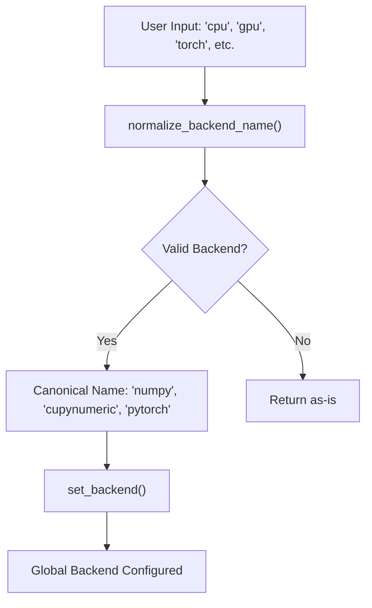
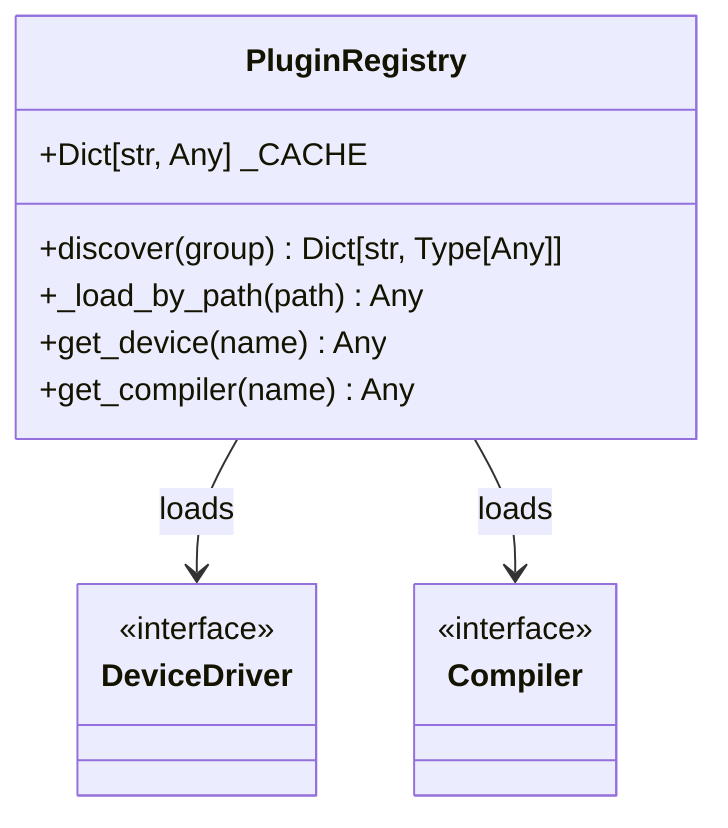
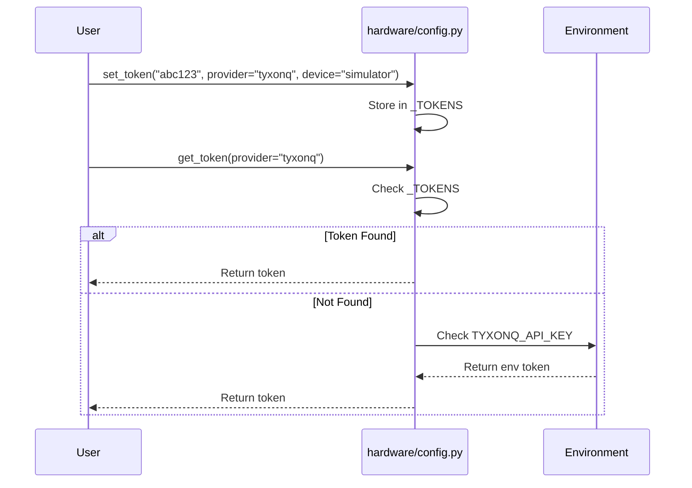

# Configuration and Customization

<cite>
**Referenced Files in This Document**   
- [config.py](file://src/tyxonq/config.py)
- [plugins/registry.py](file://src/tyxonq/plugins/registry.py)
- [numerics/context.py](file://src/tyxonq/numerics/context.py)
- [devices/hardware/config.py](file://src/tyxonq/devices/hardware/config.py)
</cite>

## Table of Contents
1. [Introduction](#introduction)
2. [Global Configuration Options](#global-configuration-options)
3. [Plugin System and Extensibility](#plugin-system-and-extensibility)
4. [Customization Points](#customization-points)
5. [Extending the Framework with Custom Components](#extending-the-framework-with-custom-components)
6. [Best Practices for Customization](#best-practices-for-customization)
7. [Environment-Specific Configurations](#environment-specific-configurations)
8. [Conclusion](#conclusion)

## Introduction
This document provides a comprehensive guide to the configuration and customization capabilities of the TyxonQ framework. It focuses on extensibility mechanisms, including global configuration settings, plugin architecture, and various customization points for compiler behavior, device interaction, and numerical computation. The goal is to empower users to adapt the framework to their specific use cases while maintaining compatibility and performance.

**Section sources**
- [config.py](file://src/tyxonq/config.py#L1-L96)
- [registry.py](file://src/tyxonq/plugins/registry.py#L1-L70)

## Global Configuration Options

### Backend Selection
The TyxonQ framework supports multiple numerical backends for computation, including `numpy`, `pytorch`, and `cupynumeric`. Backend selection is managed through the `numerics/context.py` module, which provides a global backend configuration system. Users can set the default backend using the `set_backend()` function, which accepts either a backend name (as a string) or a direct backend instance.

Backend name normalization is handled by the `normalize_backend_name()` function in `config.py`, which maps common aliases to canonical backend names:
- `'cpu'`, `'numpy(cpu)'` → `'numpy'`
- `'gpu'`, `'cupynumeric(gpu)'` → `'cupynumeric'`
- `'torch'`, `'pt'` → `'pytorch'`

This allows flexible user input while ensuring consistent internal handling.



**Diagram sources**
- [config.py](file://src/tyxonq/config.py#L49-L68)
- [context.py](file://src/tyxonq/numerics/context.py#L17-L29)

### Logging and Diagnostics
While explicit logging configuration is not defined in the core `config.py`, the framework's design supports diagnostics through backend-specific logging systems. The `numerics` module includes a diagnostics plan that can be extended based on the selected backend, allowing for performance monitoring and error tracking.

### Performance Tuning
Performance tuning is primarily achieved through backend selection and vectorization policies. The `VectorizationPolicy` type in `config.py` defines supported policies: `"auto"`, `"force"`, and `"off"`. These policies control how operations are vectorized across the selected backend, impacting both computational efficiency and memory usage.

Default data types for numerical computations are also configurable:
- Default complex type: `complex64`
- Default real type: `float32`

These defaults can be retrieved via the `default_dtypes()` function and are used across the framework to ensure consistent numerical precision.

**Section sources**
- [config.py](file://src/tyxonq/config.py#L1-L96)
- [context.py](file://src/tyxonq/numerics/context.py#L1-L29)

## Plugin System and Extensibility

### Plugin Registry Architecture
The plugin system is implemented in `plugins/registry.py` and provides a lightweight mechanism for dynamically loading and caching components. The registry supports two primary extension points:
- Device drivers
- Compiler implementations

The system uses a global `_CACHE` dictionary to store instantiated components, preventing redundant initialization and improving performance.



**Diagram sources**
- [registry.py](file://src/tyxonq/plugins/registry.py#L1-L70)

### Component Discovery and Loading
The `_load_by_path()` function enables dynamic loading of components using fully-qualified module paths in the format `module:attribute` or `module.attribute`. This allows users to register custom implementations from external packages or local modules.

The `get_device()` and `get_compiler()` functions follow the same pattern:
1. Check if the component is already cached
2. Load the component using `_load_by_path()`
3. Instantiate if callable, otherwise use as-is
4. Cache and return the component

This design supports both class-based and instance-based plugins, providing flexibility for different use cases.

**Section sources**
- [registry.py](file://src/tyxonq/plugins/registry.py#L1-L70)

## Customization Points

### Compiler Optimization Strategies
Compiler customization is achieved through the plugin system by registering custom compiler implementations. Users can extend the framework with specialized compiler passes by implementing a compiler class and registering it via the `get_compiler()` mechanism. This allows for domain-specific optimizations, alternative compilation strategies, or integration with external compilation tools.

### Device-Specific Parameters
Device configuration is managed through `devices/hardware/config.py`, which provides functions for setting and retrieving authentication tokens and default device configurations. The system supports provider-specific and device-specific tokens, enabling secure access to different quantum hardware providers.

Key configuration functions include:
- `set_token()`: Register API tokens for providers or specific devices
- `get_token()`: Retrieve tokens with fallback to environment variables
- `set_default()`: Configure default provider and device
- `get_default_provider()` and `get_default_device()`: Query current defaults



**Diagram sources**
- [config.py](file://src/tyxonq/devices/hardware/config.py#L1-L67)

### Numerics Context Management
Numerical context management is handled by the `use_backend()` context manager in `numerics/context.py`. This allows temporary backend switching within a specific scope, enabling mixed-backend workflows where different parts of a computation use different numerical backends.

The context manager ensures proper restoration of the previous backend state, even in the presence of exceptions, making it safe for use in complex computational pipelines.

**Section sources**
- [context.py](file://src/tyxonq/numerics/context.py#L1-L52)
- [config.py](file://src/tyxonq/devices/hardware/config.py#L1-L67)

## Extending the Framework with Custom Components

### Custom Device Drivers
To create a custom device driver:
1. Implement a device class that conforms to the device protocol
2. Register it using a fully-qualified path
3. Use `get_device()` to instantiate

Example:
```python
# my_device.py
class MyQuantumDevice:
    def execute(self, circuit):
        # Custom execution logic
        pass

# Usage
device = get_device("my_package.my_device:MyQuantumDevice")
```

### Custom Compiler Passes
Custom compiler implementations can be created by:
1. Implementing a compiler class with the required interface
2. Registering via the plugin system
3. Using `get_compiler()` to retrieve and use

The compiler API supports integration with different compilation frameworks (e.g., Qiskit) through adapter patterns.

### Postprocessing Extensions
While not directly shown in the analyzed files, the postprocessing module structure suggests support for custom postprocessing methods. Users can extend functionality by implementing new modules in the `postprocessing` package that follow the existing pattern.

**Section sources**
- [registry.py](file://src/tyxonq/plugins/registry.py#L35-L61)
- [context.py](file://src/tyxonq/numerics/context.py#L31-L52)

## Best Practices for Customization

### Maintaining Compatibility
When customizing core behavior:
- Always inherit from existing base classes when possible
- Maintain interface compatibility with documented APIs
- Use the provided context managers for backend switching
- Follow the same error handling patterns as the core framework

### Performance Considerations
- Cache expensive operations in plugin implementations
- Use appropriate vectorization policies for the target backend
- Minimize data copying between different numerical backends
- Leverage the built-in caching mechanism in the plugin registry

### Testing Custom Components
- Write unit tests that verify integration with the plugin system
- Test both cached and uncached instantiation paths
- Validate behavior across different backend configurations
- Ensure proper cleanup in context managers

**Section sources**
- [registry.py](file://src/tyxonq/plugins/registry.py#L1-L70)
- [context.py](file://src/tyxonq/numerics/context.py#L1-L52)

## Environment-Specific Configurations

### Development Configuration
For development environments:
- Use the `numpy` backend for predictable behavior
- Set vectorization policy to `"off"` for easier debugging
- Use simulator devices with verbose logging
- Store tokens in environment variables rather than configuration files

### Testing Configuration
For testing:
- Use isolated backend instances to prevent test interference
- Employ the `use_backend()` context manager to test multiple backends
- Configure devices to use mock or simulated hardware
- Set consistent random seeds for reproducible results

### Production Configuration
For production deployment:
- Use `cupynumeric` or `pytorch` backends for GPU acceleration
- Set vectorization policy to `"auto"` or `"force"` for optimal performance
- Use authenticated access to real quantum devices
- Store tokens securely and rotate regularly
- Configure appropriate endpoints and API versions via environment variables

The framework supports environment-specific configuration through a combination of:
- Environment variables (e.g., `TYXONQ_BASE_URL`, `TYXONQ_API_KEY`)
- Programmatic configuration via API calls
- Default values that can be overridden at runtime

**Section sources**
- [config.py](file://src/tyxonq/config.py#L1-L96)
- [context.py](file://src/tyxonq/numerics/context.py#L1-L52)
- [config.py](file://src/tyxonq/devices/hardware/config.py#L1-L67)

## Conclusion
The TyxonQ framework provides a comprehensive set of configuration and customization options that enable users to adapt the system to their specific needs. Through a combination of global configuration settings, a flexible plugin system, and well-defined customization points, users can extend the framework's capabilities while maintaining compatibility and performance. The design emphasizes simplicity, with lightweight configuration modules that can be imported early in the application lifecycle, and extensibility, with a plugin architecture that supports dynamic component loading and caching.