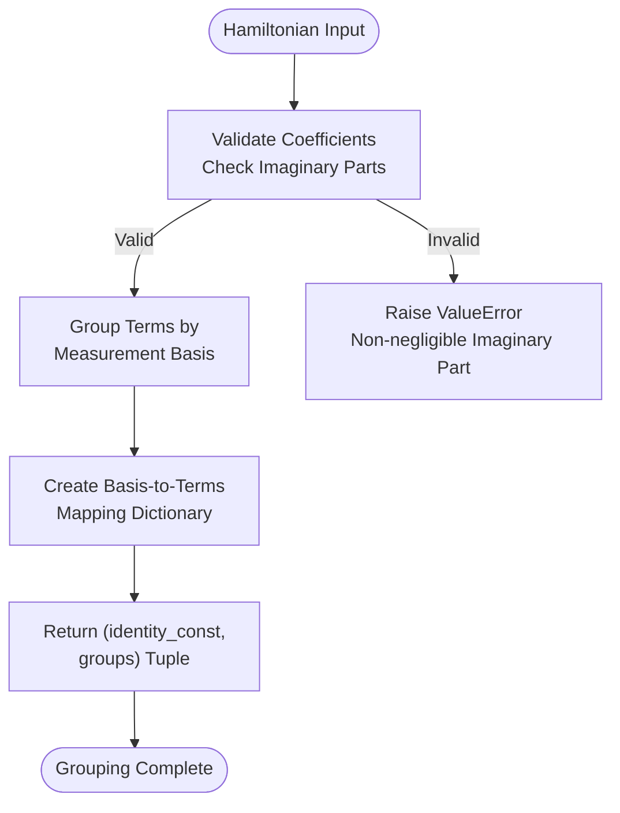
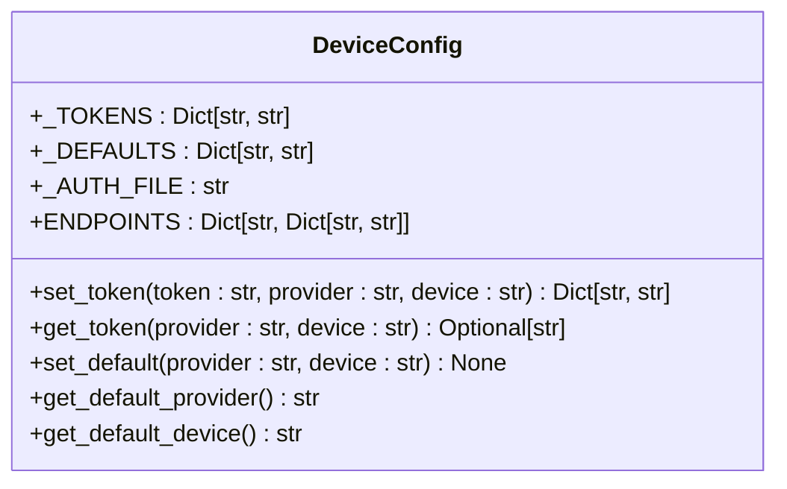
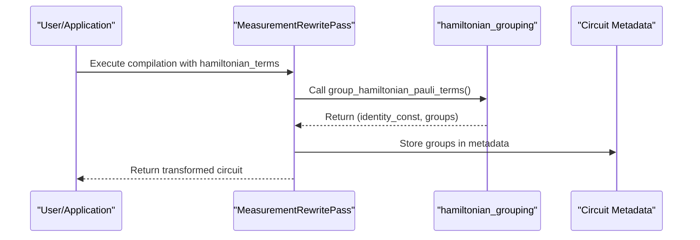

# Framework Customization Points

<cite>
**Referenced Files in This Document**   
- [hamiltonian_grouping.py](file://src/tyxonq/compiler/utils/hamiltonian_grouping.py)
- [config.py](file://src/tyxonq/devices/hardware/config.py)
- [config.py](file://src/tyxonq/config.py)
- [measurement.py](file://src/tyxonq/compiler/stages/rewrite/measurement.py)
- [hea_device_runtime.py](file://src/tyxonq/applications/chem/runtimes/hea_device_runtime.py)
- [base.py](file://src/tyxonq/devices/base.py)
</cite>

## Table of Contents
1. [Introduction](#introduction)
2. [Hamiltonian Grouping Customization](#hamiltonian-grouping-customization)
3. [Device Configuration and Hardware Settings](#device-configuration-and-hardware-settings)
4. [Integration with Main Configuration System](#integration-with-main-configuration-system)
5. [Extending the Framework with Custom Components](#extending-the-framework-with-custom-components)
6. [Performance, Accuracy, and Compatibility Impacts](#performance-accuracy-and-compatibility-impacts)
7. [Testing and Thread Safety Considerations](#testing-and-thread-safety-considerations)
8. [Advanced Use Cases](#advanced-use-cases)
9. [Conclusion](#conclusion)

## Introduction
This document details the customization points within the TyxonQ framework that extend beyond basic configuration. It focuses on two primary extension mechanisms: custom Hamiltonian measurement grouping strategies through `hamiltonian_grouping.py` and device-specific configuration options in `devices/config.py`. These components enable fine-grained control over quantum circuit compilation, execution behavior, and hardware interaction. The framework supports advanced use cases including multi-device workflows, hybrid backend selection, and custom algorithm extensions while maintaining performance and compatibility across different execution environments.

## Hamiltonian Grouping Customization
The `hamiltonian_grouping.py` module provides a critical customization point in the compiler pipeline by enabling flexible measurement grouping strategies for Hamiltonian expectation value calculations. This functionality is exposed through two primary functions: `group_qubit_operator_terms` and `group_hamiltonian_pauli_terms`, which are imported from the core implementation in `libs/hamiltonian_encoding/hamiltonian_grouping.py`.

These functions implement a greedy, product-basis-safe grouping algorithm that partitions Pauli terms into measurement groups where all terms within a group can be measured simultaneously. The grouping strategy ensures that terms sharing the same measurement basis (X, Y, Z) on overlapping qubits are grouped together, minimizing the number of distinct circuit executions required for energy estimation. The algorithm validates that all coefficients are effectively real (imaginary part below 1e-10 threshold) and raises exceptions for non-physical Hamiltonians.

The grouping process returns a tuple containing the identity constant (constant term in the Hamiltonian) and a dictionary mapping measurement bases to lists of Pauli terms with their coefficients. This structured output enables downstream components to efficiently generate the required measurement circuits and properly aggregate results.



**Diagram sources**
- [hamiltonian_grouping.py](file://src/tyxonq/libs/hamiltonian_encoding/hamiltonian_grouping.py#L47-L65)

**Section sources**
- [hamiltonian_grouping.py](file://src/tyxonq/compiler/utils/hamiltonian_grouping.py#L0-L21)
- [hamiltonian_grouping.py](file://src/tyxonq/libs/hamiltonian_encoding/hamiltonian_grouping.py#L0-L66)

## Device Configuration and Hardware Settings
The device-specific configuration system is centered around `devices/hardware/config.py`, which manages provider and device defaults, authentication tokens, and API endpoints. This module provides a centralized configuration mechanism for both simulator parameters and hardware settings across different quantum computing providers.

Key configuration elements include:
- **Provider and Device Defaults**: Managed through `_DEFAULTS` dictionary with configurable provider (default: "tyxonq") and device (default: "tyxonq::simulator:mps")
- **Authentication Tokens**: Stored in `_TOKENS` dictionary with flexible scoping (provider-level or device-specific) and fallback to environment variables
- **API Endpoints**: Configurable base URLs and API versions through environment variables `TYXONQ_BASE_URL` and `TYXONQ_API_VERSION`
- **Configuration Functions**: `set_token`, `get_token`, `set_default`, and `get_default_provider/device` for programmatic configuration

The configuration system supports multiple authentication methods including in-memory tokens, environment variables, and potential file-based storage (indicated by `_AUTH_FILE` path). This flexibility allows users to configure access to both local simulators and cloud-based quantum hardware through a unified interface.



**Diagram sources**
- [config.py](file://src/tyxonq/devices/hardware/config.py#L0-L67)

**Section sources**
- [config.py](file://src/tyxonq/devices/hardware/config.py#L0-L67)

## Integration with Main Configuration System
The customization modules integrate seamlessly with the main configuration system through a layered architecture that connects compiler, device, and application-level components. The `config.py` module in the root package provides global configuration utilities and normalization functions that are used across the framework.

Key integration points include:
- **Backend Normalization**: `normalize_backend_name` function maps aliases (cpu, gpu, torch, pt) to canonical backend names (numpy, cupynumeric, pytorch)
- **Vectorization Policy**: Configurable vectorization behavior ("auto", "force", "off") validated through `is_valid_vectorization_policy`
- **Default Data Types**: Centralized default dtype strings (complex64, float32) accessible via `default_dtypes`

The device configuration system integrates with the execution pipeline through the `device_descriptor` function in `devices/base.py`, which resolves provider and device specifications into standardized descriptors. This function handles various input formats and automatically maps shorthand names to fully qualified device identifiers.

The Hamiltonian grouping functionality is integrated into the compiler pipeline through the `MeasurementRewritePass` class in `compiler/stages/rewrite/measurement.py`. This pass automatically detects Hamiltonian terms in compilation options and applies the grouping algorithm, storing the results in circuit metadata for downstream processing.



**Diagram sources**
- [measurement.py](file://src/tyxonq/compiler/stages/rewrite/measurement.py#L9-L88)
- [config.py](file://src/tyxonq/config.py#L0-L96)

**Section sources**
- [config.py](file://src/tyxonq/config.py#L0-L96)
- [measurement.py](file://src/tyxonq/compiler/stages/rewrite/measurement.py#L0-L164)

## Extending the Framework with Custom Components
The framework supports extension through several mechanisms that allow users to implement custom Hamiltonian grouping algorithms and device calibration profiles. The modular design enables substitution of core components while maintaining compatibility with the existing execution pipeline.

For custom Hamiltonian grouping strategies, users can implement alternative grouping algorithms that conform to the same interface as the built-in functions. The `group_qubit_operator_terms` and `group_hamiltonian_pauli_terms` functions follow a consistent signature that returns a tuple of (identity_const, groups), where groups is a dictionary mapping measurement bases to term-coefficient pairs. Custom implementations can be integrated by replacing the imported functions in `compiler/utils/hamiltonian_grouping.py`.

Custom device calibration profiles can be implemented by extending the device configuration system. Users can define new device types in the `ENDPOINTS` dictionary and implement corresponding driver modules that handle communication with specific hardware. The `resolve_driver` function in `devices/base.py` provides a pluggable architecture for adding new providers.

The `HEADeviceRuntime` class in `applications/chem/runtimes/hea_device_runtime.py` demonstrates how custom runtime components can be built on top of the configuration system. This class pre-groups Hamiltonian terms during initialization and caches measurement prefixes, optimizing performance for variational quantum algorithms.

```mermaid
flowchart TD
subgraph "Custom Implementation"
A[Define Custom Grouping Algorithm]
B[Implement Required Interface]
C[Return (identity_const, groups)]
end
subgraph "Integration"
D[Replace Imported Function]
E[Update Configuration]
F[Test Compatibility]
end
A --> B --> C --> D --> E --> F
```

**Section sources**
- [hea_device_runtime.py](file://src/tyxonq/applications/chem/runtimes/hea_device_runtime.py#L22-L190)

## Performance, Accuracy, and Compatibility Impacts
Customization of the framework has significant implications for performance, accuracy, and compatibility across different execution environments.

**Performance Impacts:**
- Custom grouping algorithms can reduce the number of required circuit executions by optimizing term grouping, directly impacting total execution time
- The greedy grouping strategy in the default implementation ensures O(n) complexity relative to the number of Hamiltonian terms
- Caching of measurement prefixes in `HEADeviceRuntime` reduces circuit compilation overhead for repeated executions
- Vectorization policies ("auto", "force", "off") affect computational efficiency on different hardware backends

**Accuracy Considerations:**
- The framework enforces physical constraints by validating that Hamiltonian coefficients have negligible imaginary parts (< 1e-10)
- Measurement grouping preserves the mathematical equivalence of the original Hamiltonian through proper coefficient aggregation
- Shot allocation strategies (implicit in grouping) affect statistical uncertainty in expectation value estimates
- Noise configuration options enable realistic simulation of hardware errors

**Compatibility Requirements:**
- Custom components must adhere to the defined interfaces to ensure compatibility with the compiler pipeline
- Device drivers must implement the `Device` protocol with required methods (`run`, `expval`)
- Configuration normalization ensures consistent handling of backend specifications across different environments
- The framework maintains backward compatibility through careful versioning of configuration parameters

## Testing and Thread Safety Considerations
Testing custom components requires attention to both functional correctness and thread safety, particularly for shared configuration state.

**Testing Guidelines:**
- Validate that custom grouping algorithms preserve the total Hamiltonian expectation value
- Test edge cases including single-term Hamiltonians, identity terms, and large operator counts
- Verify compatibility with different backend configurations (numpy, pytorch, cupynumeric)
- Test error handling for invalid inputs (non-physical Hamiltonians, incorrect term formats)
- Ensure proper integration with the measurement rewrite pass and metadata system

**Thread Safety:**
- The configuration system uses global dictionaries (`_TOKENS`, `_DEFAULTS`) that require synchronization in multi-threaded environments
- The `enable_noise` function uses global variables (`_NOISE_ENABLED`, `_NOISE_CONFIG`) that are not inherently thread-safe
- Device task handling in `run` function creates `DeviceTask` objects that encapsulate execution state
- Configuration modifications should be performed during initialization rather than during concurrent execution

The framework provides testing utilities through the `tests_*` directories, with specific test files for compiler pipeline components, device interactions, and numerical backends. Custom components should include corresponding test files that verify both functionality and performance characteristics.

**Section sources**
- [base.py](file://src/tyxonq/devices/base.py#L0-L403)

## Advanced Use Cases
The customization framework supports several advanced use cases that leverage the extensibility of the configuration and compilation systems.

**Multi-Device Workflows:**
- Coordinate execution across multiple quantum devices using different providers (simulator, ibm, tyxonq)
- Implement hybrid algorithms that combine results from different hardware backends
- Use `list_all_devices` to discover available resources and dynamically select optimal devices
- Manage multiple authentication tokens for different providers through the configuration system

**Hybrid Backend Selection:**
- Dynamically switch between CPU (numpy), GPU (cupynumeric), and other backends based on problem size
- Use the `normalize_backend_name` function to ensure consistent backend specification
- Implement fallback strategies when preferred backends are unavailable
- Combine classical and quantum processing in heterogeneous computing environments

**Runtime Optimization:**
- Pre-compute and cache Hamiltonian groupings for variational algorithms with fixed Hamiltonians
- Implement adaptive grouping strategies that consider term coefficients and expected variances
- Optimize shot allocation across measurement groups based on term weights
- Integrate with external calibration data to adjust measurement strategies

**Extensible Architecture:**
- Add new quantum hardware providers through driver modules that implement the device protocol
- Extend the configuration system with custom parameters for specialized hardware
- Implement alternative compilation pipelines that incorporate domain-specific optimizations
- Develop application-specific runtime classes that build on the core configuration system

## Conclusion
The TyxonQ framework provides extensive customization points that enable fine-grained control over quantum algorithm execution. The Hamiltonian grouping system in `hamiltonian_grouping.py` and device configuration in `devices/config.py` form the foundation for extending the framework's capabilities beyond basic configuration. These components integrate with the main configuration system to provide a unified interface for controlling execution behavior across different backends and hardware platforms.

By following the documented extension patterns, users can implement custom measurement strategies, device integrations, and runtime optimizations while maintaining compatibility with the core framework. The design emphasizes performance, accuracy, and thread safety, making it suitable for both research and production quantum computing applications. Advanced use cases including multi-device workflows and hybrid backend selection demonstrate the framework's flexibility and scalability for complex quantum computing tasks.