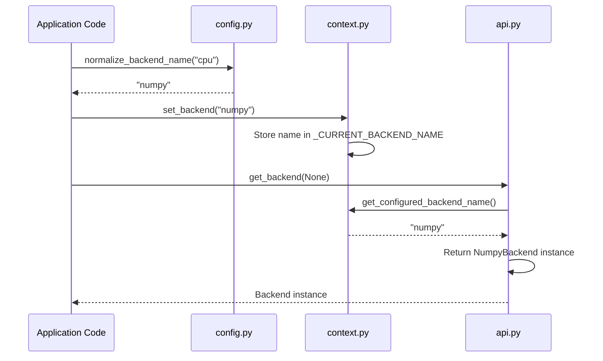

# Global Configuration

<cite>
**Referenced Files in This Document**   
- [config.py](file://src/tyxonq/config.py)
- [context.py](file://src/tyxonq/numerics/context.py)
- [api.py](file://src/tyxonq/numerics/api.py)
- [vectorization_checks.py](file://src/tyxonq/numerics/vectorization_checks.py)
- [aces_for_setting_numeric_backend.py](file://examples-ng/aces_for_setting_numeric_backend.py)
- [aces_test_for_numeric_backend.py](file://examples-ng/aces_test_for_numeric_backend.py)
</cite>

## Table of Contents
1. [Introduction](#introduction)
2. [Core Configuration Constants](#core-configuration-constants)
3. [Backend Name Normalization](#backend-name-normalization)
4. [Type Safety with BackendName and VectorizationPolicy](#type-safety-with-backendname-and-vectorizationpolicy)
5. [Numerics Module Integration](#numerics-module-integration)
6. [Practical Configuration Examples](#practical-configuration-examples)
7. [Vectorization Policy and Performance](#vectorization-policy-and-performance)
8. [Troubleshooting Common Issues](#troubleshooting-common-issues)
9. [Conclusion](#conclusion)

## Introduction

The `config.py` module in TyxonQ serves as the central hub for framework-wide settings, providing essential constants, type definitions, and normalization utilities. This configuration layer is designed to be lightweight and dependency-free, enabling early import by core subsystems such as numerics, devices, and compiler components. The module establishes global defaults for numerical computation, defines supported backends, and implements type-safe patterns for configuration values. It plays a critical role in ensuring consistent behavior across the framework by standardizing how backend selections, data types, and vectorization strategies are defined and validated.

## Core Configuration Constants

The `config.py` module defines several key constants that establish the default behavior for numerical computations within the TyxonQ framework.

**PACKAGE_NAME** is set to "tyxonq" and serves as the canonical identifier for the package across the system. This constant ensures consistent naming in logging, error messages, and external integrations.

The default data type strings are defined as **DEFAULT_COMPLEX_DTYPE_STR** = "complex64" and **DEFAULT_REAL_DTYPE_STR** = "float32". These defaults reflect a modern computational architecture optimized for GPU and accelerated computing, where single-precision arithmetic provides an optimal balance between numerical accuracy and performance. These defaults are used when creating new arrays or tensors unless explicitly overridden.

The **SUPPORTED_BACKENDS** tuple lists the canonical backend names: ("numpy", "pytorch", "cupynumeric"). These represent the officially supported numerical computation engines that can be selected for array operations and tensor computations. The selection of these backends enables TyxonQ to support both CPU-based computation (via numpy), GPU-accelerated deep learning workflows (via pytorch), and high-performance numerical computing (via cupynumeric).

**Section sources**
- [config.py](file://src/tyxonq/config.py#L15-L25)

## Backend Name Normalization

The `normalize_backend_name` function provides a robust mechanism for mapping user-provided backend aliases to canonical backend names. This normalization layer enhances usability by accepting common shorthand names while ensuring internal consistency.

The function accepts a string input, strips whitespace, converts to lowercase, and maps recognized aliases to their canonical equivalents:
- 'cpu', 'numpy', and 'numpy(cpu)' all normalize to "numpy"
- 'gpu', 'cupynumeric', and 'cupynumeric(gpu)' all normalize to "cupynumeric" 
- 'torch', 'pt', and 'pytorch' all normalize to "pytorch"

This design allows users to specify backends using intuitive terms like "cpu" or "gpu" while ensuring that the internal system always works with standardized backend identifiers. Any unrecognized backend name is returned as-is, allowing for potential extension to custom or experimental backends.

The normalization process is critical for integrating user input with the framework's backend selection system, particularly when processing configuration files, command-line arguments, or API parameters where users may employ various naming conventions.

**Section sources**
- [config.py](file://src/tyxonq/config.py#L49-L68)

## Type Safety with BackendName and VectorizationPolicy

To enhance type safety and provide better developer experience, `config.py` defines two specialized string subtypes: `BackendName` and `VectorizationPolicy`.

**BackendName** is a subclass of Python's built-in `str` that uses ABCMeta to provide runtime type checking. While it behaves like a regular string, it serves as a type hint and documentation that a value represents a backend identifier. This pattern improves code readability and enables static analysis tools to validate that backend-related variables contain appropriate values.

**VectorizationPolicy** similarly extends `str` to represent the three valid vectorization modes: "auto", "force", and "off". This enumeration-like pattern prevents invalid policy values from being used in vectorization contexts. The corresponding `is_valid_vectorization_policy` function provides runtime validation by checking if a string value is one of the supported policies.

These type definitions work in conjunction with the `numerics/api.py` module, where `VectorizationPolicy` is also defined as a `Literal` type for static type checking. This dual approach—runtime type safety through string subclasses and compile-time type checking through Literal types—provides comprehensive validation across different development workflows.

**Section sources**
- [config.py](file://src/tyxonq/config.py#L31-L44)

## Numerics Module Integration

The configuration system integrates closely with the numerics module to establish global computational settings that affect system behavior across multiple components.

The `numerics/context.py` module maintains the global backend state using two variables: `_CURRENT_BACKEND_NAME` and `_CURRENT_BACKEND_INSTANCE`. The `set_backend` function updates this state, accepting either a backend name (which is resolved lazily) or a pre-configured backend instance. This global state is queried by `get_backend(None)` to retrieve the currently configured backend.

The integration follows a cascading pattern: when `get_backend` is called with `None`, it first checks for a configured instance, then falls back to the configured name, and finally defaults to numpy if no configuration exists. This allows for flexible configuration strategies—from global defaults to per-session overrides—while maintaining backward compatibility.

The `default_dtypes()` function provides a convenient way to access the default complex and real data type strings, which are used throughout the numerics system when creating arrays or tensors without explicit dtype specification. This ensures consistent data representation across different components of the framework.

**Diagram sources**
- [config.py](file://src/tyxonq/config.py#L80-L85)
- [context.py](file://src/tyxonq/numerics/context.py#L15-L30)



## Practical Configuration Examples

Configuring the numerics backend in TyxonQ can be accomplished through several patterns, as demonstrated in the example code.

The primary method is using `tyxonq.set_backend()` with a backend identifier. As shown in `aces_for_setting_numeric_backend.py`, applications can dynamically switch between backends:

```python
tq.set_backend("numpy")
# ... perform computations
tq.set_backend("pytorch")
# ... perform computations with PyTorch backend
```

The framework automatically handles backend-specific initialization and cleanup. When a backend name is provided, it is normalized and stored as the global default. Subsequent operations that don't specify an explicit backend will use this default.

For temporary backend changes, the `use_backend` context manager (imported from `numerics/context.py`) provides a scoped approach:

```python
with tq.use_backend("cupynumeric"):
    # All operations in this block use cupynumeric
    results = circuit.run()
# Reverts to previous backend
```

The examples also demonstrate graceful handling of optional backends—code attempts to use PyTorch and CuPyNumeric but catches exceptions if these packages are not installed, falling back to numpy as the default.

**Section sources**
- [aces_for_setting_numeric_backend.py](file://examples-ng/aces_for_setting_numeric_backend.py#L15-L30)
- [aces_test_for_numeric_backend.py](file://examples-ng/aces_test_for_numeric_backend.py#L25-L35)

## Vectorization Policy and Performance

The vectorization policy system, centered around the `VectorizationPolicy` type, provides control over computational efficiency through batched operations.

The three policy settings have distinct performance implications:
- **"auto"**: Attempts to use vectorized execution (via `vmap`) if the backend supports it, falling back to element-wise processing on failure. This provides optimal performance when vectorization is safe and available.
- **"force"**: Requires vectorized execution and will raise errors if vectorization fails. This ensures maximum performance but requires careful validation of operations.
- **"off"**: Disables vectorization entirely, processing operations element by element. This is safest for operations with side effects but has the highest computational overhead.

The `vectorize_or_fallback` function in `api.py` implements this policy, first checking for native `vmap` support in the backend, then attempting generic vectorization by iterating over the leading axis of input data.

Performance optimization occurs when operations can be parallelized across batches of quantum circuits or parameters. The vectorization system enables significant speedups in variational algorithms, parameter scans, and ensemble calculations by leveraging the underlying backend's optimized batch operations.

**Section sources**
- [api.py](file://src/tyxonq/numerics/api.py#L107-L145)
- [vectorization_checks.py](file://src/tyxonq/numerics/vectorization_checks.py#L5-L25)

## Troubleshooting Common Issues

Several common configuration issues can arise when working with TyxonQ's global configuration system.

**Invalid backend names** typically occur when typos are made in backend specifications or when attempting to use unsupported backends. The system handles this by normalizing known aliases and falling back to numpy for unrecognized names. To troubleshoot, verify the spelling of backend names against the `SUPPORTED_BACKENDS` list and use `normalize_backend_name()` to check how a name will be interpreted.

**Dtype mismatches** can cause numerical instability or type errors in computations. Since the default dtypes are "complex64" and "float32", operations that require higher precision may need explicit dtype specification. When encountering unexpected numerical results, check if the computation would benefit from double-precision types.

**Backend import errors** occur when requesting backends that are not installed (e.g., pytorch or cupynumeric). The framework raises `RuntimeError` with descriptive messages in these cases. Ensure required packages are installed via pip or conda before attempting to use their respective backends.

**Vectorization failures** may happen when operations have side effects or in-place modifications that are incompatible with batched execution. The `safe_for_vectorization` function in `vectorization_checks.py` uses warning detection to identify potentially unsafe operations. For debugging, temporarily set the policy to "off" to isolate whether vectorization is the source of issues.

**Section sources**
- [api.py](file://src/tyxonq/numerics/api.py#L162-L191)
- [vectorization_checks.py](file://src/tyxonq/numerics/vectorization_checks.py#L5-L25)

## Conclusion

The global configuration system in TyxonQ provides a robust foundation for managing framework-wide settings related to numerical computation. By centralizing constants, implementing intelligent name normalization, and providing type-safe patterns for configuration values, the system ensures consistent behavior across diverse use cases. The integration between `config.py` and the numerics module enables flexible backend selection with sensible defaults, while the vectorization policy system offers control over computational performance. Understanding these configuration mechanisms is essential for effectively utilizing TyxonQ's capabilities in quantum computing workflows, from simple circuit simulations to large-scale variational algorithms.