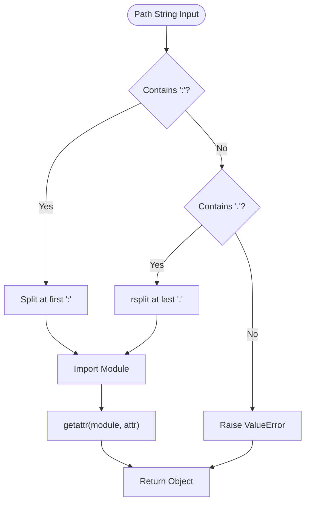
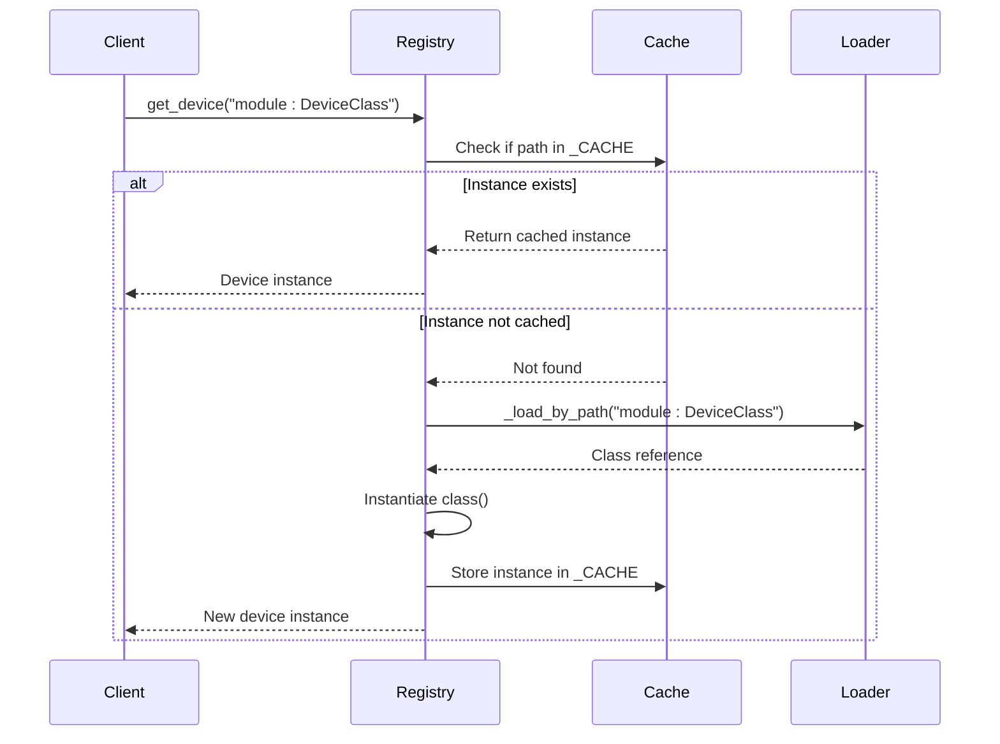

# Plugin System and Extensibility

<cite>
**Referenced Files in This Document**   
- [registry.py](file://src/tyxonq/plugins/registry.py)
- [test_plugins_registry.py](file://tests_core_module/test_plugins_registry.py)
</cite>

## Table of Contents
1. [Introduction](#introduction)
2. [Core Plugin Registry Functions](#core-plugin-registry-functions)
3. [Dynamic Object Loading Mechanism](#dynamic-object-loading-mechanism)
4. [Caching Strategy and Instance Reuse](#caching-strategy-and-instance-reuse)
5. [Plugin Discovery Framework](#plugin-discovery-framework)
6. [Usage Examples and Registration Patterns](#usage-examples-and-registration-patterns)
7. [Current Limitations and Future Roadmap](#current-limitations-and-future-roadmap)
8. [Best Practices for Plugin Development](#best-practices-for-plugin-development)
9. [State Management in Long-Running Processes](#state-management-in-long-running-processes)
10. [Conclusion](#conclusion)

## Introduction

The plugin system in TyxonQ provides a flexible extensibility framework that enables dynamic loading of device drivers and compiler implementations. Built around the `registry.py` module, this system supports runtime discovery and instantiation of components through fully-qualified module paths. The architecture is designed to support both immediate use cases with direct path-based loading and future expansion with standardized entry point integration. This document details the core mechanisms, usage patterns, and design considerations for developing and integrating plugins within the TyxonQ ecosystem.

**Section sources**
- [registry.py](file://src/tyxonq/plugins/registry.py#L1-L70)

## Core Plugin Registry Functions

The registry module exposes two primary functions for component retrieval: `get_device` and `get_compiler`. Both functions follow identical patterns for dynamic loading and caching, providing a consistent interface for accessing extensible components. These functions accept fully-qualified module paths that specify the exact location of classes or callables within the codebase. The implementation supports two syntax formats for path specification: `module:attribute` (using colon separation) and `module.attribute` (using dot notation with rightmost split). This dual-format support accommodates different naming conventions while maintaining backward compatibility.

**Section sources**
- [registry.py](file://src/tyxonq/plugins/registry.py#L35-L61)

## Dynamic Object Loading Mechanism

The `_load_by_path` utility function implements the core resolution logic for importing objects from fully-qualified paths. This function parses input strings to extract module names and attribute references, then uses Python's `importlib` to dynamically import the specified module and retrieve the target attribute. The parsing logic distinguishes between colon-separated and dot-separated formats, with the colon format taking precedence when both delimiters are present. For dot-separated paths, the function performs a rightmost split to handle nested module structures correctly. Invalid paths that contain neither delimiter raise a `ValueError` with descriptive messaging, ensuring clear error feedback during development and debugging.

**Diagram sources**
- [registry.py](file://src/tyxonq/plugins/registry.py#L20-L32)

**Section sources**
- [registry.py](file://src/tyxonq/plugins/registry.py#L20-L32)

## Caching Strategy and Instance Reuse

The plugin system employs a global `_CACHE` dictionary to store instantiated components, ensuring efficient retrieval and preventing redundant initialization. When a component is requested through `get_device` or `get_compiler`, the registry first checks whether an instance already exists in the cache. If found, the cached instance is returned immediately without re-instantiation. For new requests, the system loads the specified class, creates an instance if the object is callable, and stores it in the cache before returning. This caching mechanism significantly improves performance in scenarios where components are accessed repeatedly, while also ensuring singleton-like behavior for stateful plugins. The cache uses the original path string as the key, maintaining a direct mapping between request identifiers and their corresponding instances.

**Diagram sources**
- [registry.py](file://src/tyxonq/plugins/registry.py#L6-L6)
- [registry.py](file://src/tyxonq/plugins/registry.py#L35-L48)
- [registry.py](file://src/tyxonq/plugins/registry.py#L51-L61)

**Section sources**
- [registry.py](file://src/tyxonq/plugins/registry.py#L6-L6)
- [registry.py](file://src/tyxonq/plugins/registry.py#L35-L61)

## Plugin Discovery Framework

The `discover` function serves as a placeholder for future plugin discovery mechanisms based on entry point groups. Currently implemented as a no-op that returns an empty dictionary, this function maintains a stable interface for testing and documentation purposes. The signature accepts a group identifier string and returns a mapping of plugin names to their corresponding classes, establishing the expected contract for future implementations. This forward-compatible design allows client code to be written against the discovery interface without requiring changes when the actual discovery mechanism is implemented. The empty return value ensures that existing code paths continue to function predictably while providing a clear signal that no plugins are available through discovery in the current version.

**Section sources**
- [registry.py](file://src/tyxonq/plugins/registry.py#L9-L17)

## Usage Examples and Registration Patterns

While the current implementation does not support automatic registration, plugins can be accessed by specifying their fully-qualified paths. For example, a custom device driver located at `myproject.devices.custom:CustomDevice` can be instantiated using `get_device("myproject.devices.custom:CustomDevice")`. Similarly, compiler backends can be loaded using the same pattern with `get_compiler`. The test suite demonstrates this pattern using a sentinel class `_X` defined within the registry module itself, verifying that repeated calls with the same path return identical instances. This approach enables immediate extensibility while maintaining isolation between core functionality and third-party implementations. Developers can create compatible plugins by ensuring their classes are importable through standard Python module resolution mechanisms.

**Section sources**
- [test_plugins_registry.py](file://tests_core_module/test_plugins_registry.py#L13-L17)

## Current Limitations and Future Roadmap

The current plugin system has several limitations that are addressed in the planned roadmap. The most significant limitation is the absence of automatic discovery through entry points, which requires users to know exact module paths for component access. Future versions will integrate with Python's entry point system to enable automatic discovery and registration of plugins. Additionally, the current implementation lacks configuration file support for defining default plugins or aliases. The roadmap includes adding support for configuration-based plugin mapping, which will allow users to define human-readable names for commonly used components. These enhancements will maintain backward compatibility with the existing path-based loading while providing more user-friendly discovery mechanisms.

**Section sources**
- [registry.py](file://src/tyxonq/plugins/registry.py#L9-L17)
- [registry.py](file://src/tyxonq/plugins/registry.py#L35-L48)

## Best Practices for Plugin Development

Developers creating plugins for the TyxonQ ecosystem should follow several best practices to ensure compatibility and maintainability. Plugins should expose their main classes at the module level to facilitate easy import through the path resolution system. They should avoid side effects during module import to prevent issues with dynamic loading. State management should be designed with caching in mind, as instances may persist for the lifetime of the process. Type hints should be used consistently to improve discoverability and IDE support. Finally, plugins should follow the same interface contracts as built-in components to ensure seamless integration. These practices help maintain isolation between plugins and the core system while enabling reliable dynamic loading.

**Section sources**
- [registry.py](file://src/tyxonq/plugins/registry.py#L20-L32)
- [registry.py](file://src/tyxonq/plugins/registry.py#L35-L61)

## State Management in Long-Running Processes

The caching behavior of the plugin registry has important implications for state management in long-running processes. Since instances are cached for the duration of the process, any internal state maintained by plugin components will persist across multiple uses. This can lead to unintended state leakage if plugins are not designed with this behavior in mind. Stateless plugins are generally preferred, but when state is necessary, developers should implement explicit reset mechanisms or provide factory functions that can create fresh instances when needed. The system does not currently provide mechanisms for cache invalidation or instance refresh, so long-running applications should be designed with the understanding that plugin instances are effectively singletons within the process lifetime.

**Section sources**
- [registry.py](file://src/tyxonq/plugins/registry.py#L6-L6)
- [registry.py](file://src/tyxonq/plugins/registry.py#L35-L61)

## Conclusion

The plugin system in TyxonQ provides a robust foundation for extensibility through its dynamic loading capabilities and caching strategy. While currently focused on path-based component retrieval, the architecture is designed to accommodate future enhancements such as entry point discovery and configuration-based registration. The clear separation between discovery (placeholder) and loading (implemented) functions creates a stable interface for both current use and future expansion. By following the documented patterns and best practices, developers can create compatible plugins that integrate seamlessly with the core system, enabling a rich ecosystem of device drivers and compiler implementations.