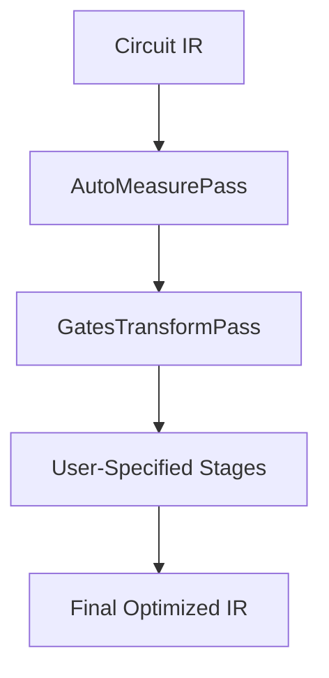
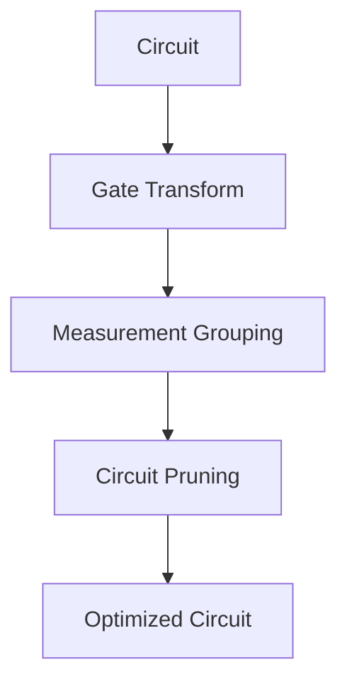
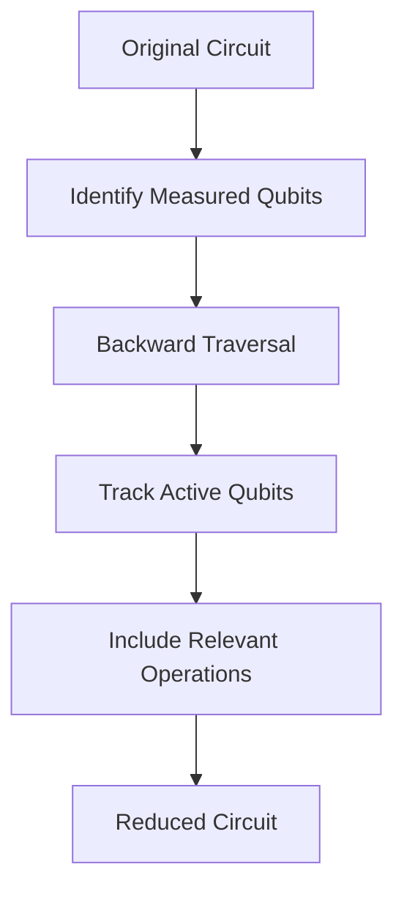
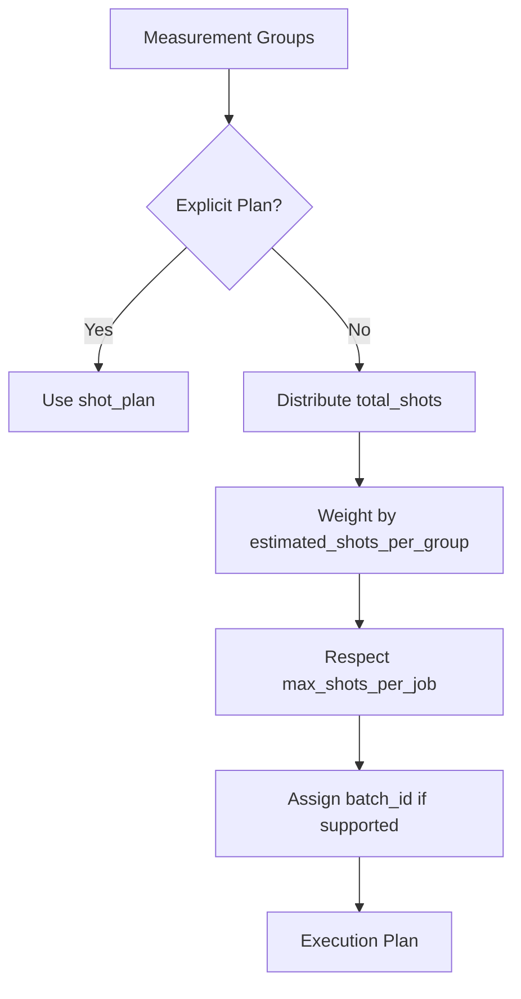

# Compilation Stages

<cite>
**Referenced Files in This Document**   
- [compile_plan.py](file://src/tyxonq/compiler/compile_engine/native/compile_plan.py)
- [native_compiler.py](file://src/tyxonq/compiler/compile_engine/native/native_compiler.py)
- [rotations.py](file://src/tyxonq/compiler/stages/decompose/rotations.py)
- [measurement.py](file://src/tyxonq/compiler/stages/rewrite/measurement.py)
- [gates_transform.py](file://src/tyxonq/compiler/stages/rewrite/gates_transform.py)
- [merge_prune.py](file://src/tyxonq/compiler/stages/rewrite/merge_prune.py)
- [lightcone.py](file://src/tyxonq/compiler/stages/simplify/lightcone.py)
- [parameter_shift_pass.py](file://src/tyxonq/compiler/stages/gradients/parameter_shift_pass.py)
- [shot_scheduler.py](file://src/tyxonq/compiler/stages/scheduling/shot_scheduler.py)
- [hamiltonian_grouping.py](file://src/tyxonq/compiler/utils/hamiltonian_grouping.py)
</cite>

## Table of Contents
1. [Introduction](#introduction)
2. [Compilation Pipeline Architecture](#compilation-pipeline-architecture)
3. [Decomposition Stage](#decomposition-stage)
4. [Rewriting Stage](#rewriting-stage)
5. [Simplification Stage](#simplification-stage)
6. [Scheduling Stage](#scheduling-stage)
7. [Gradient Processing Stage](#gradient-processing-stage)
8. [Integration with Device Constraints and Numerics](#integration-with-device-constraints-and-numerics)
9. [Common Issues and Best Practices](#common-issues-and-best-practices)
10. [Conclusion](#conclusion)

## Introduction

The TyxonQ compiler implements a modular, composable pipeline for quantum circuit compilation. This document details the five core stages of the compilation process: decomposition, rewriting, simplification, scheduling, and gradient processing. Each stage operates as a transformation pass on the Intermediate Representation (IR), progressively optimizing the circuit for execution on target hardware or simulation backends. The pipeline is designed to be flexible, allowing users to chain stages according to their specific requirements while ensuring compatibility with device constraints and numerical backends.

**Section sources**
- [compile_plan.py](file://src/tyxonq/compiler/compile_engine/native/compile_plan.py#L44-L94)
- [native_compiler.py](file://src/tyxonq/compiler/compile_engine/native/native_compiler.py#L12-L98)

## Compilation Pipeline Architecture

The compilation pipeline is orchestrated by the `CompilePlan` class, which manages a sequence of `Pass` instances. Each pass implements the `execute_plan` method to transform the circuit IR. The `build_plan` function constructs a `CompilePlan` from a list of stage names, resolving them via the `_resolve_stage` function.

The `NativeCompiler` serves as the primary entry point, which by default prepends essential normalization passes (`rewrite/auto_measure` and `rewrite/gates_transform`) to any user-specified pipeline. This ensures circuit consistency before applying domain-specific optimizations.



**Diagram sources**
- [compile_plan.py](file://src/tyxonq/compiler/compile_engine/native/compile_plan.py#L69-L88)
- [native_compiler.py](file://src/tyxonq/compiler/compile_engine/native/native_compiler.py#L12-L98)

**Section sources**
- [compile_plan.py](file://src/tyxonq/compiler/compile_engine/native/compile_plan.py#L69-L88)
- [native_compiler.py](file://src/tyxonq/compiler/compile_engine/native/native_compiler.py#L12-L98)

## Decomposition Stage

The decomposition stage, implemented by `RotationsDecomposePass`, breaks down complex parametric rotation gates into a standardized basis set of {H, RZ, CX}. This stage is crucial for ensuring compatibility with hardware that may not natively support all rotation types.

The pass applies standard quantum identities:
- RX(θ) → H · RZ(θ) · H
- RY(θ) → S† · H · RZ(θ) · H · S
- RZZ(θ) → CX · RZ(θ) · CX
- RXX(θ) → H⊗H · CX · RZ(θ) · CX · H⊗H
- RYY(θ) → (S†H)⊗(S†H) · CX · RZ(θ) · CX · (HS)⊗(HS)

This decomposition enables uniform handling of rotation gates across different backends and facilitates further optimization in subsequent stages.

```mermaid
flowchart LR
RX[RX(θ)] --> H1[H]
H1 --> RZ[RZ(θ)]
RZ --> H2[H]
RY[RY(θ)] --> Sd[S†]
Sd --> H3[H]
H3 --> RZ2[RZ(θ)]
RZ2 --> H4[H]
H4 --> S[S]
```

**Diagram sources**
- [rotations.py](file://src/tyxonq/compiler/stages/decompose/rotations.py#L10-L66)

**Section sources**
- [rotations.py](file://src/tyxonq/compiler/stages/decompose/rotations.py#L10-L66)

## Rewriting Stage

The rewriting stage consists of multiple passes that transform the circuit structure for optimization and compatibility. Key components include:

### Gate Transformation
The `GatesTransformPass` rewrites single-qubit gates according to a specified basis set (default: ["h", "rx", "rz", "cx", "cz"]). It converts X and Y gates to their parametric equivalents (RX(π) and RY(π)) when the basis allows, ensuring the circuit adheres to device-specific gate sets.

### Measurement Grouping
The `MeasurementRewritePass` performs observable grouping to optimize measurement efficiency. It groups measurement operations by non-overlapping wires and consistent measurement bases, enabling shot reuse and reducing total measurement settings. The pass supports both explicit measurement specifications and Hamiltonian-based inputs, grouping Pauli terms into commuting sets.

### Circuit Pruning
The `MergePrunePass` applies local circuit optimizations by merging adjacent single-qubit gates and removing identity operations. It uses a rule-based system to combine gates (e.g., RZ(θ₁) followed by RZ(θ₂) becomes RZ(θ₁+θ₂)) and eliminates redundant operations, reducing circuit depth.



**Diagram sources**
- [gates_transform.py](file://src/tyxonq/compiler/stages/rewrite/gates_transform.py#L9-L49)
- [measurement.py](file://src/tyxonq/compiler/stages/rewrite/measurement.py#L9-L88)
- [merge_prune.py](file://src/tyxonq/compiler/stages/rewrite/merge_prune.py#L24-L82)

**Section sources**
- [gates_transform.py](file://src/tyxonq/compiler/stages/rewrite/gates_transform.py#L9-L49)
- [measurement.py](file://src/tyxonq/compiler/stages/rewrite/measurement.py#L9-L88)
- [merge_prune.py](file://src/tyxonq/compiler/stages/rewrite/merge_prune.py#L24-L82)

## Simplification Stage

The simplification stage employs lightcone-based circuit reduction through the `LightconeSimplifyPass`. This pass performs a backward slice from measurement operations to identify and retain only the operations that influence the final measurement outcomes.

The algorithm works as follows:
1. Collect all measured qubits from explicit `measure_z` operations or assume all qubits are measured if `assume_measure_all` is enabled.
2. Traverse the circuit operations in reverse order, maintaining an "active" set of qubits.
3. For each operation, if it acts on any active qubit, include it in the reduced circuit and update the active set.
4. For entangling gates (CX, CZ, etc.), propagate dependencies to both qubits.

This approach significantly reduces circuit depth by eliminating operations that do not contribute to the final observable, improving simulation efficiency and reducing noise in hardware execution.



**Diagram sources**
- [lightcone.py](file://src/tyxonq/compiler/stages/simplify/lightcone.py#L9-L95)

**Section sources**
- [lightcone.py](file://src/tyxonq/compiler/stages/simplify/lightcone.py#L9-L95)

## Scheduling Stage

The scheduling stage, implemented by `ShotSchedulerPass`, plans the execution of measurements by allocating shots across different measurement groups. It operates in two modes:

1. **Explicit Mode**: Uses a user-provided `shot_plan` to define the number of shots for each measurement segment.
2. **Group-Based Mode**: Automatically distributes a `total_shots` budget across measurement groups using their `estimated_shots_per_group` as weights.

The scheduler respects device constraints such as `max_shots_per_job` by splitting large segments into smaller ones. It also supports batching when the device allows, assigning `batch_id` to segments for efficient execution.

The `schedule` function generates a plan with segments containing `shots`, `basis`, `wires`, and `basis_map`, enabling executors to reuse measurement settings and minimize overhead.



**Diagram sources**
- [shot_scheduler.py](file://src/tyxonq/compiler/stages/scheduling/shot_scheduler.py#L121-L133)

**Section sources**
- [shot_scheduler.py](file://src/tyxonq/compiler/stages/scheduling/shot_scheduler.py#L121-L133)

## Gradient Processing Stage

The gradient processing stage, implemented by `ParameterShiftPass`, prepares circuits for gradient computation using the parameter-shift rule. This pass generates shifted circuit variants for a specified gate type (e.g., "rz") by creating `plus` and `minus` circuits with parameters shifted by ±π/2.

The pass populates the circuit metadata with gradient information, including the shifted circuits and metadata for reconstruction. This enables efficient gradient computation in variational algorithms without requiring additional compilation steps.

The parameter shift method is particularly valuable for noisy intermediate-scale quantum (NISQ) devices, as it provides exact gradients and is robust to certain types of noise.

```mermaid
flowchart TD
A[Original Circuit] --> B[ParameterShiftPass]
B --> C[Plus Circuit: θ + π/2]
B --> D[Minus Circuit: θ - π/2]
C --> E[Gradient = (Plus - Minus)/2]
D --> E
```

**Diagram sources**
- [parameter_shift_pass.py](file://src/tyxonq/compiler/stages/gradients/parameter_shift_pass.py#L11-L28)

**Section sources**
- [parameter_shift_pass.py](file://src/tyxonq/compiler/stages/gradients/parameter_shift_pass.py#L11-L28)

## Integration with Device Constraints and Numerics

The compilation pipeline integrates with device constraints through the `device_rule` parameter passed to each pass. This allows stages to adapt their behavior based on hardware capabilities, such as maximum shots per job, supported gate sets, and connectivity constraints.

For numerical backends, the pipeline is designed to work with various numerics implementations (NumPy, CuPy, PyTorch) through the numerics API. The transformations preserve the mathematical equivalence of circuits while optimizing for the target backend's performance characteristics.

The `NativeCompiler` ensures compatibility by defaulting to a standard basis set and providing fallback mechanisms when specific optimizations are not supported by the target backend.

**Section sources**
- [native_compiler.py](file://src/tyxonq/compiler/compile_engine/native/native_compiler.py#L12-L98)
- [shot_scheduler.py](file://src/tyxonq/compiler/stages/scheduling/shot_scheduler.py#L121-L133)

## Common Issues and Best Practices

### Common Issues
1. **Non-convergent Simplifications**: Lightcone simplification may not reduce circuit depth when all operations are in the lightcone of measurements. This is expected behavior for circuits where every gate affects the output.
2. **Incorrect Gradient Applications**: Applying parameter shift to non-parametric gates or gates with non-linear parameter dependence can produce incorrect gradients.
3. **Measurement Grouping Limitations**: The greedy grouping algorithm may not find optimal groupings for complex Hamiltonians with many non-commuting terms.

### Best Practices
1. **Stage Chaining**: Always include `rewrite/gates_transform` early in the pipeline to ensure gate set compatibility.
2. **Measurement Optimization**: Use `rewrite/measurement` before `scheduling/shot_scheduler` to enable efficient shot allocation.
3. **Device-Aware Compilation**: Provide accurate `device_rule` information to enable constraint-aware scheduling and optimization.
4. **Testing**: Validate compilation results with small circuits before scaling to larger problems.

**Section sources**
- [compile_plan.py](file://src/tyxonq/compiler/compile_engine/native/compile_plan.py#L44-L94)
- [lightcone.py](file://src/tyxonq/compiler/stages/simplify/lightcone.py#L9-L95)
- [parameter_shift_pass.py](file://src/tyxonq/compiler/stages/gradients/parameter_shift_pass.py#L11-L28)

## Conclusion

The TyxonQ compilation pipeline provides a comprehensive, modular framework for quantum circuit optimization. By separating concerns into distinct stages—decomposition, rewriting, simplification, scheduling, and gradient processing—the system enables flexible, targeted optimizations while maintaining mathematical correctness. The integration of device constraints and numerical backend requirements ensures that compiled circuits are both efficient and executable on real hardware. Understanding the invocation relationships and domain models of each stage allows users to chain them effectively for their specific quantum computing tasks.