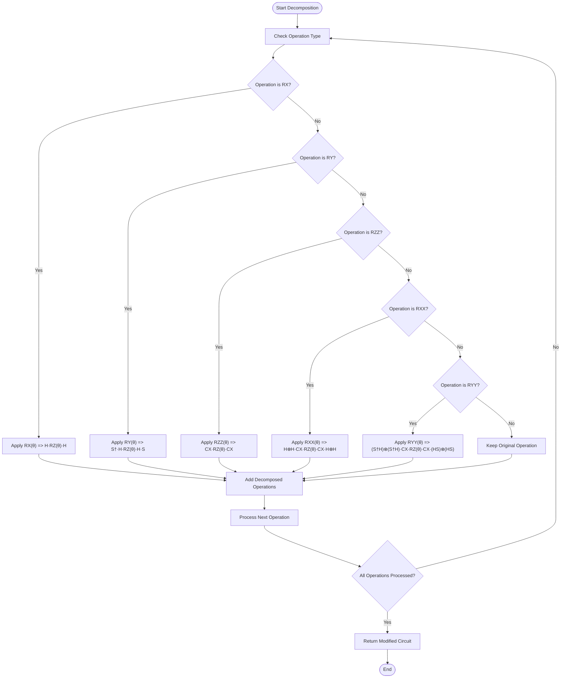
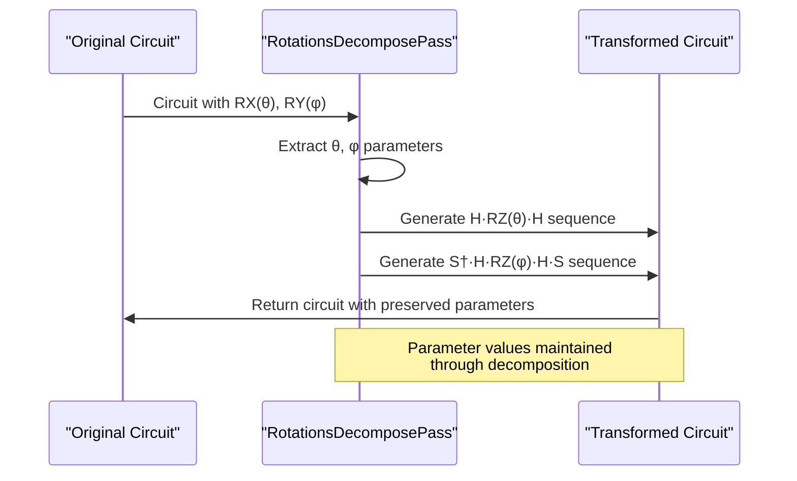
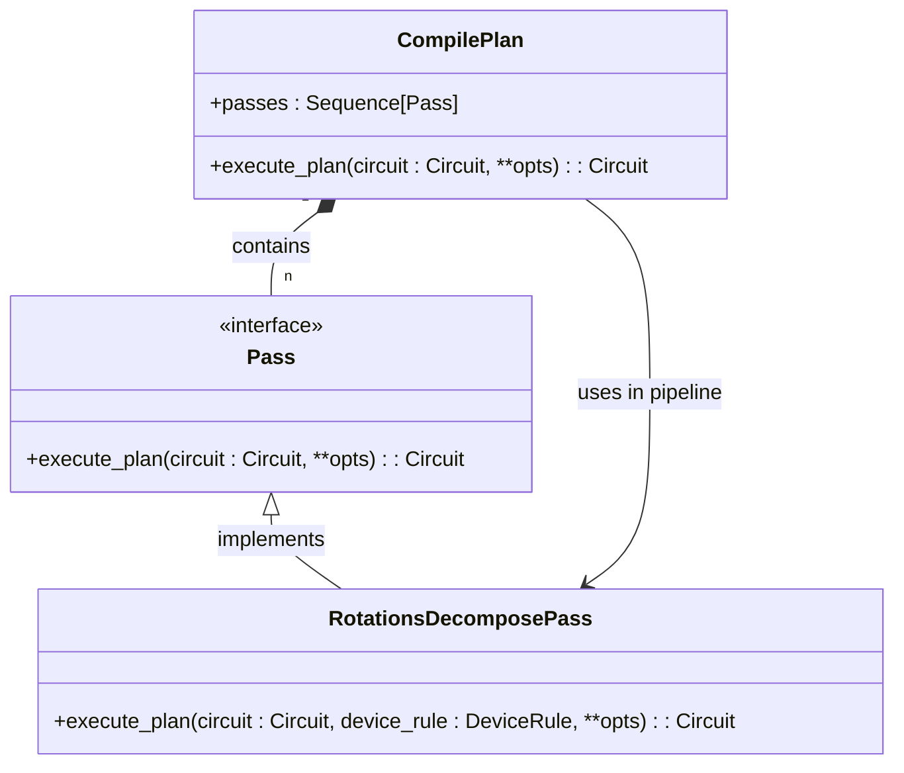

# Decomposition Stage

<cite>
**Referenced Files in This Document**   
- [rotations.py](file://src/tyxonq/compiler/stages/decompose/rotations.py)
- [circuit.py](file://src/tyxonq/core/ir/circuit.py)
- [compile_plan.py](file://src/tyxonq/compiler/compile_engine/native/compile_plan.py)
</cite>

## Table of Contents
1. [Introduction](#introduction)
2. [Rotation Decomposition](#rotation-decomposition)
3. [Gate Canonicalization](#gate-canonicalization)
4. [Gradient Flow Preservation](#gradient-flow-preservation)
5. [Multi-Qubit Gate Decomposition](#multi-qubit-gate-decomposition)
6. [Integration with Chain API](#integration-with-chain-api)
7. [IR Preservation](#ir-preservation)
8. [Common Issues](#common-issues)
9. [Best Practices](#best-practices)

## Introduction
The Decomposition stage in TyxonQ's compiler pipeline transforms high-level quantum operations into native gate sets supported by target quantum devices. This stage ensures circuit compatibility with hardware constraints by breaking down complex gates into fundamental operations such as {H, RZ, CX}. The implementation focuses on rotation decomposition and gate canonicalization, maintaining gradient flow for variational circuits while preserving the Intermediate Representation (IR) structure. This document details the implementation in rotations.py and its integration within the broader compilation pipeline.

**Section sources**
- [rotations.py](file://src/tyxonq/compiler/stages/decompose/rotations.py#L10-L66)

## Rotation Decomposition
The rotation decomposition process converts arbitrary single-qubit rotations into sequences of RZ and Ry gates. The RotationsDecomposePass class implements standard quantum identities to decompose parametric rotations into the native gate set {H, RZ, CX}. For RX(θ) operations, the decomposition follows the identity RX(θ) = H · RZ(θ) · H. For RY(θ) operations, the identity RY(θ) = S† · H · RZ(θ) · H · S is applied, where S is equivalent to RZ(π/2). The implementation processes each operation in the circuit sequentially, replacing supported rotation gates with their decomposed equivalents while preserving non-rotation operations.

**Diagram sources**
- [rotations.py](file://src/tyxonq/compiler/stages/decompose/rotations.py#L21-L66)

**Section sources**
- [rotations.py](file://src/tyxonq/compiler/stages/decompose/rotations.py#L21-L66)

## Gate Canonicalization
Gate canonicalization standardizes quantum operations into a consistent form that aligns with device-native gate sets. The decomposition process specifically targets parametric rotation gates and converts them into sequences using the canonical set {H, RZ, CX}. This canonicalization ensures compatibility across different quantum hardware backends by eliminating device-specific gate representations. The implementation handles both single-qubit rotations (RX, RY) and two-qubit entangling gates (RXX, RYY, RZZ), transforming them into equivalent circuits using only the supported native gates. This process maintains the semantic equivalence of the original circuit while ensuring hardware compatibility.

**Section sources**
- [rotations.py](file://src/tyxonq/compiler/stages/decompose/rotations.py#L10-L66)

## Gradient Flow Preservation
The decomposition process preserves gradient flow for variational circuits by maintaining parameter dependencies through the transformation. When decomposing parameterized rotations, the original angle parameters are directly transferred to the corresponding RZ gates in the decomposed sequence. This ensures that gradient-based optimization algorithms can correctly compute derivatives with respect to the original parameters. The implementation avoids introducing additional parameters or modifying existing ones, thus preserving the differentiable structure of variational quantum circuits. This capability is essential for quantum machine learning and variational algorithms where parameter optimization is fundamental.

**Diagram sources**
- [rotations.py](file://src/tyxonq/compiler/stages/decompose/rotations.py#L21-L66)

**Section sources**
- [rotations.py](file://src/tyxonq/compiler/stages/decompose/rotations.py#L21-L66)

## Multi-Qubit Gate Decomposition
Multi-qubit gate decomposition handles entangling operations such as RXX, RYY, and RZZ by transforming them into equivalent circuits using CX and single-qubit gates. For RZZ(θ) gates, the decomposition follows RZZ(θ) = CX · RZ(θ on target) · CX, effectively implementing the ZZ interaction through controlled operations. The RXX(θ) gate is decomposed using the identity RXX(θ) = H⊗H · CX · RZ(θ on target) · CX · H⊗H, which converts XX interactions into equivalent ZZ interactions through Hadamard transformations. Similarly, RYY(θ) gates are decomposed using (S†H)⊗(S†H) pre- and post-rotations to convert YY interactions into ZZ interactions. These decompositions maintain the entangling properties of the original gates while using only device-supported operations.

**Section sources**
- [rotations.py](file://src/tyxonq/compiler/stages/decompose/rotations.py#L10-L66)

## Integration with Chain API
The decomposition stage integrates with TyxonQ's Chain API through the CompilePlan pipeline, which orchestrates multiple compilation passes. The RotationsDecomposePass is registered in the compile_plan.py file and can be invoked as "decompose/rotations" in the pipeline configuration. This integration allows users to include rotation decomposition as part of a customizable compilation workflow. The Chain API's fluent interface enables seamless composition of decomposition with other stages such as layout mapping, scheduling, and gradient computation. The execute_plan method in CompilePlan sequentially applies the decomposition pass along with other specified passes, ensuring proper ordering of compilation transformations.

**Diagram sources**
- [compile_plan.py](file://src/tyxonq/compiler/compile_engine/native/compile_plan.py#L44-L94)
- [rotations.py](file://src/tyxonq/compiler/stages/decompose/rotations.py#L10-L66)

**Section sources**
- [compile_plan.py](file://src/tyxonq/compiler/compile_engine/native/compile_plan.py#L44-L94)
- [rotations.py](file://src/tyxonq/compiler/stages/decompose/rotations.py#L10-L66)

## IR Preservation
The decomposition process preserves the Intermediate Representation (IR) structure by maintaining the Circuit dataclass integrity throughout transformation. Using Python's dataclasses.replace function, the implementation creates a new Circuit instance with modified operations while preserving all other attributes including metadata, instructions, and configuration options. This approach ensures that non-operation aspects of the circuit remain unchanged during decomposition. The IR preservation extends to chainable configuration parameters such as compile_engine, device_provider, and postprocessing_method, which are carried forward to the transformed circuit. This consistency enables reliable composition of multiple compilation stages without information loss.

**Section sources**
- [rotations.py](file://src/tyxonq/compiler/stages/decompose/rotations.py#L21-L66)
- [circuit.py](file://src/tyxonq/core/ir/circuit.py#L21-L30)

## Common Issues
Two primary issues arise during decomposition: numerical instability in rotation angles and circuit bloat from over-decomposition. Numerical instability can occur when decomposing rotations with angles close to mathematical boundaries (e.g., π/2 multiples), potentially leading to precision errors in parameterized circuits. Circuit bloat manifests when repeated decomposition passes create unnecessarily long gate sequences, increasing circuit depth and reducing execution efficiency. These issues are particularly problematic for deep variational circuits where accumulated errors can degrade optimization performance. The current implementation includes safeguards such as direct parameter transfer and minimal decomposition patterns to mitigate these problems, but careful parameter management remains essential.

**Section sources**
- [rotations.py](file://src/tyxonq/compiler/stages/decompose/rotations.py#L10-L66)

## Best Practices
To optimize decomposition effectiveness, users should control decomposition depth and precision through explicit pipeline configuration. Limit decomposition to necessary stages by selectively including "decompose/rotations" only when required for target device compatibility. For variational circuits, preserve parameter integrity by avoiding redundant decomposition passes that could introduce numerical errors. Monitor circuit metrics such as gate count and depth before and after decomposition to detect unwanted circuit bloat. When working with specific hardware backends, align decomposition parameters with device calibration data to minimize execution errors. Finally, validate decomposed circuits through simulation to ensure functional equivalence with the original circuit.

**Section sources**
- [rotations.py](file://src/tyxonq/compiler/stages/decompose/rotations.py#L10-L66)
- [compile_plan.py](file://src/tyxonq/compiler/compile_engine/native/compile_plan.py#L44-L94)