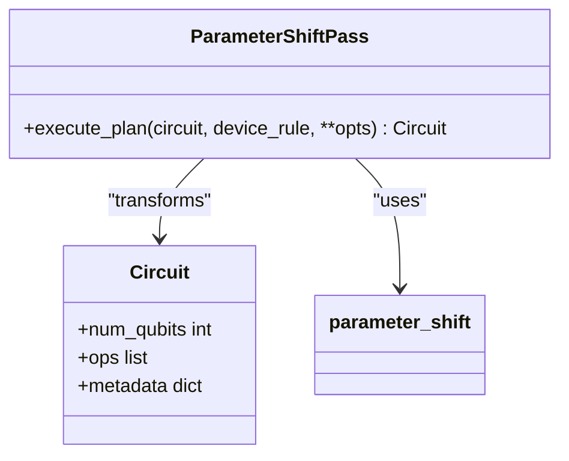
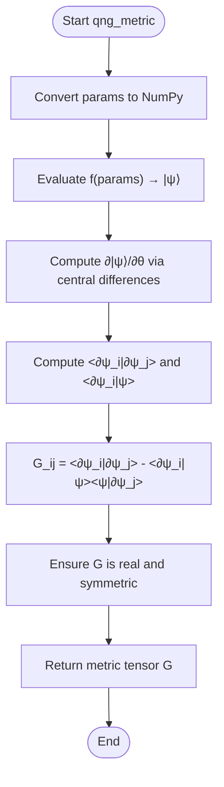
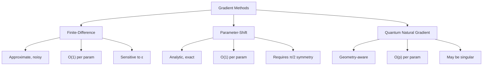
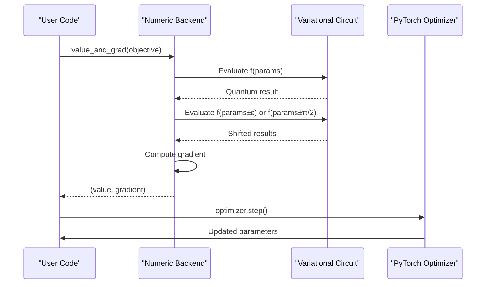

# Gradient Processing Stage

<cite>
**Referenced Files in This Document**   
- [parameter_shift_pass.py](file://src/tyxonq/compiler/stages/gradients/parameter_shift_pass.py)
- [qng.py](file://src/tyxonq/compiler/stages/gradients/qng.py)
- [parameter_shift.py](file://src/tyxonq/compiler/gradients/parameter_shift.py)
- [gradient_benchmark.py](file://examples/gradient_benchmark.py)
- [sample_value_gradient.py](file://examples/sample_value_gradient.py)
- [vqe2d.py](file://examples-ng/vqe2d.py)
- [quantumng.py](file://examples-ng/quantumng.py)
- [pytorch_backend.py](file://src/tyxonq/numerics/backends/pytorch_backend.py)
- [statevector.py](file://src/tyxonq/libs/quantum_library/kernels/statevector.py)
</cite>

## Table of Contents
1. [Introduction](#introduction)
2. [Parameter-Shift Rule Implementation](#parameter-shift-rule-implementation)
3. [Quantum Natural Gradient Computation](#quantum-natural-gradient-computation)
4. [Circuit Transformation for Gradient Evaluation](#circuit-transformation-for-gradient-evaluation)
5. [Gradient Method Comparison](#gradient-method-comparison)
6. [Integration with PyTorch and JAX](#integration-with-pytorch-and-jax)
7. [Common Issues and Best Practices](#common-issues-and-best-practices)

## Introduction
The Gradient Processing stage in TyxonQ's compiler enables efficient and accurate gradient computation for variational quantum algorithms. This document details the implementation of two advanced gradient techniques: the parameter-shift rule for analytic gradients and Quantum Natural Gradients (QNG) using metric tensor estimation. These methods are essential for optimizing variational circuits in applications such as VQE and QAOA, where precise gradient information guides the optimization process toward ground-state energies or optimal solutions.

**Section sources**
- [parameter_shift_pass.py](file://src/tyxonq/compiler/stages/gradients/parameter_shift_pass.py#L1-L31)
- [qng.py](file://src/tyxonq/compiler/stages/gradients/qng.py#L1-L114)

## Parameter-Shift Rule Implementation

The parameter-shift rule is implemented through the `ParameterShiftPass` class in `parameter_shift_pass.py`, which transforms a variational circuit into metadata that enables analytic gradient computation. When applied to a circuit, this pass identifies parameterized operations (e.g., RX, RZ gates) and generates two shifted versions of the circuit: one with the parameter increased by π/2 and another with it decreased by π/2.

The core logic resides in the `execute_plan` method, which delegates circuit transformation to the `generate_shifted_circuits` function from `parameter_shift.py`. This function clones the original circuit and applies ±π/2 shifts to the first occurrence of the specified gate type. The resulting circuits, along with metadata containing the shift coefficient (0.5), are stored in the circuit's metadata under the "gradients" key. This approach enables exact gradient estimation via the formula: ∇f(θ) = 0.5 × [f(θ+π/2) - f(θ-π/2)], avoiding the approximation errors inherent in finite-difference methods.

This implementation supports any single-parameter rotation gate and integrates seamlessly with the compiler's metadata system, preserving gradient information through subsequent compilation stages.

**Diagram sources**
- [parameter_shift_pass.py](file://src/tyxonq/compiler/stages/gradients/parameter_shift_pass.py#L1-L31)
- [parameter_shift.py](file://src/tyxonq/compiler/gradients/parameter_shift.py#L1-L38)

**Section sources**
- [parameter_shift_pass.py](file://src/tyxonq/compiler/stages/gradients/parameter_shift_pass.py#L1-L31)
- [parameter_shift.py](file://src/tyxonq/compiler/gradients/parameter_shift.py#L1-L38)

## Quantum Natural Gradient Computation

Quantum Natural Gradients (QNG) are computed using the Fubini-Study metric (quantum Fisher information matrix), implemented in `qng.py`. Unlike standard gradients that follow the steepest descent in parameter space, QNG accounts for the geometry of the quantum state space, often leading to faster convergence in variational optimization.

The `qng_metric` function computes the metric tensor G_ij = ⟨∂ψ/∂θ_i | ∂ψ/∂θ_j⟩ - ⟨∂ψ/∂θ_i|ψ⟩⟨ψ|∂ψ/∂θ_j|, where the partial derivatives are estimated numerically via central differences using the `_central_diff_jacobian` helper. This implementation is backend-agnostic, accepting any callable `f(params)` that returns a quantum state vector, and supports two kernel types: "qng" for the projected metric and "dynamics" for the unprojected version.

The numerical Jacobian is computed by perturbing each parameter by a small step `eps` (default 1e-5) and evaluating the resulting state vectors. The metric tensor is then constructed from inner products of these Jacobian rows. The function ensures the output is real and symmetric, correcting for numerical noise. This approach enables QNG computation without requiring autodiff frameworks, though it can be extended to leverage device-provided vectorization for improved performance.

**Diagram sources**
- [qng.py](file://src/tyxonq/compiler/stages/gradients/qng.py#L1-L114)

**Section sources**
- [qng.py](file://src/tyxonq/compiler/stages/gradients/qng.py#L1-L114)

## Circuit Transformation for Gradient Evaluation

The transformation of variational circuits into gradient evaluation circuits follows a systematic process. For the parameter-shift rule, the `ParameterShiftPass` analyzes the circuit operations and identifies target parameterized gates (e.g., RX, RZ). It then creates two modified circuit instances: one with the parameter shifted forward by π/2 and another shifted backward by the same amount.

This transformation preserves all other circuit elements, ensuring that only the targeted parameter is modified. The original circuit's metadata is cloned and augmented with references to the plus and minus circuits, along with the shift coefficient. This metadata-driven approach allows gradient-aware execution without altering the core circuit representation.

For QNG computation, the transformation is conceptual rather than structural—the same circuit is evaluated multiple times with perturbed parameters to estimate the Jacobian. The `qng_metric` function handles this by repeatedly calling the circuit evaluation function `f` with modified parameter vectors, effectively creating virtual shifted circuits through parameter manipulation rather than circuit rewriting.

**Section sources**
- [parameter_shift_pass.py](file://src/tyxonq/compiler/stages/gradients/parameter_shift_pass.py#L1-L31)
- [parameter_shift.py](file://src/tyxonq/compiler/gradients/parameter_shift.py#L1-L38)
- [qng.py](file://src/tyxonq/compiler/stages/gradients/qng.py#L1-L114)

## Gradient Method Comparison

TyxonQ supports multiple gradient computation methods, each with distinct trade-offs:

- **Finite-Difference**: Approximates gradients using small parameter perturbations (e.g., (f(θ+ε) - f(θ-ε))/(2ε)). While simple to implement, it suffers from numerical instability and noise, especially with finite shot counts. Example: `finite_difference_gradient` in `sample_value_gradient.py`.

- **Parameter-Shift Rule**: Provides analytic gradients by evaluating the circuit at ±π/2 shifts. It is exact for gates with generator eigenvalues ±0.5 and requires only two circuit evaluations per parameter. Demonstrated in `gradient_benchmark.py` and `sample_value_gradient.py`.

- **Quantum Natural Gradient**: Uses the metric tensor to precondition standard gradients, following the natural gradient direction in quantum state space. Implemented in `qng.py`, it can accelerate convergence but requires O(p²) circuit evaluations for p parameters and may encounter singular metric tensors.

Benchmarks in `gradient_benchmark.py` show that parameter-shift provides more accurate gradients than finite-difference with comparable computational cost, while QNG offers superior convergence in well-conditioned problems but with higher computational overhead.

**Diagram sources**
- [gradient_benchmark.py](file://examples/gradient_benchmark.py#L1-L319)
- [sample_value_gradient.py](file://examples/sample_value_gradient.py#L1-L169)
- [qng.py](file://src/tyxonq/compiler/stages/gradients/qng.py#L1-L114)

**Section sources**
- [gradient_benchmark.py](file://examples/gradient_benchmark.py#L1-L319)
- [sample_value_gradient.py](file://examples/sample_value_gradient.py#L1-L169)

## Integration with PyTorch and JAX

TyxonQ integrates with PyTorch and JAX through its numeric backend system, enabling end-to-end differentiability and compatibility with deep learning optimizers. The `pytorch_backend.py` implementation provides a `value_and_grad` function that either uses PyTorch's autograd when available or falls back to numerical differentiation.

In practice, circuits can be embedded within PyTorch models by wrapping the quantum evaluation function with `K.value_and_grad`, as demonstrated in `vqe2d.py` and `quantumng.py`. The `vags` function in `quantumng.py` combines value and gradient computation, enabling seamless integration with PyTorch optimizers like Adam. During training, gradients computed via parameter-shift or QNG are assigned to PyTorch tensors, allowing standard optimization loops to update parameters.

For JAX integration, similar patterns apply using JAX's `grad` and `jit` transformations. The backend-agnostic design of `qng.py` ensures compatibility with any framework that can compute Jacobians, while the metadata-based parameter-shift implementation preserves gradient information across compilation boundaries.

**Diagram sources**
- [pytorch_backend.py](file://src/tyxonq/numerics/backends/pytorch_backend.py#L1-L259)
- [vqe2d.py](file://examples-ng/vqe2d.py#L1-L69)
- [quantumng.py](file://examples-ng/quantumng.py#L1-L95)

**Section sources**
- [pytorch_backend.py](file://src/tyxonq/numerics/backends/pytorch_backend.py#L1-L259)
- [vqe2d.py](file://examples-ng/vqe2d.py#L1-L69)
- [quantumng.py](file://examples-ng/quantumng.py#L1-L95)

## Common Issues and Best Practices

Several challenges arise in gradient-based variational quantum algorithms:

- **Vanishing Gradients**: In deep circuits, gradients often vanish due to the concentration of measure phenomenon. Best practice: Use shallow circuits with problem-inspired ansätze, or employ gradient-aware initialization strategies.

- **Singular Metric Tensors**: QNG can fail when the metric tensor is singular or ill-conditioned. Best practice: Add regularization (e.g., λI to G), use truncated SVD, or fall back to standard gradients when condition number exceeds a threshold.

- **Parameter Dependencies**: Circuits with shared parameters require careful gradient accumulation. TyxonQ handles this by shifting each parameter instance independently and aggregating gradients.

- **Method Selection**: For shallow circuits (<10 layers) with few parameters, parameter-shift is optimal. For deeper circuits where geometry matters, QNG often converges faster despite higher cost. For noisy intermediate-scale devices, parameter-shift's robustness makes it preferable over finite-difference.

Examples in `vqe2d.py` and `gradient_benchmark.py` demonstrate proper usage patterns, including JIT compilation for performance and learning rate scheduling for stable convergence.

**Section sources**
- [vqe2d.py](file://examples-ng/vqe2d.py#L1-L69)
- [gradient_benchmark.py](file://examples/gradient_benchmark.py#L1-L319)
- [qng.py](file://src/tyxonq/compiler/stages/gradients/qng.py#L1-L114)