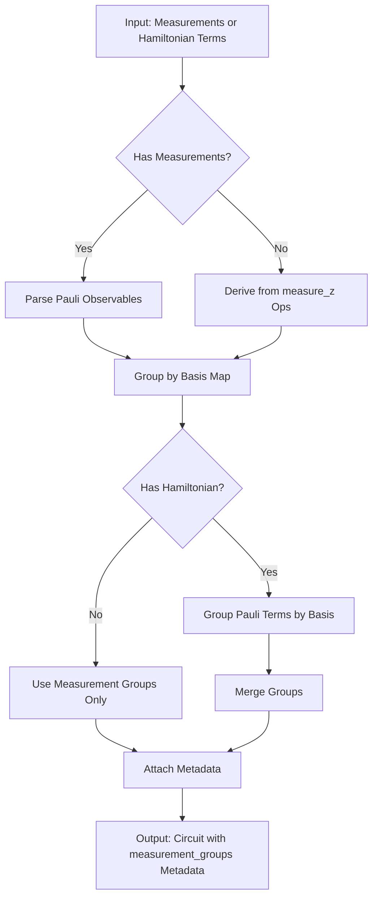
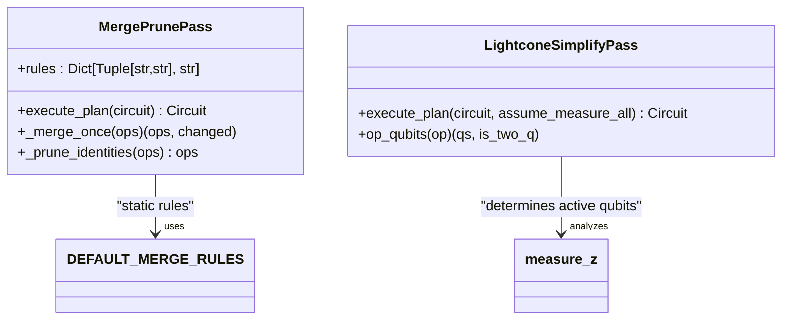

# Rewriting Stage

<cite>
**Referenced Files in This Document**   
- [gates_transform.py](file://src/tyxonq/compiler/stages/rewrite/gates_transform.py)
- [measurement.py](file://src/tyxonq/compiler/stages/rewrite/measurement.py)
- [merge_prune.py](file://src/tyxonq/compiler/stages/rewrite/merge_prune.py)
- [hamiltonian_grouping.py](file://src/tyxonq/libs/hamiltonian_encoding/hamiltonian_grouping.py)
- [lightcone.py](file://src/tyxonq/compiler/stages/simplify/lightcone.py)
</cite>

## Table of Contents
1. [Introduction](#introduction)
2. [Gate Rewriting](#gate-rewriting)
3. [Measurement Optimization](#measurement-optimization)
4. [Circuit Pruning and Merging](#circuit-pruning-and-merging)
5. [Integration with Device Topology and Execution Paths](#integration-with-device-topology-and-execution-paths)
6. [Common Issues and Best Practices](#common-issues-and-best-practices)
7. [Conclusion](#conclusion)

## Introduction
The rewriting stage in TyxonQ's compiler pipeline is responsible for transforming quantum circuits into optimized forms suitable for execution on target hardware or numerical simulators. This stage performs three primary transformations: gate rewriting, measurement optimization, and circuit pruning. These passes operate sequentially within the compilation pipeline to enhance circuit efficiency, reduce resource usage, and prepare measurements for shot-efficient evaluation. The rewriting stage bridges high-level circuit descriptions with device-specific constraints, ensuring compatibility while preserving computational semantics.

## Gate Rewriting

The `GatesTransformPass` in `gates_transform.py` rewrites non-native quantum gates into equivalent circuits using a specified basis gate set. By default, the pass targets the native gate set `["h", "rx", "rz", "cx", "cz"]`, but users can specify alternative basis gates through the `basis_gates` parameter. The transformation rules are minimal and deterministic: single-qubit Pauli-X and Pauli-Y gates are converted to `rx(π)` and `ry(π)` rotations when the corresponding rotation gates are allowed in the target basis. Native gates such as `cx`, `cz`, `h`, `rx`, `ry`, and `rz` are preserved, while extended gates like `rxx`, `rzz`, and `cy` are retained only if explicitly supported by the target device.

This pass ensures that circuits conform to the native gate set of the target quantum processor, enabling subsequent stages to generate executable instructions. It operates without altering circuit semantics and supports both device-bound and numeric execution paths by maintaining mathematical equivalence during gate substitution.

**Section sources**
- [gates_transform.py](file://src/tyxonq/compiler/stages/rewrite/gates_transform.py#L23-L49)

## Measurement Optimization

The `MeasurementRewritePass` in `measurement.py` optimizes observable measurement by grouping commuting terms and minimizing the number of distinct measurement settings. The pass supports two input types: explicit measurement specifications and Hamiltonian-like Pauli-sum operators. For each measurement, it parses the observable basis (e.g., "Z", "ZX") and wire mapping, then groups measurements that can be evaluated under the same basis configuration. The grouping strategy is greedy and product-basis-safe, allowing overlapping qubits only when their measurement bases agree.

When Hamiltonian terms are provided via `hamiltonian_terms` or `qubit_operator`, the pass delegates to `group_hamiltonian_pauli_terms` or `group_qubit_operator_terms` from `hamiltonian_grouping.py`. These functions group Pauli terms by their tensor product basis (e.g., "ZIZ", "XXI") and compute a constant offset from identity terms. The resulting groups are stored in `circuit.metadata["measurement_groups"]`, along with estimated shot requirements and basis mappings, enabling downstream shot schedulers to minimize total measurement settings.

This optimization significantly reduces the number of circuit executions required for Hamiltonian expectation values, particularly in variational quantum algorithms like VQE.

**Diagram sources**
- [measurement.py](file://src/tyxonq/compiler/stages/rewrite/measurement.py#L29-L88)
- [hamiltonian_grouping.py](file://src/tyxonq/libs/hamiltonian_encoding/hamiltonian_grouping.py#L47-L65)

**Section sources**
- [measurement.py](file://src/tyxonq/compiler/stages/rewrite/measurement.py#L29-L88)

## Circuit Pruning and Merging

The `MergePrunePass` in `merge_prune.py` performs local circuit optimization by merging adjacent single-qubit gates and eliminating identity operations. It uses a rule-based system defined in `DEFAULT_MERGE_RULES`, which specifies how gate pairs combine (e.g., `("x", "x") -> "i"`, `("rz", "rz") -> "rz"` with summed angles). The pass iteratively scans the operation list, merging consecutive gates on the same qubit when a rule applies. After merging, it removes any resulting identity gates ("i").

Additionally, the rewriting stage integrates with the `LightconeSimplifyPass` from `lightcone.py`, which prunes operations outside the causal cone of measurements. This backward slicing algorithm identifies all gates that influence measured qubits, discarding irrelevant operations. For example, in a circuit measuring only qubit 1, gates acting solely on qubit 2 are removed if they do not entangle with qubit 1.

Together, these optimizations reduce circuit depth and gate count, improving simulation performance and reducing error susceptibility on hardware.

**Diagram sources**
- [merge_prune.py](file://src/tyxonq/compiler/stages/rewrite/merge_prune.py#L35-L43)
- [lightcone.py](file://src/tyxonq/compiler/stages/simplify/lightcone.py#L12-L95)

**Section sources**
- [merge_prune.py](file://src/tyxonq/compiler/stages/rewrite/merge_prune.py#L35-L43)
- [lightcone.py](file://src/tyxonq/compiler/stages/simplify/lightcone.py#L12-L95)

## Integration with Device Topology and Execution Paths

The rewriting stage is designed to support both device execution and numeric simulation paths. Gate rewriting respects device-specific basis gates, while measurement grouping accounts for device connectivity when determining commutativity. Although the current implementation uses a greedy, product-basis grouping strategy, future extensions may incorporate commuting sets and variance-aware cost models to further optimize shot allocation.

The `MeasurementRewritePass` stores grouping metadata in `circuit.metadata`, which downstream components such as shot schedulers and device drivers use to configure measurement settings. Similarly, merged and pruned circuits are validated against device topology constraints in later stages, ensuring that all two-qubit gates align with the physical qubit connectivity.

This modular design allows the same rewriting logic to be reused across different backends, with device-specific rules injected via the `device_rule` parameter.

## Common Issues and Best Practices

Common issues in the rewriting stage include incorrect commutativity assumptions when grouping non-Pauli observables and overzealous pruning of parameterized gates. Users should ensure that Hamiltonian terms are properly formatted as real-valued Pauli strings, as complex coefficients or non-Hermitian terms will raise validation errors in `group_qubit_operator_terms`.

For parameterized circuits, care must be taken when merging rotation gates: adjacent `rz` gates with symbolic parameters should not be combined unless the parameters are known to commute. The current `MergePrunePass` operates on concrete values and may not preserve symbolic expressions correctly.

Best practices include:
- Configuring `basis_gates` explicitly when targeting specific hardware.
- Providing Hamiltonian terms in grouped form to minimize measurement overhead.
- Using `assume_measure_all=True` in simulation contexts where all qubits are effectively measured.
- Disabling aggressive pruning for debugging or when circuit fidelity is critical.

## Conclusion
The rewriting stage in TyxonQ's compiler plays a critical role in optimizing quantum circuits for efficient execution. Through gate rewriting, measurement grouping, and circuit simplification, it reduces resource requirements and enhances compatibility with target devices. By exposing transformation rules and metadata through a clean interface, it enables extensible optimization strategies that support both current and future quantum computing workflows.